Relevant source files

- [crates/gwiki/src/commands/ask.rs:20-41](crates/gwiki/src/commands/ask.rs#L20-L41), [crates/gwiki/src/commands/ask.rs:48-62](crates/gwiki/src/commands/ask.rs#L48-L62)
- [crates/gwiki/src/commands/ask/assembly.rs:6-39](crates/gwiki/src/commands/ask/assembly.rs#L6-L39), [crates/gwiki/src/commands/ask/assembly.rs:41-50](crates/gwiki/src/commands/ask/assembly.rs#L41-L50), [crates/gwiki/src/commands/ask/assembly.rs:52-58](crates/gwiki/src/commands/ask/assembly.rs#L52-L58), [crates/gwiki/src/commands/ask/assembly.rs:72-120](crates/gwiki/src/commands/ask/assembly.rs#L72-L120)
- [crates/gwiki/src/commands/ask/citation.rs:25-46](crates/gwiki/src/commands/ask/citation.rs#L25-L46), [crates/gwiki/src/commands/ask/citation.rs:50-64](crates/gwiki/src/commands/ask/citation.rs#L50-L64), [crates/gwiki/src/commands/ask/citation.rs:66-76](crates/gwiki/src/commands/ask/citation.rs#L66-L76), [crates/gwiki/src/commands/ask/citation.rs:78-98](crates/gwiki/src/commands/ask/citation.rs#L78-L98), [crates/gwiki/src/commands/ask/citation.rs:100-104](crates/gwiki/src/commands/ask/citation.rs#L100-L104), [crates/gwiki/src/commands/ask/citation.rs:106-110](crates/gwiki/src/commands/ask/citation.rs#L106-L110), [crates/gwiki/src/commands/ask/citation.rs:114-131](crates/gwiki/src/commands/ask/citation.rs#L114-L131)
- [crates/gwiki/src/commands/ask/evidence.rs:14-16](crates/gwiki/src/commands/ask/evidence.rs#L14-L16), [crates/gwiki/src/commands/ask/evidence.rs:20-26](crates/gwiki/src/commands/ask/evidence.rs#L20-L26), [crates/gwiki/src/commands/ask/evidence.rs:31-83](crates/gwiki/src/commands/ask/evidence.rs#L31-L83), [crates/gwiki/src/commands/ask/evidence.rs:95-121](crates/gwiki/src/commands/ask/evidence.rs#L95-L121), [crates/gwiki/src/commands/ask/evidence.rs:124-133](crates/gwiki/src/commands/ask/evidence.rs#L124-L133), [crates/gwiki/src/commands/ask/evidence.rs:136-149](crates/gwiki/src/commands/ask/evidence.rs#L136-L149), [crates/gwiki/src/commands/ask/evidence.rs:152-158](crates/gwiki/src/commands/ask/evidence.rs#L152-L158)
- [crates/gwiki/src/commands/ask/narration.rs:7-58](crates/gwiki/src/commands/ask/narration.rs#L7-L58), [crates/gwiki/src/commands/ask/narration.rs:60-64](crates/gwiki/src/commands/ask/narration.rs#L60-L64), [crates/gwiki/src/commands/ask/narration.rs:89-103](crates/gwiki/src/commands/ask/narration.rs#L89-L103), [crates/gwiki/src/commands/ask/narration.rs:105-123](crates/gwiki/src/commands/ask/narration.rs#L105-L123), [crates/gwiki/src/commands/ask/narration.rs:130-162](crates/gwiki/src/commands/ask/narration.rs#L130-L162), [crates/gwiki/src/commands/ask/narration.rs:165-169](crates/gwiki/src/commands/ask/narration.rs#L165-L169), [crates/gwiki/src/commands/ask/narration.rs:172-181](crates/gwiki/src/commands/ask/narration.rs#L172-L181), [crates/gwiki/src/commands/ask/narration.rs:184-187](crates/gwiki/src/commands/ask/narration.rs#L184-L187), [crates/gwiki/src/commands/ask/narration.rs:190-214](crates/gwiki/src/commands/ask/narration.rs#L190-L214)
- [crates/gwiki/src/commands/ask/render.rs:6-16](crates/gwiki/src/commands/ask/render.rs#L6-L16), [crates/gwiki/src/commands/ask/render.rs:18-68](crates/gwiki/src/commands/ask/render.rs#L18-L68), [crates/gwiki/src/commands/ask/render.rs:79-114](crates/gwiki/src/commands/ask/render.rs#L79-L114)
- [crates/gwiki/src/commands/ask/synthesis.rs:15-45](crates/gwiki/src/commands/ask/synthesis.rs#L15-L45), [crates/gwiki/src/commands/ask/synthesis.rs:47-60](crates/gwiki/src/commands/ask/synthesis.rs#L47-L60), [crates/gwiki/src/commands/ask/synthesis.rs:62-75](crates/gwiki/src/commands/ask/synthesis.rs#L62-L75), [crates/gwiki/src/commands/ask/synthesis.rs:77-111](crates/gwiki/src/commands/ask/synthesis.rs#L77-L111), [crates/gwiki/src/commands/ask/synthesis.rs:113-145](crates/gwiki/src/commands/ask/synthesis.rs#L113-L145), [crates/gwiki/src/commands/ask/synthesis.rs:147-149](crates/gwiki/src/commands/ask/synthesis.rs#L147-L149), [crates/gwiki/src/commands/ask/synthesis.rs:151-158](crates/gwiki/src/commands/ask/synthesis.rs#L151-L158), [crates/gwiki/src/commands/ask/synthesis.rs:171-217](crates/gwiki/src/commands/ask/synthesis.rs#L171-L217), [crates/gwiki/src/commands/ask/synthesis.rs:220-245](crates/gwiki/src/commands/ask/synthesis.rs#L220-L245), [crates/gwiki/src/commands/ask/synthesis.rs:248-254](crates/gwiki/src/commands/ask/synthesis.rs#L248-L254), [crates/gwiki/src/commands/ask/synthesis.rs:257-277](crates/gwiki/src/commands/ask/synthesis.rs#L257-L277), [crates/gwiki/src/commands/ask/synthesis.rs:280-303](crates/gwiki/src/commands/ask/synthesis.rs#L280-L303)
- [crates/gwiki/src/commands/backlinks.rs:10-18](crates/gwiki/src/commands/backlinks.rs#L10-L18), [crates/gwiki/src/commands/backlinks.rs:20-28](crates/gwiki/src/commands/backlinks.rs#L20-L28), [crates/gwiki/src/commands/backlinks.rs:30-53](crates/gwiki/src/commands/backlinks.rs#L30-L53), [crates/gwiki/src/commands/backlinks.rs:55-78](crates/gwiki/src/commands/backlinks.rs#L55-L78), [crates/gwiki/src/commands/backlinks.rs:80-99](crates/gwiki/src/commands/backlinks.rs#L80-L99), [crates/gwiki/src/commands/backlinks.rs:101-126](crates/gwiki/src/commands/backlinks.rs#L101-L126)
- [crates/gwiki/src/commands/benchmark.rs:11-44](crates/gwiki/src/commands/benchmark.rs#L11-L44), [crates/gwiki/src/commands/benchmark.rs:46-73](crates/gwiki/src/commands/benchmark.rs#L46-L73), [crates/gwiki/src/commands/benchmark.rs:75-81](crates/gwiki/src/commands/benchmark.rs#L75-L81), [crates/gwiki/src/commands/benchmark.rs:83-121](crates/gwiki/src/commands/benchmark.rs#L83-L121)
- [crates/gwiki/src/commands/citation_quality.rs:26-33](crates/gwiki/src/commands/citation_quality.rs#L26-L33), [crates/gwiki/src/commands/citation_quality.rs:36-40](crates/gwiki/src/commands/citation_quality.rs#L36-L40), [crates/gwiki/src/commands/citation_quality.rs:43-49](crates/gwiki/src/commands/citation_quality.rs#L43-L49), [crates/gwiki/src/commands/citation_quality.rs:52-56](crates/gwiki/src/commands/citation_quality.rs#L52-L56), [crates/gwiki/src/commands/citation_quality.rs:59-64](crates/gwiki/src/commands/citation_quality.rs#L59-L64), [crates/gwiki/src/commands/citation_quality.rs:67-70](crates/gwiki/src/commands/citation_quality.rs#L67-L70), [crates/gwiki/src/commands/citation_quality.rs:73-76](crates/gwiki/src/commands/citation_quality.rs#L73-L76), [crates/gwiki/src/commands/citation_quality.rs:79-83](crates/gwiki/src/commands/citation_quality.rs#L79-L83), [crates/gwiki/src/commands/citation_quality.rs:86-89](crates/gwiki/src/commands/citation_quality.rs#L86-L89), [crates/gwiki/src/commands/citation_quality.rs:92-95](crates/gwiki/src/commands/citation_quality.rs#L92-L95), [crates/gwiki/src/commands/citation_quality.rs:98-101](crates/gwiki/src/commands/citation_quality.rs#L98-L101), [crates/gwiki/src/commands/citation_quality.rs:104-107](crates/gwiki/src/commands/citation_quality.rs#L104-L107), [crates/gwiki/src/commands/citation_quality.rs:110-114](crates/gwiki/src/commands/citation_quality.rs#L110-L114), [crates/gwiki/src/commands/citation_quality.rs:116-146](crates/gwiki/src/commands/citation_quality.rs#L116-L146), [crates/gwiki/src/commands/citation_quality.rs:148-162](crates/gwiki/src/commands/citation_quality.rs#L148-L162), [crates/gwiki/src/commands/citation_quality.rs:164-175](crates/gwiki/src/commands/citation_quality.rs#L164-L175), [crates/gwiki/src/commands/citation_quality.rs:177-222](crates/gwiki/src/commands/citation_quality.rs#L177-L222), [crates/gwiki/src/commands/citation_quality.rs:224-264](crates/gwiki/src/commands/citation_quality.rs#L224-L264), [crates/gwiki/src/commands/citation_quality.rs:266-276](crates/gwiki/src/commands/citation_quality.rs#L266-L276), [crates/gwiki/src/commands/citation_quality.rs:278-285](crates/gwiki/src/commands/citation_quality.rs#L278-L285), [crates/gwiki/src/commands/citation_quality.rs:287-302](crates/gwiki/src/commands/citation_quality.rs#L287-L302), [crates/gwiki/src/commands/citation_quality.rs:304-335](crates/gwiki/src/commands/citation_quality.rs#L304-L335), [crates/gwiki/src/commands/citation_quality.rs:337-349](crates/gwiki/src/commands/citation_quality.rs#L337-L349), [crates/gwiki/src/commands/citation_quality.rs:351-383](crates/gwiki/src/commands/citation_quality.rs#L351-L383), [crates/gwiki/src/commands/citation_quality.rs:385-395](crates/gwiki/src/commands/citation_quality.rs#L385-L395), [crates/gwiki/src/commands/citation_quality.rs:397-403](crates/gwiki/src/commands/citation_quality.rs#L397-L403), [crates/gwiki/src/commands/citation_quality.rs:405-416](crates/gwiki/src/commands/citation_quality.rs#L405-L416), [crates/gwiki/src/commands/citation_quality.rs:418-428](crates/gwiki/src/commands/citation_quality.rs#L418-L428), [crates/gwiki/src/commands/citation_quality.rs:430-454](crates/gwiki/src/commands/citation_quality.rs#L430-L454), [crates/gwiki/src/commands/citation_quality.rs:456-470](crates/gwiki/src/commands/citation_quality.rs#L456-L470), [crates/gwiki/src/commands/citation_quality.rs:472-483](crates/gwiki/src/commands/citation_quality.rs#L472-L483), [crates/gwiki/src/commands/citation_quality.rs:485-504](crates/gwiki/src/commands/citation_quality.rs#L485-L504), [crates/gwiki/src/commands/citation_quality.rs:506-517](crates/gwiki/src/commands/citation_quality.rs#L506-L517), [crates/gwiki/src/commands/citation_quality.rs:519-532](crates/gwiki/src/commands/citation_quality.rs#L519-L532), [crates/gwiki/src/commands/citation_quality.rs:534-548](crates/gwiki/src/commands/citation_quality.rs#L534-L548), [crates/gwiki/src/commands/citation_quality.rs:562-572](crates/gwiki/src/commands/citation_quality.rs#L562-L572), [crates/gwiki/src/commands/citation_quality.rs:575-639](crates/gwiki/src/commands/citation_quality.rs#L575-L639), [crates/gwiki/src/commands/citation_quality.rs:642-716](crates/gwiki/src/commands/citation_quality.rs#L642-L716), [crates/gwiki/src/commands/citation_quality.rs:719-769](crates/gwiki/src/commands/citation_quality.rs#L719-L769), [crates/gwiki/src/commands/citation_quality.rs:772-786](crates/gwiki/src/commands/citation_quality.rs#L772-L786), [crates/gwiki/src/commands/citation_quality.rs:789-818](crates/gwiki/src/commands/citation_quality.rs#L789-L818), [crates/gwiki/src/commands/citation_quality.rs:822-841](crates/gwiki/src/commands/citation_quality.rs#L822-L841), [crates/gwiki/src/commands/citation_quality.rs:843-847](crates/gwiki/src/commands/citation_quality.rs#L843-L847), [crates/gwiki/src/commands/citation_quality.rs:849-864](crates/gwiki/src/commands/citation_quality.rs#L849-L864)
- [crates/gwiki/src/commands/citation_quality/contradictions.rs:15-18](crates/gwiki/src/commands/citation_quality/contradictions.rs#L15-L18), [crates/gwiki/src/commands/citation_quality/contradictions.rs:21-24](crates/gwiki/src/commands/citation_quality/contradictions.rs#L21-L24), [crates/gwiki/src/commands/citation_quality/contradictions.rs:27-29](crates/gwiki/src/commands/citation_quality/contradictions.rs#L27-L29), [crates/gwiki/src/commands/citation_quality/contradictions.rs:31-67](crates/gwiki/src/commands/citation_quality/contradictions.rs#L31-L67), [crates/gwiki/src/commands/citation_quality/contradictions.rs:69-117](crates/gwiki/src/commands/citation_quality/contradictions.rs#L69-L117), [crates/gwiki/src/commands/citation_quality/contradictions.rs:119-125](crates/gwiki/src/commands/citation_quality/contradictions.rs#L119-L125), [crates/gwiki/src/commands/citation_quality/contradictions.rs:127-163](crates/gwiki/src/commands/citation_quality/contradictions.rs#L127-L163), [crates/gwiki/src/commands/citation_quality/contradictions.rs:169-180](crates/gwiki/src/commands/citation_quality/contradictions.rs#L169-L180), [crates/gwiki/src/commands/citation_quality/contradictions.rs:182-193](crates/gwiki/src/commands/citation_quality/contradictions.rs#L182-L193), [crates/gwiki/src/commands/citation_quality/contradictions.rs:195-226](crates/gwiki/src/commands/citation_quality/contradictions.rs#L195-L226), [crates/gwiki/src/commands/citation_quality/contradictions.rs:228-234](crates/gwiki/src/commands/citation_quality/contradictions.rs#L228-L234), [crates/gwiki/src/commands/citation_quality/contradictions.rs:236-241](crates/gwiki/src/commands/citation_quality/contradictions.rs#L236-L241)
- [crates/gwiki/src/commands/collect.rs:10-20](crates/gwiki/src/commands/collect.rs#L10-L20), [crates/gwiki/src/commands/collect.rs:22-43](crates/gwiki/src/commands/collect.rs#L22-L43)
- [crates/gwiki/src/commands/compile.rs:18-100](crates/gwiki/src/commands/compile.rs#L18-L100), [crates/gwiki/src/commands/compile.rs:102-110](crates/gwiki/src/commands/compile.rs#L102-L110), [crates/gwiki/src/commands/compile.rs:112-132](crates/gwiki/src/commands/compile.rs#L112-L132), [crates/gwiki/src/commands/compile.rs:134-142](crates/gwiki/src/commands/compile.rs#L134-L142), [crates/gwiki/src/commands/compile.rs:144-151](crates/gwiki/src/commands/compile.rs#L144-L151), [crates/gwiki/src/commands/compile.rs:153-167](crates/gwiki/src/commands/compile.rs#L153-L167), [crates/gwiki/src/commands/compile.rs:169-203](crates/gwiki/src/commands/compile.rs#L169-L203), [crates/gwiki/src/commands/compile.rs:205-237](crates/gwiki/src/commands/compile.rs#L205-L237), [crates/gwiki/src/commands/compile.rs:242-252](crates/gwiki/src/commands/compile.rs#L242-L252), [crates/gwiki/src/commands/compile.rs:255-257](crates/gwiki/src/commands/compile.rs#L255-L257), [crates/gwiki/src/commands/compile.rs:259-264](crates/gwiki/src/commands/compile.rs#L259-L264), [crates/gwiki/src/commands/compile.rs:266-287](crates/gwiki/src/commands/compile.rs#L266-L287), [crates/gwiki/src/commands/compile.rs:293-323](crates/gwiki/src/commands/compile.rs#L293-L323), [crates/gwiki/src/commands/compile.rs:325-332](crates/gwiki/src/commands/compile.rs#L325-L332), [crates/gwiki/src/commands/compile.rs:340-360](crates/gwiki/src/commands/compile.rs#L340-L360), [crates/gwiki/src/commands/compile.rs:362-366](crates/gwiki/src/commands/compile.rs#L362-L366), [crates/gwiki/src/commands/compile.rs:369-423](crates/gwiki/src/commands/compile.rs#L369-L423), [crates/gwiki/src/commands/compile.rs:426-458](crates/gwiki/src/commands/compile.rs#L426-L458), [crates/gwiki/src/commands/compile.rs:461-479](crates/gwiki/src/commands/compile.rs#L461-L479), [crates/gwiki/src/commands/compile.rs:482-501](crates/gwiki/src/commands/compile.rs#L482-L501), [crates/gwiki/src/commands/compile.rs:504-525](crates/gwiki/src/commands/compile.rs#L504-L525), [crates/gwiki/src/commands/compile.rs:528-538](crates/gwiki/src/commands/compile.rs#L528-L538), [crates/gwiki/src/commands/compile.rs:541-557](crates/gwiki/src/commands/compile.rs#L541-L557)
- [crates/gwiki/src/commands/graph.rs:13-52](crates/gwiki/src/commands/graph.rs#L13-L52), [crates/gwiki/src/commands/graph.rs:54-67](crates/gwiki/src/commands/graph.rs#L54-L67), [crates/gwiki/src/commands/graph.rs:69-90](crates/gwiki/src/commands/graph.rs#L69-L90), [crates/gwiki/src/commands/graph.rs:93-118](crates/gwiki/src/commands/graph.rs#L93-L118), [crates/gwiki/src/commands/graph.rs:129-131](crates/gwiki/src/commands/graph.rs#L129-L131), [crates/gwiki/src/commands/graph.rs:134-137](crates/gwiki/src/commands/graph.rs#L134-L137), [crates/gwiki/src/commands/graph.rs:141-143](crates/gwiki/src/commands/graph.rs#L141-L143), [crates/gwiki/src/commands/graph.rs:145-147](crates/gwiki/src/commands/graph.rs#L145-L147), [crates/gwiki/src/commands/graph.rs:150-158](crates/gwiki/src/commands/graph.rs#L150-L158), [crates/gwiki/src/commands/graph.rs:160-162](crates/gwiki/src/commands/graph.rs#L160-L162), [crates/gwiki/src/commands/graph.rs:164-168](crates/gwiki/src/commands/graph.rs#L164-L168), [crates/gwiki/src/commands/graph.rs:172-180](crates/gwiki/src/commands/graph.rs#L172-L180), [crates/gwiki/src/commands/graph.rs:184-186](crates/gwiki/src/commands/graph.rs#L184-L186), [crates/gwiki/src/commands/graph.rs:190-195](crates/gwiki/src/commands/graph.rs#L190-L195), [crates/gwiki/src/commands/graph.rs:199-204](crates/gwiki/src/commands/graph.rs#L199-L204), [crates/gwiki/src/commands/graph.rs:208-217](crates/gwiki/src/commands/graph.rs#L208-L217)
- [crates/gwiki/src/commands/index.rs:35-38](crates/gwiki/src/commands/index.rs#L35-L38), [crates/gwiki/src/commands/index.rs:40-46](crates/gwiki/src/commands/index.rs#L40-L46), [crates/gwiki/src/commands/index.rs:48-52](crates/gwiki/src/commands/index.rs#L48-L52), [crates/gwiki/src/commands/index.rs:54-86](crates/gwiki/src/commands/index.rs#L54-L86), [crates/gwiki/src/commands/index.rs:88-153](crates/gwiki/src/commands/index.rs#L88-L153), [crates/gwiki/src/commands/index.rs:155-191](crates/gwiki/src/commands/index.rs#L155-L191), [crates/gwiki/src/commands/index.rs:193-205](crates/gwiki/src/commands/index.rs#L193-L205), [crates/gwiki/src/commands/index.rs:207-229](crates/gwiki/src/commands/index.rs#L207-L229), [crates/gwiki/src/commands/index.rs:231-254](crates/gwiki/src/commands/index.rs#L231-L254), [crates/gwiki/src/commands/index.rs:256-258](crates/gwiki/src/commands/index.rs#L256-L258), [crates/gwiki/src/commands/index.rs:260-266](crates/gwiki/src/commands/index.rs#L260-L266), [crates/gwiki/src/commands/index.rs:268-272](crates/gwiki/src/commands/index.rs#L268-L272), [crates/gwiki/src/commands/index.rs:274-281](crates/gwiki/src/commands/index.rs#L274-L281), [crates/gwiki/src/commands/index.rs:283-288](crates/gwiki/src/commands/index.rs#L283-L288), [crates/gwiki/src/commands/index.rs:290-314](crates/gwiki/src/commands/index.rs#L290-L314), [crates/gwiki/src/commands/index.rs:316-367](crates/gwiki/src/commands/index.rs#L316-L367), [crates/gwiki/src/commands/index.rs:369-371](crates/gwiki/src/commands/index.rs#L369-L371), [crates/gwiki/src/commands/index.rs:373-375](crates/gwiki/src/commands/index.rs#L373-L375), [crates/gwiki/src/commands/index.rs:377-387](crates/gwiki/src/commands/index.rs#L377-L387), [crates/gwiki/src/commands/index.rs:389-394](crates/gwiki/src/commands/index.rs#L389-L394), [crates/gwiki/src/commands/index.rs:396-431](crates/gwiki/src/commands/index.rs#L396-L431), [crates/gwiki/src/commands/index.rs:433-457](crates/gwiki/src/commands/index.rs#L433-L457), [crates/gwiki/src/commands/index.rs:459-469](crates/gwiki/src/commands/index.rs#L459-L469), [crates/gwiki/src/commands/index.rs:471-512](crates/gwiki/src/commands/index.rs#L471-L512), [crates/gwiki/src/commands/index.rs:514-569](crates/gwiki/src/commands/index.rs#L514-L569), [crates/gwiki/src/commands/index.rs:571-641](crates/gwiki/src/commands/index.rs#L571-L641), [crates/gwiki/src/commands/index.rs:643-653](crates/gwiki/src/commands/index.rs#L643-L653), [crates/gwiki/src/commands/index.rs:659-661](crates/gwiki/src/commands/index.rs#L659-L661), [crates/gwiki/src/commands/index.rs:664-668](crates/gwiki/src/commands/index.rs#L664-L668), [crates/gwiki/src/commands/index.rs:670-672](crates/gwiki/src/commands/index.rs#L670-L672), [crates/gwiki/src/commands/index.rs:676-683](crates/gwiki/src/commands/index.rs#L676-L683), [crates/gwiki/src/commands/index.rs:686-703](crates/gwiki/src/commands/index.rs#L686-L703), [crates/gwiki/src/commands/index.rs:706-730](crates/gwiki/src/commands/index.rs#L706-L730), [crates/gwiki/src/commands/index.rs:734-739](crates/gwiki/src/commands/index.rs#L734-L739), [crates/gwiki/src/commands/index.rs:741-749](crates/gwiki/src/commands/index.rs#L741-L749)
- [crates/gwiki/src/commands/mod.rs:31-104](crates/gwiki/src/commands/mod.rs#L31-L104), [crates/gwiki/src/commands/mod.rs:106-117](crates/gwiki/src/commands/mod.rs#L106-L117), [crates/gwiki/src/commands/mod.rs:119-143](crates/gwiki/src/commands/mod.rs#L119-L143)
- [crates/gwiki/src/commands/read.rs:17-28](crates/gwiki/src/commands/read.rs#L17-L28), [crates/gwiki/src/commands/read.rs:30-57](crates/gwiki/src/commands/read.rs#L30-L57), [crates/gwiki/src/commands/read.rs:59-85](crates/gwiki/src/commands/read.rs#L59-L85), [crates/gwiki/src/commands/read.rs:87-114](crates/gwiki/src/commands/read.rs#L87-L114), [crates/gwiki/src/commands/read.rs:116-122](crates/gwiki/src/commands/read.rs#L116-L122), [crates/gwiki/src/commands/read.rs:124-152](crates/gwiki/src/commands/read.rs#L124-L152), [crates/gwiki/src/commands/read.rs:154-181](crates/gwiki/src/commands/read.rs#L154-L181), [crates/gwiki/src/commands/read.rs:183-197](crates/gwiki/src/commands/read.rs#L183-L197), [crates/gwiki/src/commands/read.rs:199-211](crates/gwiki/src/commands/read.rs#L199-L211), [crates/gwiki/src/commands/read.rs:213-219](crates/gwiki/src/commands/read.rs#L213-L219), [crates/gwiki/src/commands/read.rs:221-235](crates/gwiki/src/commands/read.rs#L221-L235), [crates/gwiki/src/commands/read.rs:237-241](crates/gwiki/src/commands/read.rs#L237-L241), [crates/gwiki/src/commands/read.rs:243-312](crates/gwiki/src/commands/read.rs#L243-L312), [crates/gwiki/src/commands/read.rs:314-320](crates/gwiki/src/commands/read.rs#L314-L320), [crates/gwiki/src/commands/read.rs:322-329](crates/gwiki/src/commands/read.rs#L322-L329), [crates/gwiki/src/commands/read.rs:331-340](crates/gwiki/src/commands/read.rs#L331-L340), [crates/gwiki/src/commands/read.rs:342-361](crates/gwiki/src/commands/read.rs#L342-L361), [crates/gwiki/src/commands/read.rs:364-378](crates/gwiki/src/commands/read.rs#L364-L378), [crates/gwiki/src/commands/read.rs:380-385](crates/gwiki/src/commands/read.rs#L380-L385), [crates/gwiki/src/commands/read.rs:388-410](crates/gwiki/src/commands/read.rs#L388-L410), [crates/gwiki/src/commands/read.rs:412-427](crates/gwiki/src/commands/read.rs#L412-L427), [crates/gwiki/src/commands/read.rs:429-442](crates/gwiki/src/commands/read.rs#L429-L442), [crates/gwiki/src/commands/read.rs:444-461](crates/gwiki/src/commands/read.rs#L444-L461), [crates/gwiki/src/commands/read.rs:463-486](crates/gwiki/src/commands/read.rs#L463-L486), [crates/gwiki/src/commands/read.rs:490-493](crates/gwiki/src/commands/read.rs#L490-L493), [crates/gwiki/src/commands/read.rs:496-501](crates/gwiki/src/commands/read.rs#L496-L501), [crates/gwiki/src/commands/read.rs:503-508](crates/gwiki/src/commands/read.rs#L503-L508), [crates/gwiki/src/commands/read.rs:512-515](crates/gwiki/src/commands/read.rs#L512-L515), [crates/gwiki/src/commands/read.rs:518-522](crates/gwiki/src/commands/read.rs#L518-L522), [crates/gwiki/src/commands/read.rs:525-532](crates/gwiki/src/commands/read.rs#L525-L532), [crates/gwiki/src/commands/read.rs:534-540](crates/gwiki/src/commands/read.rs#L534-L540), [crates/gwiki/src/commands/read.rs:542-548](crates/gwiki/src/commands/read.rs#L542-L548), [crates/gwiki/src/commands/read.rs:550-556](crates/gwiki/src/commands/read.rs#L550-L556), [crates/gwiki/src/commands/read.rs:566-592](crates/gwiki/src/commands/read.rs#L566-L592), [crates/gwiki/src/commands/read.rs:595-608](crates/gwiki/src/commands/read.rs#L595-L608), [crates/gwiki/src/commands/read.rs:611-622](crates/gwiki/src/commands/read.rs#L611-L622)
- [crates/gwiki/src/commands/refresh/candidate.rs:15-74](crates/gwiki/src/commands/refresh/candidate.rs#L15-L74), [crates/gwiki/src/commands/refresh/candidate.rs:76-173](crates/gwiki/src/commands/refresh/candidate.rs#L76-L173), [crates/gwiki/src/commands/refresh/candidate.rs:175-214](crates/gwiki/src/commands/refresh/candidate.rs#L175-L214), [crates/gwiki/src/commands/refresh/candidate.rs:216-224](crates/gwiki/src/commands/refresh/candidate.rs#L216-L224), [crates/gwiki/src/commands/refresh/candidate.rs:226-245](crates/gwiki/src/commands/refresh/candidate.rs#L226-L245), [crates/gwiki/src/commands/refresh/candidate.rs:247-273](crates/gwiki/src/commands/refresh/candidate.rs#L247-L273), [crates/gwiki/src/commands/refresh/candidate.rs:275-310](crates/gwiki/src/commands/refresh/candidate.rs#L275-L310)
- [crates/gwiki/src/commands/refresh/mod.rs:29-37](crates/gwiki/src/commands/refresh/mod.rs#L29-L37), [crates/gwiki/src/commands/refresh/mod.rs:39-49](crates/gwiki/src/commands/refresh/mod.rs#L39-L49), [crates/gwiki/src/commands/refresh/mod.rs:51-140](crates/gwiki/src/commands/refresh/mod.rs#L51-L140)
- [crates/gwiki/src/commands/refresh/model.rs:5-9](crates/gwiki/src/commands/refresh/model.rs#L5-L9), [crates/gwiki/src/commands/refresh/model.rs:12-17](crates/gwiki/src/commands/refresh/model.rs#L12-L17), [crates/gwiki/src/commands/refresh/model.rs:19-24](crates/gwiki/src/commands/refresh/model.rs#L19-L24), [crates/gwiki/src/commands/refresh/model.rs:27-38](crates/gwiki/src/commands/refresh/model.rs#L27-L38), [crates/gwiki/src/commands/refresh/model.rs:41-43](crates/gwiki/src/commands/refresh/model.rs#L41-L43), [crates/gwiki/src/commands/refresh/model.rs:46-51](crates/gwiki/src/commands/refresh/model.rs#L46-L51), [crates/gwiki/src/commands/refresh/model.rs:55-68](crates/gwiki/src/commands/refresh/model.rs#L55-L68), [crates/gwiki/src/commands/refresh/model.rs:72-85](crates/gwiki/src/commands/refresh/model.rs#L72-L85), [crates/gwiki/src/commands/refresh/model.rs:88-98](crates/gwiki/src/commands/refresh/model.rs#L88-L98), [crates/gwiki/src/commands/refresh/model.rs:101-107](crates/gwiki/src/commands/refresh/model.rs#L101-L107), [crates/gwiki/src/commands/refresh/model.rs:110-116](crates/gwiki/src/commands/refresh/model.rs#L110-L116), [crates/gwiki/src/commands/refresh/model.rs:119-125](crates/gwiki/src/commands/refresh/model.rs#L119-L125), [crates/gwiki/src/commands/refresh/model.rs:128-136](crates/gwiki/src/commands/refresh/model.rs#L128-L136), [crates/gwiki/src/commands/refresh/model.rs:140-144](crates/gwiki/src/commands/refresh/model.rs#L140-L144), [crates/gwiki/src/commands/refresh/model.rs:147-153](crates/gwiki/src/commands/refresh/model.rs#L147-L153), [crates/gwiki/src/commands/refresh/model.rs:155-161](crates/gwiki/src/commands/refresh/model.rs#L155-L161), [crates/gwiki/src/commands/refresh/model.rs:163-169](crates/gwiki/src/commands/refresh/model.rs#L163-L169)
- [crates/gwiki/src/commands/refresh/selection.rs:4-75](crates/gwiki/src/commands/refresh/selection.rs#L4-L75), [crates/gwiki/src/commands/refresh/selection.rs:79-82](crates/gwiki/src/commands/refresh/selection.rs#L79-L82), [crates/gwiki/src/commands/refresh/selection.rs:85-112](crates/gwiki/src/commands/refresh/selection.rs#L85-L112), [crates/gwiki/src/commands/refresh/selection.rs:115-118](crates/gwiki/src/commands/refresh/selection.rs#L115-L118), [crates/gwiki/src/commands/refresh/selection.rs:121-124](crates/gwiki/src/commands/refresh/selection.rs#L121-L124), [crates/gwiki/src/commands/refresh/selection.rs:126-138](crates/gwiki/src/commands/refresh/selection.rs#L126-L138), [crates/gwiki/src/commands/refresh/selection.rs:140-146](crates/gwiki/src/commands/refresh/selection.rs#L140-L146), [crates/gwiki/src/commands/refresh/selection.rs:148-152](crates/gwiki/src/commands/refresh/selection.rs#L148-L152), [crates/gwiki/src/commands/refresh/selection.rs:155-169](crates/gwiki/src/commands/refresh/selection.rs#L155-L169), [crates/gwiki/src/commands/refresh/selection.rs:171-185](crates/gwiki/src/commands/refresh/selection.rs#L171-L185), [crates/gwiki/src/commands/refresh/selection.rs:187-210](crates/gwiki/src/commands/refresh/selection.rs#L187-L210), [crates/gwiki/src/commands/refresh/selection.rs:212-220](crates/gwiki/src/commands/refresh/selection.rs#L212-L220), [crates/gwiki/src/commands/refresh/selection.rs:222-224](crates/gwiki/src/commands/refresh/selection.rs#L222-L224), [crates/gwiki/src/commands/refresh/selection.rs:226-232](crates/gwiki/src/commands/refresh/selection.rs#L226-L232), [crates/gwiki/src/commands/refresh/selection.rs:234-239](crates/gwiki/src/commands/refresh/selection.rs#L234-L239), [crates/gwiki/src/commands/refresh/selection.rs:248-294](crates/gwiki/src/commands/refresh/selection.rs#L248-L294)
- [crates/gwiki/src/commands/refresh/tests.rs:7-13](crates/gwiki/src/commands/refresh/tests.rs#L7-L13), [crates/gwiki/src/commands/refresh/tests.rs:15-31](crates/gwiki/src/commands/refresh/tests.rs#L15-L31), [crates/gwiki/src/commands/refresh/tests.rs:33-49](crates/gwiki/src/commands/refresh/tests.rs#L33-L49), [crates/gwiki/src/commands/refresh/tests.rs:51-103](crates/gwiki/src/commands/refresh/tests.rs#L51-L103), [crates/gwiki/src/commands/refresh/tests.rs:105-121](crates/gwiki/src/commands/refresh/tests.rs#L105-L121), [crates/gwiki/src/commands/refresh/tests.rs:123-131](crates/gwiki/src/commands/refresh/tests.rs#L123-L131), [crates/gwiki/src/commands/refresh/tests.rs:134-160](crates/gwiki/src/commands/refresh/tests.rs#L134-L160), [crates/gwiki/src/commands/refresh/tests.rs:163-185](crates/gwiki/src/commands/refresh/tests.rs#L163-L185), [crates/gwiki/src/commands/refresh/tests.rs:188-214](crates/gwiki/src/commands/refresh/tests.rs#L188-L214), [crates/gwiki/src/commands/refresh/tests.rs:217-250](crates/gwiki/src/commands/refresh/tests.rs#L217-L250), [crates/gwiki/src/commands/refresh/tests.rs:253-316](crates/gwiki/src/commands/refresh/tests.rs#L253-L316), [crates/gwiki/src/commands/refresh/tests.rs:319-342](crates/gwiki/src/commands/refresh/tests.rs#L319-L342), [crates/gwiki/src/commands/refresh/tests.rs:345-362](crates/gwiki/src/commands/refresh/tests.rs#L345-L362), [crates/gwiki/src/commands/refresh/tests.rs:365-370](crates/gwiki/src/commands/refresh/tests.rs#L365-L370), [crates/gwiki/src/commands/refresh/tests.rs:373-386](crates/gwiki/src/commands/refresh/tests.rs#L373-L386), [crates/gwiki/src/commands/refresh/tests.rs:389-406](crates/gwiki/src/commands/refresh/tests.rs#L389-L406), [crates/gwiki/src/commands/refresh/tests.rs:409-420](crates/gwiki/src/commands/refresh/tests.rs#L409-L420), [crates/gwiki/src/commands/refresh/tests.rs:423-434](crates/gwiki/src/commands/refresh/tests.rs#L423-L434), [crates/gwiki/src/commands/refresh/tests.rs:437-445](crates/gwiki/src/commands/refresh/tests.rs#L437-L445), [crates/gwiki/src/commands/refresh/tests.rs:448-464](crates/gwiki/src/commands/refresh/tests.rs#L448-L464)
- [crates/gwiki/src/commands/refresh/vault.rs:7-9](crates/gwiki/src/commands/refresh/vault.rs#L7-L9), [crates/gwiki/src/commands/refresh/vault.rs:16-49](crates/gwiki/src/commands/refresh/vault.rs#L16-L49), [crates/gwiki/src/commands/refresh/vault.rs:51-66](crates/gwiki/src/commands/refresh/vault.rs#L51-L66), [crates/gwiki/src/commands/refresh/vault.rs:68-101](crates/gwiki/src/commands/refresh/vault.rs#L68-L101), [crates/gwiki/src/commands/refresh/vault.rs:103-112](crates/gwiki/src/commands/refresh/vault.rs#L103-L112)
- [crates/gwiki/src/commands/review_report.rs:28-105](crates/gwiki/src/commands/review_report.rs#L28-L105), [crates/gwiki/src/commands/review_report.rs:108-113](crates/gwiki/src/commands/review_report.rs#L108-L113), [crates/gwiki/src/commands/review_report.rs:116-135](crates/gwiki/src/commands/review_report.rs#L116-L135), [crates/gwiki/src/commands/review_report.rs:137-142](crates/gwiki/src/commands/review_report.rs#L137-L142), [crates/gwiki/src/commands/review_report.rs:146-154](crates/gwiki/src/commands/review_report.rs#L146-L154), [crates/gwiki/src/commands/review_report.rs:157-167](crates/gwiki/src/commands/review_report.rs#L157-L167), [crates/gwiki/src/commands/review_report.rs:170-174](crates/gwiki/src/commands/review_report.rs#L170-L174), [crates/gwiki/src/commands/review_report.rs:177-183](crates/gwiki/src/commands/review_report.rs#L177-L183), [crates/gwiki/src/commands/review_report.rs:185-211](crates/gwiki/src/commands/review_report.rs#L185-L211), [crates/gwiki/src/commands/review_report.rs:213-229](crates/gwiki/src/commands/review_report.rs#L213-L229), [crates/gwiki/src/commands/review_report.rs:231-241](crates/gwiki/src/commands/review_report.rs#L231-L241), [crates/gwiki/src/commands/review_report.rs:243-260](crates/gwiki/src/commands/review_report.rs#L243-L260), [crates/gwiki/src/commands/review_report.rs:262-266](crates/gwiki/src/commands/review_report.rs#L262-L266), [crates/gwiki/src/commands/review_report.rs:268-294](crates/gwiki/src/commands/review_report.rs#L268-L294), [crates/gwiki/src/commands/review_report.rs:296-321](crates/gwiki/src/commands/review_report.rs#L296-L321), [crates/gwiki/src/commands/review_report.rs:323-362](crates/gwiki/src/commands/review_report.rs#L323-L362), [crates/gwiki/src/commands/review_report.rs:364-399](crates/gwiki/src/commands/review_report.rs#L364-L399), [crates/gwiki/src/commands/review_report.rs:401-430](crates/gwiki/src/commands/review_report.rs#L401-L430), [crates/gwiki/src/commands/review_report.rs:432-456](crates/gwiki/src/commands/review_report.rs#L432-L456), [crates/gwiki/src/commands/review_report.rs:458-471](crates/gwiki/src/commands/review_report.rs#L458-L471), [crates/gwiki/src/commands/review_report.rs:473-484](crates/gwiki/src/commands/review_report.rs#L473-L484), [crates/gwiki/src/commands/review_report.rs:486-493](crates/gwiki/src/commands/review_report.rs#L486-L493), [crates/gwiki/src/commands/review_report.rs:495-530](crates/gwiki/src/commands/review_report.rs#L495-L530), [crates/gwiki/src/commands/review_report.rs:532-534](crates/gwiki/src/commands/review_report.rs#L532-L534), [crates/gwiki/src/commands/review_report.rs:536-546](crates/gwiki/src/commands/review_report.rs#L536-L546), [crates/gwiki/src/commands/review_report.rs:548-562](crates/gwiki/src/commands/review_report.rs#L548-L562), [crates/gwiki/src/commands/review_report.rs:564-572](crates/gwiki/src/commands/review_report.rs#L564-L572), [crates/gwiki/src/commands/review_report.rs:574-588](crates/gwiki/src/commands/review_report.rs#L574-L588), [crates/gwiki/src/commands/review_report.rs:590-603](crates/gwiki/src/commands/review_report.rs#L590-L603), [crates/gwiki/src/commands/review_report.rs:605-612](crates/gwiki/src/commands/review_report.rs#L605-L612), [crates/gwiki/src/commands/review_report.rs:614-626](crates/gwiki/src/commands/review_report.rs#L614-L626), [crates/gwiki/src/commands/review_report.rs:642-711](crates/gwiki/src/commands/review_report.rs#L642-L711), [crates/gwiki/src/commands/review_report.rs:714-736](crates/gwiki/src/commands/review_report.rs#L714-L736), [crates/gwiki/src/commands/review_report.rs:739-746](crates/gwiki/src/commands/review_report.rs#L739-L746), [crates/gwiki/src/commands/review_report.rs:749-760](crates/gwiki/src/commands/review_report.rs#L749-L760), [crates/gwiki/src/commands/review_report.rs:763-776](crates/gwiki/src/commands/review_report.rs#L763-L776)
- [crates/gwiki/src/commands/search.rs:27-30](crates/gwiki/src/commands/search.rs#L27-L30), [crates/gwiki/src/commands/search.rs:32-39](crates/gwiki/src/commands/search.rs#L32-L39), [crates/gwiki/src/commands/search.rs:41-78](crates/gwiki/src/commands/search.rs#L41-L78), [crates/gwiki/src/commands/search.rs:80-143](crates/gwiki/src/commands/search.rs#L80-L143), [crates/gwiki/src/commands/search.rs:145-163](crates/gwiki/src/commands/search.rs#L145-L163), [crates/gwiki/src/commands/search.rs:165-171](crates/gwiki/src/commands/search.rs#L165-L171), [crates/gwiki/src/commands/search.rs:173-208](crates/gwiki/src/commands/search.rs#L173-L208), [crates/gwiki/src/commands/search.rs:210-234](crates/gwiki/src/commands/search.rs#L210-L234), [crates/gwiki/src/commands/search.rs:236-240](crates/gwiki/src/commands/search.rs#L236-L240), [crates/gwiki/src/commands/search.rs:242-248](crates/gwiki/src/commands/search.rs#L242-L248), [crates/gwiki/src/commands/search.rs:250-317](crates/gwiki/src/commands/search.rs#L250-L317), [crates/gwiki/src/commands/search.rs:326-329](crates/gwiki/src/commands/search.rs#L326-L329), [crates/gwiki/src/commands/search.rs:333-353](crates/gwiki/src/commands/search.rs#L333-L353), [crates/gwiki/src/commands/search.rs:355-366](crates/gwiki/src/commands/search.rs#L355-L366), [crates/gwiki/src/commands/search.rs:368-395](crates/gwiki/src/commands/search.rs#L368-L395), [crates/gwiki/src/commands/search.rs:402-415](crates/gwiki/src/commands/search.rs#L402-L415), [crates/gwiki/src/commands/search.rs:418-435](crates/gwiki/src/commands/search.rs#L418-L435), [crates/gwiki/src/commands/search.rs:438-448](crates/gwiki/src/commands/search.rs#L438-L448), [crates/gwiki/src/commands/search.rs:451-457](crates/gwiki/src/commands/search.rs#L451-L457), [crates/gwiki/src/commands/search.rs:460-466](crates/gwiki/src/commands/search.rs#L460-L466)
- [crates/gwiki/src/commands/session_sync.rs:22-70](crates/gwiki/src/commands/session_sync.rs#L22-L70), [crates/gwiki/src/commands/session_sync.rs:72-83](crates/gwiki/src/commands/session_sync.rs#L72-L83), [crates/gwiki/src/commands/session_sync.rs:85-162](crates/gwiki/src/commands/session_sync.rs#L85-L162)
- [crates/gwiki/src/commands/setup.rs:19](crates/gwiki/src/commands/setup.rs#L19), [crates/gwiki/src/commands/setup.rs:21-93](crates/gwiki/src/commands/setup.rs#L21-L93), [crates/gwiki/src/commands/setup.rs:95-112](crates/gwiki/src/commands/setup.rs#L95-L112), [crates/gwiki/src/commands/setup.rs:114-124](crates/gwiki/src/commands/setup.rs#L114-L124), [crates/gwiki/src/commands/setup.rs:126-128](crates/gwiki/src/commands/setup.rs#L126-L128), [crates/gwiki/src/commands/setup.rs:130-181](crates/gwiki/src/commands/setup.rs#L130-L181), [crates/gwiki/src/commands/setup.rs:183-199](crates/gwiki/src/commands/setup.rs#L183-L199), [crates/gwiki/src/commands/setup.rs:201-244](crates/gwiki/src/commands/setup.rs#L201-L244), [crates/gwiki/src/commands/setup.rs:246-253](crates/gwiki/src/commands/setup.rs#L246-L253), [crates/gwiki/src/commands/setup.rs:255-259](crates/gwiki/src/commands/setup.rs#L255-L259), [crates/gwiki/src/commands/setup.rs:261-287](crates/gwiki/src/commands/setup.rs#L261-L287), [crates/gwiki/src/commands/setup.rs:289-303](crates/gwiki/src/commands/setup.rs#L289-L303), [crates/gwiki/src/commands/setup.rs:313-321](crates/gwiki/src/commands/setup.rs#L313-L321), [crates/gwiki/src/commands/setup.rs:324-366](crates/gwiki/src/commands/setup.rs#L324-L366), [crates/gwiki/src/commands/setup.rs:369-397](crates/gwiki/src/commands/setup.rs#L369-L397), [crates/gwiki/src/commands/setup.rs:400-423](crates/gwiki/src/commands/setup.rs#L400-L423), [crates/gwiki/src/commands/setup.rs:426-445](crates/gwiki/src/commands/setup.rs#L426-L445), [crates/gwiki/src/commands/setup.rs:448-478](crates/gwiki/src/commands/setup.rs#L448-L478)
- [crates/gwiki/src/commands/sources.rs:15-23](crates/gwiki/src/commands/sources.rs#L15-L23), [crates/gwiki/src/commands/sources.rs:25-122](crates/gwiki/src/commands/sources.rs#L25-L122), [crates/gwiki/src/commands/sources.rs:125-138](crates/gwiki/src/commands/sources.rs#L125-L138), [crates/gwiki/src/commands/sources.rs:141-146](crates/gwiki/src/commands/sources.rs#L141-L146), [crates/gwiki/src/commands/sources.rs:149-155](crates/gwiki/src/commands/sources.rs#L149-L155), [crates/gwiki/src/commands/sources.rs:157-163](crates/gwiki/src/commands/sources.rs#L157-L163), [crates/gwiki/src/commands/sources.rs:165-171](crates/gwiki/src/commands/sources.rs#L165-L171), [crates/gwiki/src/commands/sources.rs:175-181](crates/gwiki/src/commands/sources.rs#L175-L181), [crates/gwiki/src/commands/sources.rs:184-192](crates/gwiki/src/commands/sources.rs#L184-L192), [crates/gwiki/src/commands/sources.rs:195-205](crates/gwiki/src/commands/sources.rs#L195-L205), [crates/gwiki/src/commands/sources.rs:208-213](crates/gwiki/src/commands/sources.rs#L208-L213), [crates/gwiki/src/commands/sources.rs:216-219](crates/gwiki/src/commands/sources.rs#L216-L219), [crates/gwiki/src/commands/sources.rs:221-230](crates/gwiki/src/commands/sources.rs#L221-L230), [crates/gwiki/src/commands/sources.rs:232-260](crates/gwiki/src/commands/sources.rs#L232-L260), [crates/gwiki/src/commands/sources.rs:262-301](crates/gwiki/src/commands/sources.rs#L262-L301), [crates/gwiki/src/commands/sources.rs:303-316](crates/gwiki/src/commands/sources.rs#L303-L316), [crates/gwiki/src/commands/sources.rs:318-340](crates/gwiki/src/commands/sources.rs#L318-L340), [crates/gwiki/src/commands/sources.rs:342-363](crates/gwiki/src/commands/sources.rs#L342-L363), [crates/gwiki/src/commands/sources.rs:365-396](crates/gwiki/src/commands/sources.rs#L365-L396), [crates/gwiki/src/commands/sources.rs:398-441](crates/gwiki/src/commands/sources.rs#L398-L441), [crates/gwiki/src/commands/sources.rs:443-462](crates/gwiki/src/commands/sources.rs#L443-L462), [crates/gwiki/src/commands/sources.rs:464-486](crates/gwiki/src/commands/sources.rs#L464-L486), [crates/gwiki/src/commands/sources.rs:488-490](crates/gwiki/src/commands/sources.rs#L488-L490), [crates/gwiki/src/commands/sources.rs:492-525](crates/gwiki/src/commands/sources.rs#L492-L525), [crates/gwiki/src/commands/sources.rs:527-566](crates/gwiki/src/commands/sources.rs#L527-L566), [crates/gwiki/src/commands/sources.rs:568-573](crates/gwiki/src/commands/sources.rs#L568-L573), [crates/gwiki/src/commands/sources.rs:575-585](crates/gwiki/src/commands/sources.rs#L575-L585), [crates/gwiki/src/commands/sources.rs:587-593](crates/gwiki/src/commands/sources.rs#L587-L593), [crates/gwiki/src/commands/sources.rs:595-616](crates/gwiki/src/commands/sources.rs#L595-L616), [crates/gwiki/src/commands/sources.rs:618-657](crates/gwiki/src/commands/sources.rs#L618-L657), [crates/gwiki/src/commands/sources.rs:659-661](crates/gwiki/src/commands/sources.rs#L659-L661), [crates/gwiki/src/commands/sources.rs:669-695](crates/gwiki/src/commands/sources.rs#L669-L695), [crates/gwiki/src/commands/sources.rs:698-716](crates/gwiki/src/commands/sources.rs#L698-L716), [crates/gwiki/src/commands/sources.rs:719-730](crates/gwiki/src/commands/sources.rs#L719-L730), [crates/gwiki/src/commands/sources.rs:733-738](crates/gwiki/src/commands/sources.rs#L733-L738), [crates/gwiki/src/commands/sources.rs:741-767](crates/gwiki/src/commands/sources.rs#L741-L767), [crates/gwiki/src/commands/sources.rs:770-812](crates/gwiki/src/commands/sources.rs#L770-L812), [crates/gwiki/src/commands/sources.rs:815-828](crates/gwiki/src/commands/sources.rs#L815-L828), [crates/gwiki/src/commands/sources.rs:831-839](crates/gwiki/src/commands/sources.rs#L831-L839), [crates/gwiki/src/commands/sources.rs:841-857](crates/gwiki/src/commands/sources.rs#L841-L857), [crates/gwiki/src/commands/sources.rs:859-874](crates/gwiki/src/commands/sources.rs#L859-L874)
- [crates/gwiki/src/commands/status.rs:6-9](crates/gwiki/src/commands/status.rs#L6-L9), [crates/gwiki/src/commands/status.rs:11-30](crates/gwiki/src/commands/status.rs#L11-L30), [crates/gwiki/src/commands/status.rs:32-36](crates/gwiki/src/commands/status.rs#L32-L36), [crates/gwiki/src/commands/status.rs:38-88](crates/gwiki/src/commands/status.rs#L38-L88), [crates/gwiki/src/commands/status.rs:90-94](crates/gwiki/src/commands/status.rs#L90-L94)
- [crates/gwiki/src/commands/trust.rs:14-46](crates/gwiki/src/commands/trust.rs#L14-L46), [crates/gwiki/src/commands/trust.rs:48-52](crates/gwiki/src/commands/trust.rs#L48-L52), [crates/gwiki/src/commands/trust.rs:54-94](crates/gwiki/src/commands/trust.rs#L54-L94), [crates/gwiki/src/commands/trust.rs:96-105](crates/gwiki/src/commands/trust.rs#L96-L105), [crates/gwiki/src/commands/trust.rs:108-123](crates/gwiki/src/commands/trust.rs#L108-L123), [crates/gwiki/src/commands/trust.rs:126-196](crates/gwiki/src/commands/trust.rs#L126-L196), [crates/gwiki/src/commands/trust.rs:200-207](crates/gwiki/src/commands/trust.rs#L200-L207), [crates/gwiki/src/commands/trust.rs:210-219](crates/gwiki/src/commands/trust.rs#L210-L219), [crates/gwiki/src/commands/trust.rs:223-227](crates/gwiki/src/commands/trust.rs#L223-L227), [crates/gwiki/src/commands/trust.rs:230-234](crates/gwiki/src/commands/trust.rs#L230-L234), [crates/gwiki/src/commands/trust.rs:237-240](crates/gwiki/src/commands/trust.rs#L237-L240), [crates/gwiki/src/commands/trust.rs:243-246](crates/gwiki/src/commands/trust.rs#L243-L246), [crates/gwiki/src/commands/trust.rs:249-256](crates/gwiki/src/commands/trust.rs#L249-L256), [crates/gwiki/src/commands/trust.rs:258-295](crates/gwiki/src/commands/trust.rs#L258-L295), [crates/gwiki/src/commands/trust.rs:297-319](crates/gwiki/src/commands/trust.rs#L297-L319), [crates/gwiki/src/commands/trust.rs:321-327](crates/gwiki/src/commands/trust.rs#L321-L327), [crates/gwiki/src/commands/trust.rs:329-335](crates/gwiki/src/commands/trust.rs#L329-L335), [crates/gwiki/src/commands/trust.rs:337-357](crates/gwiki/src/commands/trust.rs#L337-L357), [crates/gwiki/src/commands/trust.rs:364-373](crates/gwiki/src/commands/trust.rs#L364-L373), [crates/gwiki/src/commands/trust.rs:376-404](crates/gwiki/src/commands/trust.rs#L376-L404), [crates/gwiki/src/commands/trust.rs:407-480](crates/gwiki/src/commands/trust.rs#L407-L480)

_8 more source files omitted._

# crates/gwiki/src/commands

Parent: [[code/modules/crates/gwiki/src|crates/gwiki/src]]

## Overview

The crates/gwiki/src/commands module serves as the central command dispatcher and execution layer for the gwiki CLI, routing distinct command variants to their specialized implementation submodules [crates/gwiki/src/commands/mod.rs:106-117]. Its primary responsibilities encompass scope initialization [crates/gwiki/src/commands/init.rs:9-20], source manifest management and ingestion [crates/gwiki/src/commands/sources.rs:15-23], multi-backend database or in-memory indexing [crates/gwiki/src/commands/index.rs:54-86], and executing retrieval-augmented search and question-answering pipelines [crates/gwiki/src/commands/search.rs:80-143, crates/gwiki/src/commands/ask.rs:20-41]. A typical execution flow begins by validating and resolving the user's scope selection [crates/gwiki/src/commands/read.rs:17-28], followed by running standard operations, syncing transcripts [crates/gwiki/src/commands/session_sync.rs:22-70], or routing specialized checks through a shared analysis command helper, before wrapping JSON metadata and formatted text summaries into a scoped command outcome [crates/gwiki/src/commands/mod.rs:119-143, crates/gwiki/src/commands/sources.rs:25-122].

The module coordinates closely with external services, including PostgreSQL, FalkorDB, and Qdrant, during provisioning, indexing, and advanced dependency shift analyses [crates/gwiki/src/commands/setup.rs:21-93, crates/gwiki/src/commands/review_report.rs:1-100, crates/gwiki/src/commands/graph_context.rs:13-83]. It collaborates with submodules such as ask to formulate evidence plans, citation_quality to evaluate contradictions in claims, and refresh to synchronize remote/local files [crates/gwiki/src/commands/ask.rs:48-62, crates/gwiki/src/commands/citation_quality.rs:26-33]. To ensure robust operations, the module monitors service connection statuses, gracefully tracking and reporting degradations by falling back to in-memory contexts or safe mock states when database or AI capabilities are unavailable [crates/gwiki/src/commands/status.rs:38-88, crates/gwiki/src/commands/graph_context.rs:13-83].

### Environment Variables & Boundary Values
| Fact | Value / Key | Description |
| --- | --- | --- |
| Environment Variable | GWIKI_READ_MAX_BYTES | Binds the maximum byte limit read by the read command . |
| Default Max Bytes | 1,048,576 (1 MB) | The default file reading boundary when fetching targets . |
| Max Title Candidates | 50 | Bounded candidate list size for title-based searches . |
| Max Title Search Depth | 64 | Maximum depth boundary when scanning title candidates . |
| Max Title Scan Entries | 10,000 | Bounded traversal size during title resolution . |

### Supported CLI Commands
| Command | Primary Module File | Summary of Operations |
| --- | --- | --- |
| ask | ask.rs | Thin RAG retrieval pipeline over search queries [crates/gwiki/src/commands/ask.rs:20-41]. |
| audit | audit.rs | Performs wiki structural audit [crates/gwiki/src/commands/audit.rs:3-13]. |
| backlinks | backlinks.rs | Finds and recommends links from in-memory graphs [crates/gwiki/src/commands/backlinks.rs:10-18]. |
| benchmark | benchmark.rs | Evaluates PostgreSQL index retrieval context [crates/gwiki/src/commands/benchmark.rs:11-44]. |
| citation-quality | citation_quality.rs | Assembles confidence and contradiction reports [crates/gwiki/src/commands/citation_quality.rs:26-33]. |
| collect | collect.rs | Collects inbox/index files over the scope root [crates/gwiki/src/commands/collect.rs:10-20]. |
| compile | compile.rs | Compiles files to wiki pages using AI explainers [crates/gwiki/src/commands/compile.rs:18-100]. |
| export | export.rs | Runs scope export pipeline [crates/gwiki/src/commands/export.rs:4-30]. |
| graph | graph.rs | Generates and exports wiki graph facts. |
| graph-context | graph_context.rs | Exposes code graph context with FalkorDB [crates/gwiki/src/commands/graph_context.rs:13-83]. |
| health | health.rs | Evaluates current health of a scoped wiki [crates/gwiki/src/commands/health.rs:4-19]. |
| index | index.rs | Multi-backend ingestion and sync pipeline [crates/gwiki/src/commands/index.rs:54-86]. |
| init | init.rs | Vault creation and scope registry initialization [crates/gwiki/src/commands/init.rs:9-20]. |
| librarian | librarian.rs | Analyzes and generates librarian proposals [crates/gwiki/src/commands/librarian.rs:3-11]. |
| lint | lint.rs | Runs static wiki checks [crates/gwiki/src/commands/lint.rs:3-11]. |
| read | read.rs | Retrieves content via path or title search [crates/gwiki/src/commands/read.rs:17-28]. |
| review-report | review_report.rs | Computes shift risk from repository changes . |
| search | search.rs | Database or in-memory backend query resolution [crates/gwiki/src/commands/search.rs:41-78]. |
| sync-sessions | session_sync.rs | Archives session transcripts to database [crates/gwiki/src/commands/session_sync.rs:22-70]. |
| setup | setup.rs | Configures and bootstraps runtime environment [crates/gwiki/src/commands/setup.rs:21-93]. |
| sources | sources.rs | Manages source manifest listings and removals [crates/gwiki/src/commands/sources.rs:15-23]. |
| status | status.rs | Returns active daemon and indexing status [crates/gwiki/src/commands/status.rs:11-30]. |
| trust | trust.rs | Combines status, health, and audit report. |

### Core Public API Symbols
| Symbol | Component Type | File Citation |
| --- | --- | --- |
| run | Function | [crates/gwiki/src/commands/mod.rs:106-117] |
| execute | Function | [crates/gwiki/src/commands/sources.rs:15-23] [crates/gwiki/src/commands/read.rs:17-28] |
| execute_remove | Function | [crates/gwiki/src/commands/sources.rs:25-122] |
| scoped_outcome | Function | [crates/gwiki/src/commands/mod.rs:119-143] |
| run_analysis_command | Function | [crates/gwiki/src/commands/mod.rs:119-143] |
| ensure_scope_root | Function | [crates/gwiki/src/commands/sources.rs:15-23] |
| select_sources | Function | [crates/gwiki/src/commands/refresh/selection.rs:4-75] |
| select_change_triggered_refresh | Function | [crates/gwiki/src/commands/refresh/selection.rs:4-75] |
| refresh_url_candidate | Function | [crates/gwiki/src/commands/refresh/vault.rs:16-49] |
| refresh_local_candidate | Function | [crates/gwiki/src/commands/refresh/vault.rs:16-49] |

## Dependency Diagram

`degraded: graph-truncated`

## Call Diagram

_Simplified diagram: showing top 20 of 58 available symbol call edge(s); source graph was truncated._

```mermaid
sequenceDiagram
    participant m_01d45770_ff0f_5b92_8aaf_0fbb9fcb8add as all_source_refresh_skips_unsupported_records &#91;function&#93;
    participant m_0617c338_79c5_5ba3_8339_0cbf68291f33 as refresh_changed_url_source &#91;function&#93;
    participant m_12d84e5d_6a4c_56b7_a069_f999afc85f05 as is_http_url &#91;function&#93;
    participant m_176be595_e509_5185_b2e8_12da390630cb as is_url_source &#91;function&#93;
    participant m_1e76e1ca_3d5d_51f5_abee_1dc70c9dd7fd as local_file_replay &#91;function&#93;
    participant m_3ee83343_1ca7_5c10_b431_ada74ace7c65 as select_change_triggered_refresh &#91;function&#93;
    participant m_43829ce6_08fa_5a08_997b_2a8d28afae4d as invalid_http_like_locations_are_not_url_sources &#91;function&#93;
    participant m_48af8e2b_650e_5dc6_bf51_9b4ed587c3f5 as refresh_local_candidate &#91;function&#93;
    participant m_50a5bf4b_66b9_5619_be11_1ef651641bf0 as select_sources &#91;function&#93;
    participant m_5a5a8b89_8f80_5e29_911d_0e57b4729095 as seed_unsupported_connector &#91;function&#93;
    participant m_5e442ff7_e6d7_5623_aa92_6f39de454509 as unchanged_content_does_not_rewrite_or_index &#91;function&#93;
    participant m_5f6b2966_be21_51ef_97c2_409b9ab5d1d9 as selection_failure &#91;function&#93;
    participant m_7ddeb860_4996_5c9e_a5de_5ea32fbaa3fe as raw_source_path &#91;function&#93;
    participant m_818c5d2b_a7d3_5207_b7a9_0982b93c00f0 as is_markdown_replay &#91;function&#93;
    participant m_83f8620d_bb18_5b19_a613_960b9176b15a as refresh_changed_local_source &#91;function&#93;
    participant m_89d5ac91_7ebb_524b_afcd_aef82ff7e4bd as seed_url &#91;function&#93;
    participant m_936ca3b4_ff19_56a5_8167_1c50ffaed7ba as refresh_plan_failure &#91;function&#93;
    participant m_9c9623fa_6398_5989_ac54_83c7fee1fd7a as finalize_changed_refresh &#91;function&#93;
    participant m_a40abd46_665f_5ed9_bf15_40147ac6ba9f as snapshot &#91;function&#93;
    participant m_ae8e3acc_72e8_542f_a848_14c1b2142b96 as source_asset_paths_for_id &#91;function&#93;
    participant m_c2499481_b616_52a5_b31f_4718867fc6f2 as local_file_hash &#91;function&#93;
    participant m_d1173452_7f8a_564b_b4b2_92e8dc483b7d as replay_kind &#91;function&#93;
    participant m_f0c37b2c_e586_5edd_83aa_ecf554126398 as test_scope &#91;function&#93;
    m_01d45770_ff0f_5b92_8aaf_0fbb9fcb8add->>m_5a5a8b89_8f80_5e29_911d_0e57b4729095: calls
    m_01d45770_ff0f_5b92_8aaf_0fbb9fcb8add->>m_89d5ac91_7ebb_524b_afcd_aef82ff7e4bd: calls
    m_01d45770_ff0f_5b92_8aaf_0fbb9fcb8add->>m_a40abd46_665f_5ed9_bf15_40147ac6ba9f: calls
    m_01d45770_ff0f_5b92_8aaf_0fbb9fcb8add->>m_f0c37b2c_e586_5edd_83aa_ecf554126398: calls
    m_0617c338_79c5_5ba3_8339_0cbf68291f33->>m_7ddeb860_4996_5c9e_a5de_5ea32fbaa3fe: calls
    m_0617c338_79c5_5ba3_8339_0cbf68291f33->>m_9c9623fa_6398_5989_ac54_83c7fee1fd7a: calls
    m_0617c338_79c5_5ba3_8339_0cbf68291f33->>m_ae8e3acc_72e8_542f_a848_14c1b2142b96: calls
    m_176be595_e509_5185_b2e8_12da390630cb->>m_12d84e5d_6a4c_56b7_a069_f999afc85f05: calls
    m_3ee83343_1ca7_5c10_b431_ada74ace7c65->>m_818c5d2b_a7d3_5207_b7a9_0982b93c00f0: calls
    m_43829ce6_08fa_5a08_997b_2a8d28afae4d->>m_89d5ac91_7ebb_524b_afcd_aef82ff7e4bd: calls
    m_48af8e2b_650e_5dc6_bf51_9b4ed587c3f5->>m_1e76e1ca_3d5d_51f5_abee_1dc70c9dd7fd: calls
    m_48af8e2b_650e_5dc6_bf51_9b4ed587c3f5->>m_5f6b2966_be21_51ef_97c2_409b9ab5d1d9: calls
    m_48af8e2b_650e_5dc6_bf51_9b4ed587c3f5->>m_7ddeb860_4996_5c9e_a5de_5ea32fbaa3fe: calls
    m_48af8e2b_650e_5dc6_bf51_9b4ed587c3f5->>m_83f8620d_bb18_5b19_a613_960b9176b15a: calls
    m_48af8e2b_650e_5dc6_bf51_9b4ed587c3f5->>m_c2499481_b616_52a5_b31f_4718867fc6f2: calls
    m_50a5bf4b_66b9_5619_be11_1ef651641bf0->>m_5f6b2966_be21_51ef_97c2_409b9ab5d1d9: calls
    m_50a5bf4b_66b9_5619_be11_1ef651641bf0->>m_936ca3b4_ff19_56a5_8167_1c50ffaed7ba: calls
    m_50a5bf4b_66b9_5619_be11_1ef651641bf0->>m_d1173452_7f8a_564b_b4b2_92e8dc483b7d: calls
    m_5e442ff7_e6d7_5623_aa92_6f39de454509->>m_89d5ac91_7ebb_524b_afcd_aef82ff7e4bd: calls
    m_5e442ff7_e6d7_5623_aa92_6f39de454509->>m_a40abd46_665f_5ed9_bf15_40147ac6ba9f: calls
```

## Child Modules

| Module | Summary |
| --- | --- |
| [[code/modules/crates/gwiki/src/commands/ask\|crates/gwiki/src/commands/ask]] | The `crates/gwiki/src/commands/ask` module implements the retrieval-augmented generation (RAG) pipeline for answering user queries based on local wiki content. Its main responsibilities include planning evidence from search retrieval hits within a prompt token budget (crates/gwiki/src/commands/ask/evidence.rs:31-83), resolving AI configuration routing to synthesize grounded answers via daemon or direct API endpoints (crates/gwiki/src/commands/ask/synthesis.rs:15-45), post-processing responses to strip non-content model preambles (crates/gwiki/src/commands/ask/narration.rs:7-58), and verifying sentence-level claims against the retrieved evidence through tokenized overlap checks (crates/gwiki/src/commands/ask/citation.rs:25-46). Finally, it maps the raw search retrieval and evidence plan into structured outputs, handles degraded or truncated states, and serializes the final payload as a scoped command outcome (crates/gwiki/src/commands/ask/assembly.rs:6-39, crates/gwiki/src/commands/ask/render.rs). This module collaborates closely with `gobby_core` modules, including `gobby_core::ai` for text and daemon generation routing (crates/gwiki/src/commands/ask/synthesis.rs:1-100) and `gobby_core::ai_context` to handle configuration sources (crates/gwiki/src/commands/ask/synthesis.rs:15-45). It also relies on `crates/gwiki/src/commands/search` for search retrievals and context extraction (crates/gwiki/src/commands/ask/evidence.rs:1-100). Table 1: Public & Key Internal Module API Symbols \| Symbol \| Type \| Description \| Citation \| \| --- \| --- \| --- \| --- \| \| `synthesize` \| Function \| Orchestrates single bounded-prompt completion over planned evidence using active AI routing \| crates/gwiki/src/commands/ask/synthesis.rs:15-45 \| \| `plan_evidence` \| Function \| Assembles top-k evidence in rank order and generates a bounded synthesis prompt \| crates/gwiki/src/commands/ask/evidence.rs:31-83 \| \| `citation_check` \| Function \| Post-generation verification that tokenizes claims and verifies overlap against evidence \| crates/gwiki/src/commands/ask/citation.rs:25-46 \| \| `strip_leading_model_narration` \| Function \| Heuristically trims leading first-person model narration or preamble sentences \| crates/gwiki/src/commands/ask/narration.rs:7-58 \| \| `ask_output_from_retrieval` \| Function \| Maps raw search retrieval and evidence plan into the final structured ask response \| crates/gwiki/src/commands/ask/assembly.rs:6-39 \| \| `render` \| Function \| Renders the final AskOutput as a scoped CommandOutcome JSON payload \| crates/gwiki/src/commands/ask/render.rs \| Table 2: Configuration Constraints and Constants \| Constant \| Value \| Description \| Citation \| \| --- \| --- \| --- \| --- \| \| `ASK_PROMPT_TOKEN_BUDGET` \| `12_000` \| Hard cap on the estimated prompt token budget for evidence assembly \| crates/gwiki/src/commands/ask/evidence.rs:14-16 \| \| `CLAIM_SUPPORT_THRESHOLD` \| `0.5` \| Minimum fraction of significant tokens in a claim that must overlap evidence \| crates/gwiki/src/commands/ask/citation.rs:25-46 \| \| `MIN_CLAIM_TOKENS` \| `3` \| Minimum token count for a claim to be checkable (skips short hedges) \| crates/gwiki/src/commands/ask/citation.rs:25-46 \| \| `NARRATION_SCAN_LIMIT` \| `30` \| Maximum leading sentences scanned for model narration trimming \| crates/gwiki/src/commands/ask/narration.rs:7-58 \| \| `EVIDENCE_BEFORE_CHARS` \| `800` \| Characters captured before query token match in excerpt windowing \| crates/gwiki/src/commands/ask/evidence.rs:1-100 \| \| `EVIDENCE_AFTER_CHARS` \| `3_200` \| Characters captured after query token match in excerpt windowing \| crates/gwiki/src/commands/ask/evidence.rs:1-100 \| Table 3: Resolved Configuration & Routing Keys \| Configuration Key / Option \| Source/Usage \| Description \| Citation \| \| --- \| --- \| --- \| --- \| \| `ai.text_generate.api_base` \| AI configuration \| Direct endpoint API base URL for direct OpenAI-compatible endpoint \| crates/gwiki/src/commands/ask/synthesis.rs:1-100 \| \| `api_key` \| AI configuration \| API credential used with the direct endpoint \| crates/gwiki/src/commands/ask/synthesis.rs:1-100 \| \| `AiRouting::Direct` \| Route Mode \| Routes generation directly via configured HTTP API endpoints \| crates/gwiki/src/commands/ask/synthesis.rs:15-45 \| \| `AiRouting::Daemon` \| Route Mode \| Routes generation through local background daemon service \| crates/gwiki/src/commands/ask/synthesis.rs:15-45 \| \| `AiRouting::Auto` / `AiRouting::Off` \| Route Mode \| Disables or marks AI text generation as unavailable \| crates/gwiki/src/commands/ask/synthesis.rs:15-45 \| [crates/gwiki/src/commands/ask/assembly.rs:6-39] [crates/gwiki/src/commands/ask/citation.rs:25-46] [crates/gwiki/src/commands/ask/evidence.rs:14-16] [crates/gwiki/src/commands/ask/narration.rs:7-58] [crates/gwiki/src/commands/ask/render.rs:6-16] |
| [[code/modules/crates/gwiki/src/commands/citation_quality\|crates/gwiki/src/commands/citation_quality]] | The citation_quality module identifies and builds citation-quality contradiction sections from provenance data and an AI-assisted contradiction detector [crates/gwiki/src/commands/citation_quality/contradictions.rs:15-18, 31-35]. In its key flow, the module evaluates whether AI-based contradiction detection is active [crates/gwiki/src/commands/citation_quality/contradictions.rs:36-40]. If enabled, it aggregates provenance links into per-section claim comparisons, isolating multi-source sections with distinct claims to submit to the AI detector [crates/gwiki/src/commands/citation_quality/contradictions.rs:48-52, 69-75]. For collaboration, this module acts as a bridge between the core provenance model and AI services, mapping `ProvenanceGraph` inputs to structured types like `SectionClaimComparison` and `SourceClaim` . It cleanses the detector's findings against known source IDs, normalizes claims, and safely propagates AI failures by translating them into the domain-specific `WikiError` results [crates/gwiki/src/commands/citation_quality/contradictions.rs:59-67]. \| Module Symbol \| Type \| Description \| \| --- \| --- \| --- \| \| contradiction_section \| Function \| Evaluates provenance data for contradictions using an AI detector. [crates/gwiki/src/commands/citation_quality/contradictions.rs:31-35] \| \| SectionClaimComparison \| Struct \| Groups claims by section for multi-source AI comparison. [crates/gwiki/src/commands/citation_quality/contradictions.rs:15-18] \| \| SourceClaim \| Struct \| Models a specific source ID and its corresponding text claim. [crates/gwiki/src/commands/citation_quality/contradictions.rs:21-24] \| |
| [[code/modules/crates/gwiki/src/commands/refresh\|crates/gwiki/src/commands/refresh]] | The `crates/gwiki/src/commands/refresh` module coordinates the validation, retrieval, and updating of local and external source records within the gwiki vault. The workflow begins in the main entrypoint, where the command parses input arguments to validate the active scope root and resolve requested source identifiers [crates/gwiki/src/commands/refresh/mod.rs:51-140]. Target sources are converted into a selection plan, separating valid refresh candidates from skipped unsupported kinds and tracking early failures [crates/gwiki/src/commands/refresh/selection.rs:4-75]. The pipeline then delegates work to dedicated candidate refresh functions that fetch remote URLs or replay local files, comparing fresh content hashes against stored records to selectively execute writes, remove superseded asset files, and track updated outcomes [crates/gwiki/src/commands/refresh/vault.rs:16-49]. This command interacts extensively with external ingest components and local file systems. It collaborates with URL fetchers and ingest utilities via `UrlSnapshot` to capture external states , hashes file contents using core indexing helpers [crates/gwiki/src/commands/refresh/candidate.rs:15-74], and enforces strict vault boundaries to prevent asset deletions from escaping the workspace [crates/gwiki/src/commands/refresh/vault.rs:68-101]. If refresh is triggered by changes to vault pages, the module identifies stale dependencies to schedule markdown replays [crates/gwiki/src/commands/refresh/selection.rs:85-112]. Results are ultimately compiled into a comprehensive render payload that can yield non-zero exit codes on failures or output descriptive summaries in both text and JSON formats [crates/gwiki/src/commands/refresh/render.rs:3-49]. ### Key API Symbols and Structs \| Symbol \| Type \| Description \| Citation \| \| --- \| --- \| --- \| --- \| \| `execute` \| Function \| Main entrypoint that validates the scope and initiates the refresh command workflow. \| [crates/gwiki/src/commands/refresh/mod.rs:29-37] \| \| `Selection` \| Struct \| Plan container grouping planned, skipped, and structurally failed sources. \| [crates/gwiki/src/commands/refresh/model.rs:5-9] \| \| `RefreshPlan` \| Struct \| Wraps a source record with derived paths, replay metadata, and validation checks. \| [crates/gwiki/src/commands/refresh/model.rs:27-38] \| \| `RefreshRender` \| Struct \| Aggregates complete execution results, dry-run flags, and indexing status. \| [crates/gwiki/src/commands/refresh/model.rs:19-24] \| \| `select_sources` \| Function \| Evaluates targeted source IDs against manifest entries to build a refresh plan. \| [crates/gwiki/src/commands/refresh/selection.rs:4-75] \| \| `refresh_url_candidate` \| Function \| Manages URL fetches, performs content hashing, and resolves remote source updates. \| [crates/gwiki/src/commands/refresh/candidate.rs:15-74] \| \| `refresh_local_candidate` \| Function \| Drives content updates and replays for local-file-backed source candidates. \| [crates/gwiki/src/commands/refresh/candidate.rs:76-173] \| \| `render_refresh` \| Function \| Transforms raw refresh execution metrics into human-readable text and JSON outputs. \| [crates/gwiki/src/commands/refresh/render.rs:3-49] \| ### Execution Parameters and Options \| Parameter / Option \| Source File \| Description \| Citation \| \| --- \| --- \| --- \| --- \| \| Scope Selection \| `mod.rs` \| Dictates the workspace or target directory containing the source manifest. \| [crates/gwiki/src/commands/refresh/mod.rs:29-37] \| \| Source IDs \| `mod.rs` \| Explicit list of specific source identifiers to filter and refresh. \| [crates/gwiki/src/commands/refresh/mod.rs:29-37] \| \| Dry Run Flag \| `model.rs` \| Executes the planning and verification phases without fetching or writing to files. \| [crates/gwiki/src/commands/refresh/model.rs:19-24] \| |

## Files

| File | Summary |
| --- | --- |
| [[code/files/crates/gwiki/src/commands/ask.rs\|crates/gwiki/src/commands/ask.rs]] | Implements the `ask` command as a thin retrieval-augmented generation pipeline over `search`: it validates that `--llm` is not used with `--ai off`, retrieves the top matches for a query within the selected scope, derives an evidence plan from those results, builds an `ask` output from the retrieved text, optionally runs LLM synthesis when enabled, and then renders the final `CommandOutcome`. The test covers the input guard by asserting that `--llm` plus `AiRouting::Off` fails before retrieval. [crates/gwiki/src/commands/ask.rs:20-41] [crates/gwiki/src/commands/ask.rs:48-62] |
| [[code/files/crates/gwiki/src/commands/audit.rs\|crates/gwiki/src/commands/audit.rs]] | Provides the `audit` command entrypoint. `execute` delegates to `super::run_analysis_command`, supplying the command name, the caller’s `ScopeSelection`, a short analysis description, and an audit runner closure that builds `AuditOptions` from the environment before calling `audit::run_with_options`; it then formats the result with `audit::render_text` and returns a `CommandOutcome` or `WikiError`. [crates/gwiki/src/commands/audit.rs:3-13] |
| [[code/files/crates/gwiki/src/commands/backlinks.rs\|crates/gwiki/src/commands/backlinks.rs]] | This file implements backlink-related commands for the wiki. `execute` resolves the selected store and scope, builds an in-memory graph from indexed data, finds pages linking to a given page, and hands the results to `render_backlinks`. `execute_link_suggest` follows the same pattern for link recommendations, asking the graph for suggestions and passing them to `render_link_suggest`. The render functions package each result set into structured JSON payloads and also generate plain-text output via `render_backlinks_text` and `render_link_suggest_text`, then wrap both into a scoped `CommandOutcome` through `super::scoped_outcome`. [crates/gwiki/src/commands/backlinks.rs:10-18] [crates/gwiki/src/commands/backlinks.rs:20-28] [crates/gwiki/src/commands/backlinks.rs:30-53] [crates/gwiki/src/commands/backlinks.rs:55-78] [crates/gwiki/src/commands/backlinks.rs:80-99] |
| [[code/files/crates/gwiki/src/commands/benchmark.rs\|crates/gwiki/src/commands/benchmark.rs]] | Implements the `gwiki benchmark` command by validating options, requiring a PostgreSQL-backed indexed project, and then running the benchmark as an analysis command. `execute` prepares the database connection and delegates into `run_attached`, which resolves Gobby/AI config from the Gobby home, builds the search and retrieval context, and produces a `BenchmarkReport`; `search_scope_for_identity` maps the output scope into the search scope used for evaluation, and `benchmark_text` serializes the final benchmark report for command output. [crates/gwiki/src/commands/benchmark.rs:11-44] [crates/gwiki/src/commands/benchmark.rs:46-73] [crates/gwiki/src/commands/benchmark.rs:75-81] [crates/gwiki/src/commands/benchmark.rs:83-121] |
| [[code/files/crates/gwiki/src/commands/citation_quality.rs\|crates/gwiki/src/commands/citation_quality.rs]] | Builds and writes a citation-quality report for a wiki scope, combining source credibility, coverage gaps, contradiction detection, stale-source warnings, and an overall confidence assessment into both structured data and rendered markdown. `execute` orchestrates the workflow, `build_report` and `build_report_with_contradiction_detector` assemble the report depending on AI availability, and the section helpers compute each subsection from source records, provenance, and scope selection. The rendering and artifact-writing helpers turn that report into a page/file output, while the tests verify scope handling, PostgreSQL index requirements, AI-driven contradiction detection, parsing, and degradation behavior. [crates/gwiki/src/commands/citation_quality.rs:26-33] [crates/gwiki/src/commands/citation_quality.rs:36-40] [crates/gwiki/src/commands/citation_quality.rs:43-49] [crates/gwiki/src/commands/citation_quality.rs:52-56] [crates/gwiki/src/commands/citation_quality.rs:59-64] |
| [[code/files/crates/gwiki/src/commands/collect.rs\|crates/gwiki/src/commands/collect.rs]] | Implements the `collect` command for a wiki scope: `execute` resolves the requested scope, ensures the vault paths exist, creates an in-memory store, captures a collection timestamp, and runs inbox/index collection over the scope root. `render` turns the resulting `CollectReport` into a scoped `CommandOutcome` with JSON payload and human-readable status text, including accepted and skipped counts. [crates/gwiki/src/commands/collect.rs:10-20] [crates/gwiki/src/commands/collect.rs:22-43] |
| [[code/files/crates/gwiki/src/commands/compile.rs\|crates/gwiki/src/commands/compile.rs]] | This file implements the `compile` command for wiki generation. `execute` resolves the requested scope, builds or loads a compile session from an optional topic seed, applies any explicit source selections, chooses the explainer transport for AI-driven narration, and then calls `compile_to_wiki_with_options` to produce the final compile outcome. The helper functions break that flow into focused steps: topic and session resolution, source selector parsing and deduplication, source record construction and raw-source writes, explainer routing, and the specific error paths for missing or ambiguous sources and for checkpoint/session initialization when no prior compile state exists. [crates/gwiki/src/commands/compile.rs:18-100] [crates/gwiki/src/commands/compile.rs:102-110] [crates/gwiki/src/commands/compile.rs:112-132] [crates/gwiki/src/commands/compile.rs:134-142] [crates/gwiki/src/commands/compile.rs:144-151] |
| [[code/files/crates/gwiki/src/commands/export.rs\|crates/gwiki/src/commands/export.rs]] | Implements the `export` command by resolving the selected wiki scope, running the export pipeline at that scope’s root, and packaging the results into a `CommandOutcome`. It converts the export result into a JSON payload, formats a human-readable summary listing the scope and exported artifact paths, and returns both through the shared scoped outcome helper. [crates/gwiki/src/commands/export.rs:4-30] |
| [[code/files/crates/gwiki/src/commands/graph.rs\|crates/gwiki/src/commands/graph.rs]] | This file implements the `gwiki graph` command. `execute` resolves the selected scope, connects to PostgreSQL, checks which optional graph services are degraded, loads wiki graph facts, chooses normal or degraded export options, and writes graph export artifacts into the scoped command outcome. The helper functions break that validation into pieces: `degraded_optional_sources` and `degraded_optional_sources_from_config` inspect config sources for missing FalkorDB, embedding, Qdrant, and related semantic-relations support, while `has_embedding_capability` determines whether an embedding provider is actually available. The `TestConfigSource` helper and the `degraded_markers`/fixture constructors support tests that verify missing-service reporting and acceptance of present or blank optional settings. [crates/gwiki/src/commands/graph.rs:13-52] [crates/gwiki/src/commands/graph.rs:54-67] [crates/gwiki/src/commands/graph.rs:69-90] [crates/gwiki/src/commands/graph.rs:93-118] [crates/gwiki/src/commands/graph.rs:129-131] |
| [[code/files/crates/gwiki/src/commands/graph_context.rs\|crates/gwiki/src/commands/graph_context.rs]] | Implements the `gwiki graph-context` command by resolving the selected scope, opening a read-only PostgreSQL connection, and assembling a graph context payload from wiki graph facts plus optional shared code-graph data. `execute` coordinates the flow, records degraded or truncated sources when code-graph loading is unavailable or clipped, and then returns the final command outcome. `optional_falkor_config` encapsulates the lookup of Falkor-related configuration from the database connection so code-graph enrichment is attempted only when that config is present. [crates/gwiki/src/commands/graph_context.rs:13-83] [crates/gwiki/src/commands/graph_context.rs:85-98] |
| [[code/files/crates/gwiki/src/commands/health.rs\|crates/gwiki/src/commands/health.rs]] | Resolves the command’s target scope from the caller’s selection, runs the wiki health check for that scope, serializes the resulting report to JSON, and wraps both the structured payload and rendered text into a scoped `CommandOutcome`. The pieces work together in a small pipeline: scope resolution, health report generation, JSON conversion, and final outcome construction. [crates/gwiki/src/commands/health.rs:4-19] |
| [[code/files/crates/gwiki/src/commands/index.rs\|crates/gwiki/src/commands/index.rs]] | Implements the `gwiki index` command for a resolved scope: it ensures the scope is rooted, indexes content into Postgres, FalkorDB, and Qdrant when configured, resolves AI/embedding settings and fallback routes, and records any service degradations encountered during sync. It also includes rendering helpers for the index and ingest views, configuration and connection helpers, scope setup, and tests covering invalid video frame intervals, degradation reporting, and embedding fallback behavior. [crates/gwiki/src/commands/index.rs:35-38] [crates/gwiki/src/commands/index.rs:40-46] [crates/gwiki/src/commands/index.rs:48-52] [crates/gwiki/src/commands/index.rs:54-86] [crates/gwiki/src/commands/index.rs:88-153] |
| [[code/files/crates/gwiki/src/commands/init.rs\|crates/gwiki/src/commands/init.rs]] | Implements the `init` command for creating a wiki scope. `execute` resolves the requested scope, initializes the vault, and then registers the scope in the registry; if registration fails, it cleans up any paths created during initialization before returning the error. `render` packages the successful result into a scoped `CommandOutcome` with JSON metadata and a human-readable message, including the command name, resolved scope, root path, status, and created directories/files. [crates/gwiki/src/commands/init.rs:9-20] [crates/gwiki/src/commands/init.rs:22-40] |
| [[code/files/crates/gwiki/src/commands/librarian.rs\|crates/gwiki/src/commands/librarian.rs]] | Provides the `librarian` command entry point for the wiki CLI. It delegates to the shared analysis-command runner with the `"librarian"` label, the selected scope, the description `"serialize librarian proposals report"`, the default librarian options, and the librarian text renderer so the command analyzes the wiki data and renders the resulting report. [crates/gwiki/src/commands/librarian.rs:3-11] |
| [[code/files/crates/gwiki/src/commands/lint.rs\|crates/gwiki/src/commands/lint.rs]] | This file exposes the `lint` command entry point. Its `execute` function takes a `ScopeSelection` and delegates to `super::run_analysis_command`, wiring together the command name, selection, a report-serialization label, and the `lint::run` and `lint::render_text` helpers so lint analysis is executed and formatted into a `CommandOutcome` or `WikiError`. [crates/gwiki/src/commands/lint.rs:3-11] |
| [[code/files/crates/gwiki/src/commands/mod.rs\|crates/gwiki/src/commands/mod.rs]] | This module is the command dispatcher for `gwiki`: it declares the individual command submodules and centralizes how CLI commands are executed. `run` matches each `Command` variant to the appropriate module-level `execute` function, while `scoped_outcome` and `run_analysis_command` provide shared helpers for running commands with resolved scope and for handling analysis-related command execution. [crates/gwiki/src/commands/mod.rs:31-104] [crates/gwiki/src/commands/mod.rs:106-117] [crates/gwiki/src/commands/mod.rs:119-143] |
| [[code/files/crates/gwiki/src/commands/read.rs\|crates/gwiki/src/commands/read.rs]] | Implements the `read` command for scoped wiki content: `execute` resolves the command scope, dispatches to `read_path` or `read_title`, and then `render`s the result into a `CommandOutcome`. The path flow normalizes and validates the requested path, rejects unreadable or missing targets, and reads an existing file with byte limits and truncation handling. The title flow rejects empty titles, gathers title candidates with bounded depth and scan budget, and returns structured outcomes for found, not found, invalid, ambiguous, or empty matches. Supporting types and helpers organize the request, candidate search, degradation labels, and serialized read output so all cases are reported consistently. [crates/gwiki/src/commands/read.rs:17-28] [crates/gwiki/src/commands/read.rs:30-57] [crates/gwiki/src/commands/read.rs:59-85] [crates/gwiki/src/commands/read.rs:87-114] [crates/gwiki/src/commands/read.rs:116-122] |
| [[code/files/crates/gwiki/src/commands/review_report.rs\|crates/gwiki/src/commands/review_report.rs]] | Builds a review-report command that resolves the requested scope, loads repository and graph metadata from PostgreSQL/Falkor/provenance sources, computes affected pages and risky dependency shifts from a change set, and returns a markdown report. The helper types and functions split that work into three parts: parsing change-set input and diff paths, deriving analytics like neighborhoods/risk/degradation from graph data, and rendering the final report sections with metadata, affected pages, stale docs, and risk summaries. [crates/gwiki/src/commands/review_report.rs:28-105] [crates/gwiki/src/commands/review_report.rs:108-113] [crates/gwiki/src/commands/review_report.rs:116-135] [crates/gwiki/src/commands/review_report.rs:137-142] [crates/gwiki/src/commands/review_report.rs:146-154] |
| [[code/files/crates/gwiki/src/commands/search.rs\|crates/gwiki/src/commands/search.rs]] | Implements the `gwiki search` command end to end: it resolves the requested scope, chooses between an attached database search path and an in-memory indexed-store path, and returns both rendered search output and the raw evidence used to build snippets. The helper functions assemble the active backends, resolve embedding and graph configuration, enforce required search settings, and produce bounded text windows/snippets so results stay compact; the render functions then format those results as command output. The file also includes tests for snippet/window behavior, multibyte handling, and config degradation cases. [crates/gwiki/src/commands/search.rs:27-30] [crates/gwiki/src/commands/search.rs:32-39] [crates/gwiki/src/commands/search.rs:41-78] [crates/gwiki/src/commands/search.rs:80-143] [crates/gwiki/src/commands/search.rs:145-163] |
| [[code/files/crates/gwiki/src/commands/session_sync.rs\|crates/gwiki/src/commands/session_sync.rs]] | Implements the `gwiki sync-sessions` command, which initializes the vault for the selected scope, resolves an archive directory, and syncs session transcript archives into either the Postgres-backed index path or an in-memory fallback. `execute` coordinates the flow, `archive_dir_or_default` picks the archive location, and `render_sync_sessions` turns the sync result plus index counts into the final command outcome, including a digest of accepted, skipped, and failed sessions. [crates/gwiki/src/commands/session_sync.rs:22-70] [crates/gwiki/src/commands/session_sync.rs:72-83] [crates/gwiki/src/commands/session_sync.rs:85-162] |
| [[code/files/crates/gwiki/src/commands/setup.rs\|crates/gwiki/src/commands/setup.rs]] | Implements the `gwiki setup` command, resolving the requested scope, discovering Postgres-backed objects, and then either provisioning a standalone Docker-based setup or using an attached database URL. The helpers split the work into configuration and validation steps: service overrides and embedding options are applied to the provisioning inputs, `write_gwiki_gcore_config` and `apply_text_generation_bootstrap` persist the merged runtime config, `run_gwiki_postgres_setup` handles Postgres setup, `setup_status` and `render` format the result, and the tests cover status reporting, config merging, reuse of existing hub services, and validation failures. [crates/gwiki/src/commands/setup.rs:19] [crates/gwiki/src/commands/setup.rs:21-93] [crates/gwiki/src/commands/setup.rs:95-112] [crates/gwiki/src/commands/setup.rs:114-124] [crates/gwiki/src/commands/setup.rs:126-128] |
| [[code/files/crates/gwiki/src/commands/sources.rs\|crates/gwiki/src/commands/sources.rs]] | Implements the `sources` command workflow for a wiki scope: `execute` loads the scope’s source manifest, gathers each source entry, and renders a source listing, while `execute_remove` drives removal of a named source with optional dry-run and asset retention. The helper types track listing state, indexed counts, removal rendering, path changes, and staged removals, and the supporting functions resolve raw and asset paths, validate them against scope roots, stage file and manifest changes, and roll back or restore files if removal fails. The rendering functions then turn the collected source and removal state into command output, and the tests cover listing, path safety, manifest updates, degradation handling, restoration after failures, and rollback behavior. [crates/gwiki/src/commands/sources.rs:15-23] [crates/gwiki/src/commands/sources.rs:25-122] [crates/gwiki/src/commands/sources.rs:125-138] [crates/gwiki/src/commands/sources.rs:141-146] [crates/gwiki/src/commands/sources.rs:149-155] |
| [[code/files/crates/gwiki/src/commands/status.rs\|crates/gwiki/src/commands/status.rs]] | Implements the `gwiki status` command by resolving the requested scope and turning it into a scoped status outcome. `execute` delegates scope resolution, while `render` assembles the JSON payload and human-readable text with the current daemon URL and runtime status. `runtime_status_for` derives the runtime mode and enabled services from the database and gobby home configuration, falling back to a shell-ready in-memory status when no database is configured. `RuntimeStatus` carries the status label, mode, and service details, and `gobby_home` supplies the base config location used during runtime inspection. [crates/gwiki/src/commands/status.rs:6-9] [crates/gwiki/src/commands/status.rs:11-30] [crates/gwiki/src/commands/status.rs:32-36] [crates/gwiki/src/commands/status.rs:38-88] [crates/gwiki/src/commands/status.rs:90-94] |
| [[code/files/crates/gwiki/src/commands/trust.rs\|crates/gwiki/src/commands/trust.rs]] | Implements the `gwiki trust` command, which assembles a trust report for the resolved scope by combining runtime status, index counts, health inspection, and audit results, then returns both JSON and rendered text output. The helper functions and data types organize that flow: `load_index_counts` chooses the index backend and records degradations, `memory_index_counts` provides the in-memory fallback, and `TrustReport` plus its nested summary structs package the final contract fields. The status helpers derive overall trust, audit, freshness, link, graph, and health summaries, while the test functions verify the prioritization and JSON shape of the report. [crates/gwiki/src/commands/trust.rs:14-46] [crates/gwiki/src/commands/trust.rs:48-52] [crates/gwiki/src/commands/trust.rs:54-94] [crates/gwiki/src/commands/trust.rs:96-105] [crates/gwiki/src/commands/trust.rs:108-123] |

## Components

| Component ID |
| --- |
| `28b6729a-0852-5e9f-a99e-2ab4ff125f3f` |
| `16d5d749-8099-5844-a52a-58353fb9f49e` |
| `120069a4-7de5-57d0-8c26-8107d8dc8144` |
| `9221ea26-3d62-54ec-a050-21b36b815b78` |
| `586b2147-ca79-5c2d-891a-3ac1a13a3d54` |
| `ef596b5a-3e01-5dd0-9709-5b73e44b8fe4` |
| `a27f4270-b445-5818-8fc6-95c5409f229c` |
| `1de27c32-8341-5a02-964c-f383d1ee83ab` |
| `766ccf2a-8fbf-5a10-88c2-495f86754355` |
| `36eb3cfa-0140-5fec-bfcc-78a5fd48e11c` |
| `3c7f7188-f600-57c0-8608-e946c8dd7210` |
| `147862a7-e4ad-5a29-bcf5-28ef1c506b95` |
| `5ffc67db-8128-5a37-8622-d1a397a94dd6` |
| `1e9a9421-24e0-5dae-bb74-d6756d087444` |
| `cc451b9b-2526-535b-a6d9-433d5b71f671` |
| `047a286f-3032-5f5a-bfb2-d061fc6dd9d8` |
| `48ff1b20-b7ae-59d5-8e0c-7d87b14a97a3` |
| `4b2ee9e1-8f33-5020-b23a-9db616cedba9` |
| `ec16f50d-f01b-51dd-955a-c90e1d412d55` |
| `2eb27a02-0545-57a5-a96e-0fead9b9f817` |
| `39a6da3b-bb8c-55b9-a609-499e6d712fa5` |
| `146f86bf-e6e6-528e-8a87-17ebbcf0070c` |
| `fc52cc3b-9bcb-599e-a612-4312aac13ba0` |
| `86298599-2f1e-5efb-acee-56fffcfdf4df` |
| `0b670d02-a812-51e8-8d74-455b8a5e3baa` |
| `8149901e-badb-5820-8205-3042c3b968c9` |
| `f66e3760-ebdc-5cf9-b01d-edc74c3d9679` |
| `354ac887-a1e7-54dc-9922-65e6d0beb061` |
| `e0b154d3-59d8-53ac-ba7b-6d506e070027` |
| `e2963772-05f1-523b-96b9-439ab519c7b0` |
| `f912fc0f-8c03-52ff-a29e-778b1cb3cf3c` |
| `27af47be-5e91-51a0-8e29-b47a9725a4fb` |
| `cb21ed28-d217-573a-9cdf-fdf6faf71c7f` |
| `b5d40b7a-5463-517c-a63f-0c7b249703ac` |
| `7a2af10b-aa2e-5810-865f-8e71f719f466` |
| `95d87f46-7972-5fd3-b723-b5159cd9ab05` |
| `02bf7786-fd03-506c-8d59-8c3659f22bfd` |
| `fd90408b-86db-56c9-a640-5fb4931af0f6` |
| `63709a04-a849-5343-ac1e-44212fa67613` |
| `b8e26556-2147-59be-861b-13daa5c2b5fd` |
| `db74ba73-8cc4-5f03-8e59-39fbb2cbe5ee` |
| `280a6922-d472-5f76-aef0-bfb0bed71797` |
| `4b488d69-3eaa-5346-b901-dc8d746428d0` |
| `bb544b4b-e2cf-5f9b-a4c5-f210e3a7b997` |
| `0a7ff010-0292-5eca-80f5-be2948f56406` |
| `9aae3683-0eaa-553e-8de0-ab0e1331892c` |
| `80f36ad8-4e25-5c4c-8706-f7d4409620d2` |
| `7dce2f2c-b96b-523c-b35b-ab98dffe9084` |
| `714c7e53-14b6-5945-a346-09b0811f3292` |
| `5bb885c9-6387-5384-ab14-2310aaad8983` |
| `d2869ddf-13be-5172-86ac-faf15c720d31` |
| `c85950a2-34ac-54a7-8641-f95bbf894bde` |
| `283896ab-ead9-551e-a988-4a7553050b68` |
| `7571597e-4c01-506a-a985-1cb39aac41d4` |
| `1b37caaa-a95a-530c-97d2-57370d80d0e2` |
| `3ce73178-c265-52a6-ba20-2981b22a6d46` |
| `e104c9da-f522-51d8-b75d-0b0455d4473f` |
| `b82f162e-63a4-5a97-b033-94faa99f166d` |
| `e6c80f4c-f0f7-5dfc-b6f6-1903106e80b6` |
| `831825ea-cfa2-5fab-b255-68c954ee93d8` |
| `a897184a-e3db-5661-bb51-1fd1483ebf37` |
| `38548bd8-8f18-56b3-971c-1845f84ab1f3` |
| `88d106c6-d1b8-5b36-8d54-0357070f6fc4` |
| `284597a9-5aa1-5e0c-8828-2faf90cf5248` |
| `3f438980-0b66-5818-ba0c-eeaa63fcf8c9` |
| `294aa713-3090-52b8-b853-e0dbe3cf6e7d` |
| `58876afd-b532-5f90-a686-bb255cce4793` |
| `17dd195a-523a-50e3-b25f-ca1c0e008138` |
| `7c2b4fda-1d3d-59fe-86c3-58e0a65709c6` |
| `5a4ca3fc-fc89-51a1-ad00-5e815e65dee0` |
| `fefc525b-f85a-5e2c-a72e-92ed6bfcd1df` |
| `b4f41ccf-6169-5249-8389-820d9a09c7d4` |
| `080cbcd4-7fa9-5953-afdd-3acce0d1034f` |
| `796f2c65-1b95-5c3b-8eff-1df8664553aa` |
| `cfffe95f-7481-551c-992f-fec0fc592d99` |
| `b10f95d1-c7da-5b10-aa18-1ad617148cd4` |
| `d7ae7ce9-64f7-5345-8a2f-7b6ce1f5258b` |
| `adcca1e0-01f7-517c-a7fb-2ae68a83849f` |
| `396b2484-b909-50f6-9085-983088b0b9d0` |
| `2290db0f-ad2a-5bac-9664-a8a9cca9c564` |
| `25b24946-a87d-5f02-a56a-437dd93a9629` |
| `e17fd907-7348-5b0f-826f-f7c18f984a72` |
| `0f23b04d-70d9-5c08-85bf-3dccb81bfb1c` |
| `243729ba-cdd5-53a7-85c1-11deca29beb1` |
| `81fdd806-cf1b-5f24-a89a-f4176c2f80a8` |
| `9e8c7582-87e2-5c66-82c6-8c8dd628d614` |
| `cba08437-a959-5782-ae54-29033a6b5e1c` |
| `ae13ec2c-fe46-59cf-95e1-3c99785b8400` |
| `195d5436-4d45-5b6d-8c08-4c3bbeba0a1d` |
| `a1bcae0c-6916-5dcd-bb81-ebed85f967c3` |
| `67fe4c3e-21e6-519f-89d4-803fd3b9ee80` |
| `c259dc39-44a0-5546-9714-65836c7dfa44` |
| `751ac09d-734c-511c-9b9f-bfd30a931dbc` |
| `2d8ff279-a767-53ac-8e14-c6c549944cb8` |
| `d6da738a-d9cf-5ca4-8062-b6a5896c4306` |
| `536c53a1-d88e-5ec9-9570-4d2e49b60df0` |
| `96de6f16-779e-5b82-9ec1-382599d4539b` |
| `dbb4f580-c079-5d64-aafa-f8bc4f76aa2c` |
| `6ddc31d4-0b70-5ce8-bb2f-cb3b8c6ebc7f` |
| `2dae974e-88f7-5adc-9fa3-f48631f3a61b` |
| `8b9db018-ee54-58b6-9b78-261136331485` |
| `1bfb51ea-113b-5885-af3d-f5ac0d32b8fc` |
| `841f90e8-756b-5f27-999e-57a7ec5d9b09` |
| `678c88e9-6753-57dc-a8e3-e1e21e3ecfbc` |
| `37703920-7301-538b-8d5e-31f0b51a00ea` |
| `e7aa8d66-45f1-53aa-83e0-dc2c1689cc42` |
| `77dbe63b-0177-50c3-8465-0a851f1d031b` |
| `ecf220bb-76ab-5eb1-bfd5-660fa389652d` |
| `9729101d-7abb-55a0-a226-979234dd085a` |
| `cfbe3467-16d0-567b-94b9-2c6e77dba77b` |
| `59c4b099-4d0e-521f-958b-c4bdd8c0d5f2` |
| `c64a5c44-b124-5b2c-9f89-31495292256a` |
| `c009b1dd-36e8-58ec-9f9b-f4695741fd3c` |
| `2be8454c-2cb6-5653-a99f-2738e4b40648` |
| `017829fc-abe9-5a85-93fb-fcc437d7ce86` |
| `c91455af-08ad-528e-aa02-216b0139ee5a` |
| `c59e77d6-1349-51c4-afca-de579c5061a0` |
| `10baeb3a-a503-5f88-849b-57091ca43562` |
| `05120f24-5264-5bf8-882f-44192a8ec13f` |
| `91ecb7ce-057d-5d92-b5bb-e053aab62811` |
| `7cda6d41-3536-520c-8c04-0ee5234a0005` |
| `88c2f3bc-7002-515a-9314-843b6f3b4e7d` |
| `62748350-39ce-5563-b414-a27e611517ae` |
| `9375464e-566e-5f4a-9ff2-347ecd87c323` |
| `1b3f2a45-adca-5f0e-aa75-d93bf7f85ca8` |
| `603f7c72-47ab-5ca9-b4c9-6ea98ffdcad0` |
| `f1233874-88a5-5a1d-b7eb-7050222be3f9` |
| `8c9334cd-28d9-50d7-b473-3f8156fb43b4` |
| `90912db1-5290-573c-8abf-30b10e5023aa` |
| `0158f309-b3f0-52de-bf24-0a95bea82d7b` |
| `cdb8e45d-c306-521f-8209-e9811c2e38c7` |
| `460ca48f-3a85-5f1e-9a89-405de48ac9bc` |
| `61424c80-3c71-52e7-8079-b41b7995d8a7` |
| `7341585c-00d0-596f-8a7a-92bf69ae07a6` |
| `fd10def5-a300-5d2e-af98-e670d51fe509` |
| `02f7443f-238f-5c55-8f31-8000a6693f50` |
| `c7cc715c-b9a9-5a7a-82de-9e217fe8c7fb` |
| `14fc1143-adc3-5c81-adf6-f1b4513f3b65` |
| `b2ef46a2-b1e1-5219-af7c-0bbd643befb0` |
| `ce00f6fd-84c3-5e9b-940b-9e677acbac9c` |
| `949aa991-1cf4-5206-852b-95b77e80dfbe` |
| `eaea66ca-7b18-5903-bfff-5f90b653a921` |
| `d1f3c366-c1da-5c4d-8832-578c1ad7cafe` |
| `1e962369-237f-543b-ae5c-deb1d4dd596c` |
| `8ef9ebe1-e821-5d37-a487-ea104e22da2f` |
| `8b19ef2b-ddc2-58cf-ba52-edf8ce04d3a0` |
| `bc93b476-82e4-5872-a117-229688f09085` |
| `618f961f-ece7-547c-9ef2-32dd21fcba44` |
| `8db5548b-39f6-510b-afaf-eb7c903af6e0` |
| `4752581d-a145-5cad-8492-936cf8aea52f` |
| `c1d97539-ecb6-595f-9937-1ccf733333db` |
| `6dcd34d6-793b-5efe-b85a-6beaef1bc5f6` |
| `ecf9bb0b-e2ed-5a88-89d0-7e1f5071c190` |
| `a3742e2b-25aa-58db-9922-9d586430e030` |
| `cc4905c4-a855-5f7a-9e8b-4a3da9ce20aa` |
| `1a69fb0f-2831-5354-924f-1325af61f872` |
| `c69b92d5-d3fc-5490-a8f5-b05936460d1c` |
| `3049abc2-c0f7-52de-ae38-e11f4371afbe` |
| `8e71259b-5b72-5508-bb44-9e19f4adef6e` |
| `6d876fd2-62f4-5ba5-95b3-37fce8f8dcd5` |
| `fb431efe-60c4-5b5a-aa3d-ffab11d21221` |
| `2a815644-c1f4-59b4-ba6c-f020352a3fdb` |
| `c868272f-3cd9-510b-b46c-204036a1672f` |
| `b3275715-2e50-5156-98a7-2648588d4ca5` |
| `63b15e49-ea04-5bc2-95a5-b3560b04c82c` |
| `cc7aba31-b51c-5b99-b4d4-b3e3adc46694` |
| `2c545177-9e04-59de-9af9-17290f47995f` |
| `d9117254-d2a7-557d-b482-7a4863ca8cad` |
| `29316e64-2e34-5da2-828b-475ad7d11711` |
| `9cb98ce0-d9b4-52c5-a5ac-4209f757cf3e` |
| `12391654-7d30-530c-b678-89cbc2076241` |
| `664c5e6e-cad1-52af-8437-be1a041bf562` |
| `f0e5b7e0-fb48-57da-a459-45dcae530e83` |
| `bf25fb1c-cf19-55b6-9e8d-867bd1c97991` |
| `a9f22573-87ef-59fa-9fc3-5186f7eccee5` |
| `bc192068-8595-5615-aa9e-abdd4bde19a0` |
| `f0b6c883-863d-591c-8006-aaf9fb3cc649` |
| `ced3ed5e-1c79-54b3-899d-50b780203db4` |
| `78c0f306-caf7-5a6a-b5b6-0238d9da34d8` |
| `971e1604-aee8-565b-b053-8e25fb6b38d2` |
| `35bfa54b-6c90-5664-b0ed-8297f5186faa` |
| `53e9eaa7-6daf-572d-a0f1-d3f052ea3138` |
| `87ccb057-6082-5975-9132-befabdf8a08a` |
| `78f91c6b-bcf0-5a6c-af97-611181823980` |
| `8d8e8c76-8606-5655-b883-26b31356f7da` |
| `29ed9aee-730d-5af5-8b12-83f2ebe301e4` |
| `110949ba-94c9-5fae-8b50-99ad53221710` |
| `f5bfa044-7a23-561c-97e0-f65f7beecfba` |
| `39f0c0ea-2766-5b48-a5c9-ca2cf7f26332` |
| `2e8e7a53-5c56-5574-b617-9b3debe174f9` |
| `73da148a-57c7-5d68-bd42-66c01c7304cb` |
| `8f3c0a89-c1a9-5e6a-afbb-52b03eab60b0` |
| `586fd394-1c1f-512e-a489-5b9b58f4f832` |
| `ed8b9961-1e88-55b9-ae95-cbb711b90d91` |
| `286c3e93-3fff-594a-909f-e46840a6c55b` |
| `f2894f8c-9cdb-5bde-9a12-b872eb35290a` |
| `05dcb72b-1931-5544-9025-91a3b0f3f7f0` |
| `fa56147e-ff1b-5bd9-bb2a-35448e433bc3` |
| `99d0b375-f107-5934-8959-b57579fea38d` |
| `3695bdd7-6b70-580a-8f3e-6b4430b84492` |
| `7a8e8ed3-2c00-57cf-8e39-f543abba64a5` |
| `7a5c4fcd-0b43-5b6e-93dc-68c870a41d29` |
| `5c7366b9-abc3-5a0f-9ab5-701b1076f029` |
| `7e6bd227-40f8-57f7-acc8-ece59ae816fd` |
| `97f30df8-5858-5eb8-8f0a-813dbca7fbe0` |
| `39072454-0bae-53ad-badf-5f1daa074d74` |
| `a966dfc3-d6c6-576e-90d7-8db3f4c4caf1` |
| `183b1cd2-31f4-50cd-b33b-39ac7a162f59` |
| `5aeb21d1-226b-50df-bce1-025a03eb7aee` |
| `46308355-3e7b-5932-80e9-f38783dcc80a` |
| `1ee04ed4-47fc-5e36-8f8b-59364abf91c7` |
| `92612fba-0461-5c1a-9c28-975bde936bed` |
| `698c0ffb-57cb-5aff-bb56-16d0de043e90` |
| `bd30a0ea-59f3-5803-91dd-c8fbcdc1050c` |
| `c150bf4a-d8c1-5534-acb0-ffe70953c4c4` |
| `c7d2767b-dce3-596f-920f-a3ad37bf0ecf` |
| `7827022e-fc2c-5f7c-af69-84222a4ae704` |
| `53398570-7c16-5692-bcb6-b8fd6e9d4860` |
| `5a87b1f0-54ab-5890-bfa2-6bd740f81ba2` |
| `070eb4f5-ea2c-51b8-84ce-02f81627b736` |
| `e6235d82-80a4-5ec7-8bc1-7f802ee05a9b` |
| `c6e5cf0a-22d4-516e-aafb-098525a544f2` |
| `1d60d254-ff75-5230-8498-90ed128697c9` |
| `c5f3012d-7fad-5f42-8f48-4677cb20861f` |
| `4e165778-be8b-52dd-a920-3a0ad80950f1` |
| `560becd1-c5d0-52f7-90b6-ea0356af3fbe` |
| `2d257661-3897-5002-9e2e-b72190f1030e` |
| `c97eb4ec-4927-5a30-a4e2-4a543b89bf5c` |
| `e3a44454-a132-5ee0-ad8d-f505c1c171c2` |
| `9a2977a4-8878-5b1c-a776-278326e4b274` |
| `561211da-50c7-5a25-8e20-e65fa5d278e5` |
| `3ecfdd19-6f21-52e1-8fcc-3818c5198f59` |
| `1d46a60d-54ed-5e4a-9af3-388121faa9a0` |
| `2846defe-17bb-54d9-9157-1a8ac26a2793` |
| `3b586ce2-616e-586f-be7d-da060e284a9a` |
| `7f3ed55b-b5a1-5f46-8e0d-16acc2b2f4a3` |
| `3cb3cef2-70de-5919-ba75-9e25b4b7c687` |
| `083665da-db88-593a-829e-841820e38a04` |
| `0ca238ae-5698-5686-92a0-8f94ed932529` |
| `7acb0a5b-acb9-5dd2-962d-c4a4c72a63e0` |
| `8ecfc8de-7d76-5c31-99ae-73ac1b3a21db` |
| `d93824ca-3b48-5c15-ace3-a1dbcc3702ac` |
| `54aad1e4-1319-545e-859e-968303b3210f` |
| `16bcbc51-ac86-5f95-9b54-c7886096438a` |
| `cf376b5a-2dc8-5b52-a62d-fab3df029b35` |
| `91c3254b-673c-55b2-9d12-0317e3abe517` |
| `31bb393e-1e63-5774-9406-ebdeee5afe8a` |
| `f34818b4-0b18-5acc-9251-d049017f3f32` |
| `0ab4d220-afcb-54c0-9480-aa66e75df6f6` |
| `b3236181-6e4b-59b9-a02c-9f0bad4072e5` |
| `6c9c0e18-714c-5c79-9395-ceac34213a49` |
| `de1f9078-3e02-5ece-a191-22b19788f4a3` |
| `591c3c86-e316-5bed-88a7-a71bc4d3c0d9` |
| `a4e8a7dc-1009-5300-ad81-af6037cbc740` |
| `384bd437-be42-52d2-9704-23efb7a2d413` |
| `03b6b1e5-929a-5730-8704-fa618983d127` |
| `2f94f005-6ad2-5121-b4e0-ba35a864d7ab` |
| `167ef934-b63a-5eca-aec7-0c5f22e01d97` |
| `dbe5d905-40d7-530e-b9c6-3faae16c138c` |
| `8918d9e3-b725-5e08-9d4b-c1333a590fa0` |
| `e773f602-c402-50a2-bd91-57b14bfa10f7` |
| `de0e5e0f-5317-54d4-abcc-fb01f5f10e7a` |
| `47b8b301-51d1-537a-bd5f-348f8b39d20f` |
| `9905546e-9da0-55c4-9ec8-ed7c751d33d8` |
| `fe9bb971-5ef2-5469-9da9-999c18e4c0e1` |
| `c7befe9b-6b20-57d1-b231-1151a10dbd92` |
| `140d9da0-befb-53a7-9080-3799cc8e022d` |
| `d1ed86ea-c31f-51f4-bec7-6afa749273be` |
| `83449710-11c0-52a3-b8c8-b10c1a33204b` |
| `25b16f6b-d64c-5cbe-95b4-e826d910be13` |
| `0a5764ea-fd4a-5845-be2c-12402c7c056a` |
| `2db59a9d-6f61-5685-828d-27626cb26cc3` |
| `6155ff77-813a-5eec-8b77-d0e4b5de4c13` |
| `04a320e4-7c1f-538b-b5f1-cecdbc496e5c` |
| `9c58c938-e5bf-52bb-89c3-12635742da40` |
| `4206c29c-562d-5f1f-955b-2b128ca7a17c` |
| `3aaf390e-414f-5ab9-b57e-f6d902aa136b` |
| `e0c548de-92c2-51df-b9e7-8afaecf308be` |
| `a4856219-1bda-59b4-9ea5-3232c19f0316` |
| `1d3a56df-c8f1-535d-82ad-63bcc3577694` |
| `a32c7141-942d-5e71-a0a3-5af5b52b1029` |
| `1a6f2012-20ca-5dda-8b31-d51fc0183004` |
| `82ebddb6-0324-50c8-85ed-bf1deade3b97` |
| `a42e2107-589b-5133-b665-b82c632db8fa` |
| `92c0eca5-908b-5c59-b059-8c9d792a8114` |
| `370097f7-06a9-54c4-9a4a-f058bcb72c5b` |
| `ce352531-6184-5c31-9171-c6f2547d20db` |
| `5f8b3c2f-05cc-54c1-942f-7ec0b0943520` |
| `21312e15-3e43-5528-a961-c32706c92ecd` |
| `a07ac043-cdd3-5464-96b6-e19b5ad08c16` |
| `4f5cf1d6-4f02-5eed-9284-99d4570e18cf` |
| `e25b38e0-3370-50c2-b52a-758e6c8c985e` |
| `0d0ab174-357e-54b8-9491-e34fe1ad5bb2` |
| `acced69f-abbb-5ca6-9dba-c8ab0bfdb371` |
| `0a8d327d-259c-51be-ade0-98eb40c069a4` |
| `73352dc8-2d1d-51d6-91a9-872df62ea01c` |
| `379f6256-1fc9-586d-9383-6ca5fb30b562` |
| `0cb76e39-f33d-55a6-a351-c7f8121477cb` |
| `f49f4521-f67a-58c2-b06e-a790c40ade78` |
| `55b76411-5000-5411-a751-0b2024c75df4` |
| `9cf4b19f-c80c-53b4-93b9-c4d37b348aec` |
| `88ccfa60-d0bb-5806-9c9e-4342f4e32c88` |
| `04716bd7-08c6-56f1-957e-637d5a257494` |
| `10c09de1-bf0b-56d8-9fc6-770d1316814d` |
| `ff66e055-4525-5a59-83fe-a203a116b52a` |
| `9fa3d9f3-cae0-5baa-a69e-b4a5c3115926` |
| `bcc8b184-f0af-5694-bfa4-4d26481f138f` |
| `2033039c-784b-5c5f-b6ac-3d22e8347588` |
| `a2c1eac3-80e3-5d99-a71d-5410d47bf766` |
| `f0a42b4a-e160-5225-98bd-9aead5b4f8a3` |
| `7a6783e8-7455-55b0-bbcc-a7f6879f4a9e` |
| `d2e8bcfe-38b5-5117-a3bb-124374b49361` |
| `0f00b216-4500-5548-b22d-02725addc862` |
| `17a94480-3a78-5703-bb0a-3c720a55b65e` |
| `baed0555-2bb2-58f5-a229-b86ac5a5501c` |
| `3f0f7880-d52e-5534-94cf-3f26606170dd` |
| `d2254af8-b521-526f-b66e-91708879f743` |
| `e5b16265-52b7-5974-9e37-29638fdb6a42` |
| `62783b68-3024-5fbb-91d1-769b3379bdb5` |
| `489d07d4-0175-51f9-97b3-32509204431f` |
| `d033754f-6f13-575c-9bef-1be62b55acb6` |
| `6b13bbf3-600c-5791-ab79-b45ea819c0a1` |
| `0b8cde2c-40cf-5d19-80bb-a7aaa5ea605d` |
| `7830881e-3b97-5a6c-ae82-4fd4fe15d3f8` |
