Relevant source files

- [crates/gwiki/src/commands/ask/assembly.rs:6-39](crates/gwiki/src/commands/ask/assembly.rs#L6-L39), [crates/gwiki/src/commands/ask/assembly.rs:41-50](crates/gwiki/src/commands/ask/assembly.rs#L41-L50), [crates/gwiki/src/commands/ask/assembly.rs:52-58](crates/gwiki/src/commands/ask/assembly.rs#L52-L58), [crates/gwiki/src/commands/ask/assembly.rs:72-120](crates/gwiki/src/commands/ask/assembly.rs#L72-L120)
- [crates/gwiki/src/commands/ask/citation.rs:25-46](crates/gwiki/src/commands/ask/citation.rs#L25-L46), [crates/gwiki/src/commands/ask/citation.rs:50-64](crates/gwiki/src/commands/ask/citation.rs#L50-L64), [crates/gwiki/src/commands/ask/citation.rs:66-76](crates/gwiki/src/commands/ask/citation.rs#L66-L76), [crates/gwiki/src/commands/ask/citation.rs:78-98](crates/gwiki/src/commands/ask/citation.rs#L78-L98), [crates/gwiki/src/commands/ask/citation.rs:100-104](crates/gwiki/src/commands/ask/citation.rs#L100-L104), [crates/gwiki/src/commands/ask/citation.rs:106-110](crates/gwiki/src/commands/ask/citation.rs#L106-L110), [crates/gwiki/src/commands/ask/citation.rs:114-131](crates/gwiki/src/commands/ask/citation.rs#L114-L131)
- [crates/gwiki/src/commands/ask/evidence.rs:14-16](crates/gwiki/src/commands/ask/evidence.rs#L14-L16), [crates/gwiki/src/commands/ask/evidence.rs:20-26](crates/gwiki/src/commands/ask/evidence.rs#L20-L26), [crates/gwiki/src/commands/ask/evidence.rs:31-83](crates/gwiki/src/commands/ask/evidence.rs#L31-L83), [crates/gwiki/src/commands/ask/evidence.rs:95-121](crates/gwiki/src/commands/ask/evidence.rs#L95-L121), [crates/gwiki/src/commands/ask/evidence.rs:124-133](crates/gwiki/src/commands/ask/evidence.rs#L124-L133), [crates/gwiki/src/commands/ask/evidence.rs:136-149](crates/gwiki/src/commands/ask/evidence.rs#L136-L149), [crates/gwiki/src/commands/ask/evidence.rs:152-158](crates/gwiki/src/commands/ask/evidence.rs#L152-L158)
- [crates/gwiki/src/commands/ask/narration.rs:7-58](crates/gwiki/src/commands/ask/narration.rs#L7-L58), [crates/gwiki/src/commands/ask/narration.rs:60-64](crates/gwiki/src/commands/ask/narration.rs#L60-L64), [crates/gwiki/src/commands/ask/narration.rs:89-103](crates/gwiki/src/commands/ask/narration.rs#L89-L103), [crates/gwiki/src/commands/ask/narration.rs:105-123](crates/gwiki/src/commands/ask/narration.rs#L105-L123), [crates/gwiki/src/commands/ask/narration.rs:130-162](crates/gwiki/src/commands/ask/narration.rs#L130-L162), [crates/gwiki/src/commands/ask/narration.rs:165-169](crates/gwiki/src/commands/ask/narration.rs#L165-L169), [crates/gwiki/src/commands/ask/narration.rs:172-181](crates/gwiki/src/commands/ask/narration.rs#L172-L181), [crates/gwiki/src/commands/ask/narration.rs:184-187](crates/gwiki/src/commands/ask/narration.rs#L184-L187), [crates/gwiki/src/commands/ask/narration.rs:190-214](crates/gwiki/src/commands/ask/narration.rs#L190-L214)
- [crates/gwiki/src/commands/ask/render.rs:6-16](crates/gwiki/src/commands/ask/render.rs#L6-L16), [crates/gwiki/src/commands/ask/render.rs:18-68](crates/gwiki/src/commands/ask/render.rs#L18-L68), [crates/gwiki/src/commands/ask/render.rs:79-114](crates/gwiki/src/commands/ask/render.rs#L79-L114)
- [crates/gwiki/src/commands/ask/synthesis.rs:15-45](crates/gwiki/src/commands/ask/synthesis.rs#L15-L45), [crates/gwiki/src/commands/ask/synthesis.rs:47-60](crates/gwiki/src/commands/ask/synthesis.rs#L47-L60), [crates/gwiki/src/commands/ask/synthesis.rs:62-75](crates/gwiki/src/commands/ask/synthesis.rs#L62-L75), [crates/gwiki/src/commands/ask/synthesis.rs:77-111](crates/gwiki/src/commands/ask/synthesis.rs#L77-L111), [crates/gwiki/src/commands/ask/synthesis.rs:113-145](crates/gwiki/src/commands/ask/synthesis.rs#L113-L145), [crates/gwiki/src/commands/ask/synthesis.rs:147-149](crates/gwiki/src/commands/ask/synthesis.rs#L147-L149), [crates/gwiki/src/commands/ask/synthesis.rs:151-158](crates/gwiki/src/commands/ask/synthesis.rs#L151-L158), [crates/gwiki/src/commands/ask/synthesis.rs:171-217](crates/gwiki/src/commands/ask/synthesis.rs#L171-L217), [crates/gwiki/src/commands/ask/synthesis.rs:220-245](crates/gwiki/src/commands/ask/synthesis.rs#L220-L245), [crates/gwiki/src/commands/ask/synthesis.rs:248-254](crates/gwiki/src/commands/ask/synthesis.rs#L248-L254), [crates/gwiki/src/commands/ask/synthesis.rs:257-277](crates/gwiki/src/commands/ask/synthesis.rs#L257-L277), [crates/gwiki/src/commands/ask/synthesis.rs:280-303](crates/gwiki/src/commands/ask/synthesis.rs#L280-L303)

# crates/gwiki/src/commands/ask

Parent: [[code/modules/crates/gwiki/src/commands|crates/gwiki/src/commands]]

## Overview

The `crates/gwiki/src/commands/ask` module implements the retrieval-augmented generation (RAG) pipeline for answering user queries based on local wiki content. Its main responsibilities include planning evidence from search retrieval hits within a prompt token budget (crates/gwiki/src/commands/ask/evidence.rs:31-83), resolving AI configuration routing to synthesize grounded answers via daemon or direct API endpoints (crates/gwiki/src/commands/ask/synthesis.rs:15-45), post-processing responses to strip non-content model preambles (crates/gwiki/src/commands/ask/narration.rs:7-58), and verifying sentence-level claims against the retrieved evidence through tokenized overlap checks (crates/gwiki/src/commands/ask/citation.rs:25-46). Finally, it maps the raw search retrieval and evidence plan into structured outputs, handles degraded or truncated states, and serializes the final payload as a scoped command outcome (crates/gwiki/src/commands/ask/assembly.rs:6-39, crates/gwiki/src/commands/ask/render.rs).

This module collaborates closely with `gobby_core` modules, including `gobby_core::ai` for text and daemon generation routing (crates/gwiki/src/commands/ask/synthesis.rs:1-100) and `gobby_core::ai_context` to handle configuration sources (crates/gwiki/src/commands/ask/synthesis.rs:15-45). It also relies on `crates/gwiki/src/commands/search` for search retrievals and context extraction (crates/gwiki/src/commands/ask/evidence.rs:1-100).

Table 1: Public & Key Internal Module API Symbols
| Symbol | Type | Description | Citation |
| --- | --- | --- | --- |
| `synthesize` | Function | Orchestrates single bounded-prompt completion over planned evidence using active AI routing | crates/gwiki/src/commands/ask/synthesis.rs:15-45 |
| `plan_evidence` | Function | Assembles top-k evidence in rank order and generates a bounded synthesis prompt | crates/gwiki/src/commands/ask/evidence.rs:31-83 |
| `citation_check` | Function | Post-generation verification that tokenizes claims and verifies overlap against evidence | crates/gwiki/src/commands/ask/citation.rs:25-46 |
| `strip_leading_model_narration` | Function | Heuristically trims leading first-person model narration or preamble sentences | crates/gwiki/src/commands/ask/narration.rs:7-58 |
| `ask_output_from_retrieval` | Function | Maps raw search retrieval and evidence plan into the final structured ask response | crates/gwiki/src/commands/ask/assembly.rs:6-39 |
| `render` | Function | Renders the final AskOutput as a scoped CommandOutcome JSON payload | crates/gwiki/src/commands/ask/render.rs |

Table 2: Configuration Constraints and Constants
| Constant | Value | Description | Citation |
| --- | --- | --- | --- |
| `ASK_PROMPT_TOKEN_BUDGET` | `12_000` | Hard cap on the estimated prompt token budget for evidence assembly | crates/gwiki/src/commands/ask/evidence.rs:14-16 |
| `CLAIM_SUPPORT_THRESHOLD` | `0.5` | Minimum fraction of significant tokens in a claim that must overlap evidence | crates/gwiki/src/commands/ask/citation.rs:25-46 |
| `MIN_CLAIM_TOKENS` | `3` | Minimum token count for a claim to be checkable (skips short hedges) | crates/gwiki/src/commands/ask/citation.rs:25-46 |
| `NARRATION_SCAN_LIMIT` | `30` | Maximum leading sentences scanned for model narration trimming | crates/gwiki/src/commands/ask/narration.rs:7-58 |
| `EVIDENCE_BEFORE_CHARS` | `800` | Characters captured before query token match in excerpt windowing | crates/gwiki/src/commands/ask/evidence.rs:1-100 |
| `EVIDENCE_AFTER_CHARS` | `3_200` | Characters captured after query token match in excerpt windowing | crates/gwiki/src/commands/ask/evidence.rs:1-100 |

Table 3: Resolved Configuration & Routing Keys
| Configuration Key / Option | Source/Usage | Description | Citation |
| --- | --- | --- | --- |
| `ai.text_generate.api_base` | AI configuration | Direct endpoint API base URL for direct OpenAI-compatible endpoint | crates/gwiki/src/commands/ask/synthesis.rs:1-100 |
| `api_key` | AI configuration | API credential used with the direct endpoint | crates/gwiki/src/commands/ask/synthesis.rs:1-100 |
| `AiRouting::Direct` | Route Mode | Routes generation directly via configured HTTP API endpoints | crates/gwiki/src/commands/ask/synthesis.rs:15-45 |
| `AiRouting::Daemon` | Route Mode | Routes generation through local background daemon service | crates/gwiki/src/commands/ask/synthesis.rs:15-45 |
| `AiRouting::Auto` / `AiRouting::Off` | Route Mode | Disables or marks AI text generation as unavailable | crates/gwiki/src/commands/ask/synthesis.rs:15-45 |
[crates/gwiki/src/commands/ask/assembly.rs:6-39]
[crates/gwiki/src/commands/ask/citation.rs:25-46]
[crates/gwiki/src/commands/ask/evidence.rs:14-16]
[crates/gwiki/src/commands/ask/narration.rs:7-58]
[crates/gwiki/src/commands/ask/render.rs:6-16]

## Dependency Diagram

`degraded: graph-truncated`

## Call Diagram

_Simplified diagram: showing top 8 of 8 available symbol call edge(s); source graph was truncated._

```mermaid
sequenceDiagram
    participant m_6906a252_6636_5d29_b9a2_7df146396ee9 as citation_check &#91;function&#93;
    participant m_74690c59_a9a7_5189_8d98_8dacd8d9c802 as claim_is_supported &#91;function&#93;
    participant m_a76ed9a4_6a2f_51e8_9e5e_1202ab997204 as evidence_tokens &#91;function&#93;
    participant m_b1cbe20f_b39f_523a_b118_3f51ac6334ae as answer_claims &#91;function&#93;
    participant m_cdc993d5_dfbb_5d16_874c_baff31f5d2d2 as collect_tokens_into &#91;function&#93;
    participant m_da565ccb_759b_5d84_b2e2_8e61b883ed59 as collect_tokens &#91;function&#93;
    participant m_fc2c20c2_ec40_5a81_874e_977e12fae75c as significant_tokens &#91;function&#93;
    m_6906a252_6636_5d29_b9a2_7df146396ee9->>m_74690c59_a9a7_5189_8d98_8dacd8d9c802: calls
    m_6906a252_6636_5d29_b9a2_7df146396ee9->>m_a76ed9a4_6a2f_51e8_9e5e_1202ab997204: calls
    m_6906a252_6636_5d29_b9a2_7df146396ee9->>m_b1cbe20f_b39f_523a_b118_3f51ac6334ae: calls
    m_74690c59_a9a7_5189_8d98_8dacd8d9c802->>m_fc2c20c2_ec40_5a81_874e_977e12fae75c: calls
    m_a76ed9a4_6a2f_51e8_9e5e_1202ab997204->>m_da565ccb_759b_5d84_b2e2_8e61b883ed59: calls
    m_b1cbe20f_b39f_523a_b118_3f51ac6334ae->>m_fc2c20c2_ec40_5a81_874e_977e12fae75c: calls
    m_da565ccb_759b_5d84_b2e2_8e61b883ed59->>m_cdc993d5_dfbb_5d16_874c_baff31f5d2d2: calls
    m_fc2c20c2_ec40_5a81_874e_977e12fae75c->>m_cdc993d5_dfbb_5d16_874c_baff31f5d2d2: calls
```

## Files

| File | Summary |
| --- | --- |
| [[code/files/crates/gwiki/src/commands/ask/assembly.rs\|crates/gwiki/src/commands/ask/assembly.rs]] | Builds an `AskOutput` from search retrieval and an evidence plan. `ask_output_from_retrieval` maps the raw `SearchOutput` plus `EvidencePlan` into the final ask response, setting status from whether hits exist, marking degraded/truncated states, carrying through hits, citations, evidence, and prompt-budget metadata. `unique_sources` collects a sorted deduplicated list of source paths from the retrieved hits and their nested sources, while `ordered_unique_strings` deduplicates string lists without changing order. The test verifies the assembled output preserves the expected bounded retrieval shape when evidence is dropped. [crates/gwiki/src/commands/ask/assembly.rs:6-39] [crates/gwiki/src/commands/ask/assembly.rs:41-50] [crates/gwiki/src/commands/ask/assembly.rs:52-58] [crates/gwiki/src/commands/ask/assembly.rs:72-120] |
| [[code/files/crates/gwiki/src/commands/ask/citation.rs\|crates/gwiki/src/commands/ask/citation.rs]] | This file implements citation verification for synthesized answers. `citation_check` builds a tokenized evidence set from the retrieved `AskOutput` plus supplied evidence excerpts, splits the answer into sentence-level claims, and marks the result as `supported` only when every checkable claim meets the overlap threshold; otherwise it returns `unsupported_claims` with the failing claims. The helper functions work together to make that decision: `answer_claims` extracts and cleans candidate claims from headings, bullets, and sentences; `claim_is_supported` compares each claim against the evidence; `evidence_tokens` gathers tokens from evidence sources; and the token helpers (`significant_tokens`, `collect_tokens`, `collect_tokens_into`) normalize and filter the text down to the words used for overlap checking. [crates/gwiki/src/commands/ask/citation.rs:25-46] [crates/gwiki/src/commands/ask/citation.rs:50-64] [crates/gwiki/src/commands/ask/citation.rs:66-76] [crates/gwiki/src/commands/ask/citation.rs:78-98] [crates/gwiki/src/commands/ask/citation.rs:100-104] |
| [[code/files/crates/gwiki/src/commands/ask/evidence.rs\|crates/gwiki/src/commands/ask/evidence.rs]] | Builds the evidence bundle for an `ask` query: it estimates prompt size, slices search hits into query-centered excerpts, and assembles a bounded synthesis prompt that stops before the token budget is exceeded. `plan_evidence` drives the process by walking retrieval results in rank order, using `query_window` and `estimate_tokens` to decide what fits, while `EvidencePlan` carries the selected `AskEvidenceOutput` items, their excerpts, the final prompt, and any dropped-hit count. The test helpers cover the budget limit, chunk-sized excerpts, and the empty-results case. [crates/gwiki/src/commands/ask/evidence.rs:14-16] [crates/gwiki/src/commands/ask/evidence.rs:20-26] [crates/gwiki/src/commands/ask/evidence.rs:31-83] [crates/gwiki/src/commands/ask/evidence.rs:95-121] [crates/gwiki/src/commands/ask/evidence.rs:124-133] |
| [[code/files/crates/gwiki/src/commands/ask/narration.rs\|crates/gwiki/src/commands/ask/narration.rs]] | This file implements heuristics for trimming leading model narration from an answer before returning it. `strip_leading_model_narration` scans up to a fixed sentence limit, uses `leading_sentence_end` to walk sentence-by-sentence, classifies each opening sentence with `is_model_narration_sentence`, and then strips either the initial contiguous narration run or a longer narration-heavy preamble when narration still dominates. `strip_narration_discourse_markers` supports that classification by removing common discourse markers, and the tests exercise the main cases: interleaved narration, content openers that disable stripping, low-density narration that only trims the front, fully narrated answers that stay intact, and narration introduced by discourse markers. [crates/gwiki/src/commands/ask/narration.rs:7-58] [crates/gwiki/src/commands/ask/narration.rs:60-64] [crates/gwiki/src/commands/ask/narration.rs:89-103] [crates/gwiki/src/commands/ask/narration.rs:105-123] [crates/gwiki/src/commands/ask/narration.rs:130-162] |
| [[code/files/crates/gwiki/src/commands/ask/render.rs\|crates/gwiki/src/commands/ask/render.rs]] | This file renders `AskOutput` into a scoped `CommandOutcome` for the `ask` command. `render` clones the scope, builds the display text with `render_text`, serializes the full output as JSON for the payload, and wraps both in `scoped_outcome("ask", ...)`. `render_text` handles the two output shapes: when a synthesis exists, it formats an answer header and body, and adds an `[unverified]` warning if the citation check is not supported; otherwise it formats wiki search results, including degraded source notices, hit titles and page names, and any code citations with file, line, and symbol details. [crates/gwiki/src/commands/ask/render.rs:6-16] [crates/gwiki/src/commands/ask/render.rs:18-68] [crates/gwiki/src/commands/ask/render.rs:79-114] |
| [[code/files/crates/gwiki/src/commands/ask/synthesis.rs\|crates/gwiki/src/commands/ask/synthesis.rs]] | This file implements the `ask` synthesis step: it resolves the active AI route, initializes AI status on the output, and then either runs a direct text generation call, routes through the daemon, or marks AI as unavailable when routing is off or unsupported. The helper functions split that flow into route-specific generation, result recording, and error/degraded-state handling, while small utilities provide the synthesis system prompt and human-readable routing labels. The tests show the intended behavior: ungrounded claims are flagged, leading model narration is stripped before recording, grounded answers pass citation checks, and model unavailability degrades the ask result. [crates/gwiki/src/commands/ask/synthesis.rs:15-45] [crates/gwiki/src/commands/ask/synthesis.rs:47-60] [crates/gwiki/src/commands/ask/synthesis.rs:62-75] [crates/gwiki/src/commands/ask/synthesis.rs:77-111] [crates/gwiki/src/commands/ask/synthesis.rs:113-145] |

## Components

| Component ID |
| --- |
| `78236031-e711-5a4a-adcf-5aad42ecb73c` |
| `a1e580a1-5c5a-5f60-ab2c-2852b53707e9` |
| `009a2eef-df4f-582b-9727-973efaf8ff55` |
| `68e793eb-64ce-5c2f-b12c-dd6a7914c778` |
| `6906a252-6636-5d29-b9a2-7df146396ee9` |
| `b1cbe20f-b39f-523a-b118-3f51ac6334ae` |
| `74690c59-a9a7-5189-8d98-8dacd8d9c802` |
| `a76ed9a4-6a2f-51e8-9e5e-1202ab997204` |
| `fc2c20c2-ec40-5a81-874e-977e12fae75c` |
| `da565ccb-759b-5d84-b2e2-8e61b883ed59` |
| `cdc993d5-dfbb-5d16-874c-baff31f5d2d2` |
| `4e18237e-0bed-5b31-b695-d43e5509a508` |
| `32e99ef6-99bc-51ff-a482-b5248d300f5e` |
| `9c21d8f6-5f23-5adc-8b1a-c1b171148ce2` |
| `388904ad-d580-5cf2-aa6c-a852a27a8469` |
| `b5235f70-a1c3-5472-9787-7db5bd40f447` |
| `5b6daa82-a53d-59eb-beb5-4f8cfe7c5da8` |
| `b8914db1-548c-55b0-9cc7-f0036dddaa66` |
| `72e0fcf5-bdc0-503e-aee3-a8bee08fe46e` |
| `45e7cd34-35a4-5bf5-83f3-06c38392d127` |
| `870dd309-7988-53a4-9e74-d2ea911921c1` |
| `937d9223-7e9f-55aa-94d7-0e6c86cdaa60` |
| `55273cc5-ccf0-545a-9890-2994a3bca5ec` |
| `36e213fd-7621-5f1e-9e51-662fe3621976` |
| `09d151b0-4123-59ee-ae14-74eeaa3db0c9` |
| `f5f3ea15-3be0-581b-a677-266f9bf6be9f` |
| `65bdbe82-112d-537d-8a4d-d4d24a21d479` |
| `3515d132-bcdd-58f9-9478-af47aba308a4` |
| `f32548e9-2828-545b-8e30-5f5ba50c0a5a` |
| `3757f62e-aee8-5fc0-8be3-59c018a9fd64` |
| `fd5e87a1-c0cb-52d6-9843-ca5ab53b4627` |
| `c99eb5b8-46e9-5d7f-ae1a-45f2fb281090` |
| `5be2b4f6-cb79-5252-a678-9e84c4bd476f` |
| `20699db2-0f81-5bd7-ac75-99f831d74be1` |
| `a1647851-0d94-5e8d-b03c-3a886728617a` |
| `3e93e0e3-f139-5a92-b4ac-3b749a665786` |
| `f094fb17-a2a5-537e-929f-a2a0cb328f5d` |
| `f08657da-76fe-5250-89f7-3950266dc0c6` |
| `51911b4b-c75a-56e8-a19a-48909a159ebe` |
| `aa51a0a7-cc99-555d-babc-d8301a21c709` |
| `24e6d087-3056-5596-a4c5-950563fac45f` |
| `2f25f6e3-97c4-5410-8214-5b9f83bb98c9` |
