# crates/gwiki/src/commands/ask

Parent: [[code/modules/crates/gwiki/src/commands|crates/gwiki/src/commands]]

## Overview

`crates/gwiki/src/commands/ask` contains 6 direct files and 0 child modules.
[crates/gwiki/src/commands/ask/assembly.rs:6-39]
[crates/gwiki/src/commands/ask/citation.rs:25-46]
[crates/gwiki/src/commands/ask/evidence.rs:14-16]
[crates/gwiki/src/commands/ask/narration.rs:7-58]
[crates/gwiki/src/commands/ask/render.rs:6-16]

## Dependency Diagram

`degraded: graph-truncated`

## Call Diagram

_Simplified diagram: showing top 8 of 8 available symbol call edge(s); source graph was truncated._

```mermaid
sequenceDiagram
    participant m_6906a252_6636_5d29_b9a2_7df146396ee9 as citation_check &#91;function&#93;
    participant m_74690c59_a9a7_5189_8d98_8dacd8d9c802 as claim_is_supported &#91;function&#93;
    participant m_a76ed9a4_6a2f_51e8_9e5e_1202ab997204 as evidence_tokens &#91;function&#93;
    participant m_b1cbe20f_b39f_523a_b118_3f51ac6334ae as answer_claims &#91;function&#93;
    participant m_cdc993d5_dfbb_5d16_874c_baff31f5d2d2 as collect_tokens_into &#91;function&#93;
    participant m_da565ccb_759b_5d84_b2e2_8e61b883ed59 as collect_tokens &#91;function&#93;
    participant m_fc2c20c2_ec40_5a81_874e_977e12fae75c as significant_tokens &#91;function&#93;
    m_6906a252_6636_5d29_b9a2_7df146396ee9->>m_74690c59_a9a7_5189_8d98_8dacd8d9c802: calls
    m_6906a252_6636_5d29_b9a2_7df146396ee9->>m_a76ed9a4_6a2f_51e8_9e5e_1202ab997204: calls
    m_6906a252_6636_5d29_b9a2_7df146396ee9->>m_b1cbe20f_b39f_523a_b118_3f51ac6334ae: calls
    m_74690c59_a9a7_5189_8d98_8dacd8d9c802->>m_fc2c20c2_ec40_5a81_874e_977e12fae75c: calls
    m_a76ed9a4_6a2f_51e8_9e5e_1202ab997204->>m_da565ccb_759b_5d84_b2e2_8e61b883ed59: calls
    m_b1cbe20f_b39f_523a_b118_3f51ac6334ae->>m_fc2c20c2_ec40_5a81_874e_977e12fae75c: calls
    m_da565ccb_759b_5d84_b2e2_8e61b883ed59->>m_cdc993d5_dfbb_5d16_874c_baff31f5d2d2: calls
    m_fc2c20c2_ec40_5a81_874e_977e12fae75c->>m_cdc993d5_dfbb_5d16_874c_baff31f5d2d2: calls
```

## Files

| File | Summary |
| --- | --- |
| [[code/files/crates/gwiki/src/commands/ask/assembly.rs\|crates/gwiki/src/commands/ask/assembly.rs]] | `crates/gwiki/src/commands/ask/assembly.rs` exposes 4 indexed API symbols. |
| [[code/files/crates/gwiki/src/commands/ask/citation.rs\|crates/gwiki/src/commands/ask/citation.rs]] | `crates/gwiki/src/commands/ask/citation.rs` exposes 7 indexed API symbols. |
| [[code/files/crates/gwiki/src/commands/ask/evidence.rs\|crates/gwiki/src/commands/ask/evidence.rs]] | `crates/gwiki/src/commands/ask/evidence.rs` exposes 7 indexed API symbols. |
| [[code/files/crates/gwiki/src/commands/ask/narration.rs\|crates/gwiki/src/commands/ask/narration.rs]] | `crates/gwiki/src/commands/ask/narration.rs` exposes 9 indexed API symbols. |
| [[code/files/crates/gwiki/src/commands/ask/render.rs\|crates/gwiki/src/commands/ask/render.rs]] | `crates/gwiki/src/commands/ask/render.rs` exposes 3 indexed API symbols. |
| [[code/files/crates/gwiki/src/commands/ask/synthesis.rs\|crates/gwiki/src/commands/ask/synthesis.rs]] | `crates/gwiki/src/commands/ask/synthesis.rs` exposes 12 indexed API symbols. |

