# crates/gwiki/src/commands/refresh

Parent: [[code/modules/crates/gwiki/src/commands|crates/gwiki/src/commands]]

## Overview

`crates/gwiki/src/commands/refresh` contains 7 direct files and 0 child modules.
[crates/gwiki/src/commands/refresh/candidate.rs:15-74]
[crates/gwiki/src/commands/refresh/mod.rs:29-37]
[crates/gwiki/src/commands/refresh/model.rs:5-9]
[crates/gwiki/src/commands/refresh/render.rs:3-49]
[crates/gwiki/src/commands/refresh/selection.rs:4-75]

## Dependency Diagram

`degraded: graph-truncated`

## Call Diagram

_Simplified diagram: showing top 20 of 50 available symbol call edge(s); source graph was truncated._

```mermaid
sequenceDiagram
    participant m_01d45770_ff0f_5b92_8aaf_0fbb9fcb8add as all_source_refresh_skips_unsupported_records &#91;function&#93;
    participant m_0617c338_79c5_5ba3_8339_0cbf68291f33 as refresh_changed_url_source &#91;function&#93;
    participant m_12d84e5d_6a4c_56b7_a069_f999afc85f05 as is_http_url &#91;function&#93;
    participant m_176be595_e509_5185_b2e8_12da390630cb as is_url_source &#91;function&#93;
    participant m_1e76e1ca_3d5d_51f5_abee_1dc70c9dd7fd as local_file_replay &#91;function&#93;
    participant m_3ee83343_1ca7_5c10_b431_ada74ace7c65 as select_change_triggered_refresh &#91;function&#93;
    participant m_43829ce6_08fa_5a08_997b_2a8d28afae4d as invalid_http_like_locations_are_not_url_sources &#91;function&#93;
    participant m_48af8e2b_650e_5dc6_bf51_9b4ed587c3f5 as refresh_local_candidate &#91;function&#93;
    participant m_50a5bf4b_66b9_5619_be11_1ef651641bf0 as select_sources &#91;function&#93;
    participant m_5a5a8b89_8f80_5e29_911d_0e57b4729095 as seed_unsupported_connector &#91;function&#93;
    participant m_5e442ff7_e6d7_5623_aa92_6f39de454509 as unchanged_content_does_not_rewrite_or_index &#91;function&#93;
    participant m_5f6b2966_be21_51ef_97c2_409b9ab5d1d9 as selection_failure &#91;function&#93;
    participant m_7ddeb860_4996_5c9e_a5de_5ea32fbaa3fe as raw_source_path &#91;function&#93;
    participant m_818c5d2b_a7d3_5207_b7a9_0982b93c00f0 as is_markdown_replay &#91;function&#93;
    participant m_83f8620d_bb18_5b19_a613_960b9176b15a as refresh_changed_local_source &#91;function&#93;
    participant m_89d5ac91_7ebb_524b_afcd_aef82ff7e4bd as seed_url &#91;function&#93;
    participant m_936ca3b4_ff19_56a5_8167_1c50ffaed7ba as refresh_plan_failure &#91;function&#93;
    participant m_9c9623fa_6398_5989_ac54_83c7fee1fd7a as finalize_changed_refresh &#91;function&#93;
    participant m_a40abd46_665f_5ed9_bf15_40147ac6ba9f as snapshot &#91;function&#93;
    participant m_ae8e3acc_72e8_542f_a848_14c1b2142b96 as source_asset_paths_for_id &#91;function&#93;
    participant m_c2499481_b616_52a5_b31f_4718867fc6f2 as local_file_hash &#91;function&#93;
    participant m_d1173452_7f8a_564b_b4b2_92e8dc483b7d as replay_kind &#91;function&#93;
    participant m_f0c37b2c_e586_5edd_83aa_ecf554126398 as test_scope &#91;function&#93;
    m_01d45770_ff0f_5b92_8aaf_0fbb9fcb8add->>m_5a5a8b89_8f80_5e29_911d_0e57b4729095: calls
    m_01d45770_ff0f_5b92_8aaf_0fbb9fcb8add->>m_89d5ac91_7ebb_524b_afcd_aef82ff7e4bd: calls
    m_01d45770_ff0f_5b92_8aaf_0fbb9fcb8add->>m_a40abd46_665f_5ed9_bf15_40147ac6ba9f: calls
    m_01d45770_ff0f_5b92_8aaf_0fbb9fcb8add->>m_f0c37b2c_e586_5edd_83aa_ecf554126398: calls
    m_0617c338_79c5_5ba3_8339_0cbf68291f33->>m_7ddeb860_4996_5c9e_a5de_5ea32fbaa3fe: calls
    m_0617c338_79c5_5ba3_8339_0cbf68291f33->>m_9c9623fa_6398_5989_ac54_83c7fee1fd7a: calls
    m_0617c338_79c5_5ba3_8339_0cbf68291f33->>m_ae8e3acc_72e8_542f_a848_14c1b2142b96: calls
    m_176be595_e509_5185_b2e8_12da390630cb->>m_12d84e5d_6a4c_56b7_a069_f999afc85f05: calls
    m_3ee83343_1ca7_5c10_b431_ada74ace7c65->>m_818c5d2b_a7d3_5207_b7a9_0982b93c00f0: calls
    m_43829ce6_08fa_5a08_997b_2a8d28afae4d->>m_89d5ac91_7ebb_524b_afcd_aef82ff7e4bd: calls
    m_48af8e2b_650e_5dc6_bf51_9b4ed587c3f5->>m_1e76e1ca_3d5d_51f5_abee_1dc70c9dd7fd: calls
    m_48af8e2b_650e_5dc6_bf51_9b4ed587c3f5->>m_5f6b2966_be21_51ef_97c2_409b9ab5d1d9: calls
    m_48af8e2b_650e_5dc6_bf51_9b4ed587c3f5->>m_7ddeb860_4996_5c9e_a5de_5ea32fbaa3fe: calls
    m_48af8e2b_650e_5dc6_bf51_9b4ed587c3f5->>m_83f8620d_bb18_5b19_a613_960b9176b15a: calls
    m_48af8e2b_650e_5dc6_bf51_9b4ed587c3f5->>m_c2499481_b616_52a5_b31f_4718867fc6f2: calls
    m_50a5bf4b_66b9_5619_be11_1ef651641bf0->>m_5f6b2966_be21_51ef_97c2_409b9ab5d1d9: calls
    m_50a5bf4b_66b9_5619_be11_1ef651641bf0->>m_936ca3b4_ff19_56a5_8167_1c50ffaed7ba: calls
    m_50a5bf4b_66b9_5619_be11_1ef651641bf0->>m_d1173452_7f8a_564b_b4b2_92e8dc483b7d: calls
    m_5e442ff7_e6d7_5623_aa92_6f39de454509->>m_89d5ac91_7ebb_524b_afcd_aef82ff7e4bd: calls
    m_5e442ff7_e6d7_5623_aa92_6f39de454509->>m_a40abd46_665f_5ed9_bf15_40147ac6ba9f: calls
```

## Files

| File | Summary |
| --- | --- |
| [[code/files/crates/gwiki/src/commands/refresh/candidate.rs\|crates/gwiki/src/commands/refresh/candidate.rs]] | `crates/gwiki/src/commands/refresh/candidate.rs` exposes 7 indexed API symbols. |
| [[code/files/crates/gwiki/src/commands/refresh/mod.rs\|crates/gwiki/src/commands/refresh/mod.rs]] | `crates/gwiki/src/commands/refresh/mod.rs` exposes 3 indexed API symbols. |
| [[code/files/crates/gwiki/src/commands/refresh/model.rs\|crates/gwiki/src/commands/refresh/model.rs]] | `crates/gwiki/src/commands/refresh/model.rs` exposes 17 indexed API symbols. |
| [[code/files/crates/gwiki/src/commands/refresh/render.rs\|crates/gwiki/src/commands/refresh/render.rs]] | `crates/gwiki/src/commands/refresh/render.rs` exposes 2 indexed API symbols. |
| [[code/files/crates/gwiki/src/commands/refresh/selection.rs\|crates/gwiki/src/commands/refresh/selection.rs]] | `crates/gwiki/src/commands/refresh/selection.rs` exposes 16 indexed API symbols. |
| [[code/files/crates/gwiki/src/commands/refresh/tests.rs\|crates/gwiki/src/commands/refresh/tests.rs]] | `crates/gwiki/src/commands/refresh/tests.rs` exposes 20 indexed API symbols. |
| [[code/files/crates/gwiki/src/commands/refresh/vault.rs\|crates/gwiki/src/commands/refresh/vault.rs]] | `crates/gwiki/src/commands/refresh/vault.rs` exposes 5 indexed API symbols. |

