Relevant source files

- [crates/gwiki/src/commands/refresh/candidate.rs:15-74](crates/gwiki/src/commands/refresh/candidate.rs#L15-L74), [crates/gwiki/src/commands/refresh/candidate.rs:76-173](crates/gwiki/src/commands/refresh/candidate.rs#L76-L173), [crates/gwiki/src/commands/refresh/candidate.rs:175-214](crates/gwiki/src/commands/refresh/candidate.rs#L175-L214), [crates/gwiki/src/commands/refresh/candidate.rs:216-224](crates/gwiki/src/commands/refresh/candidate.rs#L216-L224), [crates/gwiki/src/commands/refresh/candidate.rs:226-245](crates/gwiki/src/commands/refresh/candidate.rs#L226-L245), [crates/gwiki/src/commands/refresh/candidate.rs:247-273](crates/gwiki/src/commands/refresh/candidate.rs#L247-L273), [crates/gwiki/src/commands/refresh/candidate.rs:275-310](crates/gwiki/src/commands/refresh/candidate.rs#L275-L310)
- [crates/gwiki/src/commands/refresh/mod.rs:29-37](crates/gwiki/src/commands/refresh/mod.rs#L29-L37), [crates/gwiki/src/commands/refresh/mod.rs:39-49](crates/gwiki/src/commands/refresh/mod.rs#L39-L49), [crates/gwiki/src/commands/refresh/mod.rs:51-140](crates/gwiki/src/commands/refresh/mod.rs#L51-L140)
- [crates/gwiki/src/commands/refresh/model.rs:5-9](crates/gwiki/src/commands/refresh/model.rs#L5-L9), [crates/gwiki/src/commands/refresh/model.rs:12-17](crates/gwiki/src/commands/refresh/model.rs#L12-L17), [crates/gwiki/src/commands/refresh/model.rs:19-24](crates/gwiki/src/commands/refresh/model.rs#L19-L24), [crates/gwiki/src/commands/refresh/model.rs:27-38](crates/gwiki/src/commands/refresh/model.rs#L27-L38), [crates/gwiki/src/commands/refresh/model.rs:41-43](crates/gwiki/src/commands/refresh/model.rs#L41-L43), [crates/gwiki/src/commands/refresh/model.rs:46-51](crates/gwiki/src/commands/refresh/model.rs#L46-L51), [crates/gwiki/src/commands/refresh/model.rs:55-68](crates/gwiki/src/commands/refresh/model.rs#L55-L68), [crates/gwiki/src/commands/refresh/model.rs:72-85](crates/gwiki/src/commands/refresh/model.rs#L72-L85), [crates/gwiki/src/commands/refresh/model.rs:88-98](crates/gwiki/src/commands/refresh/model.rs#L88-L98), [crates/gwiki/src/commands/refresh/model.rs:101-107](crates/gwiki/src/commands/refresh/model.rs#L101-L107), [crates/gwiki/src/commands/refresh/model.rs:110-116](crates/gwiki/src/commands/refresh/model.rs#L110-L116), [crates/gwiki/src/commands/refresh/model.rs:119-125](crates/gwiki/src/commands/refresh/model.rs#L119-L125), [crates/gwiki/src/commands/refresh/model.rs:128-136](crates/gwiki/src/commands/refresh/model.rs#L128-L136), [crates/gwiki/src/commands/refresh/model.rs:140-144](crates/gwiki/src/commands/refresh/model.rs#L140-L144), [crates/gwiki/src/commands/refresh/model.rs:147-153](crates/gwiki/src/commands/refresh/model.rs#L147-L153), [crates/gwiki/src/commands/refresh/model.rs:155-161](crates/gwiki/src/commands/refresh/model.rs#L155-L161), [crates/gwiki/src/commands/refresh/model.rs:163-169](crates/gwiki/src/commands/refresh/model.rs#L163-L169)
- [crates/gwiki/src/commands/refresh/render.rs:3-49](crates/gwiki/src/commands/refresh/render.rs#L3-L49), [crates/gwiki/src/commands/refresh/render.rs:51-68](crates/gwiki/src/commands/refresh/render.rs#L51-L68)
- [crates/gwiki/src/commands/refresh/selection.rs:4-75](crates/gwiki/src/commands/refresh/selection.rs#L4-L75), [crates/gwiki/src/commands/refresh/selection.rs:79-82](crates/gwiki/src/commands/refresh/selection.rs#L79-L82), [crates/gwiki/src/commands/refresh/selection.rs:85-112](crates/gwiki/src/commands/refresh/selection.rs#L85-L112), [crates/gwiki/src/commands/refresh/selection.rs:115-118](crates/gwiki/src/commands/refresh/selection.rs#L115-L118), [crates/gwiki/src/commands/refresh/selection.rs:121-124](crates/gwiki/src/commands/refresh/selection.rs#L121-L124), [crates/gwiki/src/commands/refresh/selection.rs:126-138](crates/gwiki/src/commands/refresh/selection.rs#L126-L138), [crates/gwiki/src/commands/refresh/selection.rs:140-146](crates/gwiki/src/commands/refresh/selection.rs#L140-L146), [crates/gwiki/src/commands/refresh/selection.rs:148-152](crates/gwiki/src/commands/refresh/selection.rs#L148-L152), [crates/gwiki/src/commands/refresh/selection.rs:155-169](crates/gwiki/src/commands/refresh/selection.rs#L155-L169), [crates/gwiki/src/commands/refresh/selection.rs:171-185](crates/gwiki/src/commands/refresh/selection.rs#L171-L185), [crates/gwiki/src/commands/refresh/selection.rs:187-210](crates/gwiki/src/commands/refresh/selection.rs#L187-L210), [crates/gwiki/src/commands/refresh/selection.rs:212-220](crates/gwiki/src/commands/refresh/selection.rs#L212-L220), [crates/gwiki/src/commands/refresh/selection.rs:222-224](crates/gwiki/src/commands/refresh/selection.rs#L222-L224), [crates/gwiki/src/commands/refresh/selection.rs:226-232](crates/gwiki/src/commands/refresh/selection.rs#L226-L232), [crates/gwiki/src/commands/refresh/selection.rs:234-239](crates/gwiki/src/commands/refresh/selection.rs#L234-L239), [crates/gwiki/src/commands/refresh/selection.rs:248-294](crates/gwiki/src/commands/refresh/selection.rs#L248-L294)
- [crates/gwiki/src/commands/refresh/tests.rs:7-13](crates/gwiki/src/commands/refresh/tests.rs#L7-L13), [crates/gwiki/src/commands/refresh/tests.rs:15-31](crates/gwiki/src/commands/refresh/tests.rs#L15-L31), [crates/gwiki/src/commands/refresh/tests.rs:33-49](crates/gwiki/src/commands/refresh/tests.rs#L33-L49), [crates/gwiki/src/commands/refresh/tests.rs:51-103](crates/gwiki/src/commands/refresh/tests.rs#L51-L103), [crates/gwiki/src/commands/refresh/tests.rs:105-121](crates/gwiki/src/commands/refresh/tests.rs#L105-L121), [crates/gwiki/src/commands/refresh/tests.rs:123-131](crates/gwiki/src/commands/refresh/tests.rs#L123-L131), [crates/gwiki/src/commands/refresh/tests.rs:134-160](crates/gwiki/src/commands/refresh/tests.rs#L134-L160), [crates/gwiki/src/commands/refresh/tests.rs:163-185](crates/gwiki/src/commands/refresh/tests.rs#L163-L185), [crates/gwiki/src/commands/refresh/tests.rs:188-214](crates/gwiki/src/commands/refresh/tests.rs#L188-L214), [crates/gwiki/src/commands/refresh/tests.rs:217-250](crates/gwiki/src/commands/refresh/tests.rs#L217-L250), [crates/gwiki/src/commands/refresh/tests.rs:253-316](crates/gwiki/src/commands/refresh/tests.rs#L253-L316), [crates/gwiki/src/commands/refresh/tests.rs:319-342](crates/gwiki/src/commands/refresh/tests.rs#L319-L342), [crates/gwiki/src/commands/refresh/tests.rs:345-362](crates/gwiki/src/commands/refresh/tests.rs#L345-L362), [crates/gwiki/src/commands/refresh/tests.rs:365-370](crates/gwiki/src/commands/refresh/tests.rs#L365-L370), [crates/gwiki/src/commands/refresh/tests.rs:373-386](crates/gwiki/src/commands/refresh/tests.rs#L373-L386), [crates/gwiki/src/commands/refresh/tests.rs:389-406](crates/gwiki/src/commands/refresh/tests.rs#L389-L406), [crates/gwiki/src/commands/refresh/tests.rs:409-420](crates/gwiki/src/commands/refresh/tests.rs#L409-L420), [crates/gwiki/src/commands/refresh/tests.rs:423-434](crates/gwiki/src/commands/refresh/tests.rs#L423-L434), [crates/gwiki/src/commands/refresh/tests.rs:437-445](crates/gwiki/src/commands/refresh/tests.rs#L437-L445), [crates/gwiki/src/commands/refresh/tests.rs:448-464](crates/gwiki/src/commands/refresh/tests.rs#L448-L464)
- [crates/gwiki/src/commands/refresh/vault.rs:7-9](crates/gwiki/src/commands/refresh/vault.rs#L7-L9), [crates/gwiki/src/commands/refresh/vault.rs:16-49](crates/gwiki/src/commands/refresh/vault.rs#L16-L49), [crates/gwiki/src/commands/refresh/vault.rs:51-66](crates/gwiki/src/commands/refresh/vault.rs#L51-L66), [crates/gwiki/src/commands/refresh/vault.rs:68-101](crates/gwiki/src/commands/refresh/vault.rs#L68-L101), [crates/gwiki/src/commands/refresh/vault.rs:103-112](crates/gwiki/src/commands/refresh/vault.rs#L103-L112)

# crates/gwiki/src/commands/refresh

Parent: [[code/modules/crates/gwiki/src/commands|crates/gwiki/src/commands]]

## Overview

The `crates/gwiki/src/commands/refresh` module coordinates the validation, retrieval, and updating of local and external source records within the gwiki vault. The workflow begins in the main entrypoint, where the command parses input arguments to validate the active scope root and resolve requested source identifiers [crates/gwiki/src/commands/refresh/mod.rs:51-140]. Target sources are converted into a selection plan, separating valid refresh candidates from skipped unsupported kinds and tracking early failures [crates/gwiki/src/commands/refresh/selection.rs:4-75]. The pipeline then delegates work to dedicated candidate refresh functions that fetch remote URLs or replay local files, comparing fresh content hashes against stored records to selectively execute writes, remove superseded asset files, and track updated outcomes [crates/gwiki/src/commands/refresh/vault.rs:16-49].

This command interacts extensively with external ingest components and local file systems. It collaborates with URL fetchers and ingest utilities via `UrlSnapshot` to capture external states , hashes file contents using core indexing helpers [crates/gwiki/src/commands/refresh/candidate.rs:15-74], and enforces strict vault boundaries to prevent asset deletions from escaping the workspace [crates/gwiki/src/commands/refresh/vault.rs:68-101]. If refresh is triggered by changes to vault pages, the module identifies stale dependencies to schedule markdown replays [crates/gwiki/src/commands/refresh/selection.rs:85-112]. Results are ultimately compiled into a comprehensive render payload that can yield non-zero exit codes on failures or output descriptive summaries in both text and JSON formats [crates/gwiki/src/commands/refresh/render.rs:3-49].

### Key API Symbols and Structs

| Symbol | Type | Description | Citation |
| --- | --- | --- | --- |
| `execute` | Function | Main entrypoint that validates the scope and initiates the refresh command workflow. | [crates/gwiki/src/commands/refresh/mod.rs:29-37] |
| `Selection` | Struct | Plan container grouping planned, skipped, and structurally failed sources. | [crates/gwiki/src/commands/refresh/model.rs:5-9] |
| `RefreshPlan` | Struct | Wraps a source record with derived paths, replay metadata, and validation checks. | [crates/gwiki/src/commands/refresh/model.rs:27-38] |
| `RefreshRender` | Struct | Aggregates complete execution results, dry-run flags, and indexing status. | [crates/gwiki/src/commands/refresh/model.rs:19-24] |
| `select_sources` | Function | Evaluates targeted source IDs against manifest entries to build a refresh plan. | [crates/gwiki/src/commands/refresh/selection.rs:4-75] |
| `refresh_url_candidate` | Function | Manages URL fetches, performs content hashing, and resolves remote source updates. | [crates/gwiki/src/commands/refresh/candidate.rs:15-74] |
| `refresh_local_candidate` | Function | Drives content updates and replays for local-file-backed source candidates. | [crates/gwiki/src/commands/refresh/candidate.rs:76-173] |
| `render_refresh` | Function | Transforms raw refresh execution metrics into human-readable text and JSON outputs. | [crates/gwiki/src/commands/refresh/render.rs:3-49] |

### Execution Parameters and Options

| Parameter / Option | Source File | Description | Citation |
| --- | --- | --- | --- |
| Scope Selection | `mod.rs` | Dictates the workspace or target directory containing the source manifest. | [crates/gwiki/src/commands/refresh/mod.rs:29-37] |
| Source IDs | `mod.rs` | Explicit list of specific source identifiers to filter and refresh. | [crates/gwiki/src/commands/refresh/mod.rs:29-37] |
| Dry Run Flag | `model.rs` | Executes the planning and verification phases without fetching or writing to files. | [crates/gwiki/src/commands/refresh/model.rs:19-24] |

## Dependency Diagram

`degraded: graph-truncated`

## Call Diagram

_Simplified diagram: showing top 20 of 50 available symbol call edge(s); source graph was truncated._

```mermaid
sequenceDiagram
    participant m_01d45770_ff0f_5b92_8aaf_0fbb9fcb8add as all_source_refresh_skips_unsupported_records &#91;function&#93;
    participant m_0617c338_79c5_5ba3_8339_0cbf68291f33 as refresh_changed_url_source &#91;function&#93;
    participant m_12d84e5d_6a4c_56b7_a069_f999afc85f05 as is_http_url &#91;function&#93;
    participant m_176be595_e509_5185_b2e8_12da390630cb as is_url_source &#91;function&#93;
    participant m_1e76e1ca_3d5d_51f5_abee_1dc70c9dd7fd as local_file_replay &#91;function&#93;
    participant m_3ee83343_1ca7_5c10_b431_ada74ace7c65 as select_change_triggered_refresh &#91;function&#93;
    participant m_43829ce6_08fa_5a08_997b_2a8d28afae4d as invalid_http_like_locations_are_not_url_sources &#91;function&#93;
    participant m_48af8e2b_650e_5dc6_bf51_9b4ed587c3f5 as refresh_local_candidate &#91;function&#93;
    participant m_50a5bf4b_66b9_5619_be11_1ef651641bf0 as select_sources &#91;function&#93;
    participant m_5a5a8b89_8f80_5e29_911d_0e57b4729095 as seed_unsupported_connector &#91;function&#93;
    participant m_5e442ff7_e6d7_5623_aa92_6f39de454509 as unchanged_content_does_not_rewrite_or_index &#91;function&#93;
    participant m_5f6b2966_be21_51ef_97c2_409b9ab5d1d9 as selection_failure &#91;function&#93;
    participant m_7ddeb860_4996_5c9e_a5de_5ea32fbaa3fe as raw_source_path &#91;function&#93;
    participant m_818c5d2b_a7d3_5207_b7a9_0982b93c00f0 as is_markdown_replay &#91;function&#93;
    participant m_83f8620d_bb18_5b19_a613_960b9176b15a as refresh_changed_local_source &#91;function&#93;
    participant m_89d5ac91_7ebb_524b_afcd_aef82ff7e4bd as seed_url &#91;function&#93;
    participant m_936ca3b4_ff19_56a5_8167_1c50ffaed7ba as refresh_plan_failure &#91;function&#93;
    participant m_9c9623fa_6398_5989_ac54_83c7fee1fd7a as finalize_changed_refresh &#91;function&#93;
    participant m_a40abd46_665f_5ed9_bf15_40147ac6ba9f as snapshot &#91;function&#93;
    participant m_ae8e3acc_72e8_542f_a848_14c1b2142b96 as source_asset_paths_for_id &#91;function&#93;
    participant m_c2499481_b616_52a5_b31f_4718867fc6f2 as local_file_hash &#91;function&#93;
    participant m_d1173452_7f8a_564b_b4b2_92e8dc483b7d as replay_kind &#91;function&#93;
    participant m_f0c37b2c_e586_5edd_83aa_ecf554126398 as test_scope &#91;function&#93;
    m_01d45770_ff0f_5b92_8aaf_0fbb9fcb8add->>m_5a5a8b89_8f80_5e29_911d_0e57b4729095: calls
    m_01d45770_ff0f_5b92_8aaf_0fbb9fcb8add->>m_89d5ac91_7ebb_524b_afcd_aef82ff7e4bd: calls
    m_01d45770_ff0f_5b92_8aaf_0fbb9fcb8add->>m_a40abd46_665f_5ed9_bf15_40147ac6ba9f: calls
    m_01d45770_ff0f_5b92_8aaf_0fbb9fcb8add->>m_f0c37b2c_e586_5edd_83aa_ecf554126398: calls
    m_0617c338_79c5_5ba3_8339_0cbf68291f33->>m_7ddeb860_4996_5c9e_a5de_5ea32fbaa3fe: calls
    m_0617c338_79c5_5ba3_8339_0cbf68291f33->>m_9c9623fa_6398_5989_ac54_83c7fee1fd7a: calls
    m_0617c338_79c5_5ba3_8339_0cbf68291f33->>m_ae8e3acc_72e8_542f_a848_14c1b2142b96: calls
    m_176be595_e509_5185_b2e8_12da390630cb->>m_12d84e5d_6a4c_56b7_a069_f999afc85f05: calls
    m_3ee83343_1ca7_5c10_b431_ada74ace7c65->>m_818c5d2b_a7d3_5207_b7a9_0982b93c00f0: calls
    m_43829ce6_08fa_5a08_997b_2a8d28afae4d->>m_89d5ac91_7ebb_524b_afcd_aef82ff7e4bd: calls
    m_48af8e2b_650e_5dc6_bf51_9b4ed587c3f5->>m_1e76e1ca_3d5d_51f5_abee_1dc70c9dd7fd: calls
    m_48af8e2b_650e_5dc6_bf51_9b4ed587c3f5->>m_5f6b2966_be21_51ef_97c2_409b9ab5d1d9: calls
    m_48af8e2b_650e_5dc6_bf51_9b4ed587c3f5->>m_7ddeb860_4996_5c9e_a5de_5ea32fbaa3fe: calls
    m_48af8e2b_650e_5dc6_bf51_9b4ed587c3f5->>m_83f8620d_bb18_5b19_a613_960b9176b15a: calls
    m_48af8e2b_650e_5dc6_bf51_9b4ed587c3f5->>m_c2499481_b616_52a5_b31f_4718867fc6f2: calls
    m_50a5bf4b_66b9_5619_be11_1ef651641bf0->>m_5f6b2966_be21_51ef_97c2_409b9ab5d1d9: calls
    m_50a5bf4b_66b9_5619_be11_1ef651641bf0->>m_936ca3b4_ff19_56a5_8167_1c50ffaed7ba: calls
    m_50a5bf4b_66b9_5619_be11_1ef651641bf0->>m_d1173452_7f8a_564b_b4b2_92e8dc483b7d: calls
    m_5e442ff7_e6d7_5623_aa92_6f39de454509->>m_89d5ac91_7ebb_524b_afcd_aef82ff7e4bd: calls
    m_5e442ff7_e6d7_5623_aa92_6f39de454509->>m_a40abd46_665f_5ed9_bf15_40147ac6ba9f: calls
```

## Files

| File | Summary |
| --- | --- |
| [[code/files/crates/gwiki/src/commands/refresh/candidate.rs\|crates/gwiki/src/commands/refresh/candidate.rs]] | Implements the refresh pipeline for candidate sources, handling both URL-backed and local-file-backed records. `refresh_url_candidate` and `refresh_local_candidate` fetch or replay source content, compare hashes against the stored record, and route each candidate into unchanged, refreshed, or failed outputs. The helper functions support this flow by hashing local files, converting local read failures into refresh failures, rebuilding changed source records, and finalizing the result by updating paths and source metadata. [crates/gwiki/src/commands/refresh/candidate.rs:15-74] [crates/gwiki/src/commands/refresh/candidate.rs:76-173] [crates/gwiki/src/commands/refresh/candidate.rs:175-214] [crates/gwiki/src/commands/refresh/candidate.rs:216-224] [crates/gwiki/src/commands/refresh/candidate.rs:226-245] |
| [[code/files/crates/gwiki/src/commands/refresh/mod.rs\|crates/gwiki/src/commands/refresh/mod.rs]] | This module implements the `refresh` command for gwiki, with a small entrypoint layer and a core resolver that drives the refresh workflow. `execute` accepts a scope selection and source IDs, delegates URL fetching through `execute_with_fetcher`, and the resolved path in `execute_resolved_with_fetcher` validates the scope root, reads the source manifest, selects matching sources, and either renders a dry-run result or proceeds with refresh processing, tracking planned, skipped, failed, and index-related outcomes. [crates/gwiki/src/commands/refresh/mod.rs:29-37] [crates/gwiki/src/commands/refresh/mod.rs:39-49] [crates/gwiki/src/commands/refresh/mod.rs:51-140] |
| [[code/files/crates/gwiki/src/commands/refresh/model.rs\|crates/gwiki/src/commands/refresh/model.rs]] | Defines the data models used by the refresh command to plan, collect, and render refresh outcomes. `Selection` groups planned, skipped, and failed items; `ChangedRefresh` and `RefreshSinks` carry intermediate ingest results and the mutable output buckets; `RefreshRender` aggregates the full command result plus scope, dry-run, index status, and degradations for display. `RefreshPlan` wraps a `SourceRecord`, validates that its raw source path exists in `from_record`, and serializes the plan as source metadata plus derived paths and replay kind. The remaining structs model the per-item output categories (`RefreshedSource`, `RefreshResult`, `RefreshFailure`, `SkippedRefresh`), index counts, and `IndexStatus` helpers for representing whether indexing was not run, successful, or degraded. [crates/gwiki/src/commands/refresh/model.rs:5-9] [crates/gwiki/src/commands/refresh/model.rs:12-17] [crates/gwiki/src/commands/refresh/model.rs:19-24] [crates/gwiki/src/commands/refresh/model.rs:27-38] [crates/gwiki/src/commands/refresh/model.rs:41-43] |
| [[code/files/crates/gwiki/src/commands/refresh/render.rs\|crates/gwiki/src/commands/refresh/render.rs]] | Formats the result of a refresh command into a scoped `CommandOutcome` with both JSON and human-readable text. `render_refresh` copies the indexed status, derives a status label via `refresh_status`, decides whether the command should exit nonzero only for an explicit non-dry-run single-source refresh where every attempted source failed, and then assembles the payload, summary text, and final outcome. `refresh_status` centralizes the top-level status classification from dry-run and per-source counts, distinguishing `dry_run`, `failed`, `partial`, `refreshed`, and `unchanged`. [crates/gwiki/src/commands/refresh/render.rs:3-49] [crates/gwiki/src/commands/refresh/render.rs:51-68] |
| [[code/files/crates/gwiki/src/commands/refresh/selection.rs\|crates/gwiki/src/commands/refresh/selection.rs]] | This file builds the source-selection logic for refresh commands. `select_sources` turns either an explicit list of source IDs or the full set of entries into a `Selection` by deduplicating IDs, looking up records, checking whether each record has a supported replay contract via `replay_kind`, and then either converting it to a `RefreshPlan`, skipping unsupported kinds, or collecting structured failures. The surrounding helpers classify replay kinds and sources (`local_file_replay`, `is_markdown_replay`, `is_local_file_source_kind`, `is_url_source`, `is_http_url`), map errors into `SelectionFailure`, `RefreshFailure`, and `SkippedRefresh`, and `select_change_triggered_refresh`/`ChangeTriggeredSelection` provide the variant used when refresh is driven by page changes, including marking affected canonical pages stale and selecting markdown replay targets. [crates/gwiki/src/commands/refresh/selection.rs:4-75] [crates/gwiki/src/commands/refresh/selection.rs:79-82] [crates/gwiki/src/commands/refresh/selection.rs:85-112] [crates/gwiki/src/commands/refresh/selection.rs:115-118] [crates/gwiki/src/commands/refresh/selection.rs:121-124] |
| [[code/files/crates/gwiki/src/commands/refresh/tests.rs\|crates/gwiki/src/commands/refresh/tests.rs]] | This file contains the test suite for the refresh command in `gwiki`. It defines small seeding helpers for building a test `ResolvedScope`, registering URL and file-backed `SourceRecord`s, and creating local replay files, then uses those fixtures to exercise refresh behavior end to end. The tests check that dry runs only plan work, unchanged sources are not rewritten or reindexed, changed sources replace manifests and clean up old raw assets, unsupported or missing sources fail structurally, raw source IDs and asset paths are parsed and validated correctly, relative-file cleanup rejects unsafe paths but normalizes `.` segments, URL refresh accepts case-insensitive HTTP schemes, invalid HTTP-like locations are not treated as URL sources, and an all-source refresh skips unsupported records. [crates/gwiki/src/commands/refresh/tests.rs:7-13] [crates/gwiki/src/commands/refresh/tests.rs:15-31] [crates/gwiki/src/commands/refresh/tests.rs:33-49] [crates/gwiki/src/commands/refresh/tests.rs:51-103] [crates/gwiki/src/commands/refresh/tests.rs:105-121] |
| [[code/files/crates/gwiki/src/commands/refresh/vault.rs\|crates/gwiki/src/commands/refresh/vault.rs]] | This file provides refresh-time vault path helpers for locating, matching, and removing raw source files safely. `raw_source_path` delegates raw source path resolution to the shared `paths` module, `source_asset_paths_for_id` scans `raw/assets` for vault-relative asset files whose stem matches a trimmed id, `remove_relative_file` validates a relative path before deleting the corresponding file and treats missing files as a non-error, `safe_refresh_relative_path` enforces that refresh paths stay within the allowed vault-relative scope, and `ensure_scope_root` supports that scope check. Together, these helpers let the refresh command find superseded assets and clean them up without escaping the vault root. [crates/gwiki/src/commands/refresh/vault.rs:7-9] [crates/gwiki/src/commands/refresh/vault.rs:16-49] [crates/gwiki/src/commands/refresh/vault.rs:51-66] [crates/gwiki/src/commands/refresh/vault.rs:68-101] [crates/gwiki/src/commands/refresh/vault.rs:103-112] |

## Components

| Component ID |
| --- |
| `a7c9fd4c-051e-5770-9312-3bc6c06b84f9` |
| `48af8e2b-650e-5dc6-bf51-9b4ed587c3f5` |
| `c2499481-b616-52a5-b31f-4718867fc6f2` |
| `127f7552-2e11-530b-ae47-f15b8e508c33` |
| `0617c338-79c5-5ba3-8339-0cbf68291f33` |
| `83f8620d-bb18-5b19-a613-960b9176b15a` |
| `9c9623fa-6398-5989-ac54-83c7fee1fd7a` |
| `8da3eaa0-5c03-5427-89ae-c1f0d1e62003` |
| `d74e7588-1bd5-5eb1-86df-553481328145` |
| `874650ac-0dff-502a-8035-6405ea9310d4` |
| `43669b6c-7faf-5bd2-afb3-d105e22ba108` |
| `bf1bc86b-1ac9-53d4-8741-51cad3b7925b` |
| `8117eae6-c791-5b5e-adf4-a3b6ac0d78da` |
| `1fa98b8d-014e-5085-bf84-934fbc50f9d5` |
| `457c7789-2c3b-5dc5-bcb5-0e2c2d9c2db2` |
| `55975ede-169c-5c20-9780-16926f7f3e50` |
| `6f5b1380-21a1-53c6-b3d0-6ee35ae2bde8` |
| `f8e6d8ea-8cf7-5b0f-9ea2-91fddd659439` |
| `fb6e0497-0aba-52a0-9d7e-80bd27b2c223` |
| `8b94b10e-cbba-5e2a-bc36-4a5a5694f8a5` |
| `1a9bceb0-a94d-543f-97cd-3b139f30362a` |
| `dae32f12-40e1-5ee1-8e41-68514034c103` |
| `de90fac6-1b17-548d-b587-74bbf6b0d1ce` |
| `da7ff7e7-84ea-59cb-be8d-52e4375f6c40` |
| `641cb946-d3f9-5425-8a41-cf671eb2d9a8` |
| `ae95f6a6-c89f-59d2-af4b-ccd5f7520ed2` |
| `32596f90-e4f7-59fb-a334-109181d2b8e8` |
| `7dd40a3d-6099-54f0-b0b3-9f8263f090ce` |
| `7e5a9b6f-d731-5e28-a03c-79bcbc382a6e` |
| `50a5bf4b-66b9-5619-be11-1ef651641bf0` |
| `ee53c758-21ec-5506-a8d4-9b002f676ebc` |
| `3ee83343-1ca7-5c10-b431-ada74ace7c65` |
| `4bd59b49-c1f1-513b-9e8f-6554606220c9` |
| `13fe3d85-b3cc-5dac-903e-ebd3b410ea6d` |
| `d1173452-7f8a-564b-b4b2-92e8dc483b7d` |
| `e2feea7b-762e-5d7b-9c45-3cebbae3e155` |
| `1e76e1ca-3d5d-51f5-abee-1dc70c9dd7fd` |
| `818c5d2b-a7d3-5207-b7a9-0982b93c00f0` |
| `7a16b48f-42df-5dc6-b95e-b4c90b5826df` |
| `5f6b2966-be21-51ef-97c2-409b9ab5d1d9` |
| `936ca3b4-ff19-56a5-8167-1c50ffaed7ba` |
| `176be595-e509-5185-b2e8-12da390630cb` |
| `8073c0c6-35a0-55d8-bb29-619ff9da9e44` |
| `12d84e5d-6a4c-56b7-a069-f999afc85f05` |
| `d6455523-8170-5017-b6ad-e435f0ec058b` |
| `f0c37b2c-e586-5edd-83aa-ecf554126398` |
| `89d5ac91-7ebb-524b-afcd-aef82ff7e4bd` |
| `3ad695f4-9565-51ea-9256-24cdf83998ea` |
| `84002a94-24c5-5225-8eae-3d954ae5f21f` |
| `5a5a8b89-8f80-5e29-911d-0e57b4729095` |
| `a40abd46-665f-5ed9-bf15-40147ac6ba9f` |
| `d6fb63c9-a2d7-5932-b6eb-71439d96a961` |
| `5e442ff7-e6d7-5623-aa92-6f39de454509` |
| `ca67f7fa-b319-5b17-8ab5-4262fe13b736` |
| `72a0b3b7-9571-5c41-a72d-81e1dcfaa1ca` |
| `7caa4d04-5754-51a6-b0fa-50d48cdfc3c3` |
| `6ad1cf88-5527-56ac-8fee-0a7b0e5337da` |
| `bb82ea79-87de-595c-b6a5-29a7060493ae` |
| `15891dbb-a94f-557e-a2a8-58e41edc447b` |
| `6435efb4-6a3a-59ea-beca-f03f22b17bc9` |
| `b40cd965-6aba-5110-ae2d-a7836be41da6` |
| `86663790-f95c-5160-b1e0-d687141387f3` |
| `ee373694-2e3b-52b7-b803-38861eb67d49` |
| `43829ce6-08fa-5a08-997b-2a8d28afae4d` |
| `01d45770-ff0f-5b92-8aaf-0fbb9fcb8add` |
| `7ddeb860-4996-5c9e-a5de-5ea32fbaa3fe` |
| `ae8e3acc-72e8-542f-a848-14c1b2142b96` |
| `9e8329db-1be0-5251-bd70-004062b7efbb` |
| `b8008095-9a22-5c29-9787-a87dec3b4a7d` |
| `28780a83-c6fe-5064-9065-eae3d4de0538` |
