# crates/gwiki/src/compile

Parent: [[code/modules/crates/gwiki/src|crates/gwiki/src]]

## Overview

`crates/gwiki/src/compile` contains 5 direct files and 0 child modules.
[crates/gwiki/src/compile/collect.rs:10-82]
[crates/gwiki/src/compile/index.rs:16-63]
[crates/gwiki/src/compile/mod.rs:30-35]
[crates/gwiki/src/compile/render.rs:11-47]
[crates/gwiki/src/compile/tests.rs:7-25]

## Dependency Diagram

`degraded: graph-truncated`

## Call Diagram

_Simplified diagram: showing top 19 of 19 available symbol call edge(s); source graph was truncated._

```mermaid
sequenceDiagram
    participant m_23d732c6_84ed_5480_8de1_d8b5557464ac as collect_accepted_sources &#91;function&#93;
    participant m_35f09869_be27_53b4_960a_ad6d0711ee17 as compile_explainer_generates_grounded_prose_sections &#91;function&#93;
    participant m_3e2a0d2e_acba_52ef_a278_4615cf9b68ec as session_with_note &#91;function&#93;
    participant m_40448d26_2ef7_5649_886b_efc9cf8d17a9 as prepare_handoff_does_not_write_target_page &#91;function&#93;
    participant m_4d29851b_be3b_5e20_887b_c8c6debad7b5 as compile_rejects_absolute_or_escaping_target_pages &#91;function&#93;
    participant m_5ce1504f_2807_58f0_999d_3b92fe5ba5b5 as compile_bundle_contains_required_sections &#91;function&#93;
    participant m_61302e83_d007_53cd_9be3_baedf55045c7 as require_path_in_scope &#91;function&#93;
    participant m_7487a80f_8096_529f_a1b1_68e8a6df153d as prefixed_value &#91;function&#93;
    participant m_7eeebf91_8b12_5be1_9ec1_8c0f6e2eccc6 as compile_handoff_is_non_destructive_by_default &#91;function&#93;
    participant m_86a66327_f657_5f40_9456_73fe29a71bec as note_path &#91;function&#93;
    participant m_8d85d0a8_e16c_5210_ad8c_bfa04bf7dd56 as body_line_spans &#91;function&#93;
    participant m_9486b9f1_345e_50c5_bc7c_7c3cf70dcad4 as extend_unique &#91;function&#93;
    participant m_baaff445_0c64_5c5d_a2f4_899d7dcee052 as parse_note_sections &#91;function&#93;
    participant m_c05ce18a_4c02_59f5_918b_ddfde99d7abd as index_update_preserves_unrelated_entries &#91;function&#93;
    participant m_cf9ce15c_731a_59cd_80e6_6ce100eda6a7 as missing_accepted_note_returns_not_found &#91;function&#93;
    participant m_db28a7a8_6630_5489_93fa_ee61cb0d4751 as extend_unique_preserves_order_and_removes_existing_or_new_duplicates &#91;function&#93;
    participant m_dd6a8a02_156b_5f78_9d0d_63d8fce7e208 as compile_writes_obsidian_markdown &#91;function&#93;
    participant m_e7fe4178_31b0_5401_9dcf_ec4d4cc97c51 as body_start_offset &#91;function&#93;
    participant m_f3fbfee6_97ae_5501_aa4c_6f281690290b as compile_explainer_failure_degrades_and_keeps_structural_skeleton &#91;function&#93;
    participant m_f91f7584_f90f_5f48_9e7a_82f94a8158b4 as compile_without_generator_stays_structural_without_degradation &#91;function&#93;
    participant m_fc4c6394_28ab_527d_aa7e_9b94e7dff653 as compile_fails_on_out_of_scope_accepted_note &#91;function&#93;
    m_23d732c6_84ed_5480_8de1_d8b5557464ac->>m_61302e83_d007_53cd_9be3_baedf55045c7: calls
    m_23d732c6_84ed_5480_8de1_d8b5557464ac->>m_86a66327_f657_5f40_9456_73fe29a71bec: calls
    m_23d732c6_84ed_5480_8de1_d8b5557464ac->>m_9486b9f1_345e_50c5_bc7c_7c3cf70dcad4: calls
    m_23d732c6_84ed_5480_8de1_d8b5557464ac->>m_baaff445_0c64_5c5d_a2f4_899d7dcee052: calls
    m_35f09869_be27_53b4_960a_ad6d0711ee17->>m_3e2a0d2e_acba_52ef_a278_4615cf9b68ec: calls
    m_40448d26_2ef7_5649_886b_efc9cf8d17a9->>m_3e2a0d2e_acba_52ef_a278_4615cf9b68ec: calls
    m_4d29851b_be3b_5e20_887b_c8c6debad7b5->>m_3e2a0d2e_acba_52ef_a278_4615cf9b68ec: calls
    m_5ce1504f_2807_58f0_999d_3b92fe5ba5b5->>m_3e2a0d2e_acba_52ef_a278_4615cf9b68ec: calls
    m_7eeebf91_8b12_5be1_9ec1_8c0f6e2eccc6->>m_3e2a0d2e_acba_52ef_a278_4615cf9b68ec: calls
    m_8d85d0a8_e16c_5210_ad8c_bfa04bf7dd56->>m_e7fe4178_31b0_5401_9dcf_ec4d4cc97c51: calls
    m_baaff445_0c64_5c5d_a2f4_899d7dcee052->>m_7487a80f_8096_529f_a1b1_68e8a6df153d: calls
    m_baaff445_0c64_5c5d_a2f4_899d7dcee052->>m_8d85d0a8_e16c_5210_ad8c_bfa04bf7dd56: calls
    m_c05ce18a_4c02_59f5_918b_ddfde99d7abd->>m_3e2a0d2e_acba_52ef_a278_4615cf9b68ec: calls
    m_cf9ce15c_731a_59cd_80e6_6ce100eda6a7->>m_23d732c6_84ed_5480_8de1_d8b5557464ac: calls
    m_db28a7a8_6630_5489_93fa_ee61cb0d4751->>m_9486b9f1_345e_50c5_bc7c_7c3cf70dcad4: calls
    m_dd6a8a02_156b_5f78_9d0d_63d8fce7e208->>m_3e2a0d2e_acba_52ef_a278_4615cf9b68ec: calls
    m_f3fbfee6_97ae_5501_aa4c_6f281690290b->>m_3e2a0d2e_acba_52ef_a278_4615cf9b68ec: calls
    m_f91f7584_f90f_5f48_9e7a_82f94a8158b4->>m_3e2a0d2e_acba_52ef_a278_4615cf9b68ec: calls
    m_fc4c6394_28ab_527d_aa7e_9b94e7dff653->>m_3e2a0d2e_acba_52ef_a278_4615cf9b68ec: calls
```

## Files

| File | Summary |
| --- | --- |
| [[code/files/crates/gwiki/src/compile/collect.rs\|crates/gwiki/src/compile/collect.rs]] | `crates/gwiki/src/compile/collect.rs` exposes 12 indexed API symbols. |
| [[code/files/crates/gwiki/src/compile/index.rs\|crates/gwiki/src/compile/index.rs]] | `crates/gwiki/src/compile/index.rs` exposes 18 indexed API symbols. |
| [[code/files/crates/gwiki/src/compile/mod.rs\|crates/gwiki/src/compile/mod.rs]] | `crates/gwiki/src/compile/mod.rs` exposes 13 indexed API symbols. |
| [[code/files/crates/gwiki/src/compile/render.rs\|crates/gwiki/src/compile/render.rs]] | `crates/gwiki/src/compile/render.rs` exposes 7 indexed API symbols. |
| [[code/files/crates/gwiki/src/compile/tests.rs\|crates/gwiki/src/compile/tests.rs]] | `crates/gwiki/src/compile/tests.rs` exposes 16 indexed API symbols. |

