Relevant source files

- [crates/gwiki/src/compile/collect.rs:10-82](crates/gwiki/src/compile/collect.rs#L10-L82), [crates/gwiki/src/compile/collect.rs:85-90](crates/gwiki/src/compile/collect.rs#L85-L90), [crates/gwiki/src/compile/collect.rs:93-97](crates/gwiki/src/compile/collect.rs#L93-L97), [crates/gwiki/src/compile/collect.rs:99-127](crates/gwiki/src/compile/collect.rs#L99-L127), [crates/gwiki/src/compile/collect.rs:129-142](crates/gwiki/src/compile/collect.rs#L129-L142), [crates/gwiki/src/compile/collect.rs:144-171](crates/gwiki/src/compile/collect.rs#L144-L171), [crates/gwiki/src/compile/collect.rs:173-185](crates/gwiki/src/compile/collect.rs#L173-L185), [crates/gwiki/src/compile/collect.rs:187-195](crates/gwiki/src/compile/collect.rs#L187-L195), [crates/gwiki/src/compile/collect.rs:197-203](crates/gwiki/src/compile/collect.rs#L197-L203), [crates/gwiki/src/compile/collect.rs:207-239](crates/gwiki/src/compile/collect.rs#L207-L239), [crates/gwiki/src/compile/collect.rs:246-269](crates/gwiki/src/compile/collect.rs#L246-L269), [crates/gwiki/src/compile/collect.rs:272-300](crates/gwiki/src/compile/collect.rs#L272-L300)
- [crates/gwiki/src/compile/index.rs:16-63](crates/gwiki/src/compile/index.rs#L16-L63), [crates/gwiki/src/compile/index.rs:65-94](crates/gwiki/src/compile/index.rs#L65-L94), [crates/gwiki/src/compile/index.rs:96-98](crates/gwiki/src/compile/index.rs#L96-L98), [crates/gwiki/src/compile/index.rs:100-102](crates/gwiki/src/compile/index.rs#L100-L102), [crates/gwiki/src/compile/index.rs:104-106](crates/gwiki/src/compile/index.rs#L104-L106), [crates/gwiki/src/compile/index.rs:108-117](crates/gwiki/src/compile/index.rs#L108-L117), [crates/gwiki/src/compile/index.rs:119-128](crates/gwiki/src/compile/index.rs#L119-L128), [crates/gwiki/src/compile/index.rs:130-132](crates/gwiki/src/compile/index.rs#L130-L132), [crates/gwiki/src/compile/index.rs:134-193](crates/gwiki/src/compile/index.rs#L134-L193), [crates/gwiki/src/compile/index.rs:195-217](crates/gwiki/src/compile/index.rs#L195-L217), [crates/gwiki/src/compile/index.rs:219-245](crates/gwiki/src/compile/index.rs#L219-L245), [crates/gwiki/src/compile/index.rs:247-250](crates/gwiki/src/compile/index.rs#L247-L250), [crates/gwiki/src/compile/index.rs:252-262](crates/gwiki/src/compile/index.rs#L252-L262), [crates/gwiki/src/compile/index.rs:264-270](crates/gwiki/src/compile/index.rs#L264-L270), [crates/gwiki/src/compile/index.rs:272-290](crates/gwiki/src/compile/index.rs#L272-L290), [crates/gwiki/src/compile/index.rs:292-294](crates/gwiki/src/compile/index.rs#L292-L294), [crates/gwiki/src/compile/index.rs:296-330](crates/gwiki/src/compile/index.rs#L296-L330), [crates/gwiki/src/compile/index.rs:337-344](crates/gwiki/src/compile/index.rs#L337-L344)
- [crates/gwiki/src/compile/mod.rs:30-35](crates/gwiki/src/compile/mod.rs#L30-L35), [crates/gwiki/src/compile/mod.rs:38-41](crates/gwiki/src/compile/mod.rs#L38-L41), [crates/gwiki/src/compile/mod.rs:44-47](crates/gwiki/src/compile/mod.rs#L44-L47), [crates/gwiki/src/compile/mod.rs:50-55](crates/gwiki/src/compile/mod.rs#L50-L55), [crates/gwiki/src/compile/mod.rs:59-67](crates/gwiki/src/compile/mod.rs#L59-L67), [crates/gwiki/src/compile/mod.rs:70-81](crates/gwiki/src/compile/mod.rs#L70-L81), [crates/gwiki/src/compile/mod.rs:84-89](crates/gwiki/src/compile/mod.rs#L84-L89), [crates/gwiki/src/compile/mod.rs:92-95](crates/gwiki/src/compile/mod.rs#L92-L95), [crates/gwiki/src/compile/mod.rs:98-103](crates/gwiki/src/compile/mod.rs#L98-L103), [crates/gwiki/src/compile/mod.rs:105-204](crates/gwiki/src/compile/mod.rs#L105-L204), [crates/gwiki/src/compile/mod.rs:206-280](crates/gwiki/src/compile/mod.rs#L206-L280), [crates/gwiki/src/compile/mod.rs:283-288](crates/gwiki/src/compile/mod.rs#L283-L288), [crates/gwiki/src/compile/mod.rs:290-303](crates/gwiki/src/compile/mod.rs#L290-L303)
- [crates/gwiki/src/compile/render.rs:11-47](crates/gwiki/src/compile/render.rs#L11-L47), [crates/gwiki/src/compile/render.rs:49-63](crates/gwiki/src/compile/render.rs#L49-L63), [crates/gwiki/src/compile/render.rs:65-105](crates/gwiki/src/compile/render.rs#L65-L105), [crates/gwiki/src/compile/render.rs:107-144](crates/gwiki/src/compile/render.rs#L107-L144), [crates/gwiki/src/compile/render.rs:146-182](crates/gwiki/src/compile/render.rs#L146-L182), [crates/gwiki/src/compile/render.rs:184-186](crates/gwiki/src/compile/render.rs#L184-L186), [crates/gwiki/src/compile/render.rs:188-190](crates/gwiki/src/compile/render.rs#L188-L190)
- [crates/gwiki/src/compile/tests.rs:7-25](crates/gwiki/src/compile/tests.rs#L7-L25), [crates/gwiki/src/compile/tests.rs:28-72](crates/gwiki/src/compile/tests.rs#L28-L72), [crates/gwiki/src/compile/tests.rs:75-102](crates/gwiki/src/compile/tests.rs#L75-L102), [crates/gwiki/src/compile/tests.rs:105-131](crates/gwiki/src/compile/tests.rs#L105-L131), [crates/gwiki/src/compile/tests.rs:134-170](crates/gwiki/src/compile/tests.rs#L134-L170), [crates/gwiki/src/compile/tests.rs:173-219](crates/gwiki/src/compile/tests.rs#L173-L219), [crates/gwiki/src/compile/tests.rs:223-243](crates/gwiki/src/compile/tests.rs#L223-L243), [crates/gwiki/src/compile/tests.rs:247-277](crates/gwiki/src/compile/tests.rs#L247-L277), [crates/gwiki/src/compile/tests.rs:280-349](crates/gwiki/src/compile/tests.rs#L280-L349), [crates/gwiki/src/compile/tests.rs:352-379](crates/gwiki/src/compile/tests.rs#L352-L379), [crates/gwiki/src/compile/tests.rs:382-411](crates/gwiki/src/compile/tests.rs#L382-L411), [crates/gwiki/src/compile/tests.rs:414-421](crates/gwiki/src/compile/tests.rs#L414-L421), [crates/gwiki/src/compile/tests.rs:424-443](crates/gwiki/src/compile/tests.rs#L424-L443), [crates/gwiki/src/compile/tests.rs:446-514](crates/gwiki/src/compile/tests.rs#L446-L514), [crates/gwiki/src/compile/tests.rs:517-552](crates/gwiki/src/compile/tests.rs#L517-L552), [crates/gwiki/src/compile/tests.rs:555-583](crates/gwiki/src/compile/tests.rs#L555-L583)

# crates/gwiki/src/compile

Parent: [[code/modules/crates/gwiki/src|crates/gwiki/src]]

## Overview

The `compile` module orchestrates the compilation of research sessions into finalized, source-grounded wiki articles . The key workflow begins when `compile_to_wiki` or `compile_to_wiki_with_options` is triggered [crates/gwiki/src/compile/mod.rs:59-67], which delegates to `collect_accepted_sources` to retrieve, validate, and parse accepted notes while extracting deduplicated citations, conflicts, and gaps [crates/gwiki/src/compile/collect.rs:10-82]. Next, the system uses `render_bundle` to format the compiled sections into clean Markdown and writes the resulting target page to the wiki vault, verifying that paths remain safely scoped and free of overwrite race conditions [crates/gwiki/src/compile/render.rs:11-47] [crates/gwiki/src/compile/render.rs:65-105]. To finish compilation, `update_wiki_index` acquires a file-based lock and inserts the new page link under the "Compiled pages" section of the wiki index (`_index.md`) [crates/gwiki/src/compile/index.rs:16-63].

This module collaborates with various external components, including the `ResearchSession` to access vetting state [crates/gwiki/src/compile/mod.rs:38-41], synthesis routines to optionally generate grounded explainers via language models [crates/gwiki/src/compile/mod.rs:59-67], and `ProvenanceGraph` to track the direct lineage of source chunks and rendered sections . It enforces rigorous target-page sandboxing and error propagation via `WikiError`  [crates/gwiki/src/compile/render.rs:65-105].

### Environment Variables
| Environment Variable | Default Value | Description |
| --- | --- | --- |
| GWIKI_INDEX_LOCK_TIMEOUT_MS | 5000 | Timeout in milliseconds when waiting to acquire the wiki index lock.  |

### Public API Symbols
| Symbol | Type | Description |
| --- | --- | --- |
| CompileRequest | Struct | Represents the top-level topic, outline, target page, and write intent for a compilation. [crates/gwiki/src/compile/mod.rs:30-35] |
| CompileOutcome | Struct | Represents the result of a compilation, wrapping a CompileBundle and CompileState. [crates/gwiki/src/compile/mod.rs:38-41] |
| WikiCompileOptions | Struct | Options configuring the wiki target kind and daemon synthesis availability. [crates/gwiki/src/compile/mod.rs:44-47] |
| WikiCompileOutcome | Struct | Represents the outcome of writing compiled files, indexing, and optional explainer report. [crates/gwiki/src/compile/mod.rs:50-55] |
| CompileBundle | Struct | Contains verified evidence, citations, conflicting claims, and missing details used for compilation. [crates/gwiki/src/compile/mod.rs:59-67] |
| AcceptedCompileSource | Struct | Captured details of an accepted source note, including extracted text chunks and source paths. [crates/gwiki/src/compile/mod.rs:59-67] |

## Dependency Diagram

`degraded: graph-truncated`

## Call Diagram

_Simplified diagram: showing top 19 of 19 available symbol call edge(s); source graph was truncated._

```mermaid
sequenceDiagram
    participant m_23d732c6_84ed_5480_8de1_d8b5557464ac as collect_accepted_sources &#91;function&#93;
    participant m_35f09869_be27_53b4_960a_ad6d0711ee17 as compile_explainer_generates_grounded_prose_sections &#91;function&#93;
    participant m_3e2a0d2e_acba_52ef_a278_4615cf9b68ec as session_with_note &#91;function&#93;
    participant m_40448d26_2ef7_5649_886b_efc9cf8d17a9 as prepare_handoff_does_not_write_target_page &#91;function&#93;
    participant m_4d29851b_be3b_5e20_887b_c8c6debad7b5 as compile_rejects_absolute_or_escaping_target_pages &#91;function&#93;
    participant m_5ce1504f_2807_58f0_999d_3b92fe5ba5b5 as compile_bundle_contains_required_sections &#91;function&#93;
    participant m_61302e83_d007_53cd_9be3_baedf55045c7 as require_path_in_scope &#91;function&#93;
    participant m_7487a80f_8096_529f_a1b1_68e8a6df153d as prefixed_value &#91;function&#93;
    participant m_7eeebf91_8b12_5be1_9ec1_8c0f6e2eccc6 as compile_handoff_is_non_destructive_by_default &#91;function&#93;
    participant m_86a66327_f657_5f40_9456_73fe29a71bec as note_path &#91;function&#93;
    participant m_8d85d0a8_e16c_5210_ad8c_bfa04bf7dd56 as body_line_spans &#91;function&#93;
    participant m_9486b9f1_345e_50c5_bc7c_7c3cf70dcad4 as extend_unique &#91;function&#93;
    participant m_baaff445_0c64_5c5d_a2f4_899d7dcee052 as parse_note_sections &#91;function&#93;
    participant m_c05ce18a_4c02_59f5_918b_ddfde99d7abd as index_update_preserves_unrelated_entries &#91;function&#93;
    participant m_cf9ce15c_731a_59cd_80e6_6ce100eda6a7 as missing_accepted_note_returns_not_found &#91;function&#93;
    participant m_db28a7a8_6630_5489_93fa_ee61cb0d4751 as extend_unique_preserves_order_and_removes_existing_or_new_duplicates &#91;function&#93;
    participant m_dd6a8a02_156b_5f78_9d0d_63d8fce7e208 as compile_writes_obsidian_markdown &#91;function&#93;
    participant m_e7fe4178_31b0_5401_9dcf_ec4d4cc97c51 as body_start_offset &#91;function&#93;
    participant m_f3fbfee6_97ae_5501_aa4c_6f281690290b as compile_explainer_failure_degrades_and_keeps_structural_skeleton &#91;function&#93;
    participant m_f91f7584_f90f_5f48_9e7a_82f94a8158b4 as compile_without_generator_stays_structural_without_degradation &#91;function&#93;
    participant m_fc4c6394_28ab_527d_aa7e_9b94e7dff653 as compile_fails_on_out_of_scope_accepted_note &#91;function&#93;
    m_23d732c6_84ed_5480_8de1_d8b5557464ac->>m_61302e83_d007_53cd_9be3_baedf55045c7: calls
    m_23d732c6_84ed_5480_8de1_d8b5557464ac->>m_86a66327_f657_5f40_9456_73fe29a71bec: calls
    m_23d732c6_84ed_5480_8de1_d8b5557464ac->>m_9486b9f1_345e_50c5_bc7c_7c3cf70dcad4: calls
    m_23d732c6_84ed_5480_8de1_d8b5557464ac->>m_baaff445_0c64_5c5d_a2f4_899d7dcee052: calls
    m_35f09869_be27_53b4_960a_ad6d0711ee17->>m_3e2a0d2e_acba_52ef_a278_4615cf9b68ec: calls
    m_40448d26_2ef7_5649_886b_efc9cf8d17a9->>m_3e2a0d2e_acba_52ef_a278_4615cf9b68ec: calls
    m_4d29851b_be3b_5e20_887b_c8c6debad7b5->>m_3e2a0d2e_acba_52ef_a278_4615cf9b68ec: calls
    m_5ce1504f_2807_58f0_999d_3b92fe5ba5b5->>m_3e2a0d2e_acba_52ef_a278_4615cf9b68ec: calls
    m_7eeebf91_8b12_5be1_9ec1_8c0f6e2eccc6->>m_3e2a0d2e_acba_52ef_a278_4615cf9b68ec: calls
    m_8d85d0a8_e16c_5210_ad8c_bfa04bf7dd56->>m_e7fe4178_31b0_5401_9dcf_ec4d4cc97c51: calls
    m_baaff445_0c64_5c5d_a2f4_899d7dcee052->>m_7487a80f_8096_529f_a1b1_68e8a6df153d: calls
    m_baaff445_0c64_5c5d_a2f4_899d7dcee052->>m_8d85d0a8_e16c_5210_ad8c_bfa04bf7dd56: calls
    m_c05ce18a_4c02_59f5_918b_ddfde99d7abd->>m_3e2a0d2e_acba_52ef_a278_4615cf9b68ec: calls
    m_cf9ce15c_731a_59cd_80e6_6ce100eda6a7->>m_23d732c6_84ed_5480_8de1_d8b5557464ac: calls
    m_db28a7a8_6630_5489_93fa_ee61cb0d4751->>m_9486b9f1_345e_50c5_bc7c_7c3cf70dcad4: calls
    m_dd6a8a02_156b_5f78_9d0d_63d8fce7e208->>m_3e2a0d2e_acba_52ef_a278_4615cf9b68ec: calls
    m_f3fbfee6_97ae_5501_aa4c_6f281690290b->>m_3e2a0d2e_acba_52ef_a278_4615cf9b68ec: calls
    m_f91f7584_f90f_5f48_9e7a_82f94a8158b4->>m_3e2a0d2e_acba_52ef_a278_4615cf9b68ec: calls
    m_fc4c6394_28ab_527d_aa7e_9b94e7dff653->>m_3e2a0d2e_acba_52ef_a278_4615cf9b68ec: calls
```

## Files

| File | Summary |
| --- | --- |
| [[code/files/crates/gwiki/src/compile/collect.rs\|crates/gwiki/src/compile/collect.rs]] | Collects accepted research notes for compilation by validating each note path is in scope and exists, reading the file, parsing its structured sections, and assembling `CollectedSources` along with deduplicated citations, conflicting claims, and missing-evidence entries. The helper types and functions break that work into parsing note chunks and line spans, deriving body offsets and prefixed values, enforcing scoped paths, and extending lists without introducing duplicates, with tests covering order-preserving deduplication and not-found handling. [crates/gwiki/src/compile/collect.rs:10-82] [crates/gwiki/src/compile/collect.rs:85-90] [crates/gwiki/src/compile/collect.rs:93-97] [crates/gwiki/src/compile/collect.rs:99-127] [crates/gwiki/src/compile/collect.rs:129-142] |
| [[code/files/crates/gwiki/src/compile/index.rs\|crates/gwiki/src/compile/index.rs]] | This file maintains the wiki’s compiled-page index and related provenance bookkeeping. `update_wiki_index` acquires an index lock, loads or initializes `_index.md`, and ensures the current synthesized page is listed under a “Compiled pages” section. The helper functions handle detecting and inserting headings and page links, finding line and section boundaries, writing provenance sections for source chunks and rendered articles, marking sources as compiled, and providing file-level locks to keep index and provenance updates consistent. [crates/gwiki/src/compile/index.rs:16-63] [crates/gwiki/src/compile/index.rs:65-94] [crates/gwiki/src/compile/index.rs:96-98] [crates/gwiki/src/compile/index.rs:100-102] [crates/gwiki/src/compile/index.rs:104-106] |
| [[code/files/crates/gwiki/src/compile/mod.rs\|crates/gwiki/src/compile/mod.rs]] | This module defines the data model and orchestration for compiling a wiki article from a research session. `CompileRequest` and `CompileOutcome` represent the top-level input/output for a compile, while `WikiCompileOptions` configures the target article kind and whether daemon synthesis is available, with a default of topic articles and no daemon support. `WikiCompileOutcome` packages the final article path, source and index paths, generated page writes, synthesis prompt, and optional explainer report. `CompileBundle` and the accepted-source/chunk structs capture the vetted evidence, citations, conflicts, and missing support that feed the compile. The main flow is split across `compile_to_wiki` and `compile_to_wiki_with_options`, which drive collection, synthesis, rendering, and handoff preparation through the helper modules, with `prepare_handoff` assembling the final bundle and `index_lock_timeout` controlling index locking via an environment-backed timeout. [crates/gwiki/src/compile/mod.rs:30-35] [crates/gwiki/src/compile/mod.rs:38-41] [crates/gwiki/src/compile/mod.rs:44-47] [crates/gwiki/src/compile/mod.rs:50-55] [crates/gwiki/src/compile/mod.rs:59-67] |
| [[code/files/crates/gwiki/src/compile/render.rs\|crates/gwiki/src/compile/render.rs]] | Builds a rendered compile-bundle page and safely writes it to disk inside the wiki vault. `render_bundle` formats the bundle into Markdown sections for the topic outline, accepted sources, citations, conflicting claims, and missing evidence, while `render_list_section` handles the repeated “list or none recorded” section layout. `write_target_page` creates parent directories, validates the target path stays within the vault, and writes the rendered content, with `normalize_target_page`, `slugify`, and `unix_timestamp_ms` providing path normalization and naming/timestamp helpers used by the compile output flow. [crates/gwiki/src/compile/render.rs:11-47] [crates/gwiki/src/compile/render.rs:49-63] [crates/gwiki/src/compile/render.rs:65-105] [crates/gwiki/src/compile/render.rs:107-144] [crates/gwiki/src/compile/render.rs:146-182] |
| [[code/files/crates/gwiki/src/compile/tests.rs\|crates/gwiki/src/compile/tests.rs]] | This file is a compile test suite for `gwiki` that exercises handoff preparation, target-page safety, markdown writing, index updates, and explainer generation. A small `session_with_note` helper builds a `ResearchSession` with one accepted note, and the tests use it to verify that compile bundles include required sections, remain non-destructive by default, reject out-of-scope or escaping targets and symlinked paths, preserve unrelated index entries, create missing compiled headings, enforce overwrite races, and either generate grounded prose or fall back to a structural skeleton when explainer generation is unavailable. [crates/gwiki/src/compile/tests.rs:7-25] [crates/gwiki/src/compile/tests.rs:28-72] [crates/gwiki/src/compile/tests.rs:75-102] [crates/gwiki/src/compile/tests.rs:105-131] [crates/gwiki/src/compile/tests.rs:134-170] |

## Components

| Component ID |
| --- |
| `23d732c6-84ed-5480-8de1-d8b5557464ac` |
| `c4464172-a545-5c35-b5ab-60a55ecef7e3` |
| `288abf22-a012-5bd1-9278-2767c732c5fe` |
| `baaff445-0c64-5c5d-a2f4-899d7dcee052` |
| `8d85d0a8-e16c-5210-ad8c-bfa04bf7dd56` |
| `e7fe4178-31b0-5401-9dcf-ec4d4cc97c51` |
| `7487a80f-8096-529f-a1b1-68e8a6df153d` |
| `9486b9f1-345e-50c5-bc7c-7c3cf70dcad4` |
| `86a66327-f657-5f40-9456-73fe29a71bec` |
| `61302e83-d007-53cd-9be3-baedf55045c7` |
| `db28a7a8-6630-5489-93fa-ee61cb0d4751` |
| `cf9ce15c-731a-59cd-80e6-6ce100eda6a7` |
| `3f09bb62-7ee3-5979-bcf6-49346dd087f6` |
| `db1bb4e7-8492-594b-be39-e60973e9976f` |
| `6e117f33-212e-5617-8922-1f912616373a` |
| `8a8fad35-0605-5d7e-8337-77d99e362f64` |
| `43fef494-7f9b-5c21-9f91-260631da5688` |
| `54ec3ba7-27d4-5900-bbae-9b4a1e506977` |
| `8b3a3172-d870-51cb-b0a1-e7eda831e87b` |
| `0faa4d12-cb37-582c-bb6a-dbe2dcaf0dba` |
| `f36d0d54-3863-5836-b84a-0edaf33e8c9c` |
| `db7865d3-9fb4-5d98-8450-105ede1284a4` |
| `0cdc1b36-9f9a-5703-98f9-b28d100c8b57` |
| `5893b7f8-395a-5bdd-85c0-76d995757665` |
| `9576f3de-ea14-55c3-afef-7ea57de8fcef` |
| `48930bf4-aeb8-5490-8246-5dc6e2d52f2f` |
| `5985bdf2-d328-5271-a1d8-08bcd257a73d` |
| `3e28f071-5dc8-5415-9b48-aaa3380f0f1a` |
| `5d6965b3-4153-5c8a-b169-a6dc4aa91374` |
| `c8247e83-3fee-5dcb-8ade-4ad5fafd9c11` |
| `b23540e3-d38d-56c1-90c9-14963213139f` |
| `b6734559-97c0-5e96-a3e5-8caf50e357d2` |
| `192531a0-7c72-5348-bec2-7886adba8b49` |
| `d8ef38af-aeb1-5853-b421-1de93e7d1323` |
| `20be72c2-19de-56bf-b907-af8f59f9cad5` |
| `088250f4-33b1-546d-8bf0-b1e977fdab7b` |
| `81e495a8-9423-5f49-895b-a6b785c011f5` |
| `3f17d229-f900-5fe6-b1ca-8bc44882b1b1` |
| `0659dfce-1c2b-5d6b-a343-0ec556862cf5` |
| `49c1e484-b88c-58a1-a53e-d6f7be9353a2` |
| `05b8ac7e-6c62-5efc-9c94-e6f52519e4bd` |
| `b05172c1-0012-5265-b08e-1fc88b7c1c04` |
| `37c3c1e1-1596-570c-8950-3d451ecff6b5` |
| `56943c0d-cfe8-5f14-b11b-ef9f9ecc2475` |
| `dd6472a3-a905-5843-99bf-6c5edb0de4c9` |
| `be4b6643-5374-525e-8c59-cb225be17d24` |
| `e08cbe81-33d5-5e97-a81b-d4655ca63529` |
| `ce3526ab-ec8a-5db7-ba9f-feebabfe95eb` |
| `3ec66435-b542-5a7c-8216-4e8d22ef9b5f` |
| `abdea677-0cb5-5f29-8d6d-1d72dc6f098f` |
| `3e2a0d2e-acba-52ef-a278-4615cf9b68ec` |
| `5ce1504f-2807-58f0-999d-3b92fe5ba5b5` |
| `7eeebf91-8b12-5be1-9ec1-8c0f6e2eccc6` |
| `40448d26-2ef7-5649-886b-efc9cf8d17a9` |
| `fc4c6394-28ab-527d-aa7e-9b94e7dff653` |
| `4d29851b-be3b-5e20-887b-c8c6debad7b5` |
| `37a7864a-d0b3-523d-b9fb-2e1e9568b9dd` |
| `f9f75b81-c9a3-5462-abca-c38ad86f24a5` |
| `dd6a8a02-156b-5f78-9d0d-63d8fce7e208` |
| `c05ce18a-4c02-59f5-918b-ddfde99d7abd` |
| `cadb477d-cd23-51f1-87cf-e57053166d5d` |
| `e4379204-bef0-5cbf-96fe-71220cab3675` |
| `5e03b29a-f217-568b-a090-a7db2753dc62` |
| `35f09869-be27-53b4-960a-ad6d0711ee17` |
| `f3fbfee6-97ae-5501-aa4c-6f281690290b` |
| `f91f7584-f90f-5f48-9e7a-82f94a8158b4` |
