# crates/gwiki/src/ingest

Parent: [[code/modules/crates/gwiki/src|crates/gwiki/src]]

## Overview

`crates/gwiki/src/ingest` contains 10 direct files and 6 child modules.
[crates/gwiki/src/ingest/audio.rs:21-28]
[crates/gwiki/src/ingest/document/html.rs:8-39]
[crates/gwiki/src/ingest/document/mod.rs:21-27]
[crates/gwiki/src/ingest/document/office.rs:39-52]
[crates/gwiki/src/ingest/document/render.rs:11-33]

## Dependency Diagram

`degraded: graph-truncated`

## Call Diagram

_Simplified diagram: showing top 20 of 22 available symbol call edge(s); source graph was truncated._

```mermaid
sequenceDiagram
    participant m_0781d180_346a_5585_bc83_52b0864f61d5 as FakeVideoMediaExtractor::extract_audio &#91;method&#93;
    participant m_13047d50_d234_5c7d_900a_c8397f01009d as temp_file_with_bytes &#91;function&#93;
    participant m_1b3b06fa_72fb_5786_83e0_9822f8e7db8e as transcript_output &#91;function&#93;
    participant m_2cafd9f9_3beb_5912_ab84_6a1c4084c649 as FakeTranscriptionClient::transcribe &#91;method&#93;
    participant m_3e091d5b_55e6_50c2_9fcc_1e1d5e23504e as cleanup_sampled_temp_frame_sources &#91;function&#93;
    participant m_40f28995_bdf8_5e67_b4ad_2d17c3849718 as xlsx_with_sheet_data &#91;function&#93;
    participant m_6b25f6cf_427b_5105_8748_49b761667c39 as ingest_sample &#91;function&#93;
    participant m_72be120b_fa86_5597_904e_dd257f05417a as persist_video_frame_assets &#91;function&#93;
    participant m_7c3e9394_57e3_5625_a4f9_e0a3adeba928 as extracts_office_html_and_degrades &#91;function&#93;
    participant m_8a341812_03b3_56d0_9543_e128a11a545b as sample_xlsx &#91;function&#93;
    participant m_91e776d2_ed03_5f6a_9489_59442936e068 as sample_docx &#91;function&#93;
    participant m_a2ffb9eb_7e85_5fd7_add1_8964468f09c4 as office_html_degradation_uses_uniform_metadata &#91;function&#93;
    participant m_a8e435e0_1b17_5b2e_a62c_69a4fea7a6aa as ingest_video_with_asset_without_index &#91;function&#93;
    participant m_ade42d9a_89bb_5429_9754_b236cc69eb71 as sample_pptx &#91;function&#93;
    participant m_b11dcdf9_dd7d_5e03_bc0e_ea1015f543fe as oversized_xlsx &#91;function&#93;
    participant m_b2fb557d_9a8e_5a02_a338_0e6e73bce9db as office_zip_reads_are_bounded &#91;function&#93;
    participant m_c0627ab3_7704_5909_867c_8ffe194fae67 as remove_sampled_temp_frame &#91;function&#93;
    participant m_c2bec767_6944_538d_8ba2_fdd8cd095068 as FakeVideoMediaExtractor::sample_frame_images &#91;method&#93;
    participant m_cbf01c09_b53c_596c_a141_2b477d8fa40b as ingest_video_with_asset &#91;function&#93;
    participant m_ce934271_3de0_5398_9600_979b8243ea36 as xlsx_table_bounds_report_degradation &#91;function&#93;
    participant m_e159808c_c939_572e_a119_bfac3b926927 as zip_bytes &#91;function&#93;
    participant m_e202b50b_cb72_5795_a111_63bee2362785 as cleanup_deferred_temp_frame_sources &#91;function&#93;
    m_0781d180_346a_5585_bc83_52b0864f61d5->>m_13047d50_d234_5c7d_900a_c8397f01009d: calls
    m_2cafd9f9_3beb_5912_ab84_6a1c4084c649->>m_1b3b06fa_72fb_5786_83e0_9822f8e7db8e: calls
    m_40f28995_bdf8_5e67_b4ad_2d17c3849718->>m_e159808c_c939_572e_a119_bfac3b926927: calls
    m_72be120b_fa86_5597_904e_dd257f05417a->>m_3e091d5b_55e6_50c2_9fcc_1e1d5e23504e: calls
    m_72be120b_fa86_5597_904e_dd257f05417a->>m_c0627ab3_7704_5909_867c_8ffe194fae67: calls
    m_72be120b_fa86_5597_904e_dd257f05417a->>m_e202b50b_cb72_5795_a111_63bee2362785: calls
    m_7c3e9394_57e3_5625_a4f9_e0a3adeba928->>m_6b25f6cf_427b_5105_8748_49b761667c39: calls
    m_7c3e9394_57e3_5625_a4f9_e0a3adeba928->>m_8a341812_03b3_56d0_9543_e128a11a545b: calls
    m_7c3e9394_57e3_5625_a4f9_e0a3adeba928->>m_91e776d2_ed03_5f6a_9489_59442936e068: calls
    m_7c3e9394_57e3_5625_a4f9_e0a3adeba928->>m_ade42d9a_89bb_5429_9754_b236cc69eb71: calls
    m_8a341812_03b3_56d0_9543_e128a11a545b->>m_40f28995_bdf8_5e67_b4ad_2d17c3849718: calls
    m_91e776d2_ed03_5f6a_9489_59442936e068->>m_e159808c_c939_572e_a119_bfac3b926927: calls
    m_a2ffb9eb_7e85_5fd7_add1_8964468f09c4->>m_6b25f6cf_427b_5105_8748_49b761667c39: calls
    m_a8e435e0_1b17_5b2e_a62c_69a4fea7a6aa->>m_72be120b_fa86_5597_904e_dd257f05417a: calls
    m_ade42d9a_89bb_5429_9754_b236cc69eb71->>m_e159808c_c939_572e_a119_bfac3b926927: calls
    m_b11dcdf9_dd7d_5e03_bc0e_ea1015f543fe->>m_40f28995_bdf8_5e67_b4ad_2d17c3849718: calls
    m_b2fb557d_9a8e_5a02_a338_0e6e73bce9db->>m_e159808c_c939_572e_a119_bfac3b926927: calls
    m_c2bec767_6944_538d_8ba2_fdd8cd095068->>m_13047d50_d234_5c7d_900a_c8397f01009d: calls
    m_cbf01c09_b53c_596c_a141_2b477d8fa40b->>m_a8e435e0_1b17_5b2e_a62c_69a4fea7a6aa: calls
    m_ce934271_3de0_5398_9600_979b8243ea36->>m_b11dcdf9_dd7d_5e03_bc0e_ea1015f543fe: calls
```

## Child Modules

| Module | Summary |
| --- | --- |
| [[code/modules/crates/gwiki/src/ingest/document\|crates/gwiki/src/ingest/document]] | `crates/gwiki/src/ingest/document` contains 5 direct files and 0 child modules. [crates/gwiki/src/ingest/document/html.rs:8-39] [crates/gwiki/src/ingest/document/mod.rs:21-27] [crates/gwiki/src/ingest/document/office.rs:39-52] [crates/gwiki/src/ingest/document/render.rs:11-33] [crates/gwiki/src/ingest/document/tests.rs:9-18] |
| [[code/modules/crates/gwiki/src/ingest/file\|crates/gwiki/src/ingest/file]] | `crates/gwiki/src/ingest/file` contains 7 direct files and 0 child modules. [crates/gwiki/src/ingest/file/degradation.rs:4-11] [crates/gwiki/src/ingest/file/dispatch.rs:43-242] [crates/gwiki/src/ingest/file/generic.rs:11-57] [crates/gwiki/src/ingest/file/render.rs:6-51] [crates/gwiki/src/ingest/file/replay.rs:8-32] |
| [[code/modules/crates/gwiki/src/ingest/pdf\|crates/gwiki/src/ingest/pdf]] | `crates/gwiki/src/ingest/pdf` contains 7 direct files and 0 child modules. [crates/gwiki/src/ingest/pdf/ingest.rs:23-37] [crates/gwiki/src/ingest/pdf/markdown.rs:15-89] [crates/gwiki/src/ingest/pdf/mod.rs:22-25] [crates/gwiki/src/ingest/pdf/render.rs:23-39] [crates/gwiki/src/ingest/pdf/tests.rs:21] |
| [[code/modules/crates/gwiki/src/ingest/session\|crates/gwiki/src/ingest/session]] | `crates/gwiki/src/ingest/session` contains 8 direct files and 0 child modules. [crates/gwiki/src/ingest/session/codex.rs:12] [crates/gwiki/src/ingest/session/derived.rs:10-26] [crates/gwiki/src/ingest/session/droid.rs:12] [crates/gwiki/src/ingest/session/gemini.rs:12] [crates/gwiki/src/ingest/session/grok.rs:12] |
| [[code/modules/crates/gwiki/src/ingest/url\|crates/gwiki/src/ingest/url]] | `crates/gwiki/src/ingest/url` contains 3 direct files and 0 child modules. [crates/gwiki/src/ingest/url/fetch.rs:15-20] [crates/gwiki/src/ingest/url/render.rs:12-37] [crates/gwiki/src/ingest/url/tests.rs:21-60] [crates/gwiki/src/ingest/url/fetch.rs:23-25] [crates/gwiki/src/ingest/url/fetch.rs:28-35] |
| [[code/modules/crates/gwiki/src/ingest/video\|crates/gwiki/src/ingest/video]] | `crates/gwiki/src/ingest/video` contains 5 direct files and 0 child modules. [crates/gwiki/src/ingest/video/assets.rs:4-23] [crates/gwiki/src/ingest/video/metadata.rs:4-8] [crates/gwiki/src/ingest/video/mod.rs:32-45] [crates/gwiki/src/ingest/video/processing.rs:18-26] [crates/gwiki/src/ingest/video/tests.rs:25-62] |

## Files

| File | Summary |
| --- | --- |
| [[code/files/crates/gwiki/src/ingest/audio.rs\|crates/gwiki/src/ingest/audio.rs]] | `crates/gwiki/src/ingest/audio.rs` exposes 46 indexed API symbols. |
| [[code/files/crates/gwiki/src/ingest/file.rs\|crates/gwiki/src/ingest/file.rs]] | `crates/gwiki/src/ingest/file.rs` exposes 4 indexed API symbols. |
| [[code/files/crates/gwiki/src/ingest/git.rs\|crates/gwiki/src/ingest/git.rs]] | `crates/gwiki/src/ingest/git.rs` exposes 12 indexed API symbols. |
| [[code/files/crates/gwiki/src/ingest/image.rs\|crates/gwiki/src/ingest/image.rs]] | `crates/gwiki/src/ingest/image.rs` exposes 16 indexed API symbols. |
| [[code/files/crates/gwiki/src/ingest/mediawiki.rs\|crates/gwiki/src/ingest/mediawiki.rs]] | `crates/gwiki/src/ingest/mediawiki.rs` exposes 4 indexed API symbols. |
| [[code/files/crates/gwiki/src/ingest/mod.rs\|crates/gwiki/src/ingest/mod.rs]] | `crates/gwiki/src/ingest/mod.rs` exposes 61 indexed API symbols. |
| [[code/files/crates/gwiki/src/ingest/session.rs\|crates/gwiki/src/ingest/session.rs]] | `crates/gwiki/src/ingest/session.rs` exposes 45 indexed API symbols. |
| [[code/files/crates/gwiki/src/ingest/session_archive.rs\|crates/gwiki/src/ingest/session_archive.rs]] | `crates/gwiki/src/ingest/session_archive.rs` exposes 19 indexed API symbols. |
| [[code/files/crates/gwiki/src/ingest/url.rs\|crates/gwiki/src/ingest/url.rs]] | `crates/gwiki/src/ingest/url.rs` exposes 12 indexed API symbols. |
| [[code/files/crates/gwiki/src/ingest/wayback.rs\|crates/gwiki/src/ingest/wayback.rs]] | `crates/gwiki/src/ingest/wayback.rs` exposes 31 indexed API symbols. |

