Relevant source files

- [crates/gwiki/src/ingest/audio.rs:21-28](crates/gwiki/src/ingest/audio.rs#L21-L28), [crates/gwiki/src/ingest/audio.rs:31-37](crates/gwiki/src/ingest/audio.rs#L31-L37), [crates/gwiki/src/ingest/audio.rs:40-54](crates/gwiki/src/ingest/audio.rs#L40-L54), [crates/gwiki/src/ingest/audio.rs:56-87](crates/gwiki/src/ingest/audio.rs#L56-L87), [crates/gwiki/src/ingest/audio.rs:89-91](crates/gwiki/src/ingest/audio.rs#L89-L91), [crates/gwiki/src/ingest/audio.rs:94-96](crates/gwiki/src/ingest/audio.rs#L94-L96), [crates/gwiki/src/ingest/audio.rs:99-101](crates/gwiki/src/ingest/audio.rs#L99-L101), [crates/gwiki/src/ingest/audio.rs:104-125](crates/gwiki/src/ingest/audio.rs#L104-L125), [crates/gwiki/src/ingest/audio.rs:128-137](crates/gwiki/src/ingest/audio.rs#L128-L137), [crates/gwiki/src/ingest/audio.rs:139-145](crates/gwiki/src/ingest/audio.rs#L139-L145), [crates/gwiki/src/ingest/audio.rs:148-159](crates/gwiki/src/ingest/audio.rs#L148-L159), [crates/gwiki/src/ingest/audio.rs:161-202](crates/gwiki/src/ingest/audio.rs#L161-L202), [crates/gwiki/src/ingest/audio.rs:204-226](crates/gwiki/src/ingest/audio.rs#L204-L226), [crates/gwiki/src/ingest/audio.rs:228-238](crates/gwiki/src/ingest/audio.rs#L228-L238), [crates/gwiki/src/ingest/audio.rs:241-250](crates/gwiki/src/ingest/audio.rs#L241-L250), [crates/gwiki/src/ingest/audio.rs:253-258](crates/gwiki/src/ingest/audio.rs#L253-L258), [crates/gwiki/src/ingest/audio.rs:261-286](crates/gwiki/src/ingest/audio.rs#L261-L286), [crates/gwiki/src/ingest/audio.rs:289-299](crates/gwiki/src/ingest/audio.rs#L289-L299), [crates/gwiki/src/ingest/audio.rs:301-326](crates/gwiki/src/ingest/audio.rs#L301-L326), [crates/gwiki/src/ingest/audio.rs:329-336](crates/gwiki/src/ingest/audio.rs#L329-L336), [crates/gwiki/src/ingest/audio.rs:339-345](crates/gwiki/src/ingest/audio.rs#L339-L345), [crates/gwiki/src/ingest/audio.rs:348-376](crates/gwiki/src/ingest/audio.rs#L348-L376), [crates/gwiki/src/ingest/audio.rs:396-405](crates/gwiki/src/ingest/audio.rs#L396-L405), [crates/gwiki/src/ingest/audio.rs:408-414](crates/gwiki/src/ingest/audio.rs#L408-L414), [crates/gwiki/src/ingest/audio.rs:416](crates/gwiki/src/ingest/audio.rs#L416), [crates/gwiki/src/ingest/audio.rs:419-440](crates/gwiki/src/ingest/audio.rs#L419-L440), [crates/gwiki/src/ingest/audio.rs:444-449](crates/gwiki/src/ingest/audio.rs#L444-L449), [crates/gwiki/src/ingest/audio.rs:453-460](crates/gwiki/src/ingest/audio.rs#L453-L460), [crates/gwiki/src/ingest/audio.rs:462-469](crates/gwiki/src/ingest/audio.rs#L462-L469), [crates/gwiki/src/ingest/audio.rs:471-473](crates/gwiki/src/ingest/audio.rs#L471-L473), [crates/gwiki/src/ingest/audio.rs:478-484](crates/gwiki/src/ingest/audio.rs#L478-L484), [crates/gwiki/src/ingest/audio.rs:486-493](crates/gwiki/src/ingest/audio.rs#L486-L493), [crates/gwiki/src/ingest/audio.rs:495-510](crates/gwiki/src/ingest/audio.rs#L495-L510), [crates/gwiki/src/ingest/audio.rs:513-541](crates/gwiki/src/ingest/audio.rs#L513-L541), [crates/gwiki/src/ingest/audio.rs:544-548](crates/gwiki/src/ingest/audio.rs#L544-L548), [crates/gwiki/src/ingest/audio.rs:551-559](crates/gwiki/src/ingest/audio.rs#L551-L559), [crates/gwiki/src/ingest/audio.rs:562-588](crates/gwiki/src/ingest/audio.rs#L562-L588), [crates/gwiki/src/ingest/audio.rs:592-598](crates/gwiki/src/ingest/audio.rs#L592-L598), [crates/gwiki/src/ingest/audio.rs:602-636](crates/gwiki/src/ingest/audio.rs#L602-L636), [crates/gwiki/src/ingest/audio.rs:640-674](crates/gwiki/src/ingest/audio.rs#L640-L674), [crates/gwiki/src/ingest/audio.rs:678-704](crates/gwiki/src/ingest/audio.rs#L678-L704), [crates/gwiki/src/ingest/audio.rs:708-745](crates/gwiki/src/ingest/audio.rs#L708-L745), [crates/gwiki/src/ingest/audio.rs:749-787](crates/gwiki/src/ingest/audio.rs#L749-L787), [crates/gwiki/src/ingest/audio.rs:790-821](crates/gwiki/src/ingest/audio.rs#L790-L821), [crates/gwiki/src/ingest/audio.rs:824-859](crates/gwiki/src/ingest/audio.rs#L824-L859), [crates/gwiki/src/ingest/audio.rs:862-897](crates/gwiki/src/ingest/audio.rs#L862-L897)
- [crates/gwiki/src/ingest/document/html.rs:8-39](crates/gwiki/src/ingest/document/html.rs#L8-L39), [crates/gwiki/src/ingest/document/html.rs:41-51](crates/gwiki/src/ingest/document/html.rs#L41-L51), [crates/gwiki/src/ingest/document/html.rs:53-76](crates/gwiki/src/ingest/document/html.rs#L53-L76), [crates/gwiki/src/ingest/document/html.rs:78-96](crates/gwiki/src/ingest/document/html.rs#L78-L96), [crates/gwiki/src/ingest/document/html.rs:98-110](crates/gwiki/src/ingest/document/html.rs#L98-L110), [crates/gwiki/src/ingest/document/html.rs:112-140](crates/gwiki/src/ingest/document/html.rs#L112-L140), [crates/gwiki/src/ingest/document/html.rs:142-148](crates/gwiki/src/ingest/document/html.rs#L142-L148), [crates/gwiki/src/ingest/document/html.rs:150-199](crates/gwiki/src/ingest/document/html.rs#L150-L199), [crates/gwiki/src/ingest/document/html.rs:201-213](crates/gwiki/src/ingest/document/html.rs#L201-L213), [crates/gwiki/src/ingest/document/html.rs:215-223](crates/gwiki/src/ingest/document/html.rs#L215-L223), [crates/gwiki/src/ingest/document/html.rs:230-235](crates/gwiki/src/ingest/document/html.rs#L230-L235), [crates/gwiki/src/ingest/document/html.rs:238-242](crates/gwiki/src/ingest/document/html.rs#L238-L242)
- [crates/gwiki/src/ingest/document/mod.rs:21-27](crates/gwiki/src/ingest/document/mod.rs#L21-L27), [crates/gwiki/src/ingest/document/mod.rs:30-36](crates/gwiki/src/ingest/document/mod.rs#L30-L36), [crates/gwiki/src/ingest/document/mod.rs:39-45](crates/gwiki/src/ingest/document/mod.rs#L39-L45), [crates/gwiki/src/ingest/document/mod.rs:49-53](crates/gwiki/src/ingest/document/mod.rs#L49-L53), [crates/gwiki/src/ingest/document/mod.rs:56-62](crates/gwiki/src/ingest/document/mod.rs#L56-L62), [crates/gwiki/src/ingest/document/mod.rs:64-66](crates/gwiki/src/ingest/document/mod.rs#L64-L66), [crates/gwiki/src/ingest/document/mod.rs:68-72](crates/gwiki/src/ingest/document/mod.rs#L68-L72), [crates/gwiki/src/ingest/document/mod.rs:74](crates/gwiki/src/ingest/document/mod.rs#L74), [crates/gwiki/src/ingest/document/mod.rs:77-86](crates/gwiki/src/ingest/document/mod.rs#L77-L86), [crates/gwiki/src/ingest/document/mod.rs:88-100](crates/gwiki/src/ingest/document/mod.rs#L88-L100), [crates/gwiki/src/ingest/document/mod.rs:103-114](crates/gwiki/src/ingest/document/mod.rs#L103-L114), [crates/gwiki/src/ingest/document/mod.rs:116-191](crates/gwiki/src/ingest/document/mod.rs#L116-L191), [crates/gwiki/src/ingest/document/mod.rs:193-201](crates/gwiki/src/ingest/document/mod.rs#L193-L201), [crates/gwiki/src/ingest/document/mod.rs:204-213](crates/gwiki/src/ingest/document/mod.rs#L204-L213), [crates/gwiki/src/ingest/document/mod.rs:216-218](crates/gwiki/src/ingest/document/mod.rs#L216-L218), [crates/gwiki/src/ingest/document/mod.rs:220-222](crates/gwiki/src/ingest/document/mod.rs#L220-L222), [crates/gwiki/src/ingest/document/mod.rs:224-229](crates/gwiki/src/ingest/document/mod.rs#L224-L229)
- [crates/gwiki/src/ingest/document/office.rs:39-52](crates/gwiki/src/ingest/document/office.rs#L39-L52), [crates/gwiki/src/ingest/document/office.rs:54-56](crates/gwiki/src/ingest/document/office.rs#L54-L56), [crates/gwiki/src/ingest/document/office.rs:58-60](crates/gwiki/src/ingest/document/office.rs#L58-L60), [crates/gwiki/src/ingest/document/office.rs:62-64](crates/gwiki/src/ingest/document/office.rs#L62-L64), [crates/gwiki/src/ingest/document/office.rs:66-68](crates/gwiki/src/ingest/document/office.rs#L66-L68), [crates/gwiki/src/ingest/document/office.rs:70-81](crates/gwiki/src/ingest/document/office.rs#L70-L81), [crates/gwiki/src/ingest/document/office.rs:83-94](crates/gwiki/src/ingest/document/office.rs#L83-L94), [crates/gwiki/src/ingest/document/office.rs:96-109](crates/gwiki/src/ingest/document/office.rs#L96-L109), [crates/gwiki/src/ingest/document/office.rs:111-176](crates/gwiki/src/ingest/document/office.rs#L111-L176), [crates/gwiki/src/ingest/document/office.rs:178-262](crates/gwiki/src/ingest/document/office.rs#L178-L262), [crates/gwiki/src/ingest/document/office.rs:264-267](crates/gwiki/src/ingest/document/office.rs#L264-L267), [crates/gwiki/src/ingest/document/office.rs:269-309](crates/gwiki/src/ingest/document/office.rs#L269-L309), [crates/gwiki/src/ingest/document/office.rs:311-314](crates/gwiki/src/ingest/document/office.rs#L311-L314), [crates/gwiki/src/ingest/document/office.rs:316-393](crates/gwiki/src/ingest/document/office.rs#L316-L393), [crates/gwiki/src/ingest/document/office.rs:395-402](crates/gwiki/src/ingest/document/office.rs#L395-L402), [crates/gwiki/src/ingest/document/office.rs:404-414](crates/gwiki/src/ingest/document/office.rs#L404-L414), [crates/gwiki/src/ingest/document/office.rs:416-430](crates/gwiki/src/ingest/document/office.rs#L416-L430), [crates/gwiki/src/ingest/document/office.rs:432-450](crates/gwiki/src/ingest/document/office.rs#L432-L450), [crates/gwiki/src/ingest/document/office.rs:452-462](crates/gwiki/src/ingest/document/office.rs#L452-L462), [crates/gwiki/src/ingest/document/office.rs:464-469](crates/gwiki/src/ingest/document/office.rs#L464-L469), [crates/gwiki/src/ingest/document/office.rs:471-473](crates/gwiki/src/ingest/document/office.rs#L471-L473), [crates/gwiki/src/ingest/document/office.rs:475-479](crates/gwiki/src/ingest/document/office.rs#L475-L479), [crates/gwiki/src/ingest/document/office.rs:481-486](crates/gwiki/src/ingest/document/office.rs#L481-L486), [crates/gwiki/src/ingest/document/office.rs:493-502](crates/gwiki/src/ingest/document/office.rs#L493-L502), [crates/gwiki/src/ingest/document/office.rs:505-513](crates/gwiki/src/ingest/document/office.rs#L505-L513), [crates/gwiki/src/ingest/document/office.rs:516-521](crates/gwiki/src/ingest/document/office.rs#L516-L521)
- [crates/gwiki/src/ingest/document/render.rs:11-33](crates/gwiki/src/ingest/document/render.rs#L11-L33), [crates/gwiki/src/ingest/document/render.rs:36-67](crates/gwiki/src/ingest/document/render.rs#L36-L67), [crates/gwiki/src/ingest/document/render.rs:69-93](crates/gwiki/src/ingest/document/render.rs#L69-L93), [crates/gwiki/src/ingest/document/render.rs:95-122](crates/gwiki/src/ingest/document/render.rs#L95-L122), [crates/gwiki/src/ingest/document/render.rs:124-211](crates/gwiki/src/ingest/document/render.rs#L124-L211), [crates/gwiki/src/ingest/document/render.rs:213-228](crates/gwiki/src/ingest/document/render.rs#L213-L228), [crates/gwiki/src/ingest/document/render.rs:230-241](crates/gwiki/src/ingest/document/render.rs#L230-L241), [crates/gwiki/src/ingest/document/render.rs:248-260](crates/gwiki/src/ingest/document/render.rs#L248-L260), [crates/gwiki/src/ingest/document/render.rs:263-274](crates/gwiki/src/ingest/document/render.rs#L263-L274)
- [crates/gwiki/src/ingest/document/tests.rs:9-18](crates/gwiki/src/ingest/document/tests.rs#L9-L18), [crates/gwiki/src/ingest/document/tests.rs:20-25](crates/gwiki/src/ingest/document/tests.rs#L20-L25), [crates/gwiki/src/ingest/document/tests.rs:27-38](crates/gwiki/src/ingest/document/tests.rs#L27-L38), [crates/gwiki/src/ingest/document/tests.rs:40-53](crates/gwiki/src/ingest/document/tests.rs#L40-L53), [crates/gwiki/src/ingest/document/tests.rs:55-59](crates/gwiki/src/ingest/document/tests.rs#L55-L59), [crates/gwiki/src/ingest/document/tests.rs:61-70](crates/gwiki/src/ingest/document/tests.rs#L61-L70), [crates/gwiki/src/ingest/document/tests.rs:72-96](crates/gwiki/src/ingest/document/tests.rs#L72-L96), [crates/gwiki/src/ingest/document/tests.rs:98-118](crates/gwiki/src/ingest/document/tests.rs#L98-L118), [crates/gwiki/src/ingest/document/tests.rs:121-200](crates/gwiki/src/ingest/document/tests.rs#L121-L200), [crates/gwiki/src/ingest/document/tests.rs:203-258](crates/gwiki/src/ingest/document/tests.rs#L203-L258), [crates/gwiki/src/ingest/document/tests.rs:261-263](crates/gwiki/src/ingest/document/tests.rs#L261-L263), [crates/gwiki/src/ingest/document/tests.rs:266-273](crates/gwiki/src/ingest/document/tests.rs#L266-L273), [crates/gwiki/src/ingest/document/tests.rs:276-294](crates/gwiki/src/ingest/document/tests.rs#L276-L294), [crates/gwiki/src/ingest/document/tests.rs:297-317](crates/gwiki/src/ingest/document/tests.rs#L297-L317), [crates/gwiki/src/ingest/document/tests.rs:320-327](crates/gwiki/src/ingest/document/tests.rs#L320-L327), [crates/gwiki/src/ingest/document/tests.rs:330-337](crates/gwiki/src/ingest/document/tests.rs#L330-L337)
- [crates/gwiki/src/ingest/file/tests.rs:13-22](crates/gwiki/src/ingest/file/tests.rs#L13-L22), [crates/gwiki/src/ingest/file/tests.rs:24-30](crates/gwiki/src/ingest/file/tests.rs#L24-L30), [crates/gwiki/src/ingest/file/tests.rs:33-49](crates/gwiki/src/ingest/file/tests.rs#L33-L49), [crates/gwiki/src/ingest/file/tests.rs:52-105](crates/gwiki/src/ingest/file/tests.rs#L52-L105), [crates/gwiki/src/ingest/file/tests.rs:108-130](crates/gwiki/src/ingest/file/tests.rs#L108-L130), [crates/gwiki/src/ingest/file/tests.rs:133-147](crates/gwiki/src/ingest/file/tests.rs#L133-L147), [crates/gwiki/src/ingest/file/tests.rs:150-190](crates/gwiki/src/ingest/file/tests.rs#L150-L190), [crates/gwiki/src/ingest/file/tests.rs:193-220](crates/gwiki/src/ingest/file/tests.rs#L193-L220), [crates/gwiki/src/ingest/file/tests.rs:223-246](crates/gwiki/src/ingest/file/tests.rs#L223-L246), [crates/gwiki/src/ingest/file/tests.rs:249-324](crates/gwiki/src/ingest/file/tests.rs#L249-L324), [crates/gwiki/src/ingest/file/tests.rs:327-365](crates/gwiki/src/ingest/file/tests.rs#L327-L365), [crates/gwiki/src/ingest/file/tests.rs:368-407](crates/gwiki/src/ingest/file/tests.rs#L368-L407), [crates/gwiki/src/ingest/file/tests.rs:410-451](crates/gwiki/src/ingest/file/tests.rs#L410-L451), [crates/gwiki/src/ingest/file/tests.rs:454-490](crates/gwiki/src/ingest/file/tests.rs#L454-L490), [crates/gwiki/src/ingest/file/tests.rs:493-531](crates/gwiki/src/ingest/file/tests.rs#L493-L531), [crates/gwiki/src/ingest/file/tests.rs:534-571](crates/gwiki/src/ingest/file/tests.rs#L534-L571), [crates/gwiki/src/ingest/file/tests.rs:574-612](crates/gwiki/src/ingest/file/tests.rs#L574-L612), [crates/gwiki/src/ingest/file/tests.rs:616-650](crates/gwiki/src/ingest/file/tests.rs#L616-L650), [crates/gwiki/src/ingest/file/tests.rs:654-680](crates/gwiki/src/ingest/file/tests.rs#L654-L680), [crates/gwiki/src/ingest/file/tests.rs:684-708](crates/gwiki/src/ingest/file/tests.rs#L684-L708), [crates/gwiki/src/ingest/file/tests.rs:712-736](crates/gwiki/src/ingest/file/tests.rs#L712-L736)
- [crates/gwiki/src/ingest/git.rs:15-18](crates/gwiki/src/ingest/git.rs#L15-L18), [crates/gwiki/src/ingest/git.rs:22-27](crates/gwiki/src/ingest/git.rs#L22-L27), [crates/gwiki/src/ingest/git.rs:30-55](crates/gwiki/src/ingest/git.rs#L30-L55), [crates/gwiki/src/ingest/git.rs:58-74](crates/gwiki/src/ingest/git.rs#L58-L74), [crates/gwiki/src/ingest/git.rs:77-109](crates/gwiki/src/ingest/git.rs#L77-L109), [crates/gwiki/src/ingest/git.rs:112-127](crates/gwiki/src/ingest/git.rs#L112-L127), [crates/gwiki/src/ingest/git.rs:130-142](crates/gwiki/src/ingest/git.rs#L130-L142), [crates/gwiki/src/ingest/git.rs:145-154](crates/gwiki/src/ingest/git.rs#L145-L154), [crates/gwiki/src/ingest/git.rs:157-172](crates/gwiki/src/ingest/git.rs#L157-L172), [crates/gwiki/src/ingest/git.rs:181-236](crates/gwiki/src/ingest/git.rs#L181-L236), [crates/gwiki/src/ingest/git.rs:239-247](crates/gwiki/src/ingest/git.rs#L239-L247), [crates/gwiki/src/ingest/git.rs:250-261](crates/gwiki/src/ingest/git.rs#L250-L261)
- [crates/gwiki/src/ingest/image.rs:23-31](crates/gwiki/src/ingest/image.rs#L23-L31), [crates/gwiki/src/ingest/image.rs:34-40](crates/gwiki/src/ingest/image.rs#L34-L40), [crates/gwiki/src/ingest/image.rs:43-56](crates/gwiki/src/ingest/image.rs#L43-L56), [crates/gwiki/src/ingest/image.rs:59-70](crates/gwiki/src/ingest/image.rs#L59-L70), [crates/gwiki/src/ingest/image.rs:72-103](crates/gwiki/src/ingest/image.rs#L72-L103), [crates/gwiki/src/ingest/image.rs:106-116](crates/gwiki/src/ingest/image.rs#L106-L116), [crates/gwiki/src/ingest/image.rs:118-167](crates/gwiki/src/ingest/image.rs#L118-L167), [crates/gwiki/src/ingest/image.rs:170-176](crates/gwiki/src/ingest/image.rs#L170-L176), [crates/gwiki/src/ingest/image.rs:179-210](crates/gwiki/src/ingest/image.rs#L179-L210), [crates/gwiki/src/ingest/image.rs:213-218](crates/gwiki/src/ingest/image.rs#L213-L218), [crates/gwiki/src/ingest/image.rs:228-238](crates/gwiki/src/ingest/image.rs#L228-L238), [crates/gwiki/src/ingest/image.rs:241-272](crates/gwiki/src/ingest/image.rs#L241-L272), [crates/gwiki/src/ingest/image.rs:275-297](crates/gwiki/src/ingest/image.rs#L275-L297), [crates/gwiki/src/ingest/image.rs:301-335](crates/gwiki/src/ingest/image.rs#L301-L335), [crates/gwiki/src/ingest/image.rs:338-370](crates/gwiki/src/ingest/image.rs#L338-L370), [crates/gwiki/src/ingest/image.rs:373-375](crates/gwiki/src/ingest/image.rs#L373-L375)
- [crates/gwiki/src/ingest/mod.rs:29-33](crates/gwiki/src/ingest/mod.rs#L29-L33), [crates/gwiki/src/ingest/mod.rs:35-40](crates/gwiki/src/ingest/mod.rs#L35-L40), [crates/gwiki/src/ingest/mod.rs:42-50](crates/gwiki/src/ingest/mod.rs#L42-L50), [crates/gwiki/src/ingest/mod.rs:52-61](crates/gwiki/src/ingest/mod.rs#L52-L61), [crates/gwiki/src/ingest/mod.rs:63-77](crates/gwiki/src/ingest/mod.rs#L63-L77), [crates/gwiki/src/ingest/mod.rs:79-89](crates/gwiki/src/ingest/mod.rs#L79-L89), [crates/gwiki/src/ingest/mod.rs:91-111](crates/gwiki/src/ingest/mod.rs#L91-L111), [crates/gwiki/src/ingest/mod.rs:113-121](crates/gwiki/src/ingest/mod.rs#L113-L121), [crates/gwiki/src/ingest/mod.rs:124-139](crates/gwiki/src/ingest/mod.rs#L124-L139), [crates/gwiki/src/ingest/mod.rs:141-147](crates/gwiki/src/ingest/mod.rs#L141-L147), [crates/gwiki/src/ingest/mod.rs:150-155](crates/gwiki/src/ingest/mod.rs#L150-L155), [crates/gwiki/src/ingest/mod.rs:158-160](crates/gwiki/src/ingest/mod.rs#L158-L160), [crates/gwiki/src/ingest/mod.rs:162-164](crates/gwiki/src/ingest/mod.rs#L162-L164), [crates/gwiki/src/ingest/mod.rs:166-168](crates/gwiki/src/ingest/mod.rs#L166-L168), [crates/gwiki/src/ingest/mod.rs:170-172](crates/gwiki/src/ingest/mod.rs#L170-L172), [crates/gwiki/src/ingest/mod.rs:175-185](crates/gwiki/src/ingest/mod.rs#L175-L185), [crates/gwiki/src/ingest/mod.rs:187-194](crates/gwiki/src/ingest/mod.rs#L187-L194), [crates/gwiki/src/ingest/mod.rs:196-202](crates/gwiki/src/ingest/mod.rs#L196-L202), [crates/gwiki/src/ingest/mod.rs:204-211](crates/gwiki/src/ingest/mod.rs#L204-L211), [crates/gwiki/src/ingest/mod.rs:213-220](crates/gwiki/src/ingest/mod.rs#L213-L220), [crates/gwiki/src/ingest/mod.rs:222-229](crates/gwiki/src/ingest/mod.rs#L222-L229), [crates/gwiki/src/ingest/mod.rs:231-251](crates/gwiki/src/ingest/mod.rs#L231-L251), [crates/gwiki/src/ingest/mod.rs:253-255](crates/gwiki/src/ingest/mod.rs#L253-L255), [crates/gwiki/src/ingest/mod.rs:257-260](crates/gwiki/src/ingest/mod.rs#L257-L260), [crates/gwiki/src/ingest/mod.rs:262-269](crates/gwiki/src/ingest/mod.rs#L262-L269), [crates/gwiki/src/ingest/mod.rs:271-273](crates/gwiki/src/ingest/mod.rs#L271-L273), [crates/gwiki/src/ingest/mod.rs:275-277](crates/gwiki/src/ingest/mod.rs#L275-L277), [crates/gwiki/src/ingest/mod.rs:279-281](crates/gwiki/src/ingest/mod.rs#L279-L281), [crates/gwiki/src/ingest/mod.rs:283-285](crates/gwiki/src/ingest/mod.rs#L283-L285), [crates/gwiki/src/ingest/mod.rs:287-289](crates/gwiki/src/ingest/mod.rs#L287-L289), [crates/gwiki/src/ingest/mod.rs:291-330](crates/gwiki/src/ingest/mod.rs#L291-L330), [crates/gwiki/src/ingest/mod.rs:332-382](crates/gwiki/src/ingest/mod.rs#L332-L382), [crates/gwiki/src/ingest/mod.rs:384-399](crates/gwiki/src/ingest/mod.rs#L384-L399), [crates/gwiki/src/ingest/mod.rs:401-416](crates/gwiki/src/ingest/mod.rs#L401-L416), [crates/gwiki/src/ingest/mod.rs:418-435](crates/gwiki/src/ingest/mod.rs#L418-L435), [crates/gwiki/src/ingest/mod.rs:437-445](crates/gwiki/src/ingest/mod.rs#L437-L445), [crates/gwiki/src/ingest/mod.rs:447-474](crates/gwiki/src/ingest/mod.rs#L447-L474), [crates/gwiki/src/ingest/mod.rs:478-483](crates/gwiki/src/ingest/mod.rs#L478-L483), [crates/gwiki/src/ingest/mod.rs:485-499](crates/gwiki/src/ingest/mod.rs#L485-L499), [crates/gwiki/src/ingest/mod.rs:501-507](crates/gwiki/src/ingest/mod.rs#L501-L507), [crates/gwiki/src/ingest/mod.rs:534-543](crates/gwiki/src/ingest/mod.rs#L534-L543), [crates/gwiki/src/ingest/mod.rs:545-551](crates/gwiki/src/ingest/mod.rs#L545-L551), [crates/gwiki/src/ingest/mod.rs:553-568](crates/gwiki/src/ingest/mod.rs#L553-L568), [crates/gwiki/src/ingest/mod.rs:571-582](crates/gwiki/src/ingest/mod.rs#L571-L582), [crates/gwiki/src/ingest/mod.rs:585-611](crates/gwiki/src/ingest/mod.rs#L585-L611), [crates/gwiki/src/ingest/mod.rs:614-629](crates/gwiki/src/ingest/mod.rs#L614-L629), [crates/gwiki/src/ingest/mod.rs:632-649](crates/gwiki/src/ingest/mod.rs#L632-L649), [crates/gwiki/src/ingest/mod.rs:652-701](crates/gwiki/src/ingest/mod.rs#L652-L701), [crates/gwiki/src/ingest/mod.rs:704-750](crates/gwiki/src/ingest/mod.rs#L704-L750), [crates/gwiki/src/ingest/mod.rs:753-758](crates/gwiki/src/ingest/mod.rs#L753-L758), [crates/gwiki/src/ingest/mod.rs:761-768](crates/gwiki/src/ingest/mod.rs#L761-L768), [crates/gwiki/src/ingest/mod.rs:770-776](crates/gwiki/src/ingest/mod.rs#L770-L776), [crates/gwiki/src/ingest/mod.rs:780-784](crates/gwiki/src/ingest/mod.rs#L780-L784), [crates/gwiki/src/ingest/mod.rs:786-789](crates/gwiki/src/ingest/mod.rs#L786-L789), [crates/gwiki/src/ingest/mod.rs:791-798](crates/gwiki/src/ingest/mod.rs#L791-L798), [crates/gwiki/src/ingest/mod.rs:800-803](crates/gwiki/src/ingest/mod.rs#L800-L803), [crates/gwiki/src/ingest/mod.rs:805-808](crates/gwiki/src/ingest/mod.rs#L805-L808), [crates/gwiki/src/ingest/mod.rs:810-813](crates/gwiki/src/ingest/mod.rs#L810-L813), [crates/gwiki/src/ingest/mod.rs:815-822](crates/gwiki/src/ingest/mod.rs#L815-L822), [crates/gwiki/src/ingest/mod.rs:824-827](crates/gwiki/src/ingest/mod.rs#L824-L827), [crates/gwiki/src/ingest/mod.rs:831-864](crates/gwiki/src/ingest/mod.rs#L831-L864)
- [crates/gwiki/src/ingest/pdf/ingest.rs:23-37](crates/gwiki/src/ingest/pdf/ingest.rs#L23-L37), [crates/gwiki/src/ingest/pdf/ingest.rs:41-52](crates/gwiki/src/ingest/pdf/ingest.rs#L41-L52), [crates/gwiki/src/ingest/pdf/ingest.rs:55-108](crates/gwiki/src/ingest/pdf/ingest.rs#L55-L108), [crates/gwiki/src/ingest/pdf/ingest.rs:111-128](crates/gwiki/src/ingest/pdf/ingest.rs#L111-L128), [crates/gwiki/src/ingest/pdf/ingest.rs:131-146](crates/gwiki/src/ingest/pdf/ingest.rs#L131-L146), [crates/gwiki/src/ingest/pdf/ingest.rs:149-220](crates/gwiki/src/ingest/pdf/ingest.rs#L149-L220), [crates/gwiki/src/ingest/pdf/ingest.rs:223-247](crates/gwiki/src/ingest/pdf/ingest.rs#L223-L247), [crates/gwiki/src/ingest/pdf/ingest.rs:250-257](crates/gwiki/src/ingest/pdf/ingest.rs#L250-L257), [crates/gwiki/src/ingest/pdf/ingest.rs:260-266](crates/gwiki/src/ingest/pdf/ingest.rs#L260-L266)
- [crates/gwiki/src/ingest/pdf/markdown.rs:15-89](crates/gwiki/src/ingest/pdf/markdown.rs#L15-L89), [crates/gwiki/src/ingest/pdf/markdown.rs:92-107](crates/gwiki/src/ingest/pdf/markdown.rs#L92-L107), [crates/gwiki/src/ingest/pdf/markdown.rs:110-135](crates/gwiki/src/ingest/pdf/markdown.rs#L110-L135), [crates/gwiki/src/ingest/pdf/markdown.rs:138-156](crates/gwiki/src/ingest/pdf/markdown.rs#L138-L156), [crates/gwiki/src/ingest/pdf/markdown.rs:159-239](crates/gwiki/src/ingest/pdf/markdown.rs#L159-L239), [crates/gwiki/src/ingest/pdf/markdown.rs:242-264](crates/gwiki/src/ingest/pdf/markdown.rs#L242-L264), [crates/gwiki/src/ingest/pdf/markdown.rs:267-272](crates/gwiki/src/ingest/pdf/markdown.rs#L267-L272), [crates/gwiki/src/ingest/pdf/markdown.rs:275-295](crates/gwiki/src/ingest/pdf/markdown.rs#L275-L295), [crates/gwiki/src/ingest/pdf/markdown.rs:298-319](crates/gwiki/src/ingest/pdf/markdown.rs#L298-L319), [crates/gwiki/src/ingest/pdf/markdown.rs:322-328](crates/gwiki/src/ingest/pdf/markdown.rs#L322-L328), [crates/gwiki/src/ingest/pdf/markdown.rs:331-335](crates/gwiki/src/ingest/pdf/markdown.rs#L331-L335), [crates/gwiki/src/ingest/pdf/markdown.rs:338-344](crates/gwiki/src/ingest/pdf/markdown.rs#L338-L344), [crates/gwiki/src/ingest/pdf/markdown.rs:351-360](crates/gwiki/src/ingest/pdf/markdown.rs#L351-L360), [crates/gwiki/src/ingest/pdf/markdown.rs:363-375](crates/gwiki/src/ingest/pdf/markdown.rs#L363-L375)
- [crates/gwiki/src/ingest/pdf/render.rs:23-39](crates/gwiki/src/ingest/pdf/render.rs#L23-L39), [crates/gwiki/src/ingest/pdf/render.rs:42-94](crates/gwiki/src/ingest/pdf/render.rs#L42-L94), [crates/gwiki/src/ingest/pdf/render.rs:97-100](crates/gwiki/src/ingest/pdf/render.rs#L97-L100), [crates/gwiki/src/ingest/pdf/render.rs:103-114](crates/gwiki/src/ingest/pdf/render.rs#L103-L114), [crates/gwiki/src/ingest/pdf/render.rs:117-128](crates/gwiki/src/ingest/pdf/render.rs#L117-L128), [crates/gwiki/src/ingest/pdf/render.rs:131-133](crates/gwiki/src/ingest/pdf/render.rs#L131-L133), [crates/gwiki/src/ingest/pdf/render.rs:136-144](crates/gwiki/src/ingest/pdf/render.rs#L136-L144), [crates/gwiki/src/ingest/pdf/render.rs:147-166](crates/gwiki/src/ingest/pdf/render.rs#L147-L166), [crates/gwiki/src/ingest/pdf/render.rs:169-174](crates/gwiki/src/ingest/pdf/render.rs#L169-L174), [crates/gwiki/src/ingest/pdf/render.rs:181-191](crates/gwiki/src/ingest/pdf/render.rs#L181-L191), [crates/gwiki/src/ingest/pdf/render.rs:195-202](crates/gwiki/src/ingest/pdf/render.rs#L195-L202)
- [crates/gwiki/src/ingest/pdf/tests.rs:21](crates/gwiki/src/ingest/pdf/tests.rs#L21), [crates/gwiki/src/ingest/pdf/tests.rs:23-27](crates/gwiki/src/ingest/pdf/tests.rs#L23-L27), [crates/gwiki/src/ingest/pdf/tests.rs:30-59](crates/gwiki/src/ingest/pdf/tests.rs#L30-L59), [crates/gwiki/src/ingest/pdf/tests.rs:63-65](crates/gwiki/src/ingest/pdf/tests.rs#L63-L65), [crates/gwiki/src/ingest/pdf/tests.rs:69-74](crates/gwiki/src/ingest/pdf/tests.rs#L69-L74), [crates/gwiki/src/ingest/pdf/tests.rs:77-137](crates/gwiki/src/ingest/pdf/tests.rs#L77-L137), [crates/gwiki/src/ingest/pdf/tests.rs:140-175](crates/gwiki/src/ingest/pdf/tests.rs#L140-L175), [crates/gwiki/src/ingest/pdf/tests.rs:178-182](crates/gwiki/src/ingest/pdf/tests.rs#L178-L182), [crates/gwiki/src/ingest/pdf/tests.rs:185-231](crates/gwiki/src/ingest/pdf/tests.rs#L185-L231), [crates/gwiki/src/ingest/pdf/tests.rs:234-289](crates/gwiki/src/ingest/pdf/tests.rs#L234-L289), [crates/gwiki/src/ingest/pdf/tests.rs:292-324](crates/gwiki/src/ingest/pdf/tests.rs#L292-L324), [crates/gwiki/src/ingest/pdf/tests.rs:327-331](crates/gwiki/src/ingest/pdf/tests.rs#L327-L331), [crates/gwiki/src/ingest/pdf/tests.rs:334-442](crates/gwiki/src/ingest/pdf/tests.rs#L334-L442), [crates/gwiki/src/ingest/pdf/tests.rs:446-453](crates/gwiki/src/ingest/pdf/tests.rs#L446-L453)
- [crates/gwiki/src/ingest/pdf/text.rs:4-25](crates/gwiki/src/ingest/pdf/text.rs#L4-L25), [crates/gwiki/src/ingest/pdf/text.rs:32-36](crates/gwiki/src/ingest/pdf/text.rs#L32-L36), [crates/gwiki/src/ingest/pdf/text.rs:39-49](crates/gwiki/src/ingest/pdf/text.rs#L39-L49), [crates/gwiki/src/ingest/pdf/text.rs:52-54](crates/gwiki/src/ingest/pdf/text.rs#L52-L54), [crates/gwiki/src/ingest/pdf/text.rs:57-59](crates/gwiki/src/ingest/pdf/text.rs#L57-L59), [crates/gwiki/src/ingest/pdf/text.rs:62-64](crates/gwiki/src/ingest/pdf/text.rs#L62-L64), [crates/gwiki/src/ingest/pdf/text.rs:67-69](crates/gwiki/src/ingest/pdf/text.rs#L67-L69), [crates/gwiki/src/ingest/pdf/text.rs:72-74](crates/gwiki/src/ingest/pdf/text.rs#L72-L74), [crates/gwiki/src/ingest/pdf/text.rs:77-82](crates/gwiki/src/ingest/pdf/text.rs#L77-L82)
- [crates/gwiki/src/ingest/session.rs:34-40](crates/gwiki/src/ingest/session.rs#L34-L40), [crates/gwiki/src/ingest/session.rs:43-49](crates/gwiki/src/ingest/session.rs#L43-L49), [crates/gwiki/src/ingest/session.rs:52-57](crates/gwiki/src/ingest/session.rs#L52-L57), [crates/gwiki/src/ingest/session.rs:60-65](crates/gwiki/src/ingest/session.rs#L60-L65), [crates/gwiki/src/ingest/session.rs:67-77](crates/gwiki/src/ingest/session.rs#L67-L77), [crates/gwiki/src/ingest/session.rs:79-114](crates/gwiki/src/ingest/session.rs#L79-L114), [crates/gwiki/src/ingest/session.rs:116-137](crates/gwiki/src/ingest/session.rs#L116-L137), [crates/gwiki/src/ingest/session.rs:139-166](crates/gwiki/src/ingest/session.rs#L139-L166), [crates/gwiki/src/ingest/session.rs:168-196](crates/gwiki/src/ingest/session.rs#L168-L196), [crates/gwiki/src/ingest/session.rs:198-208](crates/gwiki/src/ingest/session.rs#L198-L208), [crates/gwiki/src/ingest/session.rs:213](crates/gwiki/src/ingest/session.rs#L213), [crates/gwiki/src/ingest/session.rs:216-221](crates/gwiki/src/ingest/session.rs#L216-L221), [crates/gwiki/src/ingest/session.rs:223-271](crates/gwiki/src/ingest/session.rs#L223-L271), [crates/gwiki/src/ingest/session.rs:275-281](crates/gwiki/src/ingest/session.rs#L275-L281), [crates/gwiki/src/ingest/session.rs:284-288](crates/gwiki/src/ingest/session.rs#L284-L288), [crates/gwiki/src/ingest/session.rs:290-302](crates/gwiki/src/ingest/session.rs#L290-L302), [crates/gwiki/src/ingest/session.rs:304-315](crates/gwiki/src/ingest/session.rs#L304-L315), [crates/gwiki/src/ingest/session.rs:317](crates/gwiki/src/ingest/session.rs#L317), [crates/gwiki/src/ingest/session.rs:320-333](crates/gwiki/src/ingest/session.rs#L320-L333), [crates/gwiki/src/ingest/session.rs:335-402](crates/gwiki/src/ingest/session.rs#L335-L402), [crates/gwiki/src/ingest/session.rs:407-417](crates/gwiki/src/ingest/session.rs#L407-L417), [crates/gwiki/src/ingest/session.rs:420-426](crates/gwiki/src/ingest/session.rs#L420-L426), [crates/gwiki/src/ingest/session.rs:428-445](crates/gwiki/src/ingest/session.rs#L428-L445), [crates/gwiki/src/ingest/session.rs:447-459](crates/gwiki/src/ingest/session.rs#L447-L459), [crates/gwiki/src/ingest/session.rs:461-471](crates/gwiki/src/ingest/session.rs#L461-L471), [crates/gwiki/src/ingest/session.rs:473-477](crates/gwiki/src/ingest/session.rs#L473-L477), [crates/gwiki/src/ingest/session.rs:479-498](crates/gwiki/src/ingest/session.rs#L479-L498), [crates/gwiki/src/ingest/session.rs:500-514](crates/gwiki/src/ingest/session.rs#L500-L514), [crates/gwiki/src/ingest/session.rs:516-537](crates/gwiki/src/ingest/session.rs#L516-L537), [crates/gwiki/src/ingest/session.rs:539-550](crates/gwiki/src/ingest/session.rs#L539-L550), [crates/gwiki/src/ingest/session.rs:552-561](crates/gwiki/src/ingest/session.rs#L552-L561), [crates/gwiki/src/ingest/session.rs:563-590](crates/gwiki/src/ingest/session.rs#L563-L590), [crates/gwiki/src/ingest/session.rs:592-605](crates/gwiki/src/ingest/session.rs#L592-L605), [crates/gwiki/src/ingest/session.rs:607-609](crates/gwiki/src/ingest/session.rs#L607-L609), [crates/gwiki/src/ingest/session.rs:611-673](crates/gwiki/src/ingest/session.rs#L611-L673), [crates/gwiki/src/ingest/session.rs:675-677](crates/gwiki/src/ingest/session.rs#L675-L677), [crates/gwiki/src/ingest/session.rs:679-681](crates/gwiki/src/ingest/session.rs#L679-L681), [crates/gwiki/src/ingest/session.rs:683-686](crates/gwiki/src/ingest/session.rs#L683-L686), [crates/gwiki/src/ingest/session.rs:688-693](crates/gwiki/src/ingest/session.rs#L688-L693), [crates/gwiki/src/ingest/session.rs:700-750](crates/gwiki/src/ingest/session.rs#L700-L750), [crates/gwiki/src/ingest/session.rs:753-779](crates/gwiki/src/ingest/session.rs#L753-L779), [crates/gwiki/src/ingest/session.rs:782-798](crates/gwiki/src/ingest/session.rs#L782-L798), [crates/gwiki/src/ingest/session.rs:801-904](crates/gwiki/src/ingest/session.rs#L801-L904), [crates/gwiki/src/ingest/session.rs:907-968](crates/gwiki/src/ingest/session.rs#L907-L968)
- [crates/gwiki/src/ingest/session/codex.rs:12](crates/gwiki/src/ingest/session/codex.rs#L12), [crates/gwiki/src/ingest/session/codex.rs:15-20](crates/gwiki/src/ingest/session/codex.rs#L15-L20), [crates/gwiki/src/ingest/session/codex.rs:22-96](crates/gwiki/src/ingest/session/codex.rs#L22-L96), [crates/gwiki/src/ingest/session/codex.rs:100-105](crates/gwiki/src/ingest/session/codex.rs#L100-L105), [crates/gwiki/src/ingest/session/codex.rs:108-110](crates/gwiki/src/ingest/session/codex.rs#L108-L110), [crates/gwiki/src/ingest/session/codex.rs:113-117](crates/gwiki/src/ingest/session/codex.rs#L113-L117), [crates/gwiki/src/ingest/session/codex.rs:120-131](crates/gwiki/src/ingest/session/codex.rs#L120-L131), [crates/gwiki/src/ingest/session/codex.rs:133-156](crates/gwiki/src/ingest/session/codex.rs#L133-L156), [crates/gwiki/src/ingest/session/codex.rs:158-180](crates/gwiki/src/ingest/session/codex.rs#L158-L180), [crates/gwiki/src/ingest/session/codex.rs:182-204](crates/gwiki/src/ingest/session/codex.rs#L182-L204), [crates/gwiki/src/ingest/session/codex.rs:206-226](crates/gwiki/src/ingest/session/codex.rs#L206-L226), [crates/gwiki/src/ingest/session/codex.rs:228-242](crates/gwiki/src/ingest/session/codex.rs#L228-L242), [crates/gwiki/src/ingest/session/codex.rs:244-258](crates/gwiki/src/ingest/session/codex.rs#L244-L258), [crates/gwiki/src/ingest/session/codex.rs:260-274](crates/gwiki/src/ingest/session/codex.rs#L260-L274), [crates/gwiki/src/ingest/session/codex.rs:276-280](crates/gwiki/src/ingest/session/codex.rs#L276-L280), [crates/gwiki/src/ingest/session/codex.rs:282-303](crates/gwiki/src/ingest/session/codex.rs#L282-L303), [crates/gwiki/src/ingest/session/codex.rs:305-309](crates/gwiki/src/ingest/session/codex.rs#L305-L309), [crates/gwiki/src/ingest/session/codex.rs:311-316](crates/gwiki/src/ingest/session/codex.rs#L311-L316), [crates/gwiki/src/ingest/session/codex.rs:318-323](crates/gwiki/src/ingest/session/codex.rs#L318-L323), [crates/gwiki/src/ingest/session/codex.rs:325-330](crates/gwiki/src/ingest/session/codex.rs#L325-L330), [crates/gwiki/src/ingest/session/codex.rs:332-339](crates/gwiki/src/ingest/session/codex.rs#L332-L339), [crates/gwiki/src/ingest/session/codex.rs:352-471](crates/gwiki/src/ingest/session/codex.rs#L352-L471), [crates/gwiki/src/ingest/session/codex.rs:474-541](crates/gwiki/src/ingest/session/codex.rs#L474-L541)
- [crates/gwiki/src/ingest/session/droid.rs:12](crates/gwiki/src/ingest/session/droid.rs#L12), [crates/gwiki/src/ingest/session/droid.rs:15-17](crates/gwiki/src/ingest/session/droid.rs#L15-L17), [crates/gwiki/src/ingest/session/droid.rs:19-21](crates/gwiki/src/ingest/session/droid.rs#L19-L21), [crates/gwiki/src/ingest/session/droid.rs:23-77](crates/gwiki/src/ingest/session/droid.rs#L23-L77), [crates/gwiki/src/ingest/session/droid.rs:81-91](crates/gwiki/src/ingest/session/droid.rs#L81-L91), [crates/gwiki/src/ingest/session/droid.rs:94-97](crates/gwiki/src/ingest/session/droid.rs#L94-L97), [crates/gwiki/src/ingest/session/droid.rs:99-105](crates/gwiki/src/ingest/session/droid.rs#L99-L105), [crates/gwiki/src/ingest/session/droid.rs:107-114](crates/gwiki/src/ingest/session/droid.rs#L107-L114), [crates/gwiki/src/ingest/session/droid.rs:116-137](crates/gwiki/src/ingest/session/droid.rs#L116-L137), [crates/gwiki/src/ingest/session/droid.rs:139-148](crates/gwiki/src/ingest/session/droid.rs#L139-L148), [crates/gwiki/src/ingest/session/droid.rs:150-160](crates/gwiki/src/ingest/session/droid.rs#L150-L160), [crates/gwiki/src/ingest/session/droid.rs:162-166](crates/gwiki/src/ingest/session/droid.rs#L162-L166), [crates/gwiki/src/ingest/session/droid.rs:168-189](crates/gwiki/src/ingest/session/droid.rs#L168-L189), [crates/gwiki/src/ingest/session/droid.rs:191-202](crates/gwiki/src/ingest/session/droid.rs#L191-L202), [crates/gwiki/src/ingest/session/droid.rs:204-217](crates/gwiki/src/ingest/session/droid.rs#L204-L217), [crates/gwiki/src/ingest/session/droid.rs:219-223](crates/gwiki/src/ingest/session/droid.rs#L219-L223), [crates/gwiki/src/ingest/session/droid.rs:225-244](crates/gwiki/src/ingest/session/droid.rs#L225-L244), [crates/gwiki/src/ingest/session/droid.rs:246-277](crates/gwiki/src/ingest/session/droid.rs#L246-L277), [crates/gwiki/src/ingest/session/droid.rs:279-284](crates/gwiki/src/ingest/session/droid.rs#L279-L284), [crates/gwiki/src/ingest/session/droid.rs:286-297](crates/gwiki/src/ingest/session/droid.rs#L286-L297), [crates/gwiki/src/ingest/session/droid.rs:307-415](crates/gwiki/src/ingest/session/droid.rs#L307-L415), [crates/gwiki/src/ingest/session/droid.rs:418-432](crates/gwiki/src/ingest/session/droid.rs#L418-L432), [crates/gwiki/src/ingest/session/droid.rs:435-454](crates/gwiki/src/ingest/session/droid.rs#L435-L454)
- [crates/gwiki/src/ingest/session/gemini.rs:12](crates/gwiki/src/ingest/session/gemini.rs#L12), [crates/gwiki/src/ingest/session/gemini.rs:15-20](crates/gwiki/src/ingest/session/gemini.rs#L15-L20), [crates/gwiki/src/ingest/session/gemini.rs:22-83](crates/gwiki/src/ingest/session/gemini.rs#L22-L83), [crates/gwiki/src/ingest/session/gemini.rs:87-102](crates/gwiki/src/ingest/session/gemini.rs#L87-L102), [crates/gwiki/src/ingest/session/gemini.rs:104-119](crates/gwiki/src/ingest/session/gemini.rs#L104-L119), [crates/gwiki/src/ingest/session/gemini.rs:121-147](crates/gwiki/src/ingest/session/gemini.rs#L121-L147), [crates/gwiki/src/ingest/session/gemini.rs:149-175](crates/gwiki/src/ingest/session/gemini.rs#L149-L175), [crates/gwiki/src/ingest/session/gemini.rs:177-192](crates/gwiki/src/ingest/session/gemini.rs#L177-L192), [crates/gwiki/src/ingest/session/gemini.rs:194-198](crates/gwiki/src/ingest/session/gemini.rs#L194-L198), [crates/gwiki/src/ingest/session/gemini.rs:200-221](crates/gwiki/src/ingest/session/gemini.rs#L200-L221), [crates/gwiki/src/ingest/session/gemini.rs:223-227](crates/gwiki/src/ingest/session/gemini.rs#L223-L227), [crates/gwiki/src/ingest/session/gemini.rs:229-234](crates/gwiki/src/ingest/session/gemini.rs#L229-L234), [crates/gwiki/src/ingest/session/gemini.rs:236-241](crates/gwiki/src/ingest/session/gemini.rs#L236-L241), [crates/gwiki/src/ingest/session/gemini.rs:251-333](crates/gwiki/src/ingest/session/gemini.rs#L251-L333), [crates/gwiki/src/ingest/session/gemini.rs:336-356](crates/gwiki/src/ingest/session/gemini.rs#L336-L356)
- [crates/gwiki/src/ingest/session/grok.rs:12](crates/gwiki/src/ingest/session/grok.rs#L12), [crates/gwiki/src/ingest/session/grok.rs:15-20](crates/gwiki/src/ingest/session/grok.rs#L15-L20), [crates/gwiki/src/ingest/session/grok.rs:22-32](crates/gwiki/src/ingest/session/grok.rs#L22-L32), [crates/gwiki/src/ingest/session/grok.rs:34-104](crates/gwiki/src/ingest/session/grok.rs#L34-L104), [crates/gwiki/src/ingest/session/grok.rs:108-118](crates/gwiki/src/ingest/session/grok.rs#L108-L118), [crates/gwiki/src/ingest/session/grok.rs:121-125](crates/gwiki/src/ingest/session/grok.rs#L121-L125), [crates/gwiki/src/ingest/session/grok.rs:127-139](crates/gwiki/src/ingest/session/grok.rs#L127-L139), [crates/gwiki/src/ingest/session/grok.rs:141-153](crates/gwiki/src/ingest/session/grok.rs#L141-L153), [crates/gwiki/src/ingest/session/grok.rs:155-188](crates/gwiki/src/ingest/session/grok.rs#L155-L188), [crates/gwiki/src/ingest/session/grok.rs:190-212](crates/gwiki/src/ingest/session/grok.rs#L190-L212), [crates/gwiki/src/ingest/session/grok.rs:214-232](crates/gwiki/src/ingest/session/grok.rs#L214-L232), [crates/gwiki/src/ingest/session/grok.rs:234-250](crates/gwiki/src/ingest/session/grok.rs#L234-L250), [crates/gwiki/src/ingest/session/grok.rs:252-256](crates/gwiki/src/ingest/session/grok.rs#L252-L256), [crates/gwiki/src/ingest/session/grok.rs:258-279](crates/gwiki/src/ingest/session/grok.rs#L258-L279), [crates/gwiki/src/ingest/session/grok.rs:281-285](crates/gwiki/src/ingest/session/grok.rs#L281-L285), [crates/gwiki/src/ingest/session/grok.rs:287-292](crates/gwiki/src/ingest/session/grok.rs#L287-L292), [crates/gwiki/src/ingest/session/grok.rs:294-299](crates/gwiki/src/ingest/session/grok.rs#L294-L299), [crates/gwiki/src/ingest/session/grok.rs:309-376](crates/gwiki/src/ingest/session/grok.rs#L309-L376), [crates/gwiki/src/ingest/session/grok.rs:379-408](crates/gwiki/src/ingest/session/grok.rs#L379-L408), [crates/gwiki/src/ingest/session/grok.rs:411-430](crates/gwiki/src/ingest/session/grok.rs#L411-L430)
- [crates/gwiki/src/ingest/session/metadata.rs:10-15](crates/gwiki/src/ingest/session/metadata.rs#L10-L15), [crates/gwiki/src/ingest/session/metadata.rs:18-22](crates/gwiki/src/ingest/session/metadata.rs#L18-L22), [crates/gwiki/src/ingest/session/metadata.rs:24-28](crates/gwiki/src/ingest/session/metadata.rs#L24-L28), [crates/gwiki/src/ingest/session/metadata.rs:30-32](crates/gwiki/src/ingest/session/metadata.rs#L30-L32), [crates/gwiki/src/ingest/session/metadata.rs:34-36](crates/gwiki/src/ingest/session/metadata.rs#L34-L36), [crates/gwiki/src/ingest/session/metadata.rs:38-44](crates/gwiki/src/ingest/session/metadata.rs#L38-L44), [crates/gwiki/src/ingest/session/metadata.rs:47-87](crates/gwiki/src/ingest/session/metadata.rs#L47-L87), [crates/gwiki/src/ingest/session/metadata.rs:89-100](crates/gwiki/src/ingest/session/metadata.rs#L89-L100), [crates/gwiki/src/ingest/session/metadata.rs:102-106](crates/gwiki/src/ingest/session/metadata.rs#L102-L106), [crates/gwiki/src/ingest/session/metadata.rs:108-119](crates/gwiki/src/ingest/session/metadata.rs#L108-L119), [crates/gwiki/src/ingest/session/metadata.rs:121-132](crates/gwiki/src/ingest/session/metadata.rs#L121-L132), [crates/gwiki/src/ingest/session/metadata.rs:134-146](crates/gwiki/src/ingest/session/metadata.rs#L134-L146), [crates/gwiki/src/ingest/session/metadata.rs:148-152](crates/gwiki/src/ingest/session/metadata.rs#L148-L152)
- [crates/gwiki/src/ingest/session/qwen.rs:12](crates/gwiki/src/ingest/session/qwen.rs#L12), [crates/gwiki/src/ingest/session/qwen.rs:15-20](crates/gwiki/src/ingest/session/qwen.rs#L15-L20), [crates/gwiki/src/ingest/session/qwen.rs:22-24](crates/gwiki/src/ingest/session/qwen.rs#L22-L24), [crates/gwiki/src/ingest/session/qwen.rs:26-77](crates/gwiki/src/ingest/session/qwen.rs#L26-L77), [crates/gwiki/src/ingest/session/qwen.rs:81-89](crates/gwiki/src/ingest/session/qwen.rs#L81-L89), [crates/gwiki/src/ingest/session/qwen.rs:92-96](crates/gwiki/src/ingest/session/qwen.rs#L92-L96), [crates/gwiki/src/ingest/session/qwen.rs:98-104](crates/gwiki/src/ingest/session/qwen.rs#L98-L104), [crates/gwiki/src/ingest/session/qwen.rs:106-126](crates/gwiki/src/ingest/session/qwen.rs#L106-L126), [crates/gwiki/src/ingest/session/qwen.rs:128-145](crates/gwiki/src/ingest/session/qwen.rs#L128-L145), [crates/gwiki/src/ingest/session/qwen.rs:147-159](crates/gwiki/src/ingest/session/qwen.rs#L147-L159), [crates/gwiki/src/ingest/session/qwen.rs:161-169](crates/gwiki/src/ingest/session/qwen.rs#L161-L169), [crates/gwiki/src/ingest/session/qwen.rs:171-196](crates/gwiki/src/ingest/session/qwen.rs#L171-L196), [crates/gwiki/src/ingest/session/qwen.rs:198-211](crates/gwiki/src/ingest/session/qwen.rs#L198-L211), [crates/gwiki/src/ingest/session/qwen.rs:213-228](crates/gwiki/src/ingest/session/qwen.rs#L213-L228), [crates/gwiki/src/ingest/session/qwen.rs:230-236](crates/gwiki/src/ingest/session/qwen.rs#L230-L236), [crates/gwiki/src/ingest/session/qwen.rs:238-243](crates/gwiki/src/ingest/session/qwen.rs#L238-L243), [crates/gwiki/src/ingest/session/qwen.rs:245-247](crates/gwiki/src/ingest/session/qwen.rs#L245-L247), [crates/gwiki/src/ingest/session/qwen.rs:257-382](crates/gwiki/src/ingest/session/qwen.rs#L257-L382), [crates/gwiki/src/ingest/session/qwen.rs:385-407](crates/gwiki/src/ingest/session/qwen.rs#L385-L407), [crates/gwiki/src/ingest/session/qwen.rs:410-430](crates/gwiki/src/ingest/session/qwen.rs#L410-L430)
- [crates/gwiki/src/ingest/session_archive.rs:16-19](crates/gwiki/src/ingest/session_archive.rs#L16-L19), [crates/gwiki/src/ingest/session_archive.rs:22-26](crates/gwiki/src/ingest/session_archive.rs#L22-L26), [crates/gwiki/src/ingest/session_archive.rs:29-33](crates/gwiki/src/ingest/session_archive.rs#L29-L33), [crates/gwiki/src/ingest/session_archive.rs:36-42](crates/gwiki/src/ingest/session_archive.rs#L36-L42), [crates/gwiki/src/ingest/session_archive.rs:45-58](crates/gwiki/src/ingest/session_archive.rs#L45-L58), [crates/gwiki/src/ingest/session_archive.rs:60-62](crates/gwiki/src/ingest/session_archive.rs#L60-L62), [crates/gwiki/src/ingest/session_archive.rs:65-145](crates/gwiki/src/ingest/session_archive.rs#L65-L145), [crates/gwiki/src/ingest/session_archive.rs:147-173](crates/gwiki/src/ingest/session_archive.rs#L147-L173), [crates/gwiki/src/ingest/session_archive.rs:175-179](crates/gwiki/src/ingest/session_archive.rs#L175-L179), [crates/gwiki/src/ingest/session_archive.rs:181-195](crates/gwiki/src/ingest/session_archive.rs#L181-L195), [crates/gwiki/src/ingest/session_archive.rs:197-202](crates/gwiki/src/ingest/session_archive.rs#L197-L202), [crates/gwiki/src/ingest/session_archive.rs:205-211](crates/gwiki/src/ingest/session_archive.rs#L205-L211), [crates/gwiki/src/ingest/session_archive.rs:213-215](crates/gwiki/src/ingest/session_archive.rs#L213-L215), [crates/gwiki/src/ingest/session_archive.rs:229-269](crates/gwiki/src/ingest/session_archive.rs#L229-L269), [crates/gwiki/src/ingest/session_archive.rs:272-290](crates/gwiki/src/ingest/session_archive.rs#L272-L290), [crates/gwiki/src/ingest/session_archive.rs:293-330](crates/gwiki/src/ingest/session_archive.rs#L293-L330), [crates/gwiki/src/ingest/session_archive.rs:333-358](crates/gwiki/src/ingest/session_archive.rs#L333-L358), [crates/gwiki/src/ingest/session_archive.rs:360-365](crates/gwiki/src/ingest/session_archive.rs#L360-L365), [crates/gwiki/src/ingest/session_archive.rs:367-380](crates/gwiki/src/ingest/session_archive.rs#L367-L380)
- [crates/gwiki/src/ingest/url.rs:25-31](crates/gwiki/src/ingest/url.rs#L25-L31), [crates/gwiki/src/ingest/url.rs:34-38](crates/gwiki/src/ingest/url.rs#L34-L38), [crates/gwiki/src/ingest/url.rs:41-45](crates/gwiki/src/ingest/url.rs#L41-L45), [crates/gwiki/src/ingest/url.rs:48-51](crates/gwiki/src/ingest/url.rs#L48-L51), [crates/gwiki/src/ingest/url.rs:54-60](crates/gwiki/src/ingest/url.rs#L54-L60), [crates/gwiki/src/ingest/url.rs:62-64](crates/gwiki/src/ingest/url.rs#L62-L64), [crates/gwiki/src/ingest/url.rs:68-77](crates/gwiki/src/ingest/url.rs#L68-L77), [crates/gwiki/src/ingest/url.rs:79-113](crates/gwiki/src/ingest/url.rs#L79-L113), [crates/gwiki/src/ingest/url.rs:115-148](crates/gwiki/src/ingest/url.rs#L115-L148), [crates/gwiki/src/ingest/url.rs:150-163](crates/gwiki/src/ingest/url.rs#L150-L163), [crates/gwiki/src/ingest/url.rs:165-170](crates/gwiki/src/ingest/url.rs#L165-L170), [crates/gwiki/src/ingest/url.rs:172-211](crates/gwiki/src/ingest/url.rs#L172-L211)
- [crates/gwiki/src/ingest/url/fetch.rs:15-20](crates/gwiki/src/ingest/url/fetch.rs#L15-L20), [crates/gwiki/src/ingest/url/fetch.rs:23-25](crates/gwiki/src/ingest/url/fetch.rs#L23-L25), [crates/gwiki/src/ingest/url/fetch.rs:28-35](crates/gwiki/src/ingest/url/fetch.rs#L28-L35), [crates/gwiki/src/ingest/url/fetch.rs:39-110](crates/gwiki/src/ingest/url/fetch.rs#L39-L110), [crates/gwiki/src/ingest/url/fetch.rs:113-117](crates/gwiki/src/ingest/url/fetch.rs#L113-L117), [crates/gwiki/src/ingest/url/fetch.rs:119-133](crates/gwiki/src/ingest/url/fetch.rs#L119-L133), [crates/gwiki/src/ingest/url/fetch.rs:135-141](crates/gwiki/src/ingest/url/fetch.rs#L135-L141), [crates/gwiki/src/ingest/url/fetch.rs:144-154](crates/gwiki/src/ingest/url/fetch.rs#L144-L154), [crates/gwiki/src/ingest/url/fetch.rs:156-158](crates/gwiki/src/ingest/url/fetch.rs#L156-L158), [crates/gwiki/src/ingest/url/fetch.rs:160-173](crates/gwiki/src/ingest/url/fetch.rs#L160-L173), [crates/gwiki/src/ingest/url/fetch.rs:176-185](crates/gwiki/src/ingest/url/fetch.rs#L176-L185), [crates/gwiki/src/ingest/url/fetch.rs:187-199](crates/gwiki/src/ingest/url/fetch.rs#L187-L199), [crates/gwiki/src/ingest/url/fetch.rs:201-234](crates/gwiki/src/ingest/url/fetch.rs#L201-L234), [crates/gwiki/src/ingest/url/fetch.rs:236-240](crates/gwiki/src/ingest/url/fetch.rs#L236-L240), [crates/gwiki/src/ingest/url/fetch.rs:242-263](crates/gwiki/src/ingest/url/fetch.rs#L242-L263), [crates/gwiki/src/ingest/url/fetch.rs:265-267](crates/gwiki/src/ingest/url/fetch.rs#L265-L267), [crates/gwiki/src/ingest/url/fetch.rs:269-271](crates/gwiki/src/ingest/url/fetch.rs#L269-L271), [crates/gwiki/src/ingest/url/fetch.rs:273-282](crates/gwiki/src/ingest/url/fetch.rs#L273-L282)
- [crates/gwiki/src/ingest/url/render.rs:12-37](crates/gwiki/src/ingest/url/render.rs#L12-L37), [crates/gwiki/src/ingest/url/render.rs:39-66](crates/gwiki/src/ingest/url/render.rs#L39-L66), [crates/gwiki/src/ingest/url/render.rs:68-74](crates/gwiki/src/ingest/url/render.rs#L68-L74), [crates/gwiki/src/ingest/url/render.rs:76-88](crates/gwiki/src/ingest/url/render.rs#L76-L88), [crates/gwiki/src/ingest/url/render.rs:90-97](crates/gwiki/src/ingest/url/render.rs#L90-L97), [crates/gwiki/src/ingest/url/render.rs:99-105](crates/gwiki/src/ingest/url/render.rs#L99-L105), [crates/gwiki/src/ingest/url/render.rs:107-123](crates/gwiki/src/ingest/url/render.rs#L107-L123), [crates/gwiki/src/ingest/url/render.rs:125-135](crates/gwiki/src/ingest/url/render.rs#L125-L135), [crates/gwiki/src/ingest/url/render.rs:137-146](crates/gwiki/src/ingest/url/render.rs#L137-L146), [crates/gwiki/src/ingest/url/render.rs:148-182](crates/gwiki/src/ingest/url/render.rs#L148-L182), [crates/gwiki/src/ingest/url/render.rs:184-199](crates/gwiki/src/ingest/url/render.rs#L184-L199), [crates/gwiki/src/ingest/url/render.rs:201-207](crates/gwiki/src/ingest/url/render.rs#L201-L207), [crates/gwiki/src/ingest/url/render.rs:209-211](crates/gwiki/src/ingest/url/render.rs#L209-L211), [crates/gwiki/src/ingest/url/render.rs:213-233](crates/gwiki/src/ingest/url/render.rs#L213-L233), [crates/gwiki/src/ingest/url/render.rs:235-244](crates/gwiki/src/ingest/url/render.rs#L235-L244)
- [crates/gwiki/src/ingest/url/tests.rs:21-60](crates/gwiki/src/ingest/url/tests.rs#L21-L60), [crates/gwiki/src/ingest/url/tests.rs:63-93](crates/gwiki/src/ingest/url/tests.rs#L63-L93), [crates/gwiki/src/ingest/url/tests.rs:96-107](crates/gwiki/src/ingest/url/tests.rs#L96-L107), [crates/gwiki/src/ingest/url/tests.rs:110-152](crates/gwiki/src/ingest/url/tests.rs#L110-L152), [crates/gwiki/src/ingest/url/tests.rs:155-175](crates/gwiki/src/ingest/url/tests.rs#L155-L175), [crates/gwiki/src/ingest/url/tests.rs:178-193](crates/gwiki/src/ingest/url/tests.rs#L178-L193), [crates/gwiki/src/ingest/url/tests.rs:196-216](crates/gwiki/src/ingest/url/tests.rs#L196-L216), [crates/gwiki/src/ingest/url/tests.rs:219-224](crates/gwiki/src/ingest/url/tests.rs#L219-L224), [crates/gwiki/src/ingest/url/tests.rs:226-242](crates/gwiki/src/ingest/url/tests.rs#L226-L242), [crates/gwiki/src/ingest/url/tests.rs:245-248](crates/gwiki/src/ingest/url/tests.rs#L245-L248), [crates/gwiki/src/ingest/url/tests.rs:251-254](crates/gwiki/src/ingest/url/tests.rs#L251-L254), [crates/gwiki/src/ingest/url/tests.rs:256-258](crates/gwiki/src/ingest/url/tests.rs#L256-L258), [crates/gwiki/src/ingest/url/tests.rs:260-262](crates/gwiki/src/ingest/url/tests.rs#L260-L262), [crates/gwiki/src/ingest/url/tests.rs:264-266](crates/gwiki/src/ingest/url/tests.rs#L264-L266), [crates/gwiki/src/ingest/url/tests.rs:268-270](crates/gwiki/src/ingest/url/tests.rs#L268-L270), [crates/gwiki/src/ingest/url/tests.rs:272-274](crates/gwiki/src/ingest/url/tests.rs#L272-L274), [crates/gwiki/src/ingest/url/tests.rs:276-278](crates/gwiki/src/ingest/url/tests.rs#L276-L278), [crates/gwiki/src/ingest/url/tests.rs:280-282](crates/gwiki/src/ingest/url/tests.rs#L280-L282)
- [crates/gwiki/src/ingest/video/processing.rs:18-26](crates/gwiki/src/ingest/video/processing.rs#L18-L26), [crates/gwiki/src/ingest/video/processing.rs:28](crates/gwiki/src/ingest/video/processing.rs#L28), [crates/gwiki/src/ingest/video/processing.rs:31-33](crates/gwiki/src/ingest/video/processing.rs#L31-L33), [crates/gwiki/src/ingest/video/processing.rs:35-41](crates/gwiki/src/ingest/video/processing.rs#L35-L41), [crates/gwiki/src/ingest/video/processing.rs:45-64](crates/gwiki/src/ingest/video/processing.rs#L45-L64), [crates/gwiki/src/ingest/video/processing.rs:66-179](crates/gwiki/src/ingest/video/processing.rs#L66-L179), [crates/gwiki/src/ingest/video/processing.rs:181-197](crates/gwiki/src/ingest/video/processing.rs#L181-L197), [crates/gwiki/src/ingest/video/processing.rs:199-209](crates/gwiki/src/ingest/video/processing.rs#L199-L209), [crates/gwiki/src/ingest/video/processing.rs:212-216](crates/gwiki/src/ingest/video/processing.rs#L212-L216), [crates/gwiki/src/ingest/video/processing.rs:218-223](crates/gwiki/src/ingest/video/processing.rs#L218-L223), [crates/gwiki/src/ingest/video/processing.rs:225-333](crates/gwiki/src/ingest/video/processing.rs#L225-L333), [crates/gwiki/src/ingest/video/processing.rs:335-339](crates/gwiki/src/ingest/video/processing.rs#L335-L339)
- [crates/gwiki/src/ingest/video/tests.rs:25-62](crates/gwiki/src/ingest/video/tests.rs#L25-L62), [crates/gwiki/src/ingest/video/tests.rs:64-69](crates/gwiki/src/ingest/video/tests.rs#L64-L69), [crates/gwiki/src/ingest/video/tests.rs:72-79](crates/gwiki/src/ingest/video/tests.rs#L72-L79), [crates/gwiki/src/ingest/video/tests.rs:81-95](crates/gwiki/src/ingest/video/tests.rs#L81-L95), [crates/gwiki/src/ingest/video/tests.rs:98-118](crates/gwiki/src/ingest/video/tests.rs#L98-L118), [crates/gwiki/src/ingest/video/tests.rs:120](crates/gwiki/src/ingest/video/tests.rs#L120), [crates/gwiki/src/ingest/video/tests.rs:123-137](crates/gwiki/src/ingest/video/tests.rs#L123-L137), [crates/gwiki/src/ingest/video/tests.rs:140](crates/gwiki/src/ingest/video/tests.rs#L140), [crates/gwiki/src/ingest/video/tests.rs:143-150](crates/gwiki/src/ingest/video/tests.rs#L143-L150), [crates/gwiki/src/ingest/video/tests.rs:153](crates/gwiki/src/ingest/video/tests.rs#L153), [crates/gwiki/src/ingest/video/tests.rs:156-166](crates/gwiki/src/ingest/video/tests.rs#L156-L166), [crates/gwiki/src/ingest/video/tests.rs:169](crates/gwiki/src/ingest/video/tests.rs#L169), [crates/gwiki/src/ingest/video/tests.rs:172-176](crates/gwiki/src/ingest/video/tests.rs#L172-L176), [crates/gwiki/src/ingest/video/tests.rs:179-205](crates/gwiki/src/ingest/video/tests.rs#L179-L205), [crates/gwiki/src/ingest/video/tests.rs:208-211](crates/gwiki/src/ingest/video/tests.rs#L208-L211), [crates/gwiki/src/ingest/video/tests.rs:215-222](crates/gwiki/src/ingest/video/tests.rs#L215-L222), [crates/gwiki/src/ingest/video/tests.rs:224-231](crates/gwiki/src/ingest/video/tests.rs#L224-L231), [crates/gwiki/src/ingest/video/tests.rs:235-237](crates/gwiki/src/ingest/video/tests.rs#L235-L237), [crates/gwiki/src/ingest/video/tests.rs:241-246](crates/gwiki/src/ingest/video/tests.rs#L241-L246), [crates/gwiki/src/ingest/video/tests.rs:249-281](crates/gwiki/src/ingest/video/tests.rs#L249-L281), [crates/gwiki/src/ingest/video/tests.rs:283-285](crates/gwiki/src/ingest/video/tests.rs#L283-L285), [crates/gwiki/src/ingest/video/tests.rs:287-292](crates/gwiki/src/ingest/video/tests.rs#L287-L292)
- [crates/gwiki/src/ingest/wayback.rs:18-25](crates/gwiki/src/ingest/wayback.rs#L18-L25), [crates/gwiki/src/ingest/wayback.rs:28-47](crates/gwiki/src/ingest/wayback.rs#L28-L47), [crates/gwiki/src/ingest/wayback.rs:50-60](crates/gwiki/src/ingest/wayback.rs#L50-L60), [crates/gwiki/src/ingest/wayback.rs:63-75](crates/gwiki/src/ingest/wayback.rs#L63-L75), [crates/gwiki/src/ingest/wayback.rs:78-98](crates/gwiki/src/ingest/wayback.rs#L78-L98), [crates/gwiki/src/ingest/wayback.rs:101-108](crates/gwiki/src/ingest/wayback.rs#L101-L108), [crates/gwiki/src/ingest/wayback.rs:111-118](crates/gwiki/src/ingest/wayback.rs#L111-L118), [crates/gwiki/src/ingest/wayback.rs:121-129](crates/gwiki/src/ingest/wayback.rs#L121-L129), [crates/gwiki/src/ingest/wayback.rs:132-139](crates/gwiki/src/ingest/wayback.rs#L132-L139), [crates/gwiki/src/ingest/wayback.rs:142-145](crates/gwiki/src/ingest/wayback.rs#L142-L145), [crates/gwiki/src/ingest/wayback.rs:148-153](crates/gwiki/src/ingest/wayback.rs#L148-L153), [crates/gwiki/src/ingest/wayback.rs:156-163](crates/gwiki/src/ingest/wayback.rs#L156-L163), [crates/gwiki/src/ingest/wayback.rs:166-171](crates/gwiki/src/ingest/wayback.rs#L166-L171), [crates/gwiki/src/ingest/wayback.rs:174-180](crates/gwiki/src/ingest/wayback.rs#L174-L180), [crates/gwiki/src/ingest/wayback.rs:183-185](crates/gwiki/src/ingest/wayback.rs#L183-L185), [crates/gwiki/src/ingest/wayback.rs:188-215](crates/gwiki/src/ingest/wayback.rs#L188-L215), [crates/gwiki/src/ingest/wayback.rs:218-226](crates/gwiki/src/ingest/wayback.rs#L218-L226), [crates/gwiki/src/ingest/wayback.rs:229-238](crates/gwiki/src/ingest/wayback.rs#L229-L238), [crates/gwiki/src/ingest/wayback.rs:241-266](crates/gwiki/src/ingest/wayback.rs#L241-L266), [crates/gwiki/src/ingest/wayback.rs:269-292](crates/gwiki/src/ingest/wayback.rs#L269-L292), [crates/gwiki/src/ingest/wayback.rs:295-304](crates/gwiki/src/ingest/wayback.rs#L295-L304), [crates/gwiki/src/ingest/wayback.rs:307-313](crates/gwiki/src/ingest/wayback.rs#L307-L313), [crates/gwiki/src/ingest/wayback.rs:316-352](crates/gwiki/src/ingest/wayback.rs#L316-L352), [crates/gwiki/src/ingest/wayback.rs:361-400](crates/gwiki/src/ingest/wayback.rs#L361-L400), [crates/gwiki/src/ingest/wayback.rs:403-413](crates/gwiki/src/ingest/wayback.rs#L403-L413), [crates/gwiki/src/ingest/wayback.rs:416-430](crates/gwiki/src/ingest/wayback.rs#L416-L430), [crates/gwiki/src/ingest/wayback.rs:433-465](crates/gwiki/src/ingest/wayback.rs#L433-L465), [crates/gwiki/src/ingest/wayback.rs:468-475](crates/gwiki/src/ingest/wayback.rs#L468-L475), [crates/gwiki/src/ingest/wayback.rs:478-491](crates/gwiki/src/ingest/wayback.rs#L478-L491), [crates/gwiki/src/ingest/wayback.rs:494-511](crates/gwiki/src/ingest/wayback.rs#L494-L511), [crates/gwiki/src/ingest/wayback.rs:513-516](crates/gwiki/src/ingest/wayback.rs#L513-L516)

_15 more source files omitted._

# crates/gwiki/src/ingest

Parent: [[code/modules/crates/gwiki/src|crates/gwiki/src]]

## Overview

The crates/gwiki/src/ingest module coordinates the core ingestion workflows for raw, immutable wiki sources within the gwiki workspace [crates/gwiki/src/ingest/mod.rs:29-33]. It manages a robust "raw-first" pipeline that validates existing source files and hashes, stores raw markdown and external assets securely inside the vault directory, and triggers downstream index updates through a WikiIndexStore adapter [crates/gwiki/src/ingest/mod.rs:63-77]. Ingestion entry points accept local paths, standard input streams, or remote URL references, parsing and forwarding them to specialized, format-specific submodules [crates/gwiki/src/ingest/file.rs:46-59, crates/gwiki/src/ingest/url.rs:54-60]. These specialized pipelines convert diverse inputs—ranging from audio recordings, images, PDFs, and Git repository snapshots to chat sessions, MediaWiki revisions, and Wayback captures—into uniform, searchable Markdown outputs containing serialized frontmatter metadata [crates/gwiki/src/ingest/audio.rs:31-37, crates/gwiki/src/ingest/git.rs:30-55, crates/gwiki/src/ingest/session.rs:67-77, crates/gwiki/src/ingest/wayback.rs:28-47].

This module serves as a primary integration point within the codebase, collaborating closely with the WikiIndexStore to update the wiki index and persist metadata after raw source content has been written [crates/gwiki/src/ingest/mod.rs:35-40, crates/gwiki/src/ingest/mod.rs:63-77]. It interfaces with platform settings in gobby_core and the active AiContext to dynamically resolve available AI routing capabilities, supporting workflows such as automatic transcription, English translation, and vision-assisted document or frame analysis [crates/gwiki/src/ingest/audio.rs:21-28, crates/gwiki/src/ingest/audio.rs:56-87, crates/gwiki/src/ingest/image.rs:43-56]. Additionally, the ingestion pipelines rely on specialized system runtimes and helpers—such as a bundled Pdfium engine for native text-layer and bitmap extraction, or ffmpeg for video frame sampling and audio isolation—while enforcing strict resource limits to gracefully handle processing degradation on scanned or oversized documents [crates/gwiki/src/ingest/pdf, crates/gwiki/src/ingest/video].

| Public API Symbol | Type | Description | Citation |
| --- | --- | --- | --- |
| IngestResult | Struct | Holds the final source record alongside corresponding raw and optional asset paths. | [crates/gwiki/src/ingest/mod.rs:29-33] |
| write_raw_markdown | Function | Writes raw Markdown files directly into the raw directory of the vault root. | [crates/gwiki/src/ingest/mod.rs:42-50] |
| write_asset | Function | Persists binary asset bytes safely under the vault's assets subdirectory. | [crates/gwiki/src/ingest/mod.rs:52-61] |
| write_asset_with_suffix | Function | Safely persists raw asset bytes under an custom identifier suffix and extension. | [crates/gwiki/src/ingest/mod.rs:63-77] |
| write_asset_from_path | Function | Copies and stores a file as a raw asset inside the vault based on a content hash. | [crates/gwiki/src/ingest/mod.rs:63-77] |
| AudioSnapshot | Struct | Models raw audio file payload and associated duration, mime-type, and fetch details. | [crates/gwiki/src/ingest/audio.rs:21-28] |
| AudioIngestResult | Struct | Bundles transcription degradation, source records, and output markdown/transcript paths. | [crates/gwiki/src/ingest/audio.rs:31-37] |
| ingest_audio | Function | Drives the audio pipeline and resolves production routing for transcription and indexing. | [crates/gwiki/src/ingest/audio.rs:40-54] |
| production_transcription_endpoint | Function | Resolves the routing configuration for transcription or translation via AI context. | [crates/gwiki/src/ingest/audio.rs:56-87] |
| SessionFileSnapshot | Struct | Models raw chat transcripts and corresponding metadata for session file inputs. | [crates/gwiki/src/ingest/session.rs:34-40] |
| ingest_session_file_without_index | Function | Parses a chat transcript archive into a unified session format without indexing. | [crates/gwiki/src/ingest/session.rs:67-77] |
| WaybackCaptureSnapshot | Struct | Models Wayback web capture attributes including original URLs and response body bytes. | [crates/gwiki/src/ingest/wayback.rs:18-25] |
| ingest_capture | Function | Decodes, structures, and indexes a Wayback web capture into a stored markdown draft. | [crates/gwiki/src/ingest/wayback.rs:28-47] |

## Dependency Diagram

`degraded: graph-truncated`

## Call Diagram

_Simplified diagram: showing top 20 of 22 available symbol call edge(s); source graph was truncated._

```mermaid
sequenceDiagram
    participant m_0781d180_346a_5585_bc83_52b0864f61d5 as FakeVideoMediaExtractor::extract_audio &#91;method&#93;
    participant m_13047d50_d234_5c7d_900a_c8397f01009d as temp_file_with_bytes &#91;function&#93;
    participant m_1b3b06fa_72fb_5786_83e0_9822f8e7db8e as transcript_output &#91;function&#93;
    participant m_2cafd9f9_3beb_5912_ab84_6a1c4084c649 as FakeTranscriptionClient::transcribe &#91;method&#93;
    participant m_3e091d5b_55e6_50c2_9fcc_1e1d5e23504e as cleanup_sampled_temp_frame_sources &#91;function&#93;
    participant m_40f28995_bdf8_5e67_b4ad_2d17c3849718 as xlsx_with_sheet_data &#91;function&#93;
    participant m_6b25f6cf_427b_5105_8748_49b761667c39 as ingest_sample &#91;function&#93;
    participant m_72be120b_fa86_5597_904e_dd257f05417a as persist_video_frame_assets &#91;function&#93;
    participant m_7c3e9394_57e3_5625_a4f9_e0a3adeba928 as extracts_office_html_and_degrades &#91;function&#93;
    participant m_8a341812_03b3_56d0_9543_e128a11a545b as sample_xlsx &#91;function&#93;
    participant m_91e776d2_ed03_5f6a_9489_59442936e068 as sample_docx &#91;function&#93;
    participant m_a2ffb9eb_7e85_5fd7_add1_8964468f09c4 as office_html_degradation_uses_uniform_metadata &#91;function&#93;
    participant m_a8e435e0_1b17_5b2e_a62c_69a4fea7a6aa as ingest_video_with_asset_without_index &#91;function&#93;
    participant m_ade42d9a_89bb_5429_9754_b236cc69eb71 as sample_pptx &#91;function&#93;
    participant m_b11dcdf9_dd7d_5e03_bc0e_ea1015f543fe as oversized_xlsx &#91;function&#93;
    participant m_b2fb557d_9a8e_5a02_a338_0e6e73bce9db as office_zip_reads_are_bounded &#91;function&#93;
    participant m_c0627ab3_7704_5909_867c_8ffe194fae67 as remove_sampled_temp_frame &#91;function&#93;
    participant m_c2bec767_6944_538d_8ba2_fdd8cd095068 as FakeVideoMediaExtractor::sample_frame_images &#91;method&#93;
    participant m_cbf01c09_b53c_596c_a141_2b477d8fa40b as ingest_video_with_asset &#91;function&#93;
    participant m_ce934271_3de0_5398_9600_979b8243ea36 as xlsx_table_bounds_report_degradation &#91;function&#93;
    participant m_e159808c_c939_572e_a119_bfac3b926927 as zip_bytes &#91;function&#93;
    participant m_e202b50b_cb72_5795_a111_63bee2362785 as cleanup_deferred_temp_frame_sources &#91;function&#93;
    m_0781d180_346a_5585_bc83_52b0864f61d5->>m_13047d50_d234_5c7d_900a_c8397f01009d: calls
    m_2cafd9f9_3beb_5912_ab84_6a1c4084c649->>m_1b3b06fa_72fb_5786_83e0_9822f8e7db8e: calls
    m_40f28995_bdf8_5e67_b4ad_2d17c3849718->>m_e159808c_c939_572e_a119_bfac3b926927: calls
    m_72be120b_fa86_5597_904e_dd257f05417a->>m_3e091d5b_55e6_50c2_9fcc_1e1d5e23504e: calls
    m_72be120b_fa86_5597_904e_dd257f05417a->>m_c0627ab3_7704_5909_867c_8ffe194fae67: calls
    m_72be120b_fa86_5597_904e_dd257f05417a->>m_e202b50b_cb72_5795_a111_63bee2362785: calls
    m_7c3e9394_57e3_5625_a4f9_e0a3adeba928->>m_6b25f6cf_427b_5105_8748_49b761667c39: calls
    m_7c3e9394_57e3_5625_a4f9_e0a3adeba928->>m_8a341812_03b3_56d0_9543_e128a11a545b: calls
    m_7c3e9394_57e3_5625_a4f9_e0a3adeba928->>m_91e776d2_ed03_5f6a_9489_59442936e068: calls
    m_7c3e9394_57e3_5625_a4f9_e0a3adeba928->>m_ade42d9a_89bb_5429_9754_b236cc69eb71: calls
    m_8a341812_03b3_56d0_9543_e128a11a545b->>m_40f28995_bdf8_5e67_b4ad_2d17c3849718: calls
    m_91e776d2_ed03_5f6a_9489_59442936e068->>m_e159808c_c939_572e_a119_bfac3b926927: calls
    m_a2ffb9eb_7e85_5fd7_add1_8964468f09c4->>m_6b25f6cf_427b_5105_8748_49b761667c39: calls
    m_a8e435e0_1b17_5b2e_a62c_69a4fea7a6aa->>m_72be120b_fa86_5597_904e_dd257f05417a: calls
    m_ade42d9a_89bb_5429_9754_b236cc69eb71->>m_e159808c_c939_572e_a119_bfac3b926927: calls
    m_b11dcdf9_dd7d_5e03_bc0e_ea1015f543fe->>m_40f28995_bdf8_5e67_b4ad_2d17c3849718: calls
    m_b2fb557d_9a8e_5a02_a338_0e6e73bce9db->>m_e159808c_c939_572e_a119_bfac3b926927: calls
    m_c2bec767_6944_538d_8ba2_fdd8cd095068->>m_13047d50_d234_5c7d_900a_c8397f01009d: calls
    m_cbf01c09_b53c_596c_a141_2b477d8fa40b->>m_a8e435e0_1b17_5b2e_a62c_69a4fea7a6aa: calls
    m_ce934271_3de0_5398_9600_979b8243ea36->>m_b11dcdf9_dd7d_5e03_bc0e_ea1015f543fe: calls
```

## Child Modules

| Module | Summary |
| --- | --- |
| [[code/modules/crates/gwiki/src/ingest/document\|crates/gwiki/src/ingest/document]] | The `crates/gwiki/src/ingest/document` module implements document ingestion workflows in the gwiki workspace, mapping raw document snapshots and incoming requests to uniform, wiki-compatible Markdown outputs . The core ingestion pipeline manages target assets and writes both raw and derived Markdown pages, with optional post-ingest indexing via the `WikiIndexStore` [crates/gwiki/src/ingest/document/mod.rs:72-100, crates/gwiki/src/ingest/document/render.rs:95-122]. HTML extraction parses content through a CSS selector tree to filter script and style tags while preserving body text . Office documents (DOCX, PPTX, XLSX, XLS, and ODS) are processed under strict, environment-controlled limits to protect against bloated ZIP containers and excessive worksheet dimensions [crates/gwiki/src/ingest/document/office.rs:14-28, 39-52]. When parsers face unreadable syntax, oversized slides, or truncated sheets, the module gracefully maps these failures into structured degradation objects, rendering a warning directly onto the derived Markdown document [crates/gwiki/src/ingest/document/render.rs:36-67, 124-211]. This boundary ensures ingestion succeeds and maintains traceability even when processing complex formats [crates/gwiki/src/ingest/document/tests.rs:55-59]. ### Public API Symbols \| Symbol \| Type \| Description \| Citation \| \| --- \| --- \| --- \| --- \| \| DocumentSnapshot \| Struct \| Contains input file data, location, format, and raw bytes for ingestion. \| crates/gwiki/src/ingest/document/mod.rs:21-27 \| \| DocumentIngestResult \| Struct \| Wraps generated raw, asset, and derived Markdown paths alongside any degradation info. \| crates/gwiki/src/ingest/document/mod.rs:30-36 \| \| DocumentRequest \| Struct \| Borrowed extraction request containing the file name, kind, and slice bytes. \| crates/gwiki/src/ingest/document/mod.rs:39-45 \| \| DocumentExtraction \| Struct \| Holds extracted text, titles, unit counts, and formatting degradation details. \| crates/gwiki/src/ingest/document/mod.rs:49-53 \| \| DocumentExtractor \| Trait \| Defines the interface for format extraction engines to resolve a document request. \| crates/gwiki/src/ingest/document/mod.rs:56-62 \| \| DocumentEndpoint \| Enum \| Routes requests to active extractors or fallback degradation placeholders. \| crates/gwiki/src/ingest/document/mod.rs:60-64 \| \| ingest_document \| Function \| Orchestrates full extraction, file persistence, and automatic search store indexing. \| crates/gwiki/src/ingest/document/mod.rs:72-100 \| ### Configuration Environment Variables \| Environment Variable \| Associated Constant \| Default Value \| Description \| Citation \| \| --- \| --- \| --- \| --- \| --- \| \| OFFICE_MAX_ENTRY_BYTES \| MAX_ENTRY_BYTES \| 5,242,880 (5 MB) \| Guard limit capping the maximum uncompressed XML bytes read from a single ZIP entry. \| crates/gwiki/src/ingest/document/office.rs:23-31 \| \| OFFICE_MAX_SLIDES \| MAX_SLIDES \| 200 \| Maximum slides rendered and processed during PPTX presentation parsing. \| crates/gwiki/src/ingest/document/office.rs:20-33 \| \| OFFICE_MAX_ROWS_PER_SHEET \| MAX_ROWS_PER_SHEET \| 64 \| Maximum rows processed per workbook worksheet to avoid excessively large Markdown outputs. \| crates/gwiki/src/ingest/document/office.rs:16-35 \| \| OFFICE_MAX_COLUMNS_PER_SHEET \| MAX_COLUMNS_PER_SHEET \| 16 \| Maximum columns processed per workbook worksheet. \| crates/gwiki/src/ingest/document/office.rs:18-37 \| |
| [[code/modules/crates/gwiki/src/ingest/file\|crates/gwiki/src/ingest/file]] | The `crates/gwiki/src/ingest/file` module coordinates the no-index ingestion pipeline of local files into the wiki store [crates/gwiki/src/ingest/file/dispatch.rs:43-242]. When a file path is ingested through `ingest_path_without_index`, the module uses `detect_source_kind` to map extensions to categorical `SourceKind` types [crates/gwiki/src/ingest/file/source.rs:9-25], calculates normalized source-relative locations with `source_location` [crates/gwiki/src/ingest/file/source.rs:27-41], and decides if the file should be kept inline or stored as an asset based on its type and size via `should_store_asset` [crates/gwiki/src/ingest/file/source.rs:43-55]. The dispatcher then routes the file to its format-specific specialized ingester (such as audio, image, video, session, document, or PDF) or falls back to generic file ingestion [crates/gwiki/src/ingest/file/dispatch.rs:43-242], which registers a source record and writes out a rendered Markdown representation [crates/gwiki/src/ingest/file/generic.rs:11-57, crates/gwiki/src/ingest/file/render.rs:6-51]. To finish ingestion, the dispatcher normalizes result metadata and tracks ingestion degradations (such as video, transcription, vision, or document extraction issues) by serializing them into standard type-prefixed strings . It collaborates with replay hookups via `attach_replay_metadata` to register a `SourceReplay` on the `SourceManifest` and sync the local result [crates/gwiki/src/ingest/file/replay.rs:8-32]. This comprehensive pipeline, including stdin support, canonicalization, and specialized media or document dispatch fallback strategies, is verified within the unit testing suite . ### Public API Symbols \| Symbol \| Type \| Description \| Citation \| \| --- \| --- \| --- \| --- \| \| `ingest_path_without_index` \| Function \| Dispatches and runs ingestion for local file paths \| crates/gwiki/src/ingest/file/dispatch.rs:43-242 \| \| `detect_source_kind` \| Function \| Maps file extensions to categorical source kinds \| crates/gwiki/src/ingest/file/source.rs:9-25 \| \| `source_location` \| Function \| Normalizes paths relative to the vault root \| crates/gwiki/src/ingest/file/source.rs:27-41 \| \| `should_store_asset` \| Function \| Determines if a file should be treated as an asset \| crates/gwiki/src/ingest/file/source.rs:43-55 \| \| `read_source_file` \| Function \| Reads filesystem bytes wrapped in a wiki error \| crates/gwiki/src/ingest/file/source.rs:57-63 \| \| `attach_replay_metadata` \| Function \| Hooks up and writes ingest-time replay metadata \| crates/gwiki/src/ingest/file/replay.rs:8-32 \| ### Configuration Options \| Key / Field \| Type \| Description \| Citation \| \| --- \| --- \| --- \| --- \| \| `no_ai` \| Boolean \| Disables AI features during file ingestion \| crates/gwiki/src/ingest/file/tests.rs:16 \| \| `video_frame_interval_seconds` \| Option<u64> \| Specifies the interval for video frame extraction \| crates/gwiki/src/ingest/file/tests.rs:27 \| |
| [[code/modules/crates/gwiki/src/ingest/pdf\|crates/gwiki/src/ingest/pdf]] | The `crates/gwiki/src/ingest/pdf` module manages the ingestion of PDF documents into the `gwiki` platform, transforming raw document bytes or page snapshots into structured, metadata-rich Markdown pages. Its primary responsibilities include native text-layer extraction, page rendering via a bundled Pdfium runtime, and vision-assisted OCR processing for visual or scanned pages [crates/gwiki/src/ingest/pdf/mod.rs:22-25, crates/gwiki/src/ingest/pdf/render.rs:42-94, crates/gwiki/src/ingest/pdf/tests.rs:30-59]. During extraction, page text is sanitized and normalized by grouping consecutive non-blank lines into cohesive paragraphs separated by double newlines [crates/gwiki/src/ingest/pdf/text.rs:4-25]. It enforces strict resource limits—including maximum page budgets and bitmap memory allocations—translating third-party library errors into standard wiki failures and tracking non-fatal document degradation notes in the final Markdown output [crates/gwiki/src/ingest/pdf/render.rs:23-39, crates/gwiki/src/ingest/pdf/render.rs:117-128, crates/gwiki/src/ingest/pdf/markdown.rs:1-12]. The ingestion flow is orchestrated within the `ingest` submodule via key entry points like `ingest_pages` or `ingest_pdf_file` . This pipeline coordinates document loading, text layer extraction, and image rendering before delegating final document layout and metadata assembly to the `markdown` submodule . The module relies on several crucial data carriers, such as `PdfPageMarkdown` and `PdfMarkdownSummary`, to share page content and pipeline degradation states across components [crates/gwiki/src/ingest/pdf/mod.rs:28-34]. It collaborates with `WikiIndexStore` to execute vault indexing operations and utilizes `VisionClient` endpoints to obtain visual descriptions and OCR text [crates/gwiki/src/ingest/pdf/tests.rs:30-59]. ### Public API Symbols and Components \| Public API Symbol \| Category \| Description \| Citation \| \| --- \| --- \| --- \| --- \| \| `ingest_pages` \| Function \| Ingests plain page snapshots and routes them with optional vision extraction \| \| \| `ingest_pdf_file` \| Function \| Ingests complete PDF files, extracts text, handles rendering/OCR, and triggers vault re-indexing \| \| \| `pdf_fetched_at` \| Function \| Normalizes timestamp configurations from unix-ms or RFC3339 format into a UTC DateTime \| [crates/gwiki/src/ingest/pdf/types.rs:47-49] \| \| `PdfPageMarkdown` \| Struct \| Data carrier holding the final Markdown output and metadata for a single PDF page \| [crates/gwiki/src/ingest/pdf/mod.rs:28-34] \| \| `PdfMarkdownSummary` \| Struct \| Data carrier representing overall ingestion results, including degradation and model notes \| [crates/gwiki/src/ingest/pdf/mod.rs:28-34] \| \| `PdfRenderOutcome` \| Struct \| Represents the final output of the rendering helper pipeline, detailing rendered page items \| [crates/gwiki/src/ingest/pdf/mod.rs:37-40] \| ### Internal Constants and Resource Budgets \| Constant / Limit \| Value \| Description \| Citation \| \| --- \| --- \| --- \| --- \| \| `DEFAULT_PDF_RENDER_DPI` \| 150 \| Default resolution in DPI for rasterizing PDF pages to images \| [crates/gwiki/src/ingest/pdf/types.rs:47-49] \| \| `MAX_RENDERED_PDF_PAGES` \| 32 \| Maximum page budget allowed for rendering operations in a single PDF \| [crates/gwiki/src/ingest/pdf/render.rs:23-39] \| \| `MAX_RENDERED_PDF_TOTAL_BYTES` \| 33,554,432 (32 MB) \| Upper memory allocation threshold for rendering operations \| [crates/gwiki/src/ingest/pdf/render.rs:23-39] \| |
| [[code/modules/crates/gwiki/src/ingest/session\|crates/gwiki/src/ingest/session]] | The crates/gwiki/src/ingest/session module manages the ingestion, parsing, and structured normalization of raw session archives from multiple platforms into a unified session format. By providing a common trait-driven framework, the module delegates the interpretation of platform-specific archives to specialized implementations such as CodexSessionAdapter [crates/gwiki/src/ingest/session/codex.rs:12], DroidSessionAdapter , GrokSessionAdapter [crates/gwiki/src/ingest/session/grok.rs:12], QwenSessionAdapter [crates/gwiki/src/ingest/session/qwen.rs:12], and a Gemini transcript adapter [crates/gwiki/src/ingest/session/gemini.rs:12]. These adapters match and filter valid envelopes, assemble message timelines, reconstruct tool invocations, and normalize roles [crates/gwiki/src/ingest/session/codex.rs:15-20, crates/gwiki/src/ingest/session/grok.rs:15-20, crates/gwiki/src/ingest/session/qwen.rs:15-20]. During the ingestion pipeline, session-level metadata—including model names, git branch records, and token counters—is accumulated within the ParsedSessionMetadata struct [crates/gwiki/src/ingest/session/metadata.rs:10-15]. To prevent security leaks, the module routes parsed text through redact_session_markdown, which uses high-performance regex replacement rules compiled via OnceLock to scrub home directories, API keys, and email addresses [crates/gwiki/src/ingest/session/redaction.rs:9-15, crates/gwiki/src/ingest/session/redaction.rs:17-23]. Finally, write_session_derived_markdown performs an atomic, crash-resilient write to persist the sanitized output safely into the wiki vault directories [crates/gwiki/src/ingest/session/derived.rs:10-26, crates/gwiki/src/ingest/session/derived.rs:54-81]. \| Symbol / Adapter Type \| Target / Purpose \| Supporting Spans \| \| --- \| --- \| --- \| \| CodexSessionAdapter \| Parser for Codex session events (event_msg, response_item, session_meta, turn_context). \| crates/gwiki/src/ingest/session/codex.rs:12 \| \| DroidSessionAdapter \| Parser for Droid records, recognizing Droid-specific message and session_start envelopes. \| crates/gwiki/src/ingest/session/droid.rs:11 \| \| GrokSessionAdapter \| Parser for Grok archives, deserializing GrokRecords and handling streaming text and tools. \| crates/gwiki/src/ingest/session/grok.rs:12 \| \| QwenSessionAdapter \| Parser for Qwen archives, extracting visible chat payloads while filtering thought content. \| crates/gwiki/src/ingest/session/qwen.rs:12 \| \| ParsedSessionMetadata \| Small accumulator tracking model metadata, git branch, tool counts, and token totals. \| crates/gwiki/src/ingest/session/metadata.rs:10-15 \| \| redact_session_markdown \| Entrypoint for applying cached, regex-based security scrubbing rules to session markdown. \| crates/gwiki/src/ingest/session/redaction.rs:9-15 \| \| write_session_derived_markdown \| Computes target paths and writes normalized session records atomically to the vault. \| crates/gwiki/src/ingest/session/derived.rs:10-26 \| |
| [[code/modules/crates/gwiki/src/ingest/url\|crates/gwiki/src/ingest/url]] | The `crates/gwiki/src/ingest/url` module is responsible for the synchronous ingestion of external web content into the `gwiki` knowledge base. It handles HTTP fetching of source URLs, HTML content rendering into clean Markdown-like text, and the safe storage of non-HTML response streams as raw external assets crates/gwiki/src/ingest/url/fetch.rs:15-20 crates/gwiki/src/ingest/url/render.rs:13-25. The module employs rigorous safety checks during fetch flows, such as blocking target IPs from private, local, or loopback subnets, enforcing response body limits, and capping HTTP redirect sequences to prevent loops crates/gwiki/src/ingest/url/fetch.rs:39-110 crates/gwiki/src/ingest/url/tests.rs:110-152. In terms of key flows and collaboration, the fetch sequence uses an underlying blocking client to generate a `UrlSnapshot` crates/gwiki/src/ingest/url/fetch.rs:15-25. If the snapshot is identified as HTML, the rendering pipeline extracts body content and document titles via `scraper` parsing crates/gwiki/src/ingest/url/render.rs:13-39. Ingested snapshots and related assets are written to a target directory alongside a generated `SourceManifest` metadata index crates/gwiki/src/ingest/url/tests.rs:21-60. The module integrates closely with external libraries like `ureq` and `scraper` as well as local indexing mechanisms, validating that ingestion succeeds and registers changes inside a `WikiStore` implementation crates/gwiki/src/ingest/url/tests.rs:11-18. ### Module Constants \| Constant \| Type \| Value / Description \| File:Line \| \| --- \| --- \| --- \| --- \| \| `URL_FETCH_TIMEOUT` \| Duration \| `30` seconds \| crates/gwiki/src/ingest/url/fetch.rs:9 \| \| `HTTP_STATUS_BODY_LIMIT_BYTES` \| u64 \| `8192` bytes (8 KB) \| crates/gwiki/src/ingest/url/fetch.rs:10 \| \| `MAX_REDIRECTS` \| usize \| `10` \| crates/gwiki/src/ingest/url/fetch.rs:11 \| \| `USER_AGENT` \| &str \| `"gwiki/0.1"` \| crates/gwiki/src/ingest/url/fetch.rs:12 \| ### Core Symbols \| Symbol Name \| Kind \| Description \| File:Line \| \| --- \| --- \| --- \| --- \| \| `fetch_url_snapshot` \| fn \| Executes the blocking HTTP fetch flow and returns a `UrlSnapshot` \| crates/gwiki/src/ingest/url/fetch.rs:15-20 \| \| `BlockingUrlFetcher` \| struct \| Internal fetch client enclosing the blocking `ureq::Agent` \| crates/gwiki/src/ingest/url/fetch.rs:23-25 \| \| `render_url_markdown` \| fn \| Transforms a fetched HTML document into a Markdown-like string \| crates/gwiki/src/ingest/url/render.rs:13-39 \| \| `render_non_html_url_markdown` \| fn \| Emits Markdown metadata and treats the fetched document as an asset \| crates/gwiki/src/ingest/url/render.rs:41-71 \| \| `snapshot_is_html` \| fn \| Evaluates content type headers to detect HTML payloads \| crates/gwiki/src/ingest/url/render.rs:73 \| \| `ingest_snapshot` \| fn \| Performs directory persistence, manifest updates, and database indexing \| crates/gwiki/src/ingest/url/tests.rs:40 \| [crates/gwiki/src/ingest/url/fetch.rs:15-20] [crates/gwiki/src/ingest/url/render.rs:12-37] [crates/gwiki/src/ingest/url/tests.rs:21-60] [crates/gwiki/src/ingest/url/fetch.rs:23-25] [crates/gwiki/src/ingest/url/fetch.rs:28-35] |
| [[code/modules/crates/gwiki/src/ingest/video\|crates/gwiki/src/ingest/video]] | The crates/gwiki/src/ingest/video module orchestrates the video ingestion pipeline for the gwiki platform, registering video sources, storing raw assets, and compiling rich markdown files that combine transcription text and vision-described frame images [crates/gwiki/src/ingest/video/mod.rs:32-45]. It handles extracting audio, sampling video frames, querying transcription and vision APIs, and persisting frame assets in the vault [crates/gwiki/src/ingest/video/assets.rs:25-115, crates/gwiki/src/ingest/video/processing.rs:45-64]. The module supports running under production modes or using specialized degradation paths (e.g. to suppress frame sampling or handle missing ffmpeg/AI capabilities) [crates/gwiki/src/ingest/video/metadata.rs:10-25, crates/gwiki/src/ingest/video/processing.rs:45-64]. Key ingestion flows are initiated via high-level entry points such as ingest_video_with_asset or ingest_video_file_with_processing, which orchestrate sequential steps: registering the source, extracting audio and sampling frames via VideoMediaExtractor, querying AI backends, writing assets, and formatting markdown [crates/gwiki/src/ingest/video/assets.rs:25-115, crates/gwiki/src/ingest/video/processing.rs:45-64]. This pipeline collaborates with VideoMediaExtractor implementations (such as ProductionVideoMediaExtractor utilizing ffmpeg) to handle system media extraction, with TranscriptionEndpoint and VisionEndpoint to extract multi-modal insights, and with WikiIndexStore to reindex the vault after ingestion is complete . ### Public API Symbols and Constants \| Symbol / Component \| Type \| Description \| \| --- \| --- \| --- \| \| DEFAULT_FRAME_INTERVAL_SECONDS \| Constant \| Default interval (5 seconds) for sampling frame images from the video [crates/gwiki/src/ingest/video/mod.rs:32-45]. \| \| VideoSnapshot \| Struct \| In-memory representation of fetched video metadata, binary content, frame descriptions, and transcripts [crates/gwiki/src/ingest/video/mod.rs:48-61]. \| \| VideoFileSnapshot \| Struct \| On-disk, file-backed counterpart to VideoSnapshot [crates/gwiki/src/ingest/video/mod.rs:64-73]. \| \| VideoIngestResult \| Struct \| The resulting record containing compiled outputs and metadata produced during ingestion [crates/gwiki/src/ingest/video/mod.rs:76-94]. \| \| ingest_video_with_asset \| Function \| Public entry point that ingests a video asset and automatically reindexes the vault [crates/gwiki/src/ingest/video/assets.rs:25-115]. \| \| ingest_video_with_asset_without_index \| Function \| Ingests a video asset without immediately executing vault indexing [crates/gwiki/src/ingest/video/assets.rs:25-115]. \| \| VideoDegradationContext \| Struct \| Context structure carrying transcription/media degradations and frame-sampling suppression flags [crates/gwiki/src/ingest/video/metadata.rs:10-25]. \| \| VideoSnapshotRef \| Struct \| Borrowed view provider that abstracts over VideoSnapshot and VideoFileSnapshot [crates/gwiki/src/ingest/video/metadata.rs:43-57]. \| \| render_raw_video_markdown \| Function \| Formats and converts collected snapshots, frame descriptions, and transcripts into markdown [crates/gwiki/src/ingest/video/metadata.rs:59-73]. \| \| persist_video_frame_assets \| Function \| Writes frame image assets into the vault [crates/gwiki/src/ingest/video/assets.rs:126-206]. \| \| cleanup_sampled_temp_frame_sources \| Function \| Removes temporary frame files generated during the ingestion pipeline [crates/gwiki/src/ingest/video/assets.rs:126-206]. \| |

## Files

| File | Summary |
| --- | --- |
| [[code/files/crates/gwiki/src/ingest/audio.rs\|crates/gwiki/src/ingest/audio.rs]] | This file implements audio ingestion for gwiki. It takes an `AudioSnapshot`, resolves the appropriate transcription or translation route from AI context, and produces an `AudioIngestResult` containing the source record plus paths for the raw markdown, stored audio asset, and transcript, along with any transcription degradation. The helper functions split the workflow into route selection and fallback handling, transcription-to-markdown rendering, and translation support, while the fake/scripted transcription clients and fixture helpers drive the extensive tests that verify production routing, chunking, translation behavior, storage of original audio, and searchable transcript output. [crates/gwiki/src/ingest/audio.rs:21-28] [crates/gwiki/src/ingest/audio.rs:31-37] [crates/gwiki/src/ingest/audio.rs:40-54] [crates/gwiki/src/ingest/audio.rs:56-87] [crates/gwiki/src/ingest/audio.rs:89-91] |
| [[code/files/crates/gwiki/src/ingest/file.rs\|crates/gwiki/src/ingest/file.rs]] | This file provides the file-ingest entry points for gwiki, connecting path-based and stdin-based inputs to the shared ingest pipeline. `ingest_path` delegates to `ingest_path_without_index` and then updates the wiki index, while `ingest_stdin` wraps raw stdin bytes in a `StdinSnapshot`, builds a `SourceDraft`/`SourceManifest` record, and ingests it as a stdin source before indexing. The two small result/snapshot types carry stdin metadata and local ingest degradations, and the module is split into helpers for degradation handling, dispatch, generic ingest, rendering, replay, and source registration. [crates/gwiki/src/ingest/file.rs:34-38] [crates/gwiki/src/ingest/file.rs:41-44] [crates/gwiki/src/ingest/file.rs:46-59] [crates/gwiki/src/ingest/file.rs:62-94] |
| [[code/files/crates/gwiki/src/ingest/git.rs\|crates/gwiki/src/ingest/git.rs]] | This file turns a selected Git repository snapshot into a wiki ingest record and markdown document. `GitFileSnapshot` and `GitRepositorySnapshot` model the input snapshot, `ingest_repository` validates that at least one file is present, registers the snapshot as a `SourceDraft`/`SourceManifest`, renders markdown, and writes it into the index store. The helper functions build stable snapshot bytes for content hashing, format the markdown and its metadata, and choose a bounded code-fence delimiter so embedded file content stays renderable even when backticks appear in the source. [crates/gwiki/src/ingest/git.rs:15-18] [crates/gwiki/src/ingest/git.rs:22-27] [crates/gwiki/src/ingest/git.rs:30-55] [crates/gwiki/src/ingest/git.rs:58-74] [crates/gwiki/src/ingest/git.rs:77-109] |
| [[code/files/crates/gwiki/src/ingest/image.rs\|crates/gwiki/src/ingest/image.rs]] | Defines the image-ingestion pipeline for gwiki. `ImageSnapshot` carries the fetched image data and metadata, while `ImageIngestResult` records the generated source record plus the raw, asset, and derived markdown paths and any vision degradation used. The public entry points route ingestion either through local/default vision or production vision, with the production path optionally indexing after ingest. The internal helpers split the work into vision-enabled and no-index variants, render raw image markdown, choose a default degradation, sample snapshots for tests, verify whether originals are stored and metadata is scope-indexed, and confirm production vision writes description/OCR content. The file also includes test utilities for AI context and a vision server stub. [crates/gwiki/src/ingest/image.rs:23-31] [crates/gwiki/src/ingest/image.rs:34-40] [crates/gwiki/src/ingest/image.rs:43-56] [crates/gwiki/src/ingest/image.rs:59-70] [crates/gwiki/src/ingest/image.rs:72-103] |
| [[code/files/crates/gwiki/src/ingest/mediawiki.rs\|crates/gwiki/src/ingest/mediawiki.rs]] | This file ingests a MediaWiki page snapshot into the wiki index. `MediaWikiPageSnapshot` carries the fetched page data and revision details, `ingest_page` turns that snapshot into a `SourceDraft`, registers it in the `SourceManifest`, renders Markdown, and writes/indexes the result, `render_mediawiki_markdown` builds the Markdown with normalized metadata and page content, and `mediawiki_records_revision_metadata` is a helper for extracting or recording revision-related metadata used by the ingest flow. [crates/gwiki/src/ingest/mediawiki.rs:12-20] [crates/gwiki/src/ingest/mediawiki.rs:23-41] [crates/gwiki/src/ingest/mediawiki.rs:44-77] [crates/gwiki/src/ingest/mediawiki.rs:86-123] |
| [[code/files/crates/gwiki/src/ingest/mod.rs\|crates/gwiki/src/ingest/mod.rs]] | Helpers for ingesting immutable raw wiki sources. The module ties together source-specific ingest submodules and provides the shared plumbing for writing raw markdown and assets into the vault, normalizing file extensions and asset names, and building markdown/YAML metadata safely. It also enforces the raw-first ingest workflow by validating existing files and source hashes, creating temporary raw files when needed, and coordinating indexing through `index_after_ingest` and the `RawFirstStore` adapter so external connectors can persist raw content before derived wiki data is updated. [crates/gwiki/src/ingest/mod.rs:29-33] [crates/gwiki/src/ingest/mod.rs:35-40] [crates/gwiki/src/ingest/mod.rs:42-50] [crates/gwiki/src/ingest/mod.rs:52-61] [crates/gwiki/src/ingest/mod.rs:63-77] |
| [[code/files/crates/gwiki/src/ingest/session.rs\|crates/gwiki/src/ingest/session.rs]] | Defines the session-ingest pipeline for turning archived chat/session files into normalized session data and markdown outputs. It introduces `SessionFileSnapshot` as the input bundle, `SessionArchiveEnvelope` plus `ParsedSession`/`ParsedSessionMessage` as the intermediate parsed model, and `SessionTranscriptAdapter` as the common interface for format-specific parsers. `ingest_session_file_without_index` reads an archive, selects the first adapter that supports its envelope types, and returns an ingest result. The rest of the file wires in adapter implementations and helpers for common sessions, Claude Code sessions, content/tool rendering, JSON/field normalization, and markdown/frontmatter generation, with tests covering deterministic rendering and real or fixture archive parsing. [crates/gwiki/src/ingest/session.rs:34-40] [crates/gwiki/src/ingest/session.rs:43-49] [crates/gwiki/src/ingest/session.rs:52-57] [crates/gwiki/src/ingest/session.rs:60-65] [crates/gwiki/src/ingest/session.rs:67-77] |
| [[code/files/crates/gwiki/src/ingest/session_archive.rs\|crates/gwiki/src/ingest/session_archive.rs]] | This file manages batch ingestion of session transcript archives from a directory into the wiki index. It defines result records for accepted, skipped, and failed archives, then wraps them in `SessionArchiveBatchIngest`, which summarizes the run with a coarse `status()` and `exit_code()`. The main entry point, `sync_session_transcript_archives`, gathers archive paths, validates input like `limit`, reads gzipped JSONL archives, ingests each session file without indexing, and then indexes successful ingests through the store. Helper functions support path discovery, gzip detection and reading, archive naming, and converting ingestion errors into structured failures. [crates/gwiki/src/ingest/session_archive.rs:16-19] [crates/gwiki/src/ingest/session_archive.rs:22-26] [crates/gwiki/src/ingest/session_archive.rs:29-33] [crates/gwiki/src/ingest/session_archive.rs:36-42] [crates/gwiki/src/ingest/session_archive.rs:45-58] |
| [[code/files/crates/gwiki/src/ingest/url.rs\|crates/gwiki/src/ingest/url.rs]] | Provides URL-ingest plumbing for gwiki: it models a fetched `UrlSnapshot`, records accepted and failed ingest outcomes in `UrlBatchIngest`, and exposes status/exit-code helpers for batch reporting. The ingest functions then take a snapshot or set of URLs, detect whether the response is HTML or not, render the appropriate markdown, write raw content and assets into the vault, and optionally run index updates after ingest; the fetcher-based path wraps URL retrieval before handing snapshots into the same ingest flow. [crates/gwiki/src/ingest/url.rs:25-31] [crates/gwiki/src/ingest/url.rs:34-38] [crates/gwiki/src/ingest/url.rs:41-45] [crates/gwiki/src/ingest/url.rs:48-51] [crates/gwiki/src/ingest/url.rs:54-60] |
| [[code/files/crates/gwiki/src/ingest/wayback.rs\|crates/gwiki/src/ingest/wayback.rs]] | This file ingests archived Wayback captures into gwiki by validating the snapshot as HTML, decoding the body with the declared charset when present, extracting a title and visible text, and writing the result into the wiki index store. `WaybackCaptureSnapshot` carries the capture metadata and bytes; `ingest_capture` drives the pipeline from snapshot to stored draft and rendered markdown, while the helper functions handle content-type and charset parsing, HTML detection, title fallback logic, text extraction and block grouping, and the tests verify metadata capture, body text extraction, title preference, charset decoding, entity handling, and rejection of non-HTML input. [crates/gwiki/src/ingest/wayback.rs:18-25] [crates/gwiki/src/ingest/wayback.rs:28-47] [crates/gwiki/src/ingest/wayback.rs:50-60] [crates/gwiki/src/ingest/wayback.rs:63-75] [crates/gwiki/src/ingest/wayback.rs:78-98] |

## Components

| Component ID |
| --- |
| `003c630c-73fb-540c-89b2-8e5b0c1147a0` |
| `33266ed3-9a67-5693-913b-32bfa8ee9449` |
| `c6476a84-0ff8-5c83-9c94-4711a935eea8` |
| `ac34e907-e976-5cee-95fe-1bb6b882663a` |
| `cc4c7b6a-742d-5e8a-bb61-f7e3c21d2825` |
| `4aa3d418-19e9-5e46-956b-717bb5df5f6d` |
| `d10dacab-01b7-5a51-bfe5-df484c9399e6` |
| `808b0692-32d9-50f4-a5a9-2b2ebff56db8` |
| `5de176c9-2796-546f-8c19-126f9e96ebca` |
| `2834d8b5-a541-55fd-9288-c55e623cbb09` |
| `5b21522b-ad17-5a68-8968-9327904e4c3d` |
| `02d14539-2527-53e3-a472-18449d0abb5d` |
| `3543c95c-df70-5fa5-9de5-b2376e07fccc` |
| `5acbbdbd-c6e7-548a-b0b4-5afdf7a9952a` |
| `fcf5a57b-0932-5058-b450-a6a5a63c7786` |
| `d7adbabe-c8ce-5efc-bfc0-d6d3c6cdbf7e` |
| `5a3b5953-e6a2-51ac-acae-6cba2367b755` |
| `d8187d6d-cd9e-56c5-ad05-4663eddd5930` |
| `3786153c-d3b1-59db-9482-6a79a93a45ca` |
| `88bec159-4771-550b-9f29-22b89d007f2a` |
| `b9f5cee3-9599-5a66-b7f6-2e9328d97725` |
| `abcbd023-5ca6-5268-8972-4c4d361d8fbe` |
| `5eaf7359-6733-56b6-9ce1-e6399953a579` |
| `40f82c5d-4153-52c1-84dc-c1cbada0d6f4` |
| `8d6ba8a4-6750-57e6-8b15-e4b23eefc31d` |
| `fe3609ae-bad2-58a4-8d24-db958d5cec95` |
| `b2adc447-ecd8-5ec1-9dc0-8631f390fcdb` |
| `fbead57d-4850-5534-9ad2-9ca0989dcc45` |
| `facf006b-b0ec-5ed5-8a89-7cb9fce2f1d3` |
| `3a43edfc-8c11-5b83-9cf4-0db0d54783af` |
| `26fd6bf4-6e60-59a2-b5b5-5df3c497d33a` |
| `e2fd85d2-1c28-577e-a33e-a828028b4229` |
| `58740a20-3822-5006-9132-81f3edc5bd88` |
| `0171f70b-fa5e-53e4-8a1c-93801edad135` |
| `671d921d-86c5-5769-89fe-2fc5136fec1f` |
| `9f6d18e8-9e0d-5ddd-8334-a70f35e763ad` |
| `4ddc1ea8-2561-52a1-b123-5627c9ec69f8` |
| `1d341077-93f2-5f67-a594-7f8e6a7e8dce` |
| `3034ec15-5b98-56d3-82b0-c18401963cf1` |
| `a383f2d8-0cdb-5a7d-8f57-23a771f72f9a` |
| `cfe115d3-30eb-5335-b547-c0150c99e649` |
| `7434c8ac-7d40-505a-b34f-2e6cc048f1e9` |
| `3e2b8d11-5872-592c-8838-f169e417a49a` |
| `293e77aa-b0a4-54c2-9f87-18ae277515f5` |
| `0f981cd1-7d73-5d8d-ba02-38756ffa79a9` |
| `4a08b009-b68c-5dc7-adaa-f538a5d45b79` |
| `b9ed125c-564c-56c9-9d5c-95c5e05d583e` |
| `8f47278b-b904-5d63-a869-3086d56965e6` |
| `e9e4425e-8125-53ae-bcf0-af650e5c1bdf` |
| `b860b1e3-9eba-5669-947a-9bcb5e68bb16` |
| `31d7da91-e52c-56e2-b2b6-195f555ba05a` |
| `87a82eb0-d930-5b8b-a202-53e8d4c5184a` |
| `b9293672-6ee0-5c09-b00b-f4a5a520a3ff` |
| `8b196191-5c2c-5c16-8000-b7d923606856` |
| `3d83ef72-5f62-57f4-97a9-cc715df5bcd0` |
| `72e77782-501f-58ca-9e7b-387f3cdb2519` |
| `f185869d-e87e-54cf-b941-12ba58660fa8` |
| `3a8a5912-7ca0-5aac-baad-0ad8ba6f79bb` |
| `c90da6b4-0423-5aea-b127-6df728cf8025` |
| `1ee2f603-9dcb-56da-b029-109200745032` |
| `5685732f-8c29-5557-a59d-04658106033d` |
| `e9d92190-3075-51ce-94d2-aed5c9e5e93c` |
| `49593152-39ab-5a75-8938-baa51af371ee` |
| `d430a5ba-d38e-5621-98e1-f3c88139c74a` |
| `ccee54f4-7a59-5c41-807c-84d9ea060a10` |
| `75fb5927-0fdb-584c-9406-a731bf426c2f` |
| `a9f9e868-fb7d-51eb-a304-712192b7363c` |
| `00589531-b7ac-54da-a6ca-02d9c8ea1804` |
| `f6fff319-9e6b-5d72-9655-068135e8ea16` |
| `e4c1ac75-e76a-5527-922d-c10103e12894` |
| `7eaf2504-b8f9-5858-a25f-d8894e98503d` |
| `56ed51ef-b574-5871-a83d-fae0d7de936c` |
| `4a938bf9-d313-56a9-8de9-3df0a6d4cf0d` |
| `6b77f398-c0e7-52da-a670-2558a7f4fce3` |
| `5ffa300e-c791-5051-b6b4-348fd0e1ab65` |
| `51ba5929-c913-5501-ba14-5cb6c13f7556` |
| `bcaeb7c7-04cc-526c-9ca8-518e741a562e` |
| `88b38b87-9a88-5a32-82af-7819f05bcd6a` |
| `470371ee-0191-55ba-9bd4-50518c31030d` |
| `85bc50e7-a305-5dc5-835f-d8714205e70b` |
| `8bacfa5e-3925-593c-9c3b-da9a9ebb8967` |
| `91cffa1e-7fbc-5079-b2de-98e00d68b797` |
| `039b6212-1767-5f3b-831d-00b5f7e2c81d` |
| `37e82625-a996-5433-9895-23a2264a08db` |
| `97f5d1f5-a236-5a9d-9a71-6284e82d559e` |
| `f4cce6dd-7da3-55ac-9b6f-9e5ab327c3f5` |
| `1bc36c9a-fe4b-5942-85df-80622a1f81c8` |
| `b2f846bf-0245-52d9-8142-4fef3b099994` |
| `4ee28def-f3bf-5241-acfd-7198d7c21466` |
| `bd494856-c957-5339-9143-c30a026a49b3` |
| `bdb498d8-73ed-5c0e-8206-641a8230309d` |
| `a25bcd12-6963-5c0f-a33e-09210c63a8f6` |
| `d68b1ba5-492d-5af0-be81-d7214f66b05d` |
| `3a4b2516-a33b-5931-a250-f60a65d673bb` |
| `9a619182-b988-5d83-bb73-9928c9f1ecb4` |
| `db7e3aa9-0f20-5c91-a6aa-aa2d8285ad2a` |
| `139a1d2f-1932-55e3-a1be-fb17149ce453` |
| `5274fa0c-636b-5c25-80ac-9b4779e43966` |
| `8c2fd750-142a-5c80-b524-b91f58ab6dfc` |
| `fbdbb95c-e01d-56d6-ba2f-44ceb09e64d6` |
| `d6f23b96-a226-5322-a128-0315642dec56` |
| `6c222def-e237-5eae-8d20-e784a2f15438` |
| `6392045e-bcbe-50c1-8d52-bc3f79576afe` |
| `95b9fa59-bd17-5dbd-b103-b516fb644e27` |
| `2ab4786b-d3e2-560d-8e33-98b8300bc10c` |
| `1b6cc9d9-61c9-52e0-9024-c7c73628fc67` |
| `6894c5b9-2c52-5f6a-ba6f-1c4709d39cbd` |
| `2e118c4f-3a60-5fe7-b6f9-53e082412478` |
| `fac74773-a20c-5e48-9d44-26a246d8427b` |
| `cd78a6b4-e6e8-5897-bde0-e08a52bc9407` |
| `e7c267d0-b26f-5ee3-bb78-ceb04a2f8ad3` |
| `6236326a-b681-57e0-a759-442081c805d5` |
| `206f714d-125f-5473-876d-c490bd2868e4` |
| `63311152-bb72-5010-8891-de154791407e` |
| `b21228b3-1f6e-5219-bbf4-fc8dda5779f7` |
| `4cd1feb3-b726-5631-af2a-d04ba55b9178` |
| `64621cb1-2f49-538f-8d4e-84660e99fa4c` |
| `1ca9551f-7d9c-59cc-af0e-64a3dbcea06c` |
| `bbd224c3-a6fd-5d88-9a87-aa7b2876b8bb` |
| `6da093b4-05ad-57f1-b31d-3bde60bbc5f5` |
| `968c6b65-1c43-5545-b72e-9654ae5da29e` |
| `94a0a060-1ca3-56e3-9a54-69eaba871b83` |
| `d0082fc8-3c69-5ee0-b1c6-530f7fd3e438` |
| `87db0649-b8b6-5934-96e3-3a16944e53d2` |
| `87745c9c-4bfa-5c91-8063-b200f8f5b647` |
| `8ee98c72-d874-5f91-95db-ad3afec4c5af` |
| `bbcb8e0b-b32b-5b70-9d6f-62fad2888312` |
| `2b2cd1dc-d31d-5893-9b0f-79b01b728489` |
| `f9e81cff-9d73-525f-ba41-c318f608c2da` |
| `fd6a7cab-acba-5a80-863e-24db7e20126c` |
| `05abd631-6048-5eec-be8d-696b65ef6337` |
| `15cef8c4-3c02-5ec3-8c9e-ed97e3610f08` |
| `aff3e655-56c2-5b3a-85db-1b57e1b76fa9` |
| `5bf701ac-bbc8-502d-b665-5455e68745de` |
| `93cad582-09c8-5278-9d32-b1a37e3d0657` |
| `f478d8fe-c22a-5217-b605-a118a14bb1ed` |
| `cc3d588d-7ffa-594d-98e8-fdfbb3170166` |
| `0b05c0e9-7fd6-5c7c-9a5f-b850d0d2bc38` |
| `be196e3c-75ef-5c74-acc7-9976a1812af0` |
| `b96ab963-ecb0-56cb-bd65-d7dc44c5e6d7` |
| `7dc7572c-92c3-547e-86f5-59f2ab70661c` |
| `c605b7bd-7619-5de7-8a53-cf28994a65cf` |
| `0bf88760-9345-57cb-9545-a1f5494c23a1` |
| `a27da086-8e3b-5a99-9aec-342a1c69ca2b` |
| `e89a2110-bc67-50ac-ae12-0373cde9f14b` |
| `00086616-52cb-5f3f-bb97-c6367fb84640` |
| `71a42c37-fc2b-52cd-b68a-fd4537a160f1` |
| `cd5f39ca-4dca-5836-9f0c-dadb07194887` |
| `62ed3df3-e0ba-539b-82fa-1db2d5645667` |
| `a8b2e586-56af-5bcb-854f-196b286e4f36` |
| `d7a406c9-beb3-5454-b047-23d05eb2bc8a` |
| `eb95db7f-6ed3-5971-88a7-900c6d145af3` |
| `892ebef9-7825-5e00-8245-c98d143231e2` |
| `79fe357b-5114-5256-8268-6ddb5a5f6f6c` |
| `a98c76f4-fb90-532d-8c08-a6c24b4e90dd` |
| `fb7b6a6e-9386-56aa-a36d-5ec3624ce345` |
| `4951b9b0-bdfa-50de-b473-3c4342719d47` |
| `01dee8e9-d98a-52e3-9659-a133ac4d3b98` |
| `9b490ba1-4c28-502d-a3a1-ffa1f7aff186` |
| `e5fe8d63-e874-5661-bd2d-f2379860593d` |
| `23c9ac50-acbd-55b3-a5f3-6f78b473666d` |
| `7ddd0d1d-084a-53b4-907f-215da135200d` |
| `e230c01c-ea44-564d-acdb-cbcfc90e9888` |
| `37d7d36b-0843-5658-b6ad-a113c50b606e` |
| `3f6c85fb-46a6-5b44-8e4d-6dfbc83fae1c` |
| `bfb59dd8-b912-5944-ae17-f6b5338f7d18` |
| `0b8a6b6b-5e55-5ec6-ac16-d3d6b5cb9348` |
| `f49aa63b-536d-5791-ab3e-cd54fb573528` |
| `fdf6d751-96e4-50b6-85d8-5dff8c3b24bc` |
| `53989d0a-191d-5fda-9f9c-f9e43673d153` |
| `513d0d73-3a6c-5451-80ae-7beadb4b709b` |
| `c0cf29a2-c6d8-5eac-803f-56bf685bb101` |
| `cc87057b-c879-55b4-8541-ef9ddd2d28e5` |
| `8357d650-eff9-5ed2-b935-7054ab4cb163` |
| `dc4710a9-5beb-57e9-bd42-c591bd493f2e` |
| `f599f2bd-506c-5693-a664-7e0014a85e5d` |
| `28cafff2-84ca-5d41-aade-d347aeb97ef7` |
| `c05a37cd-90c1-5624-acb7-52ed757371ff` |
| `2b73d62e-3ee0-553c-af9c-67f427046e59` |
| `e3fafd85-d55e-50dc-9f35-896d93196caa` |
| `726b7dfe-2eca-5581-bd65-dcf94d88a23f` |
| `15a4aaae-c579-5feb-bd1c-df8ac42b4e36` |
| `39f4b285-e8d4-52ae-9b5a-752d911428a9` |
| `34f07015-867f-5a16-aa7e-05457540313a` |
| `762c8e59-0b01-5d5e-8376-0c22a65d9342` |
| `ac1fb838-581b-5e62-8903-6ed14c26c5bb` |
| `214478e0-5fc2-5e95-a9e6-3071462271ec` |
| `6e555617-74b1-54bd-bdf5-e9a59734b6cb` |
| `6aa53191-8a13-575b-b3de-654b76ac6fda` |
| `dcf2398b-7682-5a44-b461-b8cc74f23636` |
| `a122e6fd-5e35-5f2c-9b13-f2b14dd9dba7` |
| `496a7aaa-b6ad-5e3e-9976-1462bfd51c84` |
| `5808bed8-be63-5987-a780-c01191016b15` |
| `222f79ac-8144-554e-a550-d4b89046dbac` |
| `9af90cb1-e8f0-574a-ba60-f5c417d6d662` |
| `5291c4be-a3e1-58db-9085-83a5a6d70273` |
| `54dcec58-fd26-5623-ab22-164191f6eb6d` |
| `7c8f94c1-dcc2-56cb-a9c9-05fde6da9a23` |
| `23e1ac93-d0f7-5a1f-8267-5a2a505b0bb0` |
| `284436aa-3ad1-578b-8bd2-b7abcb0058ad` |
| `05af5d1a-a291-5622-9e21-52a258b6648e` |
| `94cbf0ec-73db-5977-839d-0f47b7365c55` |
| `4438b0b3-b559-51d6-a135-a35427f50604` |
| `40d4a2dc-03c3-54d8-a4e6-eddf81dad5ce` |
| `fef8a5f8-94f7-5df0-8209-a518aa9afb2e` |
| `14fdadfc-b5f4-514d-bfdb-ffeea2ad7825` |
| `c7317fe7-0151-578b-ae4a-bb7c5e6c6350` |
| `c14b8f0a-a77a-503a-9bb9-4353724c9db4` |
| `10b5ab90-399b-564d-a071-16987e705a84` |
| `e1a888d5-5ecc-50f0-8c6b-a2edc46ac72f` |
| `c301d5b8-188c-50a5-acbc-40f22d82cba4` |
| `0cc24868-fd0f-555a-b5cf-895a77c56d02` |
| `2e635155-f4db-5502-9348-7e6cdca94939` |
| `c056c1c8-97f3-5779-9a83-3d2e3dda80a0` |
| `a4f1949d-4667-5f9f-9af6-cf853e1476ca` |
| `c4a98887-d879-58d7-81a6-9d70911c19b3` |
| `62953a1c-8373-5ac7-a984-4be6c048f349` |
| `4c565554-84f8-5b2e-90f6-3ee1cce5914f` |
| `ab220337-f2ba-54b8-9c30-7018ddfa681b` |
| `ceb67b01-2212-5c09-80d9-6cc5686bb87b` |
| `64b0c162-7265-5858-b461-95e60f8dd46d` |
| `74aa7287-4f63-5b76-b031-5476596e6de6` |
| `63d89456-50e7-5784-954e-868577d872ba` |
| `2fbf37d2-86ce-5b78-9ef9-123d039786df` |
| `bbe86f9f-d0dd-5b58-a712-225a48c1e80e` |
| `429d497d-d280-5e0e-a700-be67336aeb74` |
| `1cc71d43-27e3-51f4-88b0-1945b184c7c4` |
| `7a3a3a8d-7036-5b0b-9dec-628897fb0215` |
| `b9157707-ea6a-5d17-aad3-840932a7783f` |
| `a46c9b3c-1cc8-512c-9bdd-439dc4eeed15` |
| `983cc05c-c50f-5d44-b58c-157e91ef49a8` |
| `74d345fa-9c9b-5add-a8a6-d07bfe193f5f` |
| `5cfab864-7609-5f52-b29e-0d2eb99aacd5` |
| `e6fc6764-8a2c-5687-92d1-6f6806110fca` |
| `3be24ac8-55f8-5e35-8d9c-e6e0494de09f` |
| `8e64392c-e5fd-5aa3-b61d-9a93c43fd092` |
| `ffdc2350-229a-58aa-b35b-a4baae81c8ec` |
| `84e1fe88-0ea4-5e19-a54d-55c7935ed31d` |
| `3dda53fa-58b8-53e7-b90b-c5ce8ff79b57` |
| `87d78bce-d102-50f3-b1e9-e47b376f80c0` |
| `79d78a00-1ad0-5c4a-91c7-668c833e1d58` |
| `fdf6e74d-b4f3-5bbb-9924-e0cb0facb3ed` |
| `1b535367-6c76-569d-a85f-f7e9362ecae4` |
| `e4fd5946-35c5-52a2-94f0-a26791ab96e4` |
| `43692c99-259f-5ccc-9320-3230f7e19ebd` |
| `e68e6ece-a42f-5663-8080-9ded3c72cdf5` |
| `83ecc2ee-e393-5ad0-a1a7-46e649d9da37` |
| `b0348520-a7e0-5b7b-b803-252980536758` |
| `8f244255-fb17-54c0-99b8-dcd36feecb42` |
| `24eac95d-9a8b-5a3f-842c-a3eba4a478af` |
