# crates/gwiki/src/ingest/document

Parent: [[code/modules/crates/gwiki/src/ingest|crates/gwiki/src/ingest]]

## Overview

`crates/gwiki/src/ingest/document` contains 5 direct files and 0 child modules.
[crates/gwiki/src/ingest/document/html.rs:8-39]
[crates/gwiki/src/ingest/document/mod.rs:21-27]
[crates/gwiki/src/ingest/document/office.rs:39-52]
[crates/gwiki/src/ingest/document/render.rs:11-33]
[crates/gwiki/src/ingest/document/tests.rs:9-18]

## Dependency Diagram

`degraded: graph-truncated`

## Call Diagram

_Simplified diagram: showing top 13 of 13 available symbol call edge(s); source graph was truncated._

```mermaid
sequenceDiagram
    participant m_40f28995_bdf8_5e67_b4ad_2d17c3849718 as xlsx_with_sheet_data &#91;function&#93;
    participant m_6b25f6cf_427b_5105_8748_49b761667c39 as ingest_sample &#91;function&#93;
    participant m_7c3e9394_57e3_5625_a4f9_e0a3adeba928 as extracts_office_html_and_degrades &#91;function&#93;
    participant m_8a341812_03b3_56d0_9543_e128a11a545b as sample_xlsx &#91;function&#93;
    participant m_91e776d2_ed03_5f6a_9489_59442936e068 as sample_docx &#91;function&#93;
    participant m_a2ffb9eb_7e85_5fd7_add1_8964468f09c4 as office_html_degradation_uses_uniform_metadata &#91;function&#93;
    participant m_ade42d9a_89bb_5429_9754_b236cc69eb71 as sample_pptx &#91;function&#93;
    participant m_b11dcdf9_dd7d_5e03_bc0e_ea1015f543fe as oversized_xlsx &#91;function&#93;
    participant m_b2fb557d_9a8e_5a02_a338_0e6e73bce9db as office_zip_reads_are_bounded &#91;function&#93;
    participant m_ce934271_3de0_5398_9600_979b8243ea36 as xlsx_table_bounds_report_degradation &#91;function&#93;
    participant m_d1600852_8553_5f7c_b959_f7981c57e00f as pptx_slide_count_is_bounded &#91;function&#93;
    participant m_e159808c_c939_572e_a119_bfac3b926927 as zip_bytes &#91;function&#93;
    participant m_f7443137_71ba_573f_bcf4_04fd4fdc0966 as oversized_pptx &#91;function&#93;
    m_40f28995_bdf8_5e67_b4ad_2d17c3849718->>m_e159808c_c939_572e_a119_bfac3b926927: calls
    m_7c3e9394_57e3_5625_a4f9_e0a3adeba928->>m_6b25f6cf_427b_5105_8748_49b761667c39: calls
    m_7c3e9394_57e3_5625_a4f9_e0a3adeba928->>m_8a341812_03b3_56d0_9543_e128a11a545b: calls
    m_7c3e9394_57e3_5625_a4f9_e0a3adeba928->>m_91e776d2_ed03_5f6a_9489_59442936e068: calls
    m_7c3e9394_57e3_5625_a4f9_e0a3adeba928->>m_ade42d9a_89bb_5429_9754_b236cc69eb71: calls
    m_8a341812_03b3_56d0_9543_e128a11a545b->>m_40f28995_bdf8_5e67_b4ad_2d17c3849718: calls
    m_91e776d2_ed03_5f6a_9489_59442936e068->>m_e159808c_c939_572e_a119_bfac3b926927: calls
    m_a2ffb9eb_7e85_5fd7_add1_8964468f09c4->>m_6b25f6cf_427b_5105_8748_49b761667c39: calls
    m_ade42d9a_89bb_5429_9754_b236cc69eb71->>m_e159808c_c939_572e_a119_bfac3b926927: calls
    m_b11dcdf9_dd7d_5e03_bc0e_ea1015f543fe->>m_40f28995_bdf8_5e67_b4ad_2d17c3849718: calls
    m_b2fb557d_9a8e_5a02_a338_0e6e73bce9db->>m_e159808c_c939_572e_a119_bfac3b926927: calls
    m_ce934271_3de0_5398_9600_979b8243ea36->>m_b11dcdf9_dd7d_5e03_bc0e_ea1015f543fe: calls
    m_d1600852_8553_5f7c_b959_f7981c57e00f->>m_f7443137_71ba_573f_bcf4_04fd4fdc0966: calls
```

## Files

| File | Summary |
| --- | --- |
| [[code/files/crates/gwiki/src/ingest/document/html.rs\|crates/gwiki/src/ingest/document/html.rs]] | `crates/gwiki/src/ingest/document/html.rs` exposes 12 indexed API symbols. |
| [[code/files/crates/gwiki/src/ingest/document/mod.rs\|crates/gwiki/src/ingest/document/mod.rs]] | `crates/gwiki/src/ingest/document/mod.rs` exposes 17 indexed API symbols. |
| [[code/files/crates/gwiki/src/ingest/document/office.rs\|crates/gwiki/src/ingest/document/office.rs]] | `crates/gwiki/src/ingest/document/office.rs` exposes 26 indexed API symbols. |
| [[code/files/crates/gwiki/src/ingest/document/render.rs\|crates/gwiki/src/ingest/document/render.rs]] | `crates/gwiki/src/ingest/document/render.rs` exposes 9 indexed API symbols. |
| [[code/files/crates/gwiki/src/ingest/document/tests.rs\|crates/gwiki/src/ingest/document/tests.rs]] | `crates/gwiki/src/ingest/document/tests.rs` exposes 16 indexed API symbols. |

