Relevant source files

- [crates/gwiki/src/ingest/document/html.rs:8-39](crates/gwiki/src/ingest/document/html.rs#L8-L39), [crates/gwiki/src/ingest/document/html.rs:41-51](crates/gwiki/src/ingest/document/html.rs#L41-L51), [crates/gwiki/src/ingest/document/html.rs:53-76](crates/gwiki/src/ingest/document/html.rs#L53-L76), [crates/gwiki/src/ingest/document/html.rs:78-96](crates/gwiki/src/ingest/document/html.rs#L78-L96), [crates/gwiki/src/ingest/document/html.rs:98-110](crates/gwiki/src/ingest/document/html.rs#L98-L110), [crates/gwiki/src/ingest/document/html.rs:112-140](crates/gwiki/src/ingest/document/html.rs#L112-L140), [crates/gwiki/src/ingest/document/html.rs:142-148](crates/gwiki/src/ingest/document/html.rs#L142-L148), [crates/gwiki/src/ingest/document/html.rs:150-199](crates/gwiki/src/ingest/document/html.rs#L150-L199), [crates/gwiki/src/ingest/document/html.rs:201-213](crates/gwiki/src/ingest/document/html.rs#L201-L213), [crates/gwiki/src/ingest/document/html.rs:215-223](crates/gwiki/src/ingest/document/html.rs#L215-L223), [crates/gwiki/src/ingest/document/html.rs:230-235](crates/gwiki/src/ingest/document/html.rs#L230-L235), [crates/gwiki/src/ingest/document/html.rs:238-242](crates/gwiki/src/ingest/document/html.rs#L238-L242)
- [crates/gwiki/src/ingest/document/mod.rs:21-27](crates/gwiki/src/ingest/document/mod.rs#L21-L27), [crates/gwiki/src/ingest/document/mod.rs:30-36](crates/gwiki/src/ingest/document/mod.rs#L30-L36), [crates/gwiki/src/ingest/document/mod.rs:39-45](crates/gwiki/src/ingest/document/mod.rs#L39-L45), [crates/gwiki/src/ingest/document/mod.rs:49-53](crates/gwiki/src/ingest/document/mod.rs#L49-L53), [crates/gwiki/src/ingest/document/mod.rs:56-62](crates/gwiki/src/ingest/document/mod.rs#L56-L62), [crates/gwiki/src/ingest/document/mod.rs:64-66](crates/gwiki/src/ingest/document/mod.rs#L64-L66), [crates/gwiki/src/ingest/document/mod.rs:68-72](crates/gwiki/src/ingest/document/mod.rs#L68-L72), [crates/gwiki/src/ingest/document/mod.rs:74](crates/gwiki/src/ingest/document/mod.rs#L74), [crates/gwiki/src/ingest/document/mod.rs:77-86](crates/gwiki/src/ingest/document/mod.rs#L77-L86), [crates/gwiki/src/ingest/document/mod.rs:88-100](crates/gwiki/src/ingest/document/mod.rs#L88-L100), [crates/gwiki/src/ingest/document/mod.rs:103-114](crates/gwiki/src/ingest/document/mod.rs#L103-L114), [crates/gwiki/src/ingest/document/mod.rs:116-191](crates/gwiki/src/ingest/document/mod.rs#L116-L191), [crates/gwiki/src/ingest/document/mod.rs:193-201](crates/gwiki/src/ingest/document/mod.rs#L193-L201), [crates/gwiki/src/ingest/document/mod.rs:204-213](crates/gwiki/src/ingest/document/mod.rs#L204-L213), [crates/gwiki/src/ingest/document/mod.rs:216-218](crates/gwiki/src/ingest/document/mod.rs#L216-L218), [crates/gwiki/src/ingest/document/mod.rs:220-222](crates/gwiki/src/ingest/document/mod.rs#L220-L222), [crates/gwiki/src/ingest/document/mod.rs:224-229](crates/gwiki/src/ingest/document/mod.rs#L224-L229)
- [crates/gwiki/src/ingest/document/office.rs:39-52](crates/gwiki/src/ingest/document/office.rs#L39-L52), [crates/gwiki/src/ingest/document/office.rs:54-56](crates/gwiki/src/ingest/document/office.rs#L54-L56), [crates/gwiki/src/ingest/document/office.rs:58-60](crates/gwiki/src/ingest/document/office.rs#L58-L60), [crates/gwiki/src/ingest/document/office.rs:62-64](crates/gwiki/src/ingest/document/office.rs#L62-L64), [crates/gwiki/src/ingest/document/office.rs:66-68](crates/gwiki/src/ingest/document/office.rs#L66-L68), [crates/gwiki/src/ingest/document/office.rs:70-81](crates/gwiki/src/ingest/document/office.rs#L70-L81), [crates/gwiki/src/ingest/document/office.rs:83-94](crates/gwiki/src/ingest/document/office.rs#L83-L94), [crates/gwiki/src/ingest/document/office.rs:96-109](crates/gwiki/src/ingest/document/office.rs#L96-L109), [crates/gwiki/src/ingest/document/office.rs:111-176](crates/gwiki/src/ingest/document/office.rs#L111-L176), [crates/gwiki/src/ingest/document/office.rs:178-262](crates/gwiki/src/ingest/document/office.rs#L178-L262), [crates/gwiki/src/ingest/document/office.rs:264-267](crates/gwiki/src/ingest/document/office.rs#L264-L267), [crates/gwiki/src/ingest/document/office.rs:269-309](crates/gwiki/src/ingest/document/office.rs#L269-L309), [crates/gwiki/src/ingest/document/office.rs:311-314](crates/gwiki/src/ingest/document/office.rs#L311-L314), [crates/gwiki/src/ingest/document/office.rs:316-393](crates/gwiki/src/ingest/document/office.rs#L316-L393), [crates/gwiki/src/ingest/document/office.rs:395-402](crates/gwiki/src/ingest/document/office.rs#L395-L402), [crates/gwiki/src/ingest/document/office.rs:404-414](crates/gwiki/src/ingest/document/office.rs#L404-L414), [crates/gwiki/src/ingest/document/office.rs:416-430](crates/gwiki/src/ingest/document/office.rs#L416-L430), [crates/gwiki/src/ingest/document/office.rs:432-450](crates/gwiki/src/ingest/document/office.rs#L432-L450), [crates/gwiki/src/ingest/document/office.rs:452-462](crates/gwiki/src/ingest/document/office.rs#L452-L462), [crates/gwiki/src/ingest/document/office.rs:464-469](crates/gwiki/src/ingest/document/office.rs#L464-L469), [crates/gwiki/src/ingest/document/office.rs:471-473](crates/gwiki/src/ingest/document/office.rs#L471-L473), [crates/gwiki/src/ingest/document/office.rs:475-479](crates/gwiki/src/ingest/document/office.rs#L475-L479), [crates/gwiki/src/ingest/document/office.rs:481-486](crates/gwiki/src/ingest/document/office.rs#L481-L486), [crates/gwiki/src/ingest/document/office.rs:493-502](crates/gwiki/src/ingest/document/office.rs#L493-L502), [crates/gwiki/src/ingest/document/office.rs:505-513](crates/gwiki/src/ingest/document/office.rs#L505-L513), [crates/gwiki/src/ingest/document/office.rs:516-521](crates/gwiki/src/ingest/document/office.rs#L516-L521)
- [crates/gwiki/src/ingest/document/render.rs:11-33](crates/gwiki/src/ingest/document/render.rs#L11-L33), [crates/gwiki/src/ingest/document/render.rs:36-67](crates/gwiki/src/ingest/document/render.rs#L36-L67), [crates/gwiki/src/ingest/document/render.rs:69-93](crates/gwiki/src/ingest/document/render.rs#L69-L93), [crates/gwiki/src/ingest/document/render.rs:95-122](crates/gwiki/src/ingest/document/render.rs#L95-L122), [crates/gwiki/src/ingest/document/render.rs:124-211](crates/gwiki/src/ingest/document/render.rs#L124-L211), [crates/gwiki/src/ingest/document/render.rs:213-228](crates/gwiki/src/ingest/document/render.rs#L213-L228), [crates/gwiki/src/ingest/document/render.rs:230-241](crates/gwiki/src/ingest/document/render.rs#L230-L241), [crates/gwiki/src/ingest/document/render.rs:248-260](crates/gwiki/src/ingest/document/render.rs#L248-L260), [crates/gwiki/src/ingest/document/render.rs:263-274](crates/gwiki/src/ingest/document/render.rs#L263-L274)
- [crates/gwiki/src/ingest/document/tests.rs:9-18](crates/gwiki/src/ingest/document/tests.rs#L9-L18), [crates/gwiki/src/ingest/document/tests.rs:20-25](crates/gwiki/src/ingest/document/tests.rs#L20-L25), [crates/gwiki/src/ingest/document/tests.rs:27-38](crates/gwiki/src/ingest/document/tests.rs#L27-L38), [crates/gwiki/src/ingest/document/tests.rs:40-53](crates/gwiki/src/ingest/document/tests.rs#L40-L53), [crates/gwiki/src/ingest/document/tests.rs:55-59](crates/gwiki/src/ingest/document/tests.rs#L55-L59), [crates/gwiki/src/ingest/document/tests.rs:61-70](crates/gwiki/src/ingest/document/tests.rs#L61-L70), [crates/gwiki/src/ingest/document/tests.rs:72-96](crates/gwiki/src/ingest/document/tests.rs#L72-L96), [crates/gwiki/src/ingest/document/tests.rs:98-118](crates/gwiki/src/ingest/document/tests.rs#L98-L118), [crates/gwiki/src/ingest/document/tests.rs:121-200](crates/gwiki/src/ingest/document/tests.rs#L121-L200), [crates/gwiki/src/ingest/document/tests.rs:203-258](crates/gwiki/src/ingest/document/tests.rs#L203-L258), [crates/gwiki/src/ingest/document/tests.rs:261-263](crates/gwiki/src/ingest/document/tests.rs#L261-L263), [crates/gwiki/src/ingest/document/tests.rs:266-273](crates/gwiki/src/ingest/document/tests.rs#L266-L273), [crates/gwiki/src/ingest/document/tests.rs:276-294](crates/gwiki/src/ingest/document/tests.rs#L276-L294), [crates/gwiki/src/ingest/document/tests.rs:297-317](crates/gwiki/src/ingest/document/tests.rs#L297-L317), [crates/gwiki/src/ingest/document/tests.rs:320-327](crates/gwiki/src/ingest/document/tests.rs#L320-L327), [crates/gwiki/src/ingest/document/tests.rs:330-337](crates/gwiki/src/ingest/document/tests.rs#L330-L337)

# crates/gwiki/src/ingest/document

Parent: [[code/modules/crates/gwiki/src/ingest|crates/gwiki/src/ingest]]

## Overview

The `crates/gwiki/src/ingest/document` module implements document ingestion workflows in the gwiki workspace, mapping raw document snapshots and incoming requests to uniform, wiki-compatible Markdown outputs . The core ingestion pipeline manages target assets and writes both raw and derived Markdown pages, with optional post-ingest indexing via the `WikiIndexStore` [crates/gwiki/src/ingest/document/mod.rs:72-100, crates/gwiki/src/ingest/document/render.rs:95-122]. HTML extraction parses content through a CSS selector tree to filter script and style tags while preserving body text . Office documents (DOCX, PPTX, XLSX, XLS, and ODS) are processed under strict, environment-controlled limits to protect against bloated ZIP containers and excessive worksheet dimensions [crates/gwiki/src/ingest/document/office.rs:14-28, 39-52].

When parsers face unreadable syntax, oversized slides, or truncated sheets, the module gracefully maps these failures into structured degradation objects, rendering a warning directly onto the derived Markdown document [crates/gwiki/src/ingest/document/render.rs:36-67, 124-211]. This boundary ensures ingestion succeeds and maintains traceability even when processing complex formats [crates/gwiki/src/ingest/document/tests.rs:55-59].

### Public API Symbols

| Symbol | Type | Description | Citation |
| --- | --- | --- | --- |
| DocumentSnapshot | Struct | Contains input file data, location, format, and raw bytes for ingestion. | crates/gwiki/src/ingest/document/mod.rs:21-27 |
| DocumentIngestResult | Struct | Wraps generated raw, asset, and derived Markdown paths alongside any degradation info. | crates/gwiki/src/ingest/document/mod.rs:30-36 |
| DocumentRequest | Struct | Borrowed extraction request containing the file name, kind, and slice bytes. | crates/gwiki/src/ingest/document/mod.rs:39-45 |
| DocumentExtraction | Struct | Holds extracted text, titles, unit counts, and formatting degradation details. | crates/gwiki/src/ingest/document/mod.rs:49-53 |
| DocumentExtractor | Trait | Defines the interface for format extraction engines to resolve a document request. | crates/gwiki/src/ingest/document/mod.rs:56-62 |
| DocumentEndpoint | Enum | Routes requests to active extractors or fallback degradation placeholders. | crates/gwiki/src/ingest/document/mod.rs:60-64 |
| ingest_document | Function | Orchestrates full extraction, file persistence, and automatic search store indexing. | crates/gwiki/src/ingest/document/mod.rs:72-100 |

### Configuration Environment Variables

| Environment Variable | Associated Constant | Default Value | Description | Citation |
| --- | --- | --- | --- | --- |
| OFFICE_MAX_ENTRY_BYTES | MAX_ENTRY_BYTES | 5,242,880 (5 MB) | Guard limit capping the maximum uncompressed XML bytes read from a single ZIP entry. | crates/gwiki/src/ingest/document/office.rs:23-31 |
| OFFICE_MAX_SLIDES | MAX_SLIDES | 200 | Maximum slides rendered and processed during PPTX presentation parsing. | crates/gwiki/src/ingest/document/office.rs:20-33 |
| OFFICE_MAX_ROWS_PER_SHEET | MAX_ROWS_PER_SHEET | 64 | Maximum rows processed per workbook worksheet to avoid excessively large Markdown outputs. | crates/gwiki/src/ingest/document/office.rs:16-35 |
| OFFICE_MAX_COLUMNS_PER_SHEET | MAX_COLUMNS_PER_SHEET | 16 | Maximum columns processed per workbook worksheet. | crates/gwiki/src/ingest/document/office.rs:18-37 |

## Dependency Diagram

`degraded: graph-truncated`

## Call Diagram

_Simplified diagram: showing top 13 of 13 available symbol call edge(s); source graph was truncated._

```mermaid
sequenceDiagram
    participant m_40f28995_bdf8_5e67_b4ad_2d17c3849718 as xlsx_with_sheet_data &#91;function&#93;
    participant m_6b25f6cf_427b_5105_8748_49b761667c39 as ingest_sample &#91;function&#93;
    participant m_7c3e9394_57e3_5625_a4f9_e0a3adeba928 as extracts_office_html_and_degrades &#91;function&#93;
    participant m_8a341812_03b3_56d0_9543_e128a11a545b as sample_xlsx &#91;function&#93;
    participant m_91e776d2_ed03_5f6a_9489_59442936e068 as sample_docx &#91;function&#93;
    participant m_a2ffb9eb_7e85_5fd7_add1_8964468f09c4 as office_html_degradation_uses_uniform_metadata &#91;function&#93;
    participant m_ade42d9a_89bb_5429_9754_b236cc69eb71 as sample_pptx &#91;function&#93;
    participant m_b11dcdf9_dd7d_5e03_bc0e_ea1015f543fe as oversized_xlsx &#91;function&#93;
    participant m_b2fb557d_9a8e_5a02_a338_0e6e73bce9db as office_zip_reads_are_bounded &#91;function&#93;
    participant m_ce934271_3de0_5398_9600_979b8243ea36 as xlsx_table_bounds_report_degradation &#91;function&#93;
    participant m_d1600852_8553_5f7c_b959_f7981c57e00f as pptx_slide_count_is_bounded &#91;function&#93;
    participant m_e159808c_c939_572e_a119_bfac3b926927 as zip_bytes &#91;function&#93;
    participant m_f7443137_71ba_573f_bcf4_04fd4fdc0966 as oversized_pptx &#91;function&#93;
    m_40f28995_bdf8_5e67_b4ad_2d17c3849718->>m_e159808c_c939_572e_a119_bfac3b926927: calls
    m_7c3e9394_57e3_5625_a4f9_e0a3adeba928->>m_6b25f6cf_427b_5105_8748_49b761667c39: calls
    m_7c3e9394_57e3_5625_a4f9_e0a3adeba928->>m_8a341812_03b3_56d0_9543_e128a11a545b: calls
    m_7c3e9394_57e3_5625_a4f9_e0a3adeba928->>m_91e776d2_ed03_5f6a_9489_59442936e068: calls
    m_7c3e9394_57e3_5625_a4f9_e0a3adeba928->>m_ade42d9a_89bb_5429_9754_b236cc69eb71: calls
    m_8a341812_03b3_56d0_9543_e128a11a545b->>m_40f28995_bdf8_5e67_b4ad_2d17c3849718: calls
    m_91e776d2_ed03_5f6a_9489_59442936e068->>m_e159808c_c939_572e_a119_bfac3b926927: calls
    m_a2ffb9eb_7e85_5fd7_add1_8964468f09c4->>m_6b25f6cf_427b_5105_8748_49b761667c39: calls
    m_ade42d9a_89bb_5429_9754_b236cc69eb71->>m_e159808c_c939_572e_a119_bfac3b926927: calls
    m_b11dcdf9_dd7d_5e03_bc0e_ea1015f543fe->>m_40f28995_bdf8_5e67_b4ad_2d17c3849718: calls
    m_b2fb557d_9a8e_5a02_a338_0e6e73bce9db->>m_e159808c_c939_572e_a119_bfac3b926927: calls
    m_ce934271_3de0_5398_9600_979b8243ea36->>m_b11dcdf9_dd7d_5e03_bc0e_ea1015f543fe: calls
    m_d1600852_8553_5f7c_b959_f7981c57e00f->>m_f7443137_71ba_573f_bcf4_04fd4fdc0966: calls
```

## Files

| File | Summary |
| --- | --- |
| [[code/files/crates/gwiki/src/ingest/document/html.rs\|crates/gwiki/src/ingest/document/html.rs]] | This file turns raw HTML bytes into a document extraction by parsing the HTML, pulling an optional title, collecting readable body text, and normalizing the result into markdown-like text. `extract_html_document` orchestrates the flow: it parses with `scraper`, prefers the `<body>` subtree when present, gathers visible text into parts, joins and normalizes them, and returns either a populated `DocumentExtraction` or a no-content degradation when no readable text is found. The helper functions support that pipeline by extracting and cleaning the `<title>`, walking the DOM while skipping non-content tags like `head`, `script`, and `style`, distinguishing block elements from inline content, and managing spacing/punctuation so text reads naturally. The normalization helpers collapse markdown and Unicode whitespace, and the test symbols indicate coverage for sectioning tags and whitespace normalization behavior. [crates/gwiki/src/ingest/document/html.rs:8-39] [crates/gwiki/src/ingest/document/html.rs:41-51] [crates/gwiki/src/ingest/document/html.rs:53-76] [crates/gwiki/src/ingest/document/html.rs:78-96] [crates/gwiki/src/ingest/document/html.rs:98-110] |
| [[code/files/crates/gwiki/src/ingest/document/mod.rs\|crates/gwiki/src/ingest/document/mod.rs]] | This module implements document ingestion for gwiki, wiring together snapshot capture, format-specific extraction, asset/raw output, and optional post-ingest indexing. It defines the data passed through the pipeline (`DocumentSnapshot`, `DocumentRequest`, `DocumentExtraction`, `DocumentIngestResult`), the `DocumentExtractor`/`DocumentEndpoint` abstraction used to route extraction work, and a local extractor implementation. The public ingest functions handle the full flow with or without index updates, including endpoint-driven ingestion, cleanup on failure, extension and XML-entity handling, and error construction, while the `html`, `office`, and `render` submodules provide the actual format-specific extraction logic. [crates/gwiki/src/ingest/document/mod.rs:21-27] [crates/gwiki/src/ingest/document/mod.rs:30-36] [crates/gwiki/src/ingest/document/mod.rs:39-45] [crates/gwiki/src/ingest/document/mod.rs:49-53] [crates/gwiki/src/ingest/document/mod.rs:56-62] |
| [[code/files/crates/gwiki/src/ingest/document/office.rs\|crates/gwiki/src/ingest/document/office.rs]] | This file implements bounded extraction of Office documents into wiki text: `extract_office_document` dispatches by file extension to DOCX, PPTX, or spreadsheet handlers, while unsupported or missing extensions return document errors. The rest of the file provides the limits and helpers that make that extraction safe and consistent, including environment-configured caps for ZIP entry size, slide count, and spreadsheet row/column bounds, ZIP/XML readers, paragraph and table rendering helpers, and warning/degradation hooks for ignored or empty content. [crates/gwiki/src/ingest/document/office.rs:39-52] [crates/gwiki/src/ingest/document/office.rs:54-56] [crates/gwiki/src/ingest/document/office.rs:58-60] [crates/gwiki/src/ingest/document/office.rs:62-64] [crates/gwiki/src/ingest/document/office.rs:66-68] |
| [[code/files/crates/gwiki/src/ingest/document/render.rs\|crates/gwiki/src/ingest/document/render.rs]] | This file builds and persists markdown representations of ingested documents. `render_raw_document_markdown` formats a snapshot plus source metadata into a simple raw-document markdown page, while `render_document_derived_markdown` produces the richer derived document output using the scope, source record, snapshot, title, extracted content, and any degradation details. `write_document_derived_markdown` resolves the derived path, creates parent directories, renders the markdown, and writes it atomically through a temp file helper. The remaining helpers support that pipeline by creating the temp file and mapping document failures into degradation data, unit counts, and mode-specific degradation cases for PDFs and unsupported source types. [crates/gwiki/src/ingest/document/render.rs:11-33] [crates/gwiki/src/ingest/document/render.rs:36-67] [crates/gwiki/src/ingest/document/render.rs:69-93] [crates/gwiki/src/ingest/document/render.rs:95-122] [crates/gwiki/src/ingest/document/render.rs:124-211] |
| [[code/files/crates/gwiki/src/ingest/document/tests.rs\|crates/gwiki/src/ingest/document/tests.rs]] | Test module for document ingestion, focused on Office file extraction and guardrails. It defines small ZIP-based fixture builders for DOCX, PPTX, and XLSX inputs, then uses them in tests that check text extraction, uniform degradation metadata, empty-table handling, bounded ZIP and slide reads, table-bound degradation reporting, and HTML text joining/quoting behavior. [crates/gwiki/src/ingest/document/tests.rs:9-18] [crates/gwiki/src/ingest/document/tests.rs:20-25] [crates/gwiki/src/ingest/document/tests.rs:27-38] [crates/gwiki/src/ingest/document/tests.rs:40-53] [crates/gwiki/src/ingest/document/tests.rs:55-59] |

## Components

| Component ID |
| --- |
| `1bf81aa4-071b-5672-b65a-288e5c3f154f` |
| `c6c02a87-4cc3-542e-bbc1-446e0185e8bc` |
| `68d26b08-c2bc-5988-ac45-5cf8370577ff` |
| `e46717f1-1950-5c09-b743-54cefbefbdfe` |
| `fc2bcf43-a8e6-5407-8173-eec93e624e41` |
| `3ce743fe-f6bf-5086-9d9a-b4ba0b9d9342` |
| `7de0872b-a2d7-554d-931c-3e6e462b823a` |
| `2c2e0154-4860-55af-837e-736858f6f3f0` |
| `eefaf173-938b-5db1-a098-edfcd7f52ba7` |
| `7c193d5d-49db-5bdd-9973-221150919cc7` |
| `0aa2ed7b-89d5-5deb-b165-da1cbd3067d4` |
| `c9181c23-f1c7-5a08-8c5b-ff3c6ee9673e` |
| `a2170ab3-1a1e-5c51-832b-406793e1bce7` |
| `c2f16281-469b-5302-a747-bc93bf64448f` |
| `236a0122-e48b-568e-a972-a8f6e74f01d5` |
| `57b7429b-82c7-5e61-b514-0414c1939186` |
| `155919ce-7fcf-5e47-a07c-36a4c3c0cd67` |
| `0504ad43-232f-5372-83f6-19f11aa1fd79` |
| `b711a19f-ca46-5c02-92fd-d658bdc13ee9` |
| `00487aef-a03c-5717-9a3b-876c3f91922b` |
| `8395cafa-adba-570b-9a18-f0732ee176b7` |
| `31a4c0ea-3eb5-5480-b27e-96b19f488838` |
| `433322d9-00c7-5134-9d5b-514d879a9fc9` |
| `a2b12b47-340d-51ff-9881-88a88e72371d` |
| `a5d4a792-398c-5fe8-aae5-b5d9f9286b18` |
| `3de3b955-3f02-5281-9dff-82378cff55f0` |
| `cd44aaaa-0a4f-5c89-82a7-ad7d80c518b4` |
| `beb66529-f429-5375-a6e6-f8e21382dd5f` |
| `a037af27-493a-5edd-9284-72919842ba8b` |
| `f6161534-7863-5f87-8c69-5e008789fad6` |
| `a92d90b8-571c-5a73-b884-4921f7826f7e` |
| `e4bce69a-0c0c-536d-a55d-c34139798481` |
| `23189033-d651-57ed-a216-4419f035a28b` |
| `4d7b2039-b0d6-5a21-b380-c0c0621979da` |
| `7db65dba-79f9-59a6-a0e9-798b6630c6ca` |
| `f0f05d5f-7520-5f81-a290-39135561bbff` |
| `038959ea-6f68-51a7-b28d-9b857beca386` |
| `8d146c2e-c344-5b4e-84a1-f4ddd0d3aa53` |
| `b88b4196-0117-5f51-bf3a-f660e788f80b` |
| `9076381c-f935-5c44-bf48-257b15ba9c62` |
| `bfad9649-0ea9-533e-9a58-053bf3f73079` |
| `07e625e6-677d-5f31-9ed1-6712de978c93` |
| `67b04ae9-5316-58ad-8c9e-4345e12cef0e` |
| `0ed06427-e515-5a86-893e-a64f1bf21762` |
| `da78855e-7ec0-5777-967c-41b0fe4c08d8` |
| `00bf0f7d-829e-5e70-b512-33f562274178` |
| `a6eec892-8230-5d6d-8464-9ad0b5c4a6c2` |
| `691382bb-6d34-523f-a32d-a10173803043` |
| `297606c0-f447-58e6-8d59-a0e15e64bfb5` |
| `43e62dc1-b43f-5abc-9862-0faa90f8c654` |
| `fcee01ba-27b2-50fa-9897-5b5851c066da` |
| `6175e9c7-964d-5eb5-8086-34858c64ace1` |
| `0293eefa-ebf8-591f-8eff-365f417507da` |
| `c3723350-1530-5862-a41e-3863a5f97947` |
| `2052c6f8-a3c6-5375-83a2-ed7b4eeb350f` |
| `57f61d7a-3731-520b-a579-76f4f505c22d` |
| `3c268ad6-387c-5585-8bb8-97ecb9fde676` |
| `554261b9-ac01-5d3f-af7c-f6248e0a3034` |
| `3c09510a-fe5d-53e3-9cf1-861a3002dc5d` |
| `a3a6a5d5-1f3f-5fbd-b4f4-ad403beb4630` |
| `f10669b8-0540-5d77-9e5a-f0252c503b0e` |
| `6284fb14-9c85-5ee6-a5f8-27f0606ae33c` |
| `fc3b8bc3-49e9-59e1-afac-ea15c601a0d9` |
| `fc378d96-9650-50f1-a916-246f73e66981` |
| `e159808c-c939-572e-a119-bfac3b926927` |
| `91e776d2-ed03-5f6a-9489-59442936e068` |
| `ade42d9a-89bb-5429-9754-b236cc69eb71` |
| `f7443137-71ba-573f-bcf4-04fd4fdc0966` |
| `8a341812-03b3-56d0-9543-e128a11a545b` |
| `b11dcdf9-dd7d-5e03-bc0e-ea1015f543fe` |
| `40f28995-bdf8-5e67-b4ad-2d17c3849718` |
| `6b25f6cf-427b-5105-8748-49b761667c39` |
| `7c3e9394-57e3-5625-a4f9-e0a3adeba928` |
| `a2ffb9eb-7e85-5fd7-add1-8964468f09c4` |
| `83c6550a-1061-580c-8253-739d6c8277ef` |
| `b2fb557d-9a8e-5a02-a338-0e6e73bce9db` |
| `d1600852-8553-5f7c-b959-f7981c57e00f` |
| `ce934271-3de0-5398-9600-979b8243ea36` |
| `d537b31f-c128-5940-bc98-6c57e084622e` |
| `9607b55d-3e88-55cc-aeee-8c66cc0e88f9` |
