Relevant source files

- [crates/gwiki/src/ingest/video/assets.rs:4-23](crates/gwiki/src/ingest/video/assets.rs#L4-L23), [crates/gwiki/src/ingest/video/assets.rs:25-115](crates/gwiki/src/ingest/video/assets.rs#L25-L115), [crates/gwiki/src/ingest/video/assets.rs:118-122](crates/gwiki/src/ingest/video/assets.rs#L118-L122), [crates/gwiki/src/ingest/video/assets.rs:126-206](crates/gwiki/src/ingest/video/assets.rs#L126-L206), [crates/gwiki/src/ingest/video/assets.rs:208-212](crates/gwiki/src/ingest/video/assets.rs#L208-L212), [crates/gwiki/src/ingest/video/assets.rs:214-224](crates/gwiki/src/ingest/video/assets.rs#L214-L224), [crates/gwiki/src/ingest/video/assets.rs:226-242](crates/gwiki/src/ingest/video/assets.rs#L226-L242)
- [crates/gwiki/src/ingest/video/metadata.rs:4-8](crates/gwiki/src/ingest/video/metadata.rs#L4-L8), [crates/gwiki/src/ingest/video/metadata.rs:10-25](crates/gwiki/src/ingest/video/metadata.rs#L10-L25), [crates/gwiki/src/ingest/video/metadata.rs:27-39](crates/gwiki/src/ingest/video/metadata.rs#L27-L39), [crates/gwiki/src/ingest/video/metadata.rs:43-57](crates/gwiki/src/ingest/video/metadata.rs#L43-L57), [crates/gwiki/src/ingest/video/metadata.rs:59-73](crates/gwiki/src/ingest/video/metadata.rs#L59-L73), [crates/gwiki/src/ingest/video/metadata.rs:77-83](crates/gwiki/src/ingest/video/metadata.rs#L77-L83), [crates/gwiki/src/ingest/video/metadata.rs:86-127](crates/gwiki/src/ingest/video/metadata.rs#L86-L127), [crates/gwiki/src/ingest/video/metadata.rs:129-134](crates/gwiki/src/ingest/video/metadata.rs#L129-L134)
- [crates/gwiki/src/ingest/video/mod.rs:32-45](crates/gwiki/src/ingest/video/mod.rs#L32-L45), [crates/gwiki/src/ingest/video/mod.rs:48-61](crates/gwiki/src/ingest/video/mod.rs#L48-L61), [crates/gwiki/src/ingest/video/mod.rs:64-73](crates/gwiki/src/ingest/video/mod.rs#L64-L73), [crates/gwiki/src/ingest/video/mod.rs:76-94](crates/gwiki/src/ingest/video/mod.rs#L76-L94), [crates/gwiki/src/ingest/video/mod.rs:97-104](crates/gwiki/src/ingest/video/mod.rs#L97-L104), [crates/gwiki/src/ingest/video/mod.rs:107-126](crates/gwiki/src/ingest/video/mod.rs#L107-L126), [crates/gwiki/src/ingest/video/mod.rs:128-163](crates/gwiki/src/ingest/video/mod.rs#L128-L163), [crates/gwiki/src/ingest/video/mod.rs:166-179](crates/gwiki/src/ingest/video/mod.rs#L166-L179), [crates/gwiki/src/ingest/video/mod.rs:181-235](crates/gwiki/src/ingest/video/mod.rs#L181-L235)
- [crates/gwiki/src/ingest/video/processing.rs:18-26](crates/gwiki/src/ingest/video/processing.rs#L18-L26), [crates/gwiki/src/ingest/video/processing.rs:28](crates/gwiki/src/ingest/video/processing.rs#L28), [crates/gwiki/src/ingest/video/processing.rs:31-33](crates/gwiki/src/ingest/video/processing.rs#L31-L33), [crates/gwiki/src/ingest/video/processing.rs:35-41](crates/gwiki/src/ingest/video/processing.rs#L35-L41), [crates/gwiki/src/ingest/video/processing.rs:45-64](crates/gwiki/src/ingest/video/processing.rs#L45-L64), [crates/gwiki/src/ingest/video/processing.rs:66-179](crates/gwiki/src/ingest/video/processing.rs#L66-L179), [crates/gwiki/src/ingest/video/processing.rs:181-197](crates/gwiki/src/ingest/video/processing.rs#L181-L197), [crates/gwiki/src/ingest/video/processing.rs:199-209](crates/gwiki/src/ingest/video/processing.rs#L199-L209), [crates/gwiki/src/ingest/video/processing.rs:212-216](crates/gwiki/src/ingest/video/processing.rs#L212-L216), [crates/gwiki/src/ingest/video/processing.rs:218-223](crates/gwiki/src/ingest/video/processing.rs#L218-L223), [crates/gwiki/src/ingest/video/processing.rs:225-333](crates/gwiki/src/ingest/video/processing.rs#L225-L333), [crates/gwiki/src/ingest/video/processing.rs:335-339](crates/gwiki/src/ingest/video/processing.rs#L335-L339)
- [crates/gwiki/src/ingest/video/tests.rs:25-62](crates/gwiki/src/ingest/video/tests.rs#L25-L62), [crates/gwiki/src/ingest/video/tests.rs:64-69](crates/gwiki/src/ingest/video/tests.rs#L64-L69), [crates/gwiki/src/ingest/video/tests.rs:72-79](crates/gwiki/src/ingest/video/tests.rs#L72-L79), [crates/gwiki/src/ingest/video/tests.rs:81-95](crates/gwiki/src/ingest/video/tests.rs#L81-L95), [crates/gwiki/src/ingest/video/tests.rs:98-118](crates/gwiki/src/ingest/video/tests.rs#L98-L118), [crates/gwiki/src/ingest/video/tests.rs:120](crates/gwiki/src/ingest/video/tests.rs#L120), [crates/gwiki/src/ingest/video/tests.rs:123-137](crates/gwiki/src/ingest/video/tests.rs#L123-L137), [crates/gwiki/src/ingest/video/tests.rs:140](crates/gwiki/src/ingest/video/tests.rs#L140), [crates/gwiki/src/ingest/video/tests.rs:143-150](crates/gwiki/src/ingest/video/tests.rs#L143-L150), [crates/gwiki/src/ingest/video/tests.rs:153](crates/gwiki/src/ingest/video/tests.rs#L153), [crates/gwiki/src/ingest/video/tests.rs:156-166](crates/gwiki/src/ingest/video/tests.rs#L156-L166), [crates/gwiki/src/ingest/video/tests.rs:169](crates/gwiki/src/ingest/video/tests.rs#L169), [crates/gwiki/src/ingest/video/tests.rs:172-176](crates/gwiki/src/ingest/video/tests.rs#L172-L176), [crates/gwiki/src/ingest/video/tests.rs:179-205](crates/gwiki/src/ingest/video/tests.rs#L179-L205), [crates/gwiki/src/ingest/video/tests.rs:208-211](crates/gwiki/src/ingest/video/tests.rs#L208-L211), [crates/gwiki/src/ingest/video/tests.rs:215-222](crates/gwiki/src/ingest/video/tests.rs#L215-L222), [crates/gwiki/src/ingest/video/tests.rs:224-231](crates/gwiki/src/ingest/video/tests.rs#L224-L231), [crates/gwiki/src/ingest/video/tests.rs:235-237](crates/gwiki/src/ingest/video/tests.rs#L235-L237), [crates/gwiki/src/ingest/video/tests.rs:241-246](crates/gwiki/src/ingest/video/tests.rs#L241-L246), [crates/gwiki/src/ingest/video/tests.rs:249-281](crates/gwiki/src/ingest/video/tests.rs#L249-L281), [crates/gwiki/src/ingest/video/tests.rs:283-285](crates/gwiki/src/ingest/video/tests.rs#L283-L285), [crates/gwiki/src/ingest/video/tests.rs:287-292](crates/gwiki/src/ingest/video/tests.rs#L287-L292)

# crates/gwiki/src/ingest/video

Parent: [[code/modules/crates/gwiki/src/ingest|crates/gwiki/src/ingest]]

## Overview

The crates/gwiki/src/ingest/video module orchestrates the video ingestion pipeline for the gwiki platform, registering video sources, storing raw assets, and compiling rich markdown files that combine transcription text and vision-described frame images [crates/gwiki/src/ingest/video/mod.rs:32-45]. It handles extracting audio, sampling video frames, querying transcription and vision APIs, and persisting frame assets in the vault [crates/gwiki/src/ingest/video/assets.rs:25-115, crates/gwiki/src/ingest/video/processing.rs:45-64]. The module supports running under production modes or using specialized degradation paths (e.g. to suppress frame sampling or handle missing ffmpeg/AI capabilities) [crates/gwiki/src/ingest/video/metadata.rs:10-25, crates/gwiki/src/ingest/video/processing.rs:45-64].

Key ingestion flows are initiated via high-level entry points such as ingest_video_with_asset or ingest_video_file_with_processing, which orchestrate sequential steps: registering the source, extracting audio and sampling frames via VideoMediaExtractor, querying AI backends, writing assets, and formatting markdown [crates/gwiki/src/ingest/video/assets.rs:25-115, crates/gwiki/src/ingest/video/processing.rs:45-64]. This pipeline collaborates with VideoMediaExtractor implementations (such as ProductionVideoMediaExtractor utilizing ffmpeg) to handle system media extraction, with TranscriptionEndpoint and VisionEndpoint to extract multi-modal insights, and with WikiIndexStore to reindex the vault after ingestion is complete .

### Public API Symbols and Constants

| Symbol / Component | Type | Description |
| --- | --- | --- |
| DEFAULT_FRAME_INTERVAL_SECONDS | Constant | Default interval (5 seconds) for sampling frame images from the video [crates/gwiki/src/ingest/video/mod.rs:32-45]. |
| VideoSnapshot | Struct | In-memory representation of fetched video metadata, binary content, frame descriptions, and transcripts [crates/gwiki/src/ingest/video/mod.rs:48-61]. |
| VideoFileSnapshot | Struct | On-disk, file-backed counterpart to VideoSnapshot [crates/gwiki/src/ingest/video/mod.rs:64-73]. |
| VideoIngestResult | Struct | The resulting record containing compiled outputs and metadata produced during ingestion [crates/gwiki/src/ingest/video/mod.rs:76-94]. |
| ingest_video_with_asset | Function | Public entry point that ingests a video asset and automatically reindexes the vault [crates/gwiki/src/ingest/video/assets.rs:25-115]. |
| ingest_video_with_asset_without_index | Function | Ingests a video asset without immediately executing vault indexing [crates/gwiki/src/ingest/video/assets.rs:25-115]. |
| VideoDegradationContext | Struct | Context structure carrying transcription/media degradations and frame-sampling suppression flags [crates/gwiki/src/ingest/video/metadata.rs:10-25]. |
| VideoSnapshotRef | Struct | Borrowed view provider that abstracts over VideoSnapshot and VideoFileSnapshot [crates/gwiki/src/ingest/video/metadata.rs:43-57]. |
| render_raw_video_markdown | Function | Formats and converts collected snapshots, frame descriptions, and transcripts into markdown [crates/gwiki/src/ingest/video/metadata.rs:59-73]. |
| persist_video_frame_assets | Function | Writes frame image assets into the vault [crates/gwiki/src/ingest/video/assets.rs:126-206]. |
| cleanup_sampled_temp_frame_sources | Function | Removes temporary frame files generated during the ingestion pipeline [crates/gwiki/src/ingest/video/assets.rs:126-206]. |

## Dependency Diagram

`degraded: graph-truncated`

## Call Diagram

_Simplified diagram: showing top 9 of 9 available symbol call edge(s); source graph was truncated._

```mermaid
sequenceDiagram
    participant m_0781d180_346a_5585_bc83_52b0864f61d5 as FakeVideoMediaExtractor::extract_audio &#91;method&#93;
    participant m_13047d50_d234_5c7d_900a_c8397f01009d as temp_file_with_bytes &#91;function&#93;
    participant m_1b3b06fa_72fb_5786_83e0_9822f8e7db8e as transcript_output &#91;function&#93;
    participant m_2cafd9f9_3beb_5912_ab84_6a1c4084c649 as FakeTranscriptionClient::transcribe &#91;method&#93;
    participant m_3e091d5b_55e6_50c2_9fcc_1e1d5e23504e as cleanup_sampled_temp_frame_sources &#91;function&#93;
    participant m_72be120b_fa86_5597_904e_dd257f05417a as persist_video_frame_assets &#91;function&#93;
    participant m_a8e435e0_1b17_5b2e_a62c_69a4fea7a6aa as ingest_video_with_asset_without_index &#91;function&#93;
    participant m_c0627ab3_7704_5909_867c_8ffe194fae67 as remove_sampled_temp_frame &#91;function&#93;
    participant m_c2bec767_6944_538d_8ba2_fdd8cd095068 as FakeVideoMediaExtractor::sample_frame_images &#91;method&#93;
    participant m_cbf01c09_b53c_596c_a141_2b477d8fa40b as ingest_video_with_asset &#91;function&#93;
    participant m_e202b50b_cb72_5795_a111_63bee2362785 as cleanup_deferred_temp_frame_sources &#91;function&#93;
    m_0781d180_346a_5585_bc83_52b0864f61d5->>m_13047d50_d234_5c7d_900a_c8397f01009d: calls
    m_2cafd9f9_3beb_5912_ab84_6a1c4084c649->>m_1b3b06fa_72fb_5786_83e0_9822f8e7db8e: calls
    m_72be120b_fa86_5597_904e_dd257f05417a->>m_3e091d5b_55e6_50c2_9fcc_1e1d5e23504e: calls
    m_72be120b_fa86_5597_904e_dd257f05417a->>m_c0627ab3_7704_5909_867c_8ffe194fae67: calls
    m_72be120b_fa86_5597_904e_dd257f05417a->>m_e202b50b_cb72_5795_a111_63bee2362785: calls
    m_a8e435e0_1b17_5b2e_a62c_69a4fea7a6aa->>m_72be120b_fa86_5597_904e_dd257f05417a: calls
    m_c2bec767_6944_538d_8ba2_fdd8cd095068->>m_13047d50_d234_5c7d_900a_c8397f01009d: calls
    m_cbf01c09_b53c_596c_a141_2b477d8fa40b->>m_a8e435e0_1b17_5b2e_a62c_69a4fea7a6aa: calls
    m_e202b50b_cb72_5795_a111_63bee2362785->>m_c0627ab3_7704_5909_867c_8ffe194fae67: calls
```

## Files

| File | Summary |
| --- | --- |
| [[code/files/crates/gwiki/src/ingest/video/assets.rs\|crates/gwiki/src/ingest/video/assets.rs]] | This file implements the video-asset ingestion pipeline for gwiki. `ingest_video_with_asset` is the indexed entry point that delegates to `ingest_video_with_asset_without_index` and then reindexes the vault, while the main ingest path registers the video source, writes the asset, gathers media metadata, renders raw markdown, determines frame samples, persists frame assets, and then cleans up temporary frame sources. [crates/gwiki/src/ingest/video/assets.rs:4-23] [crates/gwiki/src/ingest/video/assets.rs:25-115] [crates/gwiki/src/ingest/video/assets.rs:118-122] [crates/gwiki/src/ingest/video/assets.rs:126-206] [crates/gwiki/src/ingest/video/assets.rs:208-212] |
| [[code/files/crates/gwiki/src/ingest/video/metadata.rs\|crates/gwiki/src/ingest/video/metadata.rs]] | This file provides the video-ingest metadata and rendering helpers used by `gwiki` to describe a video asset, its snapshots, and related degradation state. `VideoDegradationContext` carries the media and transcription degradation inputs plus a flag to suppress frame sampling, `video_media_metadata` reads the on-disk file size and pairs it with an optional duration, and `VideoSnapshotRef` offers borrowed views over either a full `VideoSnapshot` or `VideoFileSnapshot` via `from_snapshot` and `from_file_snapshot`. The remaining helpers convert ingest results, format timestamps, and render raw video markdown from the collected snapshot, frame, and transcript data. [crates/gwiki/src/ingest/video/metadata.rs:4-8] [crates/gwiki/src/ingest/video/metadata.rs:10-25] [crates/gwiki/src/ingest/video/metadata.rs:27-39] [crates/gwiki/src/ingest/video/metadata.rs:43-57] [crates/gwiki/src/ingest/video/metadata.rs:59-73] |
| [[code/files/crates/gwiki/src/ingest/video/mod.rs\|crates/gwiki/src/ingest/video/mod.rs]] | Handles video ingestion for the wiki pipeline. It defines in-memory snapshot types for fetched video data and file-backed video data, plus a result wrapper that carries the ingest record and related outputs. The public ingest functions build on shared helpers to transcribe audio, sample frames, generate frame descriptions, write derived markdown/assets, and optionally index the ingested content, with separate paths for degraded processing and production vision processing. [crates/gwiki/src/ingest/video/mod.rs:32-45] [crates/gwiki/src/ingest/video/mod.rs:48-61] [crates/gwiki/src/ingest/video/mod.rs:64-73] [crates/gwiki/src/ingest/video/mod.rs:76-94] [crates/gwiki/src/ingest/video/mod.rs:97-104] |
| [[code/files/crates/gwiki/src/ingest/video/processing.rs\|crates/gwiki/src/ingest/video/processing.rs]] | This file defines the video-ingest processing pipeline. It abstracts media access behind `VideoMediaExtractor`, provides the production extractor that delegates to the crate’s audio and frame-sampling helpers, and exposes two ingest entry points: one that runs processing and then reindexes the vault, and one that performs the same work without indexing. The rest of the file supports that workflow by classifying video media degradations, detecting ffmpeg-unavailable errors, wrapping described and pending frame images, generating frame descriptions from sampled images via the vision endpoint, and cleaning up temporary frame files that should be kept. [crates/gwiki/src/ingest/video/processing.rs:18-26] [crates/gwiki/src/ingest/video/processing.rs:28] [crates/gwiki/src/ingest/video/processing.rs:31-33] [crates/gwiki/src/ingest/video/processing.rs:35-41] [crates/gwiki/src/ingest/video/processing.rs:45-64] |
| [[code/files/crates/gwiki/src/ingest/video/tests.rs\|crates/gwiki/src/ingest/video/tests.rs]] | Test support for the video ingestion pipeline. It builds a representative `VideoSnapshot`, temporary media files, and a set of fake or scripted media, transcription, and vision clients to drive success and failure cases without real AI backends. The helpers and fixtures are used by the nested test modules to exercise ingestion with extracted audio, sampled frames, transcript output, derived artifact reading, and asset-preservation assertions. [crates/gwiki/src/ingest/video/tests.rs:25-62] [crates/gwiki/src/ingest/video/tests.rs:64-69] [crates/gwiki/src/ingest/video/tests.rs:72-79] [crates/gwiki/src/ingest/video/tests.rs:81-95] [crates/gwiki/src/ingest/video/tests.rs:98-118] |

## Components

| Component ID |
| --- |
| `cbf01c09-b53c-596c-a141-2b477d8fa40b` |
| `a8e435e0-1b17-5b2e-a62c-69a4fea7a6aa` |
| `841887f8-f365-5572-926f-ec44648f2c26` |
| `72be120b-fa86-5597-904e-dd257f05417a` |
| `e202b50b-cb72-5795-a111-63bee2362785` |
| `c0627ab3-7704-5909-867c-8ffe194fae67` |
| `3e091d5b-55e6-50c2-9fcc-1e1d5e23504e` |
| `5cef0615-849a-5088-9727-c0d3a43555eb` |
| `50c14da7-1f27-51f7-a67b-5c60ec275906` |
| `972281b0-e102-5a09-82ba-87d19a7ebc0b` |
| `3522703e-16f5-5898-9feb-e0b52ecbb815` |
| `75e3be97-d080-5235-bd93-6bcc2727e1bb` |
| `e26ab6b0-6585-5980-b440-3ac9a7b01222` |
| `c50d2c8f-1fc1-52f7-8b50-2ddcbec19ec6` |
| `cd0dca05-9cc7-5c6f-a9d2-87f9d92709fe` |
| `dd142d97-67d1-5b19-8944-61495d5dbd56` |
| `37a00017-4190-5aed-af26-17a9be16f909` |
| `90aa09d2-4e3d-5179-80a2-29d1ac9a90e7` |
| `da11a34a-ca1b-5284-bfb4-5460849abd5c` |
| `2f4bef6e-9032-5bfb-a651-6e62ae0b3fab` |
| `05e2eb59-486c-5722-8d2a-9911584d43a2` |
| `91beae62-064b-50ee-a889-d2fb4e4e8d44` |
| `e1826708-fc51-5518-8657-df2ea7c4d3f3` |
| `8d9c3b8e-052f-5f35-bfc8-9a4fa176a9db` |
| `feea3095-1de5-5d20-841d-a034f7b03e2c` |
| `7182cf5d-71b8-5945-ad4c-d57b815a0f73` |
| `ecaf1caf-2d02-5431-b0c3-2ac9526efde9` |
| `6eeb7aba-df07-5af4-8da7-dc95e75b8acd` |
| `9ab8814d-fbde-559b-93d7-7f2a1255caae` |
| `2dd8e101-7a17-5aaa-a693-020813b3ab27` |
| `1a71190e-9caf-5a2d-aa02-dbcd3509a583` |
| `973f3faf-ba04-5707-bb88-b95f33938319` |
| `dd498a39-6aca-56f5-a7a8-3672a4892e7e` |
| `4e412cc1-28bd-572f-bf6c-a91bd5bfc35a` |
| `e87fb9d9-8b4d-59b8-87b7-589e77628835` |
| `8c7b0327-80cc-5b3a-ac12-1ce0464a5efa` |
| `9f7f0716-cf91-59b0-8c44-a1c733edaddd` |
| `c0237e41-b6e0-50e4-9fa5-e38a5bbe2e64` |
| `0781d180-346a-5585-bc83-52b0864f61d5` |
| `c2bec767-6944-538d-8ba2-fdd8cd095068` |
| `13047d50-d234-5c7d-900a-c8397f01009d` |
| `8f7d7215-c8b8-5c76-96d5-8ca8cc87b0c0` |
| `2cafd9f9-3beb-5912-ab84-6a1c4084c649` |
| `e2e0a18d-28e5-554f-b6b9-5a9d8faba7d7` |
| `5c179191-eae3-5877-9634-e4372aef21a3` |
| `f525d93f-ea05-5111-9a6c-e4b21da392ed` |
| `8dfa8191-25e9-571d-bfb3-24cf718c1a60` |
| `0b8a50f9-44c9-5f1b-861b-8ef138e58577` |
| `01991d05-354f-5a94-9d0f-06cf4a41359a` |
| `1b3b06fa-72fb-5786-83e0-9822f8e7db8e` |
| `3efb0e7e-7ccf-5ad0-b410-77457c3320e5` |
| `ff631682-e97e-509f-9b21-633159e7311a` |
| `6f128ce2-292f-5abb-9f94-0ab4e954ab40` |
| `52cf4f71-8e95-55da-9466-5f7480644d80` |
| `b4ad2eec-9b58-52bb-938b-19f02af663e2` |
| `77806cb4-7580-51a9-a4ba-4e796cc9d9b5` |
| `81f01164-89be-5be6-b734-62ada4905806` |
| `1b3fa2e6-fe7d-5b19-b4a0-f0bd28009a30` |
