# crates/gwiki/src/ingest/video

Parent: [[code/modules/crates/gwiki/src/ingest|crates/gwiki/src/ingest]]

## Overview

`crates/gwiki/src/ingest/video` contains 5 direct files and 0 child modules.
[crates/gwiki/src/ingest/video/assets.rs:4-23]
[crates/gwiki/src/ingest/video/metadata.rs:4-8]
[crates/gwiki/src/ingest/video/mod.rs:32-45]
[crates/gwiki/src/ingest/video/processing.rs:18-26]
[crates/gwiki/src/ingest/video/tests.rs:25-62]

## Dependency Diagram

`degraded: graph-truncated`

## Call Diagram

_Simplified diagram: showing top 9 of 9 available symbol call edge(s); source graph was truncated._

```mermaid
sequenceDiagram
    participant m_0781d180_346a_5585_bc83_52b0864f61d5 as FakeVideoMediaExtractor::extract_audio &#91;method&#93;
    participant m_13047d50_d234_5c7d_900a_c8397f01009d as temp_file_with_bytes &#91;function&#93;
    participant m_1b3b06fa_72fb_5786_83e0_9822f8e7db8e as transcript_output &#91;function&#93;
    participant m_2cafd9f9_3beb_5912_ab84_6a1c4084c649 as FakeTranscriptionClient::transcribe &#91;method&#93;
    participant m_3e091d5b_55e6_50c2_9fcc_1e1d5e23504e as cleanup_sampled_temp_frame_sources &#91;function&#93;
    participant m_72be120b_fa86_5597_904e_dd257f05417a as persist_video_frame_assets &#91;function&#93;
    participant m_a8e435e0_1b17_5b2e_a62c_69a4fea7a6aa as ingest_video_with_asset_without_index &#91;function&#93;
    participant m_c0627ab3_7704_5909_867c_8ffe194fae67 as remove_sampled_temp_frame &#91;function&#93;
    participant m_c2bec767_6944_538d_8ba2_fdd8cd095068 as FakeVideoMediaExtractor::sample_frame_images &#91;method&#93;
    participant m_cbf01c09_b53c_596c_a141_2b477d8fa40b as ingest_video_with_asset &#91;function&#93;
    participant m_e202b50b_cb72_5795_a111_63bee2362785 as cleanup_deferred_temp_frame_sources &#91;function&#93;
    m_0781d180_346a_5585_bc83_52b0864f61d5->>m_13047d50_d234_5c7d_900a_c8397f01009d: calls
    m_2cafd9f9_3beb_5912_ab84_6a1c4084c649->>m_1b3b06fa_72fb_5786_83e0_9822f8e7db8e: calls
    m_72be120b_fa86_5597_904e_dd257f05417a->>m_3e091d5b_55e6_50c2_9fcc_1e1d5e23504e: calls
    m_72be120b_fa86_5597_904e_dd257f05417a->>m_c0627ab3_7704_5909_867c_8ffe194fae67: calls
    m_72be120b_fa86_5597_904e_dd257f05417a->>m_e202b50b_cb72_5795_a111_63bee2362785: calls
    m_a8e435e0_1b17_5b2e_a62c_69a4fea7a6aa->>m_72be120b_fa86_5597_904e_dd257f05417a: calls
    m_c2bec767_6944_538d_8ba2_fdd8cd095068->>m_13047d50_d234_5c7d_900a_c8397f01009d: calls
    m_cbf01c09_b53c_596c_a141_2b477d8fa40b->>m_a8e435e0_1b17_5b2e_a62c_69a4fea7a6aa: calls
    m_e202b50b_cb72_5795_a111_63bee2362785->>m_c0627ab3_7704_5909_867c_8ffe194fae67: calls
```

## Files

| File | Summary |
| --- | --- |
| [[code/files/crates/gwiki/src/ingest/video/assets.rs\|crates/gwiki/src/ingest/video/assets.rs]] | `crates/gwiki/src/ingest/video/assets.rs` exposes 7 indexed API symbols. |
| [[code/files/crates/gwiki/src/ingest/video/metadata.rs\|crates/gwiki/src/ingest/video/metadata.rs]] | `crates/gwiki/src/ingest/video/metadata.rs` exposes 8 indexed API symbols. |
| [[code/files/crates/gwiki/src/ingest/video/mod.rs\|crates/gwiki/src/ingest/video/mod.rs]] | `crates/gwiki/src/ingest/video/mod.rs` exposes 9 indexed API symbols. |
| [[code/files/crates/gwiki/src/ingest/video/processing.rs\|crates/gwiki/src/ingest/video/processing.rs]] | `crates/gwiki/src/ingest/video/processing.rs` exposes 12 indexed API symbols. |
| [[code/files/crates/gwiki/src/ingest/video/tests.rs\|crates/gwiki/src/ingest/video/tests.rs]] | `crates/gwiki/src/ingest/video/tests.rs` exposes 22 indexed API symbols. |

