# crates/gwiki/src/search

Parent: [[code/modules/crates/gwiki/src|crates/gwiki/src]]

## Overview

`crates/gwiki/src/search` contains 5 direct files and 0 child modules.
[crates/gwiki/src/search/bm25.rs:13-17]
[crates/gwiki/src/search/graph_boost.rs:21-24]
[crates/gwiki/src/search/mod.rs:14-18]
[crates/gwiki/src/search/rrf.rs:8-92]
[crates/gwiki/src/search/semantic.rs:18-22]

## Dependency Diagram

`degraded: graph-truncated`

## Call Diagram

_Simplified diagram: showing top 20 of 37 available symbol call edge(s); source graph was truncated._

```mermaid
sequenceDiagram
    participant m_06b9608d_606c_5193_82e7_12263f23d17a as embed_daemon_query &#91;function&#93;
    participant m_075bf38b_fb30_5918_b746_c1c9254303ba as merge_hit_metadata &#91;function&#93;
    participant m_110023b3_89ee_5be2_925e_e4d64a6705cc as fusion_preserves_sources &#91;function&#93;
    participant m_18be91b5_215c_57a8_a113_35143841770d as GobbyQdrantBackend::search &#91;method&#93;
    participant m_1e6f24e6_88ef_533b_a262_90c856e9b2ee as OpenAiEmbeddingBackend::embed_query &#91;method&#93;
    participant m_282251c4_626e_523d_81ef_94eb2b0819b7 as graph_linked_pages_enter_search_results &#91;function&#93;
    participant m_2ab99996_d154_5f0a_905b_fcb5d2f9c62f as OpenAiEmbeddingBackend::new &#91;method&#93;
    participant m_3bfa7530_6717_5406_bda1_f02eb1504763 as payload_usize &#91;function&#93;
    participant m_3e5c6516_7d7b_5dfd_9c57_ea322f818b50 as OpenAiEmbeddingBackend::embed_queries &#91;method&#93;
    participant m_419738fe_3b7e_5097_8f51_40685e008784 as combined_partial_search_reports_all_unavailable_sources_once &#91;function&#93;
    participant m_4eca450f_d42b_5051_b76f_64bbcfd6a47a as fuse_sources &#91;function&#93;
    participant m_63421599_fd6c_5332_8274_76b5bfbbfeb6 as hit_to_result &#91;function&#93;
    participant m_6c04c67b_f714_5f35_b2d6_0c14b30fa25d as semantic_unavailable_degrades &#91;function&#93;
    participant m_70ae924d_f3f7_5971_bc71_3511345d8122 as SearchScope::project &#91;method&#93;
    participant m_92abeb5a_b0ae_58e1_8850_acb5b03c331a as fusion_rejects_invalid_utf8_paths &#91;function&#93;
    participant m_9d290002_e63f_51b2_8789_20e00e994aeb as OpenAiEmbeddingBackend::embed_query &#91;method&#93;
    participant m_ad0392d9_ba55_585f_b864_5a7b751f2a7f as memory_graph &#91;function&#93;
    participant m_b4816375_18b6_5a61_99a2_8fed1ec25de2 as search &#91;function&#93;
    participant m_bca4e613_b421_596c_a803_b72bcfbe2d58 as payload_string &#91;function&#93;
    participant m_c73a05c9_11de_5f55_bbc8_2d839c17768c as embed_direct_queries &#91;function&#93;
    participant m_c7c9774d_0fd0_51de_93df_b76b8da72b79 as search_result &#91;function&#93;
    participant m_e622f5b9_e60b_5d5c_8c70_6991229b985a as ranked_keys &#91;function&#93;
    participant m_ece5a9f4_aa45_5237_86c8_87565ae31085 as OpenAiEmbeddingBackend::default &#91;method&#93;
    m_110023b3_89ee_5be2_925e_e4d64a6705cc->>m_4eca450f_d42b_5051_b76f_64bbcfd6a47a: calls
    m_18be91b5_215c_57a8_a113_35143841770d->>m_18be91b5_215c_57a8_a113_35143841770d: calls
    m_1e6f24e6_88ef_533b_a262_90c856e9b2ee->>m_06b9608d_606c_5193_82e7_12263f23d17a: calls
    m_282251c4_626e_523d_81ef_94eb2b0819b7->>m_70ae924d_f3f7_5971_bc71_3511345d8122: calls
    m_282251c4_626e_523d_81ef_94eb2b0819b7->>m_ad0392d9_ba55_585f_b864_5a7b751f2a7f: calls
    m_282251c4_626e_523d_81ef_94eb2b0819b7->>m_b4816375_18b6_5a61_99a2_8fed1ec25de2: calls
    m_2ab99996_d154_5f0a_905b_fcb5d2f9c62f->>m_ece5a9f4_aa45_5237_86c8_87565ae31085: calls
    m_3e5c6516_7d7b_5dfd_9c57_ea322f818b50->>m_c73a05c9_11de_5f55_bbc8_2d839c17768c: calls
    m_419738fe_3b7e_5097_8f51_40685e008784->>m_70ae924d_f3f7_5971_bc71_3511345d8122: calls
    m_419738fe_3b7e_5097_8f51_40685e008784->>m_b4816375_18b6_5a61_99a2_8fed1ec25de2: calls
    m_4eca450f_d42b_5051_b76f_64bbcfd6a47a->>m_075bf38b_fb30_5918_b746_c1c9254303ba: calls
    m_4eca450f_d42b_5051_b76f_64bbcfd6a47a->>m_e622f5b9_e60b_5d5c_8c70_6991229b985a: calls
    m_63421599_fd6c_5332_8274_76b5bfbbfeb6->>m_3bfa7530_6717_5406_bda1_f02eb1504763: calls
    m_63421599_fd6c_5332_8274_76b5bfbbfeb6->>m_bca4e613_b421_596c_a803_b72bcfbe2d58: calls
    m_6c04c67b_f714_5f35_b2d6_0c14b30fa25d->>m_70ae924d_f3f7_5971_bc71_3511345d8122: calls
    m_6c04c67b_f714_5f35_b2d6_0c14b30fa25d->>m_b4816375_18b6_5a61_99a2_8fed1ec25de2: calls
    m_92abeb5a_b0ae_58e1_8850_acb5b03c331a->>m_4eca450f_d42b_5051_b76f_64bbcfd6a47a: calls
    m_92abeb5a_b0ae_58e1_8850_acb5b03c331a->>m_c7c9774d_0fd0_51de_93df_b76b8da72b79: calls
    m_9d290002_e63f_51b2_8789_20e00e994aeb->>m_06b9608d_606c_5193_82e7_12263f23d17a: calls
    m_9d290002_e63f_51b2_8789_20e00e994aeb->>m_c73a05c9_11de_5f55_bbc8_2d839c17768c: calls
```

## Files

| File | Summary |
| --- | --- |
| [[code/files/crates/gwiki/src/search/bm25.rs\|crates/gwiki/src/search/bm25.rs]] | `crates/gwiki/src/search/bm25.rs` exposes 31 indexed API symbols. |
| [[code/files/crates/gwiki/src/search/graph_boost.rs\|crates/gwiki/src/search/graph_boost.rs]] | `crates/gwiki/src/search/graph_boost.rs` exposes 35 indexed API symbols. |
| [[code/files/crates/gwiki/src/search/mod.rs\|crates/gwiki/src/search/mod.rs]] | `crates/gwiki/src/search/mod.rs` exposes 33 indexed API symbols. |
| [[code/files/crates/gwiki/src/search/rrf.rs\|crates/gwiki/src/search/rrf.rs]] | `crates/gwiki/src/search/rrf.rs` exposes 7 indexed API symbols. |
| [[code/files/crates/gwiki/src/search/semantic.rs\|crates/gwiki/src/search/semantic.rs]] | `crates/gwiki/src/search/semantic.rs` exposes 49 indexed API symbols. |

