Relevant source files

- [crates/gwiki/src/search/bm25.rs:13-17](crates/gwiki/src/search/bm25.rs#L13-L17), [crates/gwiki/src/search/bm25.rs:20-23](crates/gwiki/src/search/bm25.rs#L20-L23), [crates/gwiki/src/search/bm25.rs:26-37](crates/gwiki/src/search/bm25.rs#L26-L37), [crates/gwiki/src/search/bm25.rs:39-44](crates/gwiki/src/search/bm25.rs#L39-L44), [crates/gwiki/src/search/bm25.rs:46-69](crates/gwiki/src/search/bm25.rs#L46-L69), [crates/gwiki/src/search/bm25.rs:71-157](crates/gwiki/src/search/bm25.rs#L71-L157), [crates/gwiki/src/search/bm25.rs:159-162](crates/gwiki/src/search/bm25.rs#L159-L162), [crates/gwiki/src/search/bm25.rs:164-176](crates/gwiki/src/search/bm25.rs#L164-L176), [crates/gwiki/src/search/bm25.rs:178-182](crates/gwiki/src/search/bm25.rs#L178-L182), [crates/gwiki/src/search/bm25.rs:184-186](crates/gwiki/src/search/bm25.rs#L184-L186), [crates/gwiki/src/search/bm25.rs:189-191](crates/gwiki/src/search/bm25.rs#L189-L191), [crates/gwiki/src/search/bm25.rs:195-225](crates/gwiki/src/search/bm25.rs#L195-L225), [crates/gwiki/src/search/bm25.rs:228-284](crates/gwiki/src/search/bm25.rs#L228-L284), [crates/gwiki/src/search/bm25.rs:286-289](crates/gwiki/src/search/bm25.rs#L286-L289), [crates/gwiki/src/search/bm25.rs:291-299](crates/gwiki/src/search/bm25.rs#L291-L299), [crates/gwiki/src/search/bm25.rs:301-303](crates/gwiki/src/search/bm25.rs#L301-L303), [crates/gwiki/src/search/bm25.rs:307-309](crates/gwiki/src/search/bm25.rs#L307-L309), [crates/gwiki/src/search/bm25.rs:313-315](crates/gwiki/src/search/bm25.rs#L313-L315), [crates/gwiki/src/search/bm25.rs:320-325](crates/gwiki/src/search/bm25.rs#L320-L325), [crates/gwiki/src/search/bm25.rs:335-374](crates/gwiki/src/search/bm25.rs#L335-L374), [crates/gwiki/src/search/bm25.rs:377-387](crates/gwiki/src/search/bm25.rs#L377-L387), [crates/gwiki/src/search/bm25.rs:390-395](crates/gwiki/src/search/bm25.rs#L390-L395), [crates/gwiki/src/search/bm25.rs:398-414](crates/gwiki/src/search/bm25.rs#L398-L414), [crates/gwiki/src/search/bm25.rs:417-427](crates/gwiki/src/search/bm25.rs#L417-L427), [crates/gwiki/src/search/bm25.rs:430-444](crates/gwiki/src/search/bm25.rs#L430-L444), [crates/gwiki/src/search/bm25.rs:447-455](crates/gwiki/src/search/bm25.rs#L447-L455), [crates/gwiki/src/search/bm25.rs:457-482](crates/gwiki/src/search/bm25.rs#L457-L482), [crates/gwiki/src/search/bm25.rs:484-504](crates/gwiki/src/search/bm25.rs#L484-L504), [crates/gwiki/src/search/bm25.rs:506-527](crates/gwiki/src/search/bm25.rs#L506-L527), [crates/gwiki/src/search/bm25.rs:529-538](crates/gwiki/src/search/bm25.rs#L529-L538), [crates/gwiki/src/search/bm25.rs:540-551](crates/gwiki/src/search/bm25.rs#L540-L551)
- [crates/gwiki/src/search/graph_boost.rs:21-24](crates/gwiki/src/search/graph_boost.rs#L21-L24), [crates/gwiki/src/search/graph_boost.rs:27-32](crates/gwiki/src/search/graph_boost.rs#L27-L32), [crates/gwiki/src/search/graph_boost.rs:35-39](crates/gwiki/src/search/graph_boost.rs#L35-L39), [crates/gwiki/src/search/graph_boost.rs:41-44](crates/gwiki/src/search/graph_boost.rs#L41-L44), [crates/gwiki/src/search/graph_boost.rs:46-51](crates/gwiki/src/search/graph_boost.rs#L46-L51), [crates/gwiki/src/search/graph_boost.rs:54](crates/gwiki/src/search/graph_boost.rs#L54), [crates/gwiki/src/search/graph_boost.rs:57-65](crates/gwiki/src/search/graph_boost.rs#L57-L65), [crates/gwiki/src/search/graph_boost.rs:68-70](crates/gwiki/src/search/graph_boost.rs#L68-L70), [crates/gwiki/src/search/graph_boost.rs:73-77](crates/gwiki/src/search/graph_boost.rs#L73-L77), [crates/gwiki/src/search/graph_boost.rs:81-89](crates/gwiki/src/search/graph_boost.rs#L81-L89), [crates/gwiki/src/search/graph_boost.rs:93-98](crates/gwiki/src/search/graph_boost.rs#L93-L98), [crates/gwiki/src/search/graph_boost.rs:101-103](crates/gwiki/src/search/graph_boost.rs#L101-L103), [crates/gwiki/src/search/graph_boost.rs:106-108](crates/gwiki/src/search/graph_boost.rs#L106-L108), [crates/gwiki/src/search/graph_boost.rs:112-123](crates/gwiki/src/search/graph_boost.rs#L112-L123), [crates/gwiki/src/search/graph_boost.rs:126-129](crates/gwiki/src/search/graph_boost.rs#L126-L129), [crates/gwiki/src/search/graph_boost.rs:132-134](crates/gwiki/src/search/graph_boost.rs#L132-L134), [crates/gwiki/src/search/graph_boost.rs:136-145](crates/gwiki/src/search/graph_boost.rs#L136-L145), [crates/gwiki/src/search/graph_boost.rs:149-184](crates/gwiki/src/search/graph_boost.rs#L149-L184), [crates/gwiki/src/search/graph_boost.rs:188-191](crates/gwiki/src/search/graph_boost.rs#L188-L191), [crates/gwiki/src/search/graph_boost.rs:194-197](crates/gwiki/src/search/graph_boost.rs#L194-L197), [crates/gwiki/src/search/graph_boost.rs:199-264](crates/gwiki/src/search/graph_boost.rs#L199-L264), [crates/gwiki/src/search/graph_boost.rs:266-277](crates/gwiki/src/search/graph_boost.rs#L266-L277), [crates/gwiki/src/search/graph_boost.rs:279-301](crates/gwiki/src/search/graph_boost.rs#L279-L301), [crates/gwiki/src/search/graph_boost.rs:303-308](crates/gwiki/src/search/graph_boost.rs#L303-L308), [crates/gwiki/src/search/graph_boost.rs:310-347](crates/gwiki/src/search/graph_boost.rs#L310-L347), [crates/gwiki/src/search/graph_boost.rs:349-362](crates/gwiki/src/search/graph_boost.rs#L349-L362), [crates/gwiki/src/search/graph_boost.rs:364-384](crates/gwiki/src/search/graph_boost.rs#L364-L384), [crates/gwiki/src/search/graph_boost.rs:386-392](crates/gwiki/src/search/graph_boost.rs#L386-L392), [crates/gwiki/src/search/graph_boost.rs:399-427](crates/gwiki/src/search/graph_boost.rs#L399-L427), [crates/gwiki/src/search/graph_boost.rs:430-452](crates/gwiki/src/search/graph_boost.rs#L430-L452), [crates/gwiki/src/search/graph_boost.rs:455-473](crates/gwiki/src/search/graph_boost.rs#L455-L473), [crates/gwiki/src/search/graph_boost.rs:476-489](crates/gwiki/src/search/graph_boost.rs#L476-L489), [crates/gwiki/src/search/graph_boost.rs:492-512](crates/gwiki/src/search/graph_boost.rs#L492-L512), [crates/gwiki/src/search/graph_boost.rs:514-519](crates/gwiki/src/search/graph_boost.rs#L514-L519), [crates/gwiki/src/search/graph_boost.rs:521-526](crates/gwiki/src/search/graph_boost.rs#L521-L526)
- [crates/gwiki/src/search/mod.rs:14-18](crates/gwiki/src/search/mod.rs#L14-L18), [crates/gwiki/src/search/mod.rs:21-23](crates/gwiki/src/search/mod.rs#L21-L23), [crates/gwiki/src/search/mod.rs:25-29](crates/gwiki/src/search/mod.rs#L25-L29), [crates/gwiki/src/search/mod.rs:31-35](crates/gwiki/src/search/mod.rs#L31-L35), [crates/gwiki/src/search/mod.rs:37-43](crates/gwiki/src/search/mod.rs#L37-L43), [crates/gwiki/src/search/mod.rs:45-51](crates/gwiki/src/search/mod.rs#L45-L51), [crates/gwiki/src/search/mod.rs:53-59](crates/gwiki/src/search/mod.rs#L53-L59), [crates/gwiki/src/search/mod.rs:63-67](crates/gwiki/src/search/mod.rs#L63-L67), [crates/gwiki/src/search/mod.rs:70-76](crates/gwiki/src/search/mod.rs#L70-L76), [crates/gwiki/src/search/mod.rs:78-85](crates/gwiki/src/search/mod.rs#L78-L85), [crates/gwiki/src/search/mod.rs:89-92](crates/gwiki/src/search/mod.rs#L89-L92), [crates/gwiki/src/search/mod.rs:95-100](crates/gwiki/src/search/mod.rs#L95-L100), [crates/gwiki/src/search/mod.rs:103-108](crates/gwiki/src/search/mod.rs#L103-L108), [crates/gwiki/src/search/mod.rs:111-115](crates/gwiki/src/search/mod.rs#L111-L115), [crates/gwiki/src/search/mod.rs:118-131](crates/gwiki/src/search/mod.rs#L118-L131), [crates/gwiki/src/search/mod.rs:134-141](crates/gwiki/src/search/mod.rs#L134-L141), [crates/gwiki/src/search/mod.rs:144-149](crates/gwiki/src/search/mod.rs#L144-L149), [crates/gwiki/src/search/mod.rs:152-157](crates/gwiki/src/search/mod.rs#L152-L157), [crates/gwiki/src/search/mod.rs:160-163](crates/gwiki/src/search/mod.rs#L160-L163), [crates/gwiki/src/search/mod.rs:166-169](crates/gwiki/src/search/mod.rs#L166-L169), [crates/gwiki/src/search/mod.rs:172-179](crates/gwiki/src/search/mod.rs#L172-L179), [crates/gwiki/src/search/mod.rs:186-266](crates/gwiki/src/search/mod.rs#L186-L266), [crates/gwiki/src/search/mod.rs:268-285](crates/gwiki/src/search/mod.rs#L268-L285), [crates/gwiki/src/search/mod.rs:287-300](crates/gwiki/src/search/mod.rs#L287-L300), [crates/gwiki/src/search/mod.rs:302-304](crates/gwiki/src/search/mod.rs#L302-L304), [crates/gwiki/src/search/mod.rs:311-352](crates/gwiki/src/search/mod.rs#L311-L352), [crates/gwiki/src/search/mod.rs:355-386](crates/gwiki/src/search/mod.rs#L355-L386), [crates/gwiki/src/search/mod.rs:389-427](crates/gwiki/src/search/mod.rs#L389-L427), [crates/gwiki/src/search/mod.rs:429-454](crates/gwiki/src/search/mod.rs#L429-L454), [crates/gwiki/src/search/mod.rs:456-475](crates/gwiki/src/search/mod.rs#L456-L475), [crates/gwiki/src/search/mod.rs:477-483](crates/gwiki/src/search/mod.rs#L477-L483), [crates/gwiki/src/search/mod.rs:485](crates/gwiki/src/search/mod.rs#L485), [crates/gwiki/src/search/mod.rs:488-501](crates/gwiki/src/search/mod.rs#L488-L501)
- [crates/gwiki/src/search/rrf.rs:8-92](crates/gwiki/src/search/rrf.rs#L8-L92), [crates/gwiki/src/search/rrf.rs:94-96](crates/gwiki/src/search/rrf.rs#L94-L96), [crates/gwiki/src/search/rrf.rs:98-108](crates/gwiki/src/search/rrf.rs#L98-L108), [crates/gwiki/src/search/rrf.rs:119-180](crates/gwiki/src/search/rrf.rs#L119-L180), [crates/gwiki/src/search/rrf.rs:183-225](crates/gwiki/src/search/rrf.rs#L183-L225), [crates/gwiki/src/search/rrf.rs:229-240](crates/gwiki/src/search/rrf.rs#L229-L240), [crates/gwiki/src/search/rrf.rs:242-267](crates/gwiki/src/search/rrf.rs#L242-L267)
- [crates/gwiki/src/search/semantic.rs:18-22](crates/gwiki/src/search/semantic.rs#L18-L22), [crates/gwiki/src/search/semantic.rs:25-28](crates/gwiki/src/search/semantic.rs#L25-L28), [crates/gwiki/src/search/semantic.rs:30-35](crates/gwiki/src/search/semantic.rs#L30-L35), [crates/gwiki/src/search/semantic.rs:37-54](crates/gwiki/src/search/semantic.rs#L37-L54), [crates/gwiki/src/search/semantic.rs:57-61](crates/gwiki/src/search/semantic.rs#L57-L61), [crates/gwiki/src/search/semantic.rs:63-70](crates/gwiki/src/search/semantic.rs#L63-L70), [crates/gwiki/src/search/semantic.rs:72-163](crates/gwiki/src/search/semantic.rs#L72-L163), [crates/gwiki/src/search/semantic.rs:165-170](crates/gwiki/src/search/semantic.rs#L165-L170), [crates/gwiki/src/search/semantic.rs:172-174](crates/gwiki/src/search/semantic.rs#L172-L174), [crates/gwiki/src/search/semantic.rs:176-182](crates/gwiki/src/search/semantic.rs#L176-L182), [crates/gwiki/src/search/semantic.rs:184-204](crates/gwiki/src/search/semantic.rs#L184-L204), [crates/gwiki/src/search/semantic.rs:206-211](crates/gwiki/src/search/semantic.rs#L206-L211), [crates/gwiki/src/search/semantic.rs:214-226](crates/gwiki/src/search/semantic.rs#L214-L226), [crates/gwiki/src/search/semantic.rs:234-245](crates/gwiki/src/search/semantic.rs#L234-L245), [crates/gwiki/src/search/semantic.rs:250-252](crates/gwiki/src/search/semantic.rs#L250-L252), [crates/gwiki/src/search/semantic.rs:256-260](crates/gwiki/src/search/semantic.rs#L256-L260), [crates/gwiki/src/search/semantic.rs:265-267](crates/gwiki/src/search/semantic.rs#L265-L267), [crates/gwiki/src/search/semantic.rs:272-288](crates/gwiki/src/search/semantic.rs#L272-L288), [crates/gwiki/src/search/semantic.rs:290-305](crates/gwiki/src/search/semantic.rs#L290-L305), [crates/gwiki/src/search/semantic.rs:309-323](crates/gwiki/src/search/semantic.rs#L309-L323), [crates/gwiki/src/search/semantic.rs:327](crates/gwiki/src/search/semantic.rs#L327), [crates/gwiki/src/search/semantic.rs:331-333](crates/gwiki/src/search/semantic.rs#L331-L333), [crates/gwiki/src/search/semantic.rs:338-350](crates/gwiki/src/search/semantic.rs#L338-L350), [crates/gwiki/src/search/semantic.rs:355-364](crates/gwiki/src/search/semantic.rs#L355-L364), [crates/gwiki/src/search/semantic.rs:368-376](crates/gwiki/src/search/semantic.rs#L368-L376), [crates/gwiki/src/search/semantic.rs:379](crates/gwiki/src/search/semantic.rs#L379), [crates/gwiki/src/search/semantic.rs:382-389](crates/gwiki/src/search/semantic.rs#L382-L389), [crates/gwiki/src/search/semantic.rs:392-396](crates/gwiki/src/search/semantic.rs#L392-L396), [crates/gwiki/src/search/semantic.rs:398-411](crates/gwiki/src/search/semantic.rs#L398-L411), [crates/gwiki/src/search/semantic.rs:413-457](crates/gwiki/src/search/semantic.rs#L413-L457), [crates/gwiki/src/search/semantic.rs:459-461](crates/gwiki/src/search/semantic.rs#L459-L461), [crates/gwiki/src/search/semantic.rs:463-468](crates/gwiki/src/search/semantic.rs#L463-L468), [crates/gwiki/src/search/semantic.rs:470-478](crates/gwiki/src/search/semantic.rs#L470-L478), [crates/gwiki/src/search/semantic.rs:480-509](crates/gwiki/src/search/semantic.rs#L480-L509), [crates/gwiki/src/search/semantic.rs:512](crates/gwiki/src/search/semantic.rs#L512), [crates/gwiki/src/search/semantic.rs:516-524](crates/gwiki/src/search/semantic.rs#L516-L524), [crates/gwiki/src/search/semantic.rs:528-531](crates/gwiki/src/search/semantic.rs#L528-L531), [crates/gwiki/src/search/semantic.rs:535-540](crates/gwiki/src/search/semantic.rs#L535-L540), [crates/gwiki/src/search/semantic.rs:545-552](crates/gwiki/src/search/semantic.rs#L545-L552), [crates/gwiki/src/search/semantic.rs:556-560](crates/gwiki/src/search/semantic.rs#L556-L560), [crates/gwiki/src/search/semantic.rs:564-570](crates/gwiki/src/search/semantic.rs#L564-L570), [crates/gwiki/src/search/semantic.rs:575-584](crates/gwiki/src/search/semantic.rs#L575-L584), [crates/gwiki/src/search/semantic.rs:588](crates/gwiki/src/search/semantic.rs#L588), [crates/gwiki/src/search/semantic.rs:592-598](crates/gwiki/src/search/semantic.rs#L592-L598), [crates/gwiki/src/search/semantic.rs:602](crates/gwiki/src/search/semantic.rs#L602), [crates/gwiki/src/search/semantic.rs:606-613](crates/gwiki/src/search/semantic.rs#L606-L613), [crates/gwiki/src/search/semantic.rs:617-619](crates/gwiki/src/search/semantic.rs#L617-L619), [crates/gwiki/src/search/semantic.rs:623-637](crates/gwiki/src/search/semantic.rs#L623-L637)

# crates/gwiki/src/search

Parent: [[code/modules/crates/gwiki/src|crates/gwiki/src]]

## Overview

The `crates/gwiki/src/search` module orchestrates the wiki's multi-backend search subsystem by unifying keyword-based BM25 search, vector-based semantic search, and graph-based relationship boosting [crates/gwiki/src/search/mod.rs:14-18]. The entrypoint `search` function coordinates queries across available backends according to the specified global, project, or topic `SearchScope` [crates/gwiki/src/search/mod.rs:21-23]. Key flows leverage `search_bm25` to query SQL-backed or in-memory stores and post-filter path boundaries, and `search_semantic` to embed queries and perform Qdrant-backed vector retrieval [crates/gwiki/src/search/semantic.rs:18-22, crates/gwiki/src/search/semantic.rs:44-53]. Simultaneously, graph boosting ranks linked document neighborhoods in Falkor or memory graphs starting from seed paths to inject structural relevance [crates/gwiki/src/search/graph_boost.rs:27-32, crates/gwiki/src/search/graph_boost.rs:35-39]. Results are then unified through reciprocal-rank fusion (`fuse_sources`) which merges duplicate metadata, preserves hit provenance, and rehydrates final search scores [crates/gwiki/src/search/rrf.rs:8-92, crates/gwiki/src/search/rrf.rs:119-180].

Collaboration points include `gobby_core` for low-level reciprocal-rank fusion algorithms, Qdrant client configurations, Falkor graph queries, and AI embedding daemons [crates/gwiki/src/search/semantic.rs:18-22, crates/gwiki/src/search/graph_boost.rs:21-24]. The subsystem gracefully handles degraded or unavailable backends by reporting partial results rather than failing completely [crates/gwiki/src/search/mod.rs:31-35, crates/gwiki/src/search/semantic.rs:25-28].

### Public API Symbols
| Public Symbol | Description | Supporting Span |
| --- | --- | --- |
| `SearchScope` | Represents the target scope (Global, Project, Topic) [type] | crates/gwiki/src/search/mod.rs:14-18 |
| `SearchSource` | Enumerates available search strategies (Bm25, Graph, Semantic) [type] | crates/gwiki/src/search/mod.rs:21-23 |
| `SearchHitKind` | Dictates if a match is a Document or Chunk [type] | crates/gwiki/src/search/mod.rs:25-29 |
| `WikiSearchResult` | Encapsulates path, score, sources, and provenance for a match [class] | crates/gwiki/src/search/mod.rs:31-35 |
| `SearchRequest` / `WikiSearchResponse` | Root payload types for executing searches and returning hits [class] | crates/gwiki/src/search/mod.rs:37-43 |
| `SearchError` | Specialized error type for the search subsystem [type] | crates/gwiki/src/search/mod.rs:37-43 |
| `Bm25SearchRequest` / `Bm25SearchBackend` | Request format and backend trait for BM25 keyword matching | crates/gwiki/src/search/bm25.rs |
| `SemanticSearchRequest` / `SemanticSearchOutcome` | Request and outcome structures for vector searches | crates/gwiki/src/search/semantic.rs:18-22, 25-28 |
| `SemanticSearchBackend` / `QueryEmbedder` | Traits for vector search execution and query embedding generation | crates/gwiki/src/search/semantic.rs:30-35, 37-54 |
| `GraphBoostConfig` | Parameters configuring query limits for document/link relationships | crates/gwiki/src/search/graph_boost.rs:21-24 |
| `GraphBoostRequest` / `GraphBoostOutcome` | Structural parameters and output for graph-based neighborhood ranking | crates/gwiki/src/search/graph_boost.rs:27-32, 35-39 |
| `GraphBoostBackend` | Defines the trait interface for executing graph-based search boosting | crates/gwiki/src/search/graph_boost.rs:41-44 |
| `fuse_sources` | Merges BM25, semantic, and graph hits using reciprocal-rank fusion | crates/gwiki/src/search/rrf.rs:8-92 |

### Configuration Keys
| Configuration Key | Type | Default Value | Description | Supporting Span |
| --- | --- | --- | --- | --- |
| `document_query_limit` | `i64` | `10_000` | Max document queries allowed during graph boost | crates/gwiki/src/search/graph_boost.rs:21-24 |
| `link_query_limit` | `i64` | `50_000` | Max link traversal queries during graph boost | crates/gwiki/src/search/graph_boost.rs:21-24 |

### Search Sources
| Search Source | String Representation | Supporting Span |
| --- | --- | --- |
| `SearchSource::Bm25` | `"bm25"` | crates/gwiki/src/search/mod.rs:21-23 |
| `SearchSource::Graph` | `"graph"` | crates/gwiki/src/search/mod.rs:21-23 |
| `SearchSource::Semantic` | `"semantic"` | crates/gwiki/src/search/mod.rs:21-23 |

## Dependency Diagram

`degraded: graph-truncated`

## Call Diagram

_Simplified diagram: showing top 20 of 37 available symbol call edge(s); source graph was truncated._

```mermaid
sequenceDiagram
    participant m_06b9608d_606c_5193_82e7_12263f23d17a as embed_daemon_query &#91;function&#93;
    participant m_075bf38b_fb30_5918_b746_c1c9254303ba as merge_hit_metadata &#91;function&#93;
    participant m_110023b3_89ee_5be2_925e_e4d64a6705cc as fusion_preserves_sources &#91;function&#93;
    participant m_18be91b5_215c_57a8_a113_35143841770d as GobbyQdrantBackend::search &#91;method&#93;
    participant m_1e6f24e6_88ef_533b_a262_90c856e9b2ee as OpenAiEmbeddingBackend::embed_query &#91;method&#93;
    participant m_282251c4_626e_523d_81ef_94eb2b0819b7 as graph_linked_pages_enter_search_results &#91;function&#93;
    participant m_2ab99996_d154_5f0a_905b_fcb5d2f9c62f as OpenAiEmbeddingBackend::new &#91;method&#93;
    participant m_3bfa7530_6717_5406_bda1_f02eb1504763 as payload_usize &#91;function&#93;
    participant m_3e5c6516_7d7b_5dfd_9c57_ea322f818b50 as OpenAiEmbeddingBackend::embed_queries &#91;method&#93;
    participant m_419738fe_3b7e_5097_8f51_40685e008784 as combined_partial_search_reports_all_unavailable_sources_once &#91;function&#93;
    participant m_4eca450f_d42b_5051_b76f_64bbcfd6a47a as fuse_sources &#91;function&#93;
    participant m_63421599_fd6c_5332_8274_76b5bfbbfeb6 as hit_to_result &#91;function&#93;
    participant m_6c04c67b_f714_5f35_b2d6_0c14b30fa25d as semantic_unavailable_degrades &#91;function&#93;
    participant m_70ae924d_f3f7_5971_bc71_3511345d8122 as SearchScope::project &#91;method&#93;
    participant m_92abeb5a_b0ae_58e1_8850_acb5b03c331a as fusion_rejects_invalid_utf8_paths &#91;function&#93;
    participant m_9d290002_e63f_51b2_8789_20e00e994aeb as OpenAiEmbeddingBackend::embed_query &#91;method&#93;
    participant m_ad0392d9_ba55_585f_b864_5a7b751f2a7f as memory_graph &#91;function&#93;
    participant m_b4816375_18b6_5a61_99a2_8fed1ec25de2 as search &#91;function&#93;
    participant m_bca4e613_b421_596c_a803_b72bcfbe2d58 as payload_string &#91;function&#93;
    participant m_c73a05c9_11de_5f55_bbc8_2d839c17768c as embed_direct_queries &#91;function&#93;
    participant m_c7c9774d_0fd0_51de_93df_b76b8da72b79 as search_result &#91;function&#93;
    participant m_e622f5b9_e60b_5d5c_8c70_6991229b985a as ranked_keys &#91;function&#93;
    participant m_ece5a9f4_aa45_5237_86c8_87565ae31085 as OpenAiEmbeddingBackend::default &#91;method&#93;
    m_110023b3_89ee_5be2_925e_e4d64a6705cc->>m_4eca450f_d42b_5051_b76f_64bbcfd6a47a: calls
    m_18be91b5_215c_57a8_a113_35143841770d->>m_18be91b5_215c_57a8_a113_35143841770d: calls
    m_1e6f24e6_88ef_533b_a262_90c856e9b2ee->>m_06b9608d_606c_5193_82e7_12263f23d17a: calls
    m_282251c4_626e_523d_81ef_94eb2b0819b7->>m_70ae924d_f3f7_5971_bc71_3511345d8122: calls
    m_282251c4_626e_523d_81ef_94eb2b0819b7->>m_ad0392d9_ba55_585f_b864_5a7b751f2a7f: calls
    m_282251c4_626e_523d_81ef_94eb2b0819b7->>m_b4816375_18b6_5a61_99a2_8fed1ec25de2: calls
    m_2ab99996_d154_5f0a_905b_fcb5d2f9c62f->>m_ece5a9f4_aa45_5237_86c8_87565ae31085: calls
    m_3e5c6516_7d7b_5dfd_9c57_ea322f818b50->>m_c73a05c9_11de_5f55_bbc8_2d839c17768c: calls
    m_419738fe_3b7e_5097_8f51_40685e008784->>m_70ae924d_f3f7_5971_bc71_3511345d8122: calls
    m_419738fe_3b7e_5097_8f51_40685e008784->>m_b4816375_18b6_5a61_99a2_8fed1ec25de2: calls
    m_4eca450f_d42b_5051_b76f_64bbcfd6a47a->>m_075bf38b_fb30_5918_b746_c1c9254303ba: calls
    m_4eca450f_d42b_5051_b76f_64bbcfd6a47a->>m_e622f5b9_e60b_5d5c_8c70_6991229b985a: calls
    m_63421599_fd6c_5332_8274_76b5bfbbfeb6->>m_3bfa7530_6717_5406_bda1_f02eb1504763: calls
    m_63421599_fd6c_5332_8274_76b5bfbbfeb6->>m_bca4e613_b421_596c_a803_b72bcfbe2d58: calls
    m_6c04c67b_f714_5f35_b2d6_0c14b30fa25d->>m_70ae924d_f3f7_5971_bc71_3511345d8122: calls
    m_6c04c67b_f714_5f35_b2d6_0c14b30fa25d->>m_b4816375_18b6_5a61_99a2_8fed1ec25de2: calls
    m_92abeb5a_b0ae_58e1_8850_acb5b03c331a->>m_4eca450f_d42b_5051_b76f_64bbcfd6a47a: calls
    m_92abeb5a_b0ae_58e1_8850_acb5b03c331a->>m_c7c9774d_0fd0_51de_93df_b76b8da72b79: calls
    m_9d290002_e63f_51b2_8789_20e00e994aeb->>m_06b9608d_606c_5193_82e7_12263f23d17a: calls
    m_9d290002_e63f_51b2_8789_20e00e994aeb->>m_c73a05c9_11de_5f55_bbc8_2d839c17768c: calls
```

## Files

| File | Summary |
| --- | --- |
| [[code/files/crates/gwiki/src/search/bm25.rs\|crates/gwiki/src/search/bm25.rs]] | Implements BM25-based wiki search for both SQL-backed and in-memory backends. The file defines the request and SQL parameter types, builds BM25 queries from a search scope, runs backend searches, then post-filters and truncates results to enforce searchable-path and BM25-source constraints. Helper functions translate rows into `WikiSearchResult`s, parse hit kinds and optional fields, and provide scoped column/predicate builders for managed documents, chunks, aliases, and unknown aliases. The test helpers verify query sanitization, scope handling, hit parsing, and the expected SQL shape. [crates/gwiki/src/search/bm25.rs:13-17] [crates/gwiki/src/search/bm25.rs:20-23] [crates/gwiki/src/search/bm25.rs:26-37] [crates/gwiki/src/search/bm25.rs:39-44] [crates/gwiki/src/search/bm25.rs:46-69] |
| [[code/files/crates/gwiki/src/search/graph_boost.rs\|crates/gwiki/src/search/graph_boost.rs]] | Implements graph-based search boosting for wiki search, with a configurable backend interface that takes seed paths and returns boosted `WikiSearchResult` hits plus an optional degradation signal. It defines a default config, request/outcome types, a `GraphBoostBackend` trait, no-op and unavailable fallbacks, and a Falkor/memory-backed implementation that resolves graph targets, ranks linked neighborhoods, filters and normalizes paths, and turns graph relationships into search hits and provenance. [crates/gwiki/src/search/graph_boost.rs:21-24] [crates/gwiki/src/search/graph_boost.rs:27-32] [crates/gwiki/src/search/graph_boost.rs:35-39] [crates/gwiki/src/search/graph_boost.rs:41-44] [crates/gwiki/src/search/graph_boost.rs:46-51] |
| [[code/files/crates/gwiki/src/search/mod.rs\|crates/gwiki/src/search/mod.rs]] | Defines the search subsystem for `gwiki`, wiring together BM25, graph, RRF, and semantic search modules and the shared types they use to coordinate results. It models search scope and source selection, records hit/provenance metadata, and provides request/response and error types for the main `search` flow. The helper functions assemble search outputs, normalize paths, derive graph seed paths and available sources, and handle degraded or unavailable backends so combined searches can report partial results consistently. [crates/gwiki/src/search/mod.rs:14-18] [crates/gwiki/src/search/mod.rs:21-23] [crates/gwiki/src/search/mod.rs:25-29] [crates/gwiki/src/search/mod.rs:31-35] [crates/gwiki/src/search/mod.rs:37-43] |
| [[code/files/crates/gwiki/src/search/rrf.rs\|crates/gwiki/src/search/rrf.rs]] | Implements reciprocal-rank fusion for wiki search results. `fuse_sources` takes BM25, semantic, and graph hit lists plus degradations and a result limit, normalizes each hit to a fusion key, merges duplicate metadata in a `BTreeMap`, runs `gobby_core::search::rrf_merge`, and then rehydrates fused scores, sources, and explanations back onto the original `WikiSearchResult` entries. The helper functions support that flow by extracting ranked keys, merging per-hit metadata, and constructing search results, while the tests verify source preservation, canonical page-key handling, and rejection of invalid UTF-8 paths. [crates/gwiki/src/search/rrf.rs:8-92] [crates/gwiki/src/search/rrf.rs:94-96] [crates/gwiki/src/search/rrf.rs:98-108] [crates/gwiki/src/search/rrf.rs:119-180] [crates/gwiki/src/search/rrf.rs:183-225] |
| [[code/files/crates/gwiki/src/search/semantic.rs\|crates/gwiki/src/search/semantic.rs]] | This file implements the semantic search pipeline for the wiki: it defines the request and outcome types, abstracts embedding and vector retrieval behind `QueryEmbedder` and `VectorSearchBackend`, and provides the top-level `search_semantic` flow that short-circuits empty requests, resolves the target collection by scope, embeds queries, runs the Qdrant search, and converts hits into wiki results. It also contains helpers for scope-to-collection mapping, payload filtering, result/degradation handling, and concrete backend adapters for direct, daemon, and OpenAI embeddings plus Qdrant-backed search. The remaining backend types are support and test doubles for unavailable, fixed, recording, failing, and status-based behavior. [crates/gwiki/src/search/semantic.rs:18-22] [crates/gwiki/src/search/semantic.rs:25-28] [crates/gwiki/src/search/semantic.rs:30-35] [crates/gwiki/src/search/semantic.rs:37-54] [crates/gwiki/src/search/semantic.rs:44-53] |

## Components

| Component ID |
| --- |
| `c1043b19-879e-5d04-b27d-7e63f00fa47e` |
| `f4caaf29-7860-57e3-a053-bd938c52eb8d` |
| `cbe7012b-96f0-5e21-a2fb-5e0dc17cf461` |
| `3472a43b-e8b5-57a9-94c0-f4f60731426c` |
| `3e92ee08-dacc-56f4-9457-858523ae97f7` |
| `ae3b3e24-8cf2-533d-bd30-e5c12b0c8e4e` |
| `082b7053-83b3-5322-a197-316a61fd0c34` |
| `0ee61cb5-e8a7-5723-8af3-1e294804f954` |
| `d3a83c4b-a779-52f5-85cc-9a4353b64a10` |
| `297de766-fd17-57d0-a241-555e79584c92` |
| `c04e4ee8-6494-5216-9a37-748e77c838b0` |
| `84cc4fd4-e04a-5262-8eda-bc3fcec89ae3` |
| `a0cebe77-40a9-51a3-8770-f5337beb9d32` |
| `27293249-ea59-599a-b1ad-142c66738f38` |
| `89d7bf9d-1935-59c5-9c76-38222176f2c7` |
| `e948445f-d1d7-5a4b-9d30-0179b5800c66` |
| `11c27ab0-6653-5fe8-8991-21d62647b93a` |
| `f8f887d1-2bbc-5e63-9583-6ddd9deb54c9` |
| `83783c9f-b227-5c26-a160-149d60bcdf08` |
| `7a24decb-e0e0-5178-8e26-b78685014932` |
| `9fbac8ef-8a6a-58b4-891d-a8b3530e44c3` |
| `1212e8d2-a999-5c37-a45d-c14fda12be1d` |
| `189aeb01-358f-5bd7-96b8-2322453010cf` |
| `78f8e2f0-6ffe-5566-92ed-cd4e212d5034` |
| `d99e816a-8c36-5aea-b61e-b42b2f7daa3d` |
| `f0226d12-ee2e-58c9-8a68-38e1cc5b9702` |
| `829c8eba-b3bd-5a63-9496-a7d951bead2a` |
| `9e560a41-f576-50f9-9dd9-44ced797f50e` |
| `1004ccd7-3a64-5a2f-8690-b753f7bf308e` |
| `c7044903-7a12-5431-96de-88878bd8e2a4` |
| `1a6991b5-8ac0-55f7-a6c4-cf789884ca08` |
| `c6a6d24a-b8ee-52d3-9c20-562e234ab20e` |
| `78eceb97-9cc6-5e56-b572-150250b3dbd6` |
| `8f5be825-7c2b-53eb-b02a-82f0654d2051` |
| `3a59b0b5-bc0e-5cd9-9b25-309e57f45d4b` |
| `79b9f5cf-8ade-5662-b3ca-60dc0207e563` |
| `fdcf7e67-3ae8-5cd0-bbf5-cbf0b414835b` |
| `f32690f3-5a50-56d2-ba9a-9cbcfdecf2fe` |
| `40dcc694-d455-5d95-878f-28874a4b72f6` |
| `add1c616-c757-52e5-a5c1-55ee56ebaa9f` |
| `0a53f15f-1efa-59fd-86e8-dbf219fb2520` |
| `70163a3f-43fe-5629-80aa-8c5df7226a57` |
| `1d246388-9a09-55e8-ac0a-d925bebd6cab` |
| `8c18633a-8ea1-5131-8d52-c333b9b42f3b` |
| `6790f5e3-3bd0-52ab-a222-0c1734c084a1` |
| `712ab77e-617b-5fd8-9c07-592dc9d51642` |
| `7cc7999d-089c-5f8c-937b-9857da600394` |
| `0bd13d2e-41a2-591a-a482-6b576bc6976b` |
| `2e663a3b-96f6-5002-abfb-da5c0995391b` |
| `fde38213-4994-52f6-af90-c7927cdbbb4d` |
| `2d5784f3-b5af-54db-9564-f1dfb698531a` |
| `399bea63-f61b-5125-b349-6fbb15c7749e` |
| `c5b8b0c9-5895-5b22-b50d-9380acf8430d` |
| `252c20c0-2879-5e9a-ace9-2c20b779f1bb` |
| `c3c15f84-b5cf-5302-a3df-fbab1d14abad` |
| `dc80325d-a260-5da1-b7e6-fb3ea37368a9` |
| `78122284-8a95-5c83-a110-878250ca0676` |
| `5497cb79-b2bb-5b5d-943a-0f9d4af8d67e` |
| `2a76763b-11aa-53db-a2c2-91355e88c41b` |
| `919d4929-726e-54d4-bfff-6d45ae422378` |
| `b5d596ff-a374-5d33-bbfd-6cc4cc9efee2` |
| `d6ed0fc2-a13e-5a0d-9cc3-57070804098c` |
| `07a0094a-ab99-575b-b481-334a769e52a4` |
| `5819796a-5e77-539e-9acd-1fbefbc7e2ec` |
| `17385d68-e8e9-5c02-94c9-eed3651bf547` |
| `276cff58-94f4-5748-bee9-4deb1a269a57` |
| `a63cb94e-d63c-58fd-af84-544dcd0bd720` |
| `b27ef063-c0ad-59d0-9e50-be86046d0b3c` |
| `70ae924d-f3f7-5971-bc71-3511345d8122` |
| `aff26efa-2cb6-58e9-8db8-5fc6cac04600` |
| `3dd66973-b246-5962-a7c6-4d9fc30dfc93` |
| `0418928a-81f8-5b89-99ee-bddb52956242` |
| `86ab9027-1d50-54b8-96ac-549535fbb473` |
| `f9ed8292-0111-5c80-b179-fffd4ded63c1` |
| `d747f79b-5dbe-5969-911a-6c3e5540a68c` |
| `2739f536-c326-5de1-baf4-7ba55775033f` |
| `7e10eaf5-b0bf-551e-b2ac-1659a4ba4909` |
| `5118d0c5-3226-5954-aa30-fc988ef44685` |
| `06d0a076-3d6f-59bb-a654-075e9d4d514f` |
| `bf098cd0-f7b6-509b-ac2e-2334317dc22c` |
| `93643579-4075-5161-991e-eac8c12cafaa` |
| `47d3ba11-a1f0-5527-a3dd-c6d03288d75a` |
| `259af494-7635-5c39-9db3-429610dc6821` |
| `c45344b7-6b8c-5b2c-b52d-e7672c54efb7` |
| `5a16aadf-dccd-5200-846f-e086df69e820` |
| `9d7f2f31-2c39-50bb-993e-64c2e52b8308` |
| `7db4ab35-8c10-5a6b-859c-bc41fbc56fad` |
| `b4816375-18b6-5a61-99a2-8fed1ec25de2` |
| `d1715451-a38b-5f95-83f2-4281d2859ce6` |
| `16966054-19cc-57fb-befe-703147f828d7` |
| `078b8f70-5599-55ea-b4a0-e9e925df08dd` |
| `6c04c67b-f714-5f35-b2d6-0c14b30fa25d` |
| `282251c4-626e-523d-81ef-94eb2b0819b7` |
| `419738fe-3b7e-5097-8f51-40685e008784` |
| `cf7401b8-eafb-5d98-b247-ebd9137391e8` |
| `ad0392d9-ba55-585f-b864-5a7b751f2a7f` |
| `c958ce76-8fa9-53fc-ac87-5ef843ccd51f` |
| `3267fed8-3392-5a02-8ea2-e6101cdfd1d6` |
| `33a97877-4fbb-5668-9f67-0e149bf1d9c5` |
| `4eca450f-d42b-5051-b76f-64bbcfd6a47a` |
| `e622f5b9-e60b-5d5c-8c70-6991229b985a` |
| `075bf38b-fb30-5918-b746-c1c9254303ba` |
| `110023b3-89ee-5be2-925e-e4d64a6705cc` |
| `dbf76817-ee41-55ac-a8cb-9ed7bb0c1559` |
| `92abeb5a-b0ae-58e1-8850-acb5b03c331a` |
| `c7c9774d-0fd0-51de-93df-b76b8da72b79` |
| `d6edffdf-1297-5822-aae4-00a043fe8092` |
| `95ea6dda-0ac2-5969-8bce-57f6cf74dfa1` |
| `964f66d5-41d8-50a4-abe7-7e7cd382834e` |
| `aa0b0e5d-7e99-5107-9a5c-8cd065d8c67a` |
| `40da33c3-a2c0-517a-8b45-6baf6e17108e` |
| `ed766e3a-dee2-5c09-ae98-11b3cb1edb6c` |
| `77087767-c390-5ad9-8503-6415578f32aa` |
| `a15a29e6-9caf-5477-aca8-2159fa3bcd6c` |
| `e7e52f31-36dd-5f38-9fb3-4d877021128c` |
| `a80fcd6d-1997-54e8-bdda-b73358d8aae6` |
| `9b627ece-45a5-5290-90bb-f7c37255bba5` |
| `550c2c0b-2c44-513a-9092-6f7362d7091f` |
| `bd5626de-b898-5a11-b600-fecd2f33ef81` |
| `576d5cb0-9daa-517e-9bb5-63bef7cb4578` |
| `1bf478cc-b39f-5e99-995d-0ca75a1058d4` |
| `e1789e22-b2b0-500f-be70-197f0899b7cf` |
| `ece5a9f4-aa45-5237-86c8-87565ae31085` |
| `2ab99996-d154-5f0a-905b-fcb5d2f9c62f` |
| `9d290002-e63f-51b2-8789-20e00e994aeb` |
| `3e5c6516-7d7b-5dfd-9c57-ea322f818b50` |
| `c73a05c9-11de-5f55-bbc8-2d839c17768c` |
| `b8dcdbdb-8eb6-5ec9-9ba7-bca1397c09fd` |
| `4ac5fdda-2aa1-5559-8d05-dc3548bc63a1` |
| `1e6f24e6-88ef-533b-a262-90c856e9b2ee` |
| `6c12087d-e424-5a18-8c0c-2a1475e4e1a9` |
| `06b9608d-606c-5193-82e7-12263f23d17a` |
| `6570a6e4-6307-5af9-822e-3aafe8d5f53b` |
| `18be91b5-215c-57a8-a113-35143841770d` |
| `f7624e02-1bb3-50f0-af68-0d43e3cfc449` |
| `aafb800f-8717-594b-8248-becc9d6069af` |
| `63421599-fd6c-5332-8274-76b5bfbbfeb6` |
| `bca4e613-b421-596c-a803-b72bcfbe2d58` |
| `3bfa7530-6717-5406-bda1-f02eb1504763` |
| `81c916dd-6f47-5fa9-9ee6-d7984c403816` |
| `c3aadf88-0434-5ffe-91d1-6ec63067862f` |
| `ae502464-896d-59c6-ba4b-899972bb3249` |
| `d458326e-45fb-5c26-a721-378426725213` |
| `229359d9-b506-5b8f-8eab-e4689ccede18` |
| `e6979e46-22b9-56c8-bbaf-c1d887c0163c` |
| `6fd06202-1b73-5177-a670-361ded1747ce` |
| `563ea9bc-0313-5891-8548-976d54b55d6e` |
| `3a4d69a7-62d6-5a13-b911-68f919b80ac1` |
| `88d6660e-06a2-51a6-b984-6f95637a1eca` |
| `cd81caa4-39cf-5b20-83e2-4004551759fa` |
| `381d678b-9362-5b15-8e55-4b5c283bcb02` |
| `dd201376-fadd-5fb9-94d2-b346649d3920` |
| `06c4c211-94cd-507d-bbe5-2988a585c0a6` |
| `9ae3231d-caad-585e-b9dd-7c91e4b62516` |
| `955afd6f-48c6-5a3c-8f9c-8e2985d66b7b` |
