Relevant source files

- [crates/gwiki/src/sources/atomic.rs:7-44](crates/gwiki/src/sources/atomic.rs#L7-L44), [crates/gwiki/src/sources/atomic.rs:46-56](crates/gwiki/src/sources/atomic.rs#L46-L56), [crates/gwiki/src/sources/atomic.rs:58-83](crates/gwiki/src/sources/atomic.rs#L58-L83), [crates/gwiki/src/sources/atomic.rs:85-104](crates/gwiki/src/sources/atomic.rs#L85-L104), [crates/gwiki/src/sources/atomic.rs:111-116](crates/gwiki/src/sources/atomic.rs#L111-L116), [crates/gwiki/src/sources/atomic.rs:120-129](crates/gwiki/src/sources/atomic.rs#L120-L129)
- [crates/gwiki/src/sources/manifest.rs:23-25](crates/gwiki/src/sources/manifest.rs#L23-L25), [crates/gwiki/src/sources/manifest.rs:28-66](crates/gwiki/src/sources/manifest.rs#L28-L66), [crates/gwiki/src/sources/manifest.rs:68-71](crates/gwiki/src/sources/manifest.rs#L68-L71), [crates/gwiki/src/sources/manifest.rs:73-92](crates/gwiki/src/sources/manifest.rs#L73-L92), [crates/gwiki/src/sources/manifest.rs:94-113](crates/gwiki/src/sources/manifest.rs#L94-L113), [crates/gwiki/src/sources/manifest.rs:115-147](crates/gwiki/src/sources/manifest.rs#L115-L147), [crates/gwiki/src/sources/manifest.rs:149-151](crates/gwiki/src/sources/manifest.rs#L149-L151), [crates/gwiki/src/sources/manifest.rs:153-183](crates/gwiki/src/sources/manifest.rs#L153-L183), [crates/gwiki/src/sources/manifest.rs:185-195](crates/gwiki/src/sources/manifest.rs#L185-L195), [crates/gwiki/src/sources/manifest.rs:197-208](crates/gwiki/src/sources/manifest.rs#L197-L208), [crates/gwiki/src/sources/manifest.rs:210-212](crates/gwiki/src/sources/manifest.rs#L210-L212), [crates/gwiki/src/sources/manifest.rs:215-253](crates/gwiki/src/sources/manifest.rs#L215-L253), [crates/gwiki/src/sources/manifest.rs:255-285](crates/gwiki/src/sources/manifest.rs#L255-L285), [crates/gwiki/src/sources/manifest.rs:287-291](crates/gwiki/src/sources/manifest.rs#L287-L291), [crates/gwiki/src/sources/manifest.rs:293-300](crates/gwiki/src/sources/manifest.rs#L293-L300), [crates/gwiki/src/sources/manifest.rs:302-311](crates/gwiki/src/sources/manifest.rs#L302-L311)
- [crates/gwiki/src/sources/mod.rs:1-24](crates/gwiki/src/sources/mod.rs#L1-L24)
- [crates/gwiki/src/sources/render.rs:15-45](crates/gwiki/src/sources/render.rs#L15-L45), [crates/gwiki/src/sources/render.rs:47-58](crates/gwiki/src/sources/render.rs#L47-L58), [crates/gwiki/src/sources/render.rs:60-70](crates/gwiki/src/sources/render.rs#L60-L70), [crates/gwiki/src/sources/render.rs:72-75](crates/gwiki/src/sources/render.rs#L72-L75), [crates/gwiki/src/sources/render.rs:77-124](crates/gwiki/src/sources/render.rs#L77-L124), [crates/gwiki/src/sources/render.rs:126-133](crates/gwiki/src/sources/render.rs#L126-L133), [crates/gwiki/src/sources/render.rs:135-137](crates/gwiki/src/sources/render.rs#L135-L137), [crates/gwiki/src/sources/render.rs:139-145](crates/gwiki/src/sources/render.rs#L139-L145), [crates/gwiki/src/sources/render.rs:147-166](crates/gwiki/src/sources/render.rs#L147-L166), [crates/gwiki/src/sources/render.rs:168-183](crates/gwiki/src/sources/render.rs#L168-L183), [crates/gwiki/src/sources/render.rs:185-190](crates/gwiki/src/sources/render.rs#L185-L190), [crates/gwiki/src/sources/render.rs:192-197](crates/gwiki/src/sources/render.rs#L192-L197), [crates/gwiki/src/sources/render.rs:199-204](crates/gwiki/src/sources/render.rs#L199-L204), [crates/gwiki/src/sources/render.rs:206-208](crates/gwiki/src/sources/render.rs#L206-L208), [crates/gwiki/src/sources/render.rs:215-221](crates/gwiki/src/sources/render.rs#L215-L221), [crates/gwiki/src/sources/render.rs:224-229](crates/gwiki/src/sources/render.rs#L224-L229), [crates/gwiki/src/sources/render.rs:232-234](crates/gwiki/src/sources/render.rs#L232-L234)
- [crates/gwiki/src/sources/tests.rs:8-50](crates/gwiki/src/sources/tests.rs#L8-L50), [crates/gwiki/src/sources/tests.rs:53-113](crates/gwiki/src/sources/tests.rs#L53-L113), [crates/gwiki/src/sources/tests.rs:116-121](crates/gwiki/src/sources/tests.rs#L116-L121), [crates/gwiki/src/sources/tests.rs:124-140](crates/gwiki/src/sources/tests.rs#L124-L140), [crates/gwiki/src/sources/tests.rs:143-160](crates/gwiki/src/sources/tests.rs#L143-L160)
- [crates/gwiki/src/sources/types.rs:12-30](crates/gwiki/src/sources/types.rs#L12-L30), [crates/gwiki/src/sources/types.rs:33-52](crates/gwiki/src/sources/types.rs#L33-L52), [crates/gwiki/src/sources/types.rs:57-60](crates/gwiki/src/sources/types.rs#L57-L60), [crates/gwiki/src/sources/types.rs:63-68](crates/gwiki/src/sources/types.rs#L63-L68), [crates/gwiki/src/sources/types.rs:73-76](crates/gwiki/src/sources/types.rs#L73-L76), [crates/gwiki/src/sources/types.rs:79-84](crates/gwiki/src/sources/types.rs#L79-L84), [crates/gwiki/src/sources/types.rs:88-98](crates/gwiki/src/sources/types.rs#L88-L98), [crates/gwiki/src/sources/types.rs:101-118](crates/gwiki/src/sources/types.rs#L101-L118), [crates/gwiki/src/sources/types.rs:120-126](crates/gwiki/src/sources/types.rs#L120-L126), [crates/gwiki/src/sources/types.rs:128-131](crates/gwiki/src/sources/types.rs#L128-L131), [crates/gwiki/src/sources/types.rs:133-136](crates/gwiki/src/sources/types.rs#L133-L136), [crates/gwiki/src/sources/types.rs:138-141](crates/gwiki/src/sources/types.rs#L138-L141), [crates/gwiki/src/sources/types.rs:143-146](crates/gwiki/src/sources/types.rs#L143-L146), [crates/gwiki/src/sources/types.rs:148-151](crates/gwiki/src/sources/types.rs#L148-L151), [crates/gwiki/src/sources/types.rs:154-164](crates/gwiki/src/sources/types.rs#L154-L164), [crates/gwiki/src/sources/types.rs:167-181](crates/gwiki/src/sources/types.rs#L167-L181), [crates/gwiki/src/sources/types.rs:185-191](crates/gwiki/src/sources/types.rs#L185-L191), [crates/gwiki/src/sources/types.rs:194-199](crates/gwiki/src/sources/types.rs#L194-L199), [crates/gwiki/src/sources/types.rs:203-218](crates/gwiki/src/sources/types.rs#L203-L218), [crates/gwiki/src/sources/types.rs:221-231](crates/gwiki/src/sources/types.rs#L221-L231), [crates/gwiki/src/sources/types.rs:233-246](crates/gwiki/src/sources/types.rs#L233-L246), [crates/gwiki/src/sources/types.rs:249-251](crates/gwiki/src/sources/types.rs#L249-L251), [crates/gwiki/src/sources/types.rs:253-261](crates/gwiki/src/sources/types.rs#L253-L261), [crates/gwiki/src/sources/types.rs:263-276](crates/gwiki/src/sources/types.rs#L263-L276)

# crates/gwiki/src/sources

Parent: [[code/modules/crates/gwiki/src|crates/gwiki/src]]

## Overview

The crates/gwiki/src/sources module defines and manages the source-manifest subsystem for immutable raw wiki sources within gwiki [crates/gwiki/src/sources/mod.rs:1-24]. It is responsible for parsing, registering, updating, and rendering metadata for ingested external resources (such as URLs, files, and media) stored directly within a wiki vault's index file as inline markdown annotations and embedded JSON source markers [crates/gwiki/src/sources/manifest.rs:28-66][crates/gwiki/src/sources/render.rs:15-45]. To ensure durability and concurrency safety, the module uses lock helpers to serialize access during manifest modifications [crates/gwiki/src/sources/manifest.rs:73-92] and executes platform-independent atomic file swaps by writing to temporary sibling files before executing a safe, synchronized replacement [crates/gwiki/src/sources/atomic.rs:7-44][crates/gwiki/src/sources/atomic.rs:58-83].

During ingestion, a SourceDraft is validated and normalized by canonicalizing its location URI (e.g., trimming trailing slashes, sorting query parameters, and stripping fragments) [crates/gwiki/src/sources/render.rs:47-58][crates/gwiki/src/sources/types.rs:12-30]. The draft is registered into a SourceRecord, formatted into a markdown list item containing metadata, optional citation or license details, and an embedded gwiki-source JSON marker, and then appended or updated inside the vault index [crates/gwiki/src/sources/render.rs:15-45][crates/gwiki/src/sources/manifest.rs:28-66]. The subsystem closely collaborates with gwiki ingestion routines and local file-replay metadata configurations [crates/gwiki/src/sources/types.rs:12-30], providing seamless integration with external AI routing structures [crates/gwiki/src/sources/types.rs:12-30].

### Public API Symbols

| Symbol | Type | Description |
| --- | --- | --- |
| SourceManifest | Struct | Manages reading, registering, and serializing source records [crates/gwiki/src/sources/manifest.rs:28-66]. |
| SourceDraft | Struct | Builder-style in-memory representation of an ingested source [crates/gwiki/src/sources/types.rs:12-30]. |
| SourceDraftRef | Struct | Reference type wrapper for SourceDraft [crates/gwiki/src/sources/types.rs:12-30]. |
| SourceRecord | Struct | Persisted form of source metadata and identity [crates/gwiki/src/sources/types.rs:12-30]. |
| SourceKind | Enum | Enumerates supported source formats (e.g., Url, Pdf, GitRepository) [crates/gwiki/src/sources/types.rs:12-30]. |
| IngestionMethod | Enum | Specifies how a source was ingested (Manual, Research) [crates/gwiki/src/sources/types.rs:12-30]. |
| CompileStatus | Enum | Ingestion compilation state (Pending, Compiled) [crates/gwiki/src/sources/types.rs:12-30]. |
| SourceReplay | Enum | Reconstructs sources from local settings [crates/gwiki/src/sources/types.rs:12-30]. |
| SourceReplayOptions | Struct | Configuration options mapping to ingest files [crates/gwiki/src/sources/types.rs:12-30]. |
| routing_name | Function | Generates routing name configuration [crates/gwiki/src/sources/types.rs:73-76]. |
| parse_routing | Function | Parses AI routing configurations [crates/gwiki/src/sources/types.rs:73-76]. |

### Environment Variables

| Variable | Description |
| --- | --- |
| SOURCE_MANIFEST_LOCK_TIMEOUT_ENV | Overrides the default timeout for acquiring the manifest lock [crates/gwiki/src/sources/manifest.rs:23-25]. |

### Configuration Keys and Constants

| Key / Constant | Value / Description |
| --- | --- |
| DEFAULT_SOURCE_MANIFEST_LOCK_TIMEOUT | Default timeout for acquiring the manifest lock [crates/gwiki/src/sources/manifest.rs:23-25]. |
| SOURCE_MANIFEST_LOCK_RETRY_DELAY | Lock retry polling delay [crates/gwiki/src/sources/manifest.rs:23-25]. |
| SOURCE_MARKER | Marker string used to identify gwiki-source metadata [crates/gwiki/src/sources/render.rs:15-45]. |
| GENERATED_SOURCE_MANIFEST_START | Prefix delimiter marking the start of the source manifest block [crates/gwiki/src/sources/render.rs:15-45]. |
| GENERATED_SOURCE_MANIFEST_END | Suffix delimiter marking the end of the source manifest block [crates/gwiki/src/sources/render.rs:15-45]. |
| SOURCE_ID_HASH_PREFIX_LEN | Constant defining prefix length for source hash generation [crates/gwiki/src/sources/render.rs:15-45]. |

## Dependency Diagram

`degraded: graph-truncated`

## Call Diagram

_Simplified diagram: showing top 3 of 3 available symbol call edge(s); source graph was truncated._

```mermaid
sequenceDiagram
    participant m_521189f6_f475_5b4c_95c0_ff67a9f4d95a as SourceDraft::new &#91;method&#93;
    participant m_627ae794_d79e_5e9a_a3c9_48afbd81bb50 as parse_routing &#91;function&#93;
    participant m_65c04634_c2d6_5b85_a5d4_7e42735aa281 as SourceReplayOptions::to_ingest_file_options &#91;method&#93;
    participant m_ce11198a_0576_5e27_bcc7_8833478a0bab as SourceReplayOptions::from_ingest_file_options &#91;method&#93;
    participant m_e04bc6be_b85c_52f3_ae65_dd128c373b4c as SourceDraft::url &#91;method&#93;
    participant m_f1754d33_8a99_5fee_86f8_e15c2c10397f as SourceReplay::local_file &#91;method&#93;
    m_65c04634_c2d6_5b85_a5d4_7e42735aa281->>m_627ae794_d79e_5e9a_a3c9_48afbd81bb50: calls
    m_e04bc6be_b85c_52f3_ae65_dd128c373b4c->>m_521189f6_f475_5b4c_95c0_ff67a9f4d95a: calls
    m_f1754d33_8a99_5fee_86f8_e15c2c10397f->>m_ce11198a_0576_5e27_bcc7_8833478a0bab: calls
```

## Files

| File | Summary |
| --- | --- |
| [[code/files/crates/gwiki/src/sources/atomic.rs\|crates/gwiki/src/sources/atomic.rs]] | Provides atomic file-write helpers for wiki sources. `write_atomic` creates a sibling temp file, writes and `sync_all`s the data, then swaps it into place with `replace_atomic` and finally syncs the parent directory so the update is durable. `temp_sibling_path` builds a unique temp name next to the target and rejects paths without a file name or without a UTF-8 file name, while `replace_atomic` does the platform-specific rename step, removing an existing destination first on Windows. [crates/gwiki/src/sources/atomic.rs:7-44] [crates/gwiki/src/sources/atomic.rs:46-56] [crates/gwiki/src/sources/atomic.rs:58-83] [crates/gwiki/src/sources/atomic.rs:85-104] [crates/gwiki/src/sources/atomic.rs:111-116] |
| [[code/files/crates/gwiki/src/sources/manifest.rs\|crates/gwiki/src/sources/manifest.rs]] | Manages the source manifest stored in a wiki vault’s index file: it can read existing `gwiki-source` markers back into `SourceRecord` entries, register new drafts into the manifest, update or remove records, and write the manifest atomically. The `SourceManifest` methods handle the lifecycle of entries and persistence, while the lock helpers (`with_manifest_lock`, `lock_source_manifest`, `try_lock_exclusive`, `source_manifest_lock_timeout`) serialize concurrent access so manifest updates do not race, and `SourceRecordParts` supports assembling record data for registration and rendering. [crates/gwiki/src/sources/manifest.rs:23-25] [crates/gwiki/src/sources/manifest.rs:28-66] [crates/gwiki/src/sources/manifest.rs:68-71] [crates/gwiki/src/sources/manifest.rs:73-92] [crates/gwiki/src/sources/manifest.rs:94-113] |
| [[code/files/crates/gwiki/src/sources/mod.rs\|crates/gwiki/src/sources/mod.rs]] | Defines the source-manifest subsystem for immutable raw wiki sources, re-exporting manifest and type APIs while wiring in atomic, manifest, render, and type modules. It also centralizes source-manifest constants such as hash prefix length, lock timeout settings, marker strings, and generated manifest delimiters. [crates/gwiki/src/sources/mod.rs:1-24] |
| [[code/files/crates/gwiki/src/sources/render.rs\|crates/gwiki/src/sources/render.rs]] | Builds and maintains the rendered source index for wiki sources. `render_entry` formats a `SourceRecord` into a markdown list item with metadata, optional citation/license lines, and an embedded JSON marker; the helper functions normalize source locations by stripping fragments, lowercasing scheme/authority, sorting query parameters, and trimming redundant trailing slashes. The remaining helpers generate stable source IDs, preserve or recover existing index content around manifest markers, and escape/normalize text and link destinations so the generated markdown stays valid. [crates/gwiki/src/sources/render.rs:15-45] [crates/gwiki/src/sources/render.rs:47-58] [crates/gwiki/src/sources/render.rs:60-70] [crates/gwiki/src/sources/render.rs:72-75] [crates/gwiki/src/sources/render.rs:77-124] |
| [[code/files/crates/gwiki/src/sources/tests.rs\|crates/gwiki/src/sources/tests.rs]] | This file contains tests for source manifest and index handling in `gwiki`: it verifies that source registration deduplicates by canonical location and content hash, and that local-file replay metadata round-trips correctly through the manifest. It also checks location canonicalization and the `existing_index_without_manifest` logic, ensuring unmarked manifests are stripped up to the next heading while marked manifests preserve the content that follows. [crates/gwiki/src/sources/tests.rs:8-50] [crates/gwiki/src/sources/tests.rs:53-113] [crates/gwiki/src/sources/tests.rs:116-121] [crates/gwiki/src/sources/tests.rs:124-140] [crates/gwiki/src/sources/tests.rs:143-160] |
| [[code/files/crates/gwiki/src/sources/types.rs\|crates/gwiki/src/sources/types.rs]] | Defines the source metadata and replay types used by `gwiki` ingestion. It provides string-serialized enums for source kind, ingestion method, and compile status, plus `Display` impls so each maps to a stable lowercase name. It also defines `SourceDraft` as the mutable in-memory representation of an ingested source with builder-style setters, `SourceDraftRef` and `SourceRecord` for reference and persisted forms, and `SourceReplay`/`SourceReplayOptions` for reconstructing a source from local ingest-file settings. The small helper functions support serde defaults and routing-name parsing for AI routing configuration. [crates/gwiki/src/sources/types.rs:12-30] [crates/gwiki/src/sources/types.rs:33-52] [crates/gwiki/src/sources/types.rs:57-60] [crates/gwiki/src/sources/types.rs:63-68] [crates/gwiki/src/sources/types.rs:73-76] |

## Components

| Component ID |
| --- |
| `d727156b-09a1-574e-ae55-ec7e16497c1f` |
| `145c1170-f37f-5dce-876e-e31177f6123b` |
| `3890ab81-748a-5f41-8438-989da59810ce` |
| `119d0c70-66bd-5558-bbfb-48af00da6966` |
| `76ca60eb-5da6-5d7f-8316-5dd10384941b` |
| `95ebb71d-e9d2-5fce-9afb-6fe792c0d65f` |
| `838096cd-1be9-5ad6-83e2-5c01a2f67ac8` |
| `21efa115-c306-574d-a89a-dd384f131a47` |
| `a63fd77c-0692-52fc-94a8-07f5f1aef241` |
| `4d78ce00-3e24-57f6-ab3f-5b51e95d20b6` |
| `49dd7a6b-43a0-5e34-90f7-bd5c78bcb64c` |
| `722b360b-f71b-5232-a99c-cc119eb7fb8c` |
| `fa76f27c-224a-5a6c-8ba1-c3f4a0117359` |
| `86daa3b3-b195-5bb7-8c8e-91c63037142c` |
| `b69f4896-6357-5679-8ef6-b3f05d22c2a7` |
| `09c70535-b2f1-5d8c-a26b-cefa4e2e25b3` |
| `2dc6ff46-1f6f-5b0b-a679-b845877e7cde` |
| `dcab3658-49b7-53f5-8248-d07e6a9f3e35` |
| `1fe0585a-5198-590d-b63c-0fe3dc6d0c88` |
| `bb5c9d2b-b880-56ce-9d80-142eeb0eb048` |
| `11efb02f-d9a8-57e5-9544-9e2d23c9ee47` |
| `c60f671f-3407-5aff-93d4-a72477521cca` |
| `5e77abb0-7a68-59c2-b1ee-79caa6f3fcf4` |
| `1c9e0102-691f-523d-997d-7ca20601c51b` |
| `98d0a19e-a5f8-5a31-9ce6-67dcdd71be6c` |
| `b08e7597-ef34-54ae-8163-e620ab79f2ef` |
| `c659fb5b-a01d-558f-88ef-15ccb78d1f98` |
| `2e39bc5d-8f78-50d4-9695-bcbbeced6754` |
| `ceba4072-2897-5aa3-af55-49687688a1af` |
| `d6eb26bd-2075-5aab-b236-c6c02ce9f87a` |
| `5be09559-7ca3-54fd-844e-81b97f88c3b2` |
| `b80e810a-c3c7-508a-ad81-060a03868bf2` |
| `3b6e188a-4356-52ba-9c06-3bc22ca25dd6` |
| `2fb3fded-79b8-5165-aeea-af2a124a3a39` |
| `2ea5e442-5c30-58a3-999b-7afe9f100107` |
| `c25e2aa2-7d8a-5895-8c19-d4b09c22fff6` |
| `adfc137e-4c0f-5355-a08c-b90d50ae35cd` |
| `6677691f-1273-5176-be48-2654e734120e` |
| `1b88729e-637a-5d95-b494-5b4655f76e45` |
| `e90ad7dd-1e73-5888-a7ba-0bf11e3d78b9` |
| `98234679-435b-5104-bd46-e7e1cfaba61f` |
| `71e75e80-b30f-5090-9cf0-dfac821ca024` |
| `2ae2fa17-e2ea-5fa2-ad13-a7bef2d414fe` |
| `cef27902-e350-5015-b565-f06bb54ffb9d` |
| `8b758196-f7d8-5d59-b91b-dddde418094a` |
| `c70bbd60-68f0-5ad3-a472-d6e068b9c274` |
| `45a4625a-38e5-5ebd-ba9d-beb6e2b8e4a3` |
| `69e035de-0392-50fb-9e3c-60b043fcbe5e` |
| `37785b5b-aef1-5a6f-9f37-f03a9913b936` |
| `60b40a94-ee52-5e55-aaa6-75b6b8a632c8` |
| `d8037a4d-2645-58dd-9d8e-f3cb67bab0c9` |
| `521189f6-f475-5b4c-95c0-ff67a9f4d95a` |
| `e04bc6be-b85c-52f3-ae65-dd128c373b4c` |
| `01678433-e34e-5783-99dd-c24220eff5c6` |
| `e01fa1fc-42e3-58eb-b8af-c3a8debf05cd` |
| `14913e01-5199-559d-96a9-03c76003ec30` |
| `7ab804ac-3b7c-50e9-8c34-151744020e22` |
| `9b49bc2a-9b23-53c1-95cc-41dfadb5a586` |
| `8b50815c-0ea8-5353-82c1-247b267a0111` |
| `c14ad2df-751b-5b3b-a1c1-e702f06a205f` |
| `d928dd51-0e6d-5981-b3f2-06968f01f56a` |
| `f1754d33-8a99-5fee-86f8-e15c2c10397f` |
| `89e805ef-4571-5838-814e-976ac47a7ee2` |
| `ce11198a-0576-5e27-bcc7-8833478a0bab` |
| `65c04634-c2d6-5b85-a5d4-7e42735aa281` |
| `6f259c7c-6cce-5685-a48f-d79fe692a564` |
| `10f87276-d6dc-5321-aabb-4ea47b620d8e` |
| `627ae794-d79e-5e9a-a3c9-48afbd81bb50` |
