# crates/gwiki/src/sources

Parent: [[code/modules/crates/gwiki/src|crates/gwiki/src]]

## Overview

`crates/gwiki/src/sources` contains 6 direct files and 0 child modules.
[crates/gwiki/src/sources/atomic.rs:7-44]
[crates/gwiki/src/sources/manifest.rs:23-25]
[crates/gwiki/src/sources/mod.rs:1-24]
[crates/gwiki/src/sources/render.rs:15-45]
[crates/gwiki/src/sources/tests.rs:8-50]

## Dependency Diagram

`degraded: graph-truncated`

## Call Diagram

_Simplified diagram: showing top 3 of 3 available symbol call edge(s); source graph was truncated._

```mermaid
sequenceDiagram
    participant m_521189f6_f475_5b4c_95c0_ff67a9f4d95a as SourceDraft::new &#91;method&#93;
    participant m_627ae794_d79e_5e9a_a3c9_48afbd81bb50 as parse_routing &#91;function&#93;
    participant m_65c04634_c2d6_5b85_a5d4_7e42735aa281 as SourceReplayOptions::to_ingest_file_options &#91;method&#93;
    participant m_ce11198a_0576_5e27_bcc7_8833478a0bab as SourceReplayOptions::from_ingest_file_options &#91;method&#93;
    participant m_e04bc6be_b85c_52f3_ae65_dd128c373b4c as SourceDraft::url &#91;method&#93;
    participant m_f1754d33_8a99_5fee_86f8_e15c2c10397f as SourceReplay::local_file &#91;method&#93;
    m_65c04634_c2d6_5b85_a5d4_7e42735aa281->>m_627ae794_d79e_5e9a_a3c9_48afbd81bb50: calls
    m_e04bc6be_b85c_52f3_ae65_dd128c373b4c->>m_521189f6_f475_5b4c_95c0_ff67a9f4d95a: calls
    m_f1754d33_8a99_5fee_86f8_e15c2c10397f->>m_ce11198a_0576_5e27_bcc7_8833478a0bab: calls
```

## Files

| File | Summary |
| --- | --- |
| [[code/files/crates/gwiki/src/sources/atomic.rs\|crates/gwiki/src/sources/atomic.rs]] | `crates/gwiki/src/sources/atomic.rs` exposes 6 indexed API symbols. |
| [[code/files/crates/gwiki/src/sources/manifest.rs\|crates/gwiki/src/sources/manifest.rs]] | `crates/gwiki/src/sources/manifest.rs` exposes 16 indexed API symbols. |
| [[code/files/crates/gwiki/src/sources/mod.rs\|crates/gwiki/src/sources/mod.rs]] | `crates/gwiki/src/sources/mod.rs` has no indexed API symbols. |
| [[code/files/crates/gwiki/src/sources/render.rs\|crates/gwiki/src/sources/render.rs]] | `crates/gwiki/src/sources/render.rs` exposes 17 indexed API symbols. |
| [[code/files/crates/gwiki/src/sources/tests.rs\|crates/gwiki/src/sources/tests.rs]] | `crates/gwiki/src/sources/tests.rs` exposes 5 indexed API symbols. |
| [[code/files/crates/gwiki/src/sources/types.rs\|crates/gwiki/src/sources/types.rs]] | `crates/gwiki/src/sources/types.rs` exposes 24 indexed API symbols. |

