# crates/gwiki/src/store

Parent: [[code/modules/crates/gwiki/src|crates/gwiki/src]]

## Overview

`crates/gwiki/src/store` contains 4 direct files and 0 child modules.
[crates/gwiki/src/store/helpers.rs:12-14]
[crates/gwiki/src/store/memory.rs:16-28]
[crates/gwiki/src/store/postgres.rs:18-22]
[crates/gwiki/src/store/types.rs:8-14]
[crates/gwiki/src/store/helpers.rs:16-21]

## Dependency Diagram

`degraded: graph-truncated`

## Call Diagram

_Simplified diagram: showing top 2 of 2 available symbol call edge(s); source graph was truncated._

```mermaid
sequenceDiagram
    participant m_6940abd7_4c1b_5b2b_84af_f59915ba03e8 as WikiStoreScope::project_id &#91;method&#93;
    participant m_931bde35_e7af_5485_9f25_9bc6a5d2ca1f as WikiStoreScope::topic_name &#91;method&#93;
    m_6940abd7_4c1b_5b2b_84af_f59915ba03e8->>m_6940abd7_4c1b_5b2b_84af_f59915ba03e8: calls
    m_931bde35_e7af_5485_9f25_9bc6a5d2ca1f->>m_931bde35_e7af_5485_9f25_9bc6a5d2ca1f: calls
```

## Files

| File | Summary |
| --- | --- |
| [[code/files/crates/gwiki/src/store/helpers.rs\|crates/gwiki/src/store/helpers.rs]] | `crates/gwiki/src/store/helpers.rs` exposes 17 indexed API symbols. |
| [[code/files/crates/gwiki/src/store/memory.rs\|crates/gwiki/src/store/memory.rs]] | `crates/gwiki/src/store/memory.rs` exposes 9 indexed API symbols. |
| [[code/files/crates/gwiki/src/store/postgres.rs\|crates/gwiki/src/store/postgres.rs]] | `crates/gwiki/src/store/postgres.rs` exposes 13 indexed API symbols. |
| [[code/files/crates/gwiki/src/store/types.rs\|crates/gwiki/src/store/types.rs]] | `crates/gwiki/src/store/types.rs` exposes 18 indexed API symbols. |

