Relevant source files

- [crates/gwiki/src/store/helpers.rs:12-14](crates/gwiki/src/store/helpers.rs#L12-L14), [crates/gwiki/src/store/helpers.rs:16-21](crates/gwiki/src/store/helpers.rs#L16-L21), [crates/gwiki/src/store/helpers.rs:23-28](crates/gwiki/src/store/helpers.rs#L23-L28), [crates/gwiki/src/store/helpers.rs:30-46](crates/gwiki/src/store/helpers.rs#L30-L46), [crates/gwiki/src/store/helpers.rs:48-50](crates/gwiki/src/store/helpers.rs#L48-L50), [crates/gwiki/src/store/helpers.rs:52-58](crates/gwiki/src/store/helpers.rs#L52-L58), [crates/gwiki/src/store/helpers.rs:60-70](crates/gwiki/src/store/helpers.rs#L60-L70), [crates/gwiki/src/store/helpers.rs:72-89](crates/gwiki/src/store/helpers.rs#L72-L89), [crates/gwiki/src/store/helpers.rs:91-94](crates/gwiki/src/store/helpers.rs#L91-L94), [crates/gwiki/src/store/helpers.rs:96-115](crates/gwiki/src/store/helpers.rs#L96-L115), [crates/gwiki/src/store/helpers.rs:117-125](crates/gwiki/src/store/helpers.rs#L117-L125), [crates/gwiki/src/store/helpers.rs:127-135](crates/gwiki/src/store/helpers.rs#L127-L135), [crates/gwiki/src/store/helpers.rs:137-144](crates/gwiki/src/store/helpers.rs#L137-L144), [crates/gwiki/src/store/helpers.rs:146-153](crates/gwiki/src/store/helpers.rs#L146-L153), [crates/gwiki/src/store/helpers.rs:155-159](crates/gwiki/src/store/helpers.rs#L155-L159), [crates/gwiki/src/store/helpers.rs:161-165](crates/gwiki/src/store/helpers.rs#L161-L165), [crates/gwiki/src/store/helpers.rs:167-180](crates/gwiki/src/store/helpers.rs#L167-L180)
- [crates/gwiki/src/store/memory.rs:16-28](crates/gwiki/src/store/memory.rs#L16-L28), [crates/gwiki/src/store/memory.rs:31-33](crates/gwiki/src/store/memory.rs#L31-L33), [crates/gwiki/src/store/memory.rs:35-39](crates/gwiki/src/store/memory.rs#L35-L39), [crates/gwiki/src/store/memory.rs:41-46](crates/gwiki/src/store/memory.rs#L41-L46), [crates/gwiki/src/store/memory.rs:48-53](crates/gwiki/src/store/memory.rs#L48-L53), [crates/gwiki/src/store/memory.rs:55-59](crates/gwiki/src/store/memory.rs#L55-L59), [crates/gwiki/src/store/memory.rs:61-64](crates/gwiki/src/store/memory.rs#L61-L64), [crates/gwiki/src/store/memory.rs:66-69](crates/gwiki/src/store/memory.rs#L66-L69), [crates/gwiki/src/store/memory.rs:71-80](crates/gwiki/src/store/memory.rs#L71-L80)
- [crates/gwiki/src/store/postgres.rs:18-22](crates/gwiki/src/store/postgres.rs#L18-L22), [crates/gwiki/src/store/postgres.rs:24-28](crates/gwiki/src/store/postgres.rs#L24-L28), [crates/gwiki/src/store/postgres.rs:31-37](crates/gwiki/src/store/postgres.rs#L31-L37), [crates/gwiki/src/store/postgres.rs:39-46](crates/gwiki/src/store/postgres.rs#L39-L46), [crates/gwiki/src/store/postgres.rs:48-75](crates/gwiki/src/store/postgres.rs#L48-L75), [crates/gwiki/src/store/postgres.rs:79-95](crates/gwiki/src/store/postgres.rs#L79-L95), [crates/gwiki/src/store/postgres.rs:97-153](crates/gwiki/src/store/postgres.rs#L97-L153), [crates/gwiki/src/store/postgres.rs:155-251](crates/gwiki/src/store/postgres.rs#L155-L251), [crates/gwiki/src/store/postgres.rs:253-322](crates/gwiki/src/store/postgres.rs#L253-L322), [crates/gwiki/src/store/postgres.rs:324-368](crates/gwiki/src/store/postgres.rs#L324-L368), [crates/gwiki/src/store/postgres.rs:370-415](crates/gwiki/src/store/postgres.rs#L370-L415), [crates/gwiki/src/store/postgres.rs:417-424](crates/gwiki/src/store/postgres.rs#L417-L424), [crates/gwiki/src/store/postgres.rs:426-451](crates/gwiki/src/store/postgres.rs#L426-L451)
- [crates/gwiki/src/store/types.rs:8-14](crates/gwiki/src/store/types.rs#L8-L14), [crates/gwiki/src/store/types.rs:17-23](crates/gwiki/src/store/types.rs#L17-L23), [crates/gwiki/src/store/types.rs:26-33](crates/gwiki/src/store/types.rs#L26-L33), [crates/gwiki/src/store/types.rs:36-42](crates/gwiki/src/store/types.rs#L36-L42), [crates/gwiki/src/store/types.rs:45-50](crates/gwiki/src/store/types.rs#L45-L50), [crates/gwiki/src/store/types.rs:53-59](crates/gwiki/src/store/types.rs#L53-L59), [crates/gwiki/src/store/types.rs:62-66](crates/gwiki/src/store/types.rs#L62-L66), [crates/gwiki/src/store/types.rs:69-71](crates/gwiki/src/store/types.rs#L69-L71), [crates/gwiki/src/store/types.rs:74-80](crates/gwiki/src/store/types.rs#L74-L80), [crates/gwiki/src/store/types.rs:82-88](crates/gwiki/src/store/types.rs#L82-L88), [crates/gwiki/src/store/types.rs:90-92](crates/gwiki/src/store/types.rs#L90-L92), [crates/gwiki/src/store/types.rs:94-96](crates/gwiki/src/store/types.rs#L94-L96), [crates/gwiki/src/store/types.rs:98-100](crates/gwiki/src/store/types.rs#L98-L100), [crates/gwiki/src/store/types.rs:102-104](crates/gwiki/src/store/types.rs#L102-L104), [crates/gwiki/src/store/types.rs:108-114](crates/gwiki/src/store/types.rs#L108-L114), [crates/gwiki/src/store/types.rs:117-126](crates/gwiki/src/store/types.rs#L117-L126), [crates/gwiki/src/store/types.rs:132-140](crates/gwiki/src/store/types.rs#L132-L140), [crates/gwiki/src/store/types.rs:143-152](crates/gwiki/src/store/types.rs#L143-L152)

# crates/gwiki/src/store

Parent: [[code/modules/crates/gwiki/src|crates/gwiki/src]]

## Overview

The crates/gwiki/src/store module establishes the storage and indexing abstraction layer for the gwiki system. It governs how wiki documents, chunks, links, and sources are validated, stored, and managed across scopes . Its primary responsibility is exposing the WikiIndexStore trait [crates/gwiki/src/store/types.rs:45-50], which defines transactional behaviors for updating document metadata, replacing child chunks and links, recording ingestion events, and fetching cached hashes  . Common utility flows in this module normalize paths, confirm the path alignment of chunks/links, map data model types to DB representations, and generate stable, length-capped scoped IDs to identify items across index backends .

This storage model operates under project or topic scopes through WikiStoreScope [crates/gwiki/src/store/types.rs:45-50], collaborating with two distinct concrete backend implementations: MemoryWikiStore and PostgresWikiStore [crates/gwiki/src/store/memory.rs:16-28] . MemoryWikiStore serves local CLI commands and unit tests, maintaining lightweight state in in-memory BTreeMap structures, subject to memory-capping rules [crates/gwiki/src/store/memory.rs:16-28]. In contrast, PostgresWikiStore integrates directly with SQL transactions, utilizing database tables such as gwiki_documents along with localized cache layers to avoid redundant indexing lookups and support structured rollback actions during reprocessing [crates/gwiki/src/store/postgres.rs:18-28, 31-37].

| Environment Variable | Description | Source |
| --- | --- | --- |
| GWIKI_MAX_MEMORY_INDEX_BYTES | Caps the total markdown bytes allowed in MemoryWikiStore |  |

| Symbol | Kind | Description | Source |
| --- | --- | --- | --- |
| WikiIndexStore | Trait | Core abstraction for wiki indexing backends | [crates/gwiki/src/store/types.rs:45-50] |
| MemoryWikiStore | Struct | In-memory backend for local shell execution and unit tests | [crates/gwiki/src/store/memory.rs:16-28] |
| PostgresWikiStore | Struct | Postgres database-backed index store with metadata caching |  |
| WikiStoreScope | Struct | Scopes indexing operations to a specific project or topic | [crates/gwiki/src/store/types.rs:45-50] |
| WikiDocument | Struct | Represents a parsed document's header metadata and raw content | [crates/gwiki/src/store/types.rs:17-23] |
| WikiChunk | Struct | Represents a subdivided section of a document with byte ranges | [crates/gwiki/src/store/types.rs:26-33] |
| WikiLink | Struct | Describes an outgoing hyperlink target and anchor positions | [crates/gwiki/src/store/types.rs:36-42] |
| WikiSource | Struct | Associates content hashes and kinds with primary sources | [crates/gwiki/src/store/types.rs:45-50] |
| WikiDocumentKind | Enum | Enumerates document types (e.g., Topic, Concept, CodeDoc) | [crates/gwiki/src/store/types.rs:8-14] |
| WikiIngestionEvent | Enum | States of ingestion status changes (e.g., Added, Changed, Deleted) | [crates/gwiki/src/store/types.rs:45-50] |
| StoreError | Enum | Represents error states occurring within the store transactions | [crates/gwiki/src/store/types.rs:45-50] |

## Dependency Diagram

`degraded: graph-truncated`

## Call Diagram

_Simplified diagram: showing top 2 of 2 available symbol call edge(s); source graph was truncated._

```mermaid
sequenceDiagram
    participant m_6940abd7_4c1b_5b2b_84af_f59915ba03e8 as WikiStoreScope::project_id &#91;method&#93;
    participant m_931bde35_e7af_5485_9f25_9bc6a5d2ca1f as WikiStoreScope::topic_name &#91;method&#93;
    m_6940abd7_4c1b_5b2b_84af_f59915ba03e8->>m_6940abd7_4c1b_5b2b_84af_f59915ba03e8: calls
    m_931bde35_e7af_5485_9f25_9bc6a5d2ca1f->>m_931bde35_e7af_5485_9f25_9bc6a5d2ca1f: calls
```

## Files

| File | Summary |
| --- | --- |
| [[code/files/crates/gwiki/src/store/helpers.rs\|crates/gwiki/src/store/helpers.rs]] | Utilities for the wiki store layer that normalize paths, validate chunk and link records against an expected file path, and build stable scoped IDs with optional suffixes while capping them to the repository’s ID length limit. It also maps document, ingestion, and link kinds to names, detects URI schemes, derives rollback replacement identifiers, and reads the configured memory index limit. [crates/gwiki/src/store/helpers.rs:12-14] [crates/gwiki/src/store/helpers.rs:16-21] [crates/gwiki/src/store/helpers.rs:23-28] [crates/gwiki/src/store/helpers.rs:30-46] [crates/gwiki/src/store/helpers.rs:48-50] |
| [[code/files/crates/gwiki/src/store/memory.rs\|crates/gwiki/src/store/memory.rs]] | `crates/gwiki/src/store/memory.rs` defines `MemoryWikiStore`, an in-memory `WikiIndexStore` implementation used by local shell commands and tests. It keeps indexed wiki state in `BTreeMap`s and `Vec`s for documents, chunks, links, sources, file hashes, ingestions, and deleted paths, while also tracking how many document, chunk, link, and source writes have occurred. Its methods either return cloned hash state or mutate these collections by upserting documents/sources, replacing chunks/links after validating their paths, recording ingestions and file hashes, and deleting derived rows for a path. [crates/gwiki/src/store/memory.rs:16-28] [crates/gwiki/src/store/memory.rs:31-33] [crates/gwiki/src/store/memory.rs:35-39] [crates/gwiki/src/store/memory.rs:41-46] [crates/gwiki/src/store/memory.rs:48-53] |
| [[code/files/crates/gwiki/src/store/postgres.rs\|crates/gwiki/src/store/postgres.rs]] | Implements the Postgres-backed `WikiIndexStore` for a scoped wiki ingestion/indexing workflow. `PostgresWikiStore` holds a mutable Postgres client, the active `WikiStoreScope`, and an in-memory cache of per-path `DocumentMeta` so repeated document lookups avoid extra queries. The helpers compute scope parameters and load document metadata from `gwiki_documents`, while the store methods use that metadata to upsert documents and sources, replace chunk and link rows, record ingestion status and file hashes, return indexed hashes, and delete derived rows when reprocessing or rolling back indexed content. [crates/gwiki/src/store/postgres.rs:18-22] [crates/gwiki/src/store/postgres.rs:24-28] [crates/gwiki/src/store/postgres.rs:31-37] [crates/gwiki/src/store/postgres.rs:39-46] [crates/gwiki/src/store/postgres.rs:48-75] |
| [[code/files/crates/gwiki/src/store/types.rs\|crates/gwiki/src/store/types.rs]] | This file defines the core store-side data types for wiki indexing and ingestion: document, chunk, link, source, and ingestion event records, plus enums that classify document kinds and ingestion outcomes. It also wraps `WikiScope` in `WikiStoreScope` to construct and inspect project/topic scopes, and defines `StoreError` and `WikiIndexStore` as the error and index-store abstractions that tie the storage layer together. [crates/gwiki/src/store/types.rs:8-14] [crates/gwiki/src/store/types.rs:17-23] [crates/gwiki/src/store/types.rs:26-33] [crates/gwiki/src/store/types.rs:36-42] [crates/gwiki/src/store/types.rs:45-50] |

## Components

| Component ID |
| --- |
| `2a8dd597-78e1-51b5-a767-d34cbfc1998c` |
| `6df4dce1-50af-5d79-a23e-db5736fa15a6` |
| `f32c6060-b5fa-5511-88c8-b26238a79877` |
| `7e30ebcd-d714-5605-915b-e7e58576290b` |
| `88c1e57b-a93b-5ed2-9772-7b70f87c2f4c` |
| `758fad7b-a8b7-5499-8e52-f6ad8cf65fec` |
| `1dd28eca-1e3e-50e7-857c-c514f00a66e1` |
| `041f849e-720e-500c-8373-09cf0694550f` |
| `9aa33ced-929a-54ad-a23d-84bb6d6291d4` |
| `89287596-2fa9-51fb-926f-059fdf821ee4` |
| `9f65c057-0fbd-5612-b2b6-cef243e7e17d` |
| `be88c27d-70a1-54b5-9fd3-cdaabfc1eab4` |
| `e04cec1c-fabf-527b-942d-f8417af86f43` |
| `dff60475-953c-54e7-a949-143f48d4f651` |
| `81cc13a7-54d5-5839-8581-0aaf116c4dfc` |
| `d0c1d948-f823-54d4-8726-f63e2cb24d3d` |
| `f8d84331-d177-5eb5-96c7-f17ef9b3eac9` |
| `471ad5cd-38e5-5097-8647-346a22f56acb` |
| `99513529-e0df-5c0e-b6b0-605370d5c4ef` |
| `c2fb8efe-0517-50e0-be53-75578a31734b` |
| `07647b82-41b2-57bc-b8cf-f313cdd6fbe4` |
| `1e428d30-f1e7-559f-a668-371a41acc996` |
| `549f7764-1f18-5f91-8f6f-5678bfa40d64` |
| `a7cca8e5-67d1-5ae8-85cb-495919abcfba` |
| `612e1196-d61f-50ff-968e-d285169c514e` |
| `682f720c-3ac7-5cea-b1a2-700d8c2c1f86` |
| `dd3cf6fd-b416-5b98-bfc6-8cc64c666857` |
| `93c4fb76-5399-5f16-b669-ce57e18ffba3` |
| `00be2b94-0b3b-55b2-a0e6-1a96870b19c2` |
| `440893f1-b63d-5df8-968e-49b1acfcee31` |
| `eb7905c0-edac-5745-b2d1-ffdb910f6898` |
| `5dcfb813-96ec-5bef-bb30-938ea6711c8c` |
| `779e2c92-0acd-57ae-a3d9-e245cfd62ad9` |
| `5de7a549-abee-579a-aafe-34062356486c` |
| `519dbccf-25a4-5c1a-81d4-c97eac28d0bc` |
| `b2c0144e-822a-54a1-8545-316046cdb22d` |
| `90d9507c-2a45-53bf-8885-6b996c1cdfcb` |
| `8e8d1d2e-a409-5aa5-9a5e-a490b1257108` |
| `956bbf09-d81b-5ca3-bec2-01022cab0dc7` |
| `a9a513a7-38be-532d-969c-7734cc2a7324` |
| `a4d1991b-d7d7-501b-bc91-920e1feb59a6` |
| `274a3f7b-3f5a-5a5d-b7cb-d994d281f66e` |
| `ccc3f0fd-75d0-5e46-97b9-0a57087c15ae` |
| `0993e308-6704-5b8b-8bea-647c2c415753` |
| `adf6b959-071e-5f08-8fae-f4e9117eefdb` |
| `0b0d8aa5-e3fa-5814-a9ab-3d11fee13862` |
| `d3e1fa5b-1625-5ea1-b25b-5638cd5ebae9` |
| `1489fd1b-aebf-5c55-ae43-cfb71b333e9a` |
| `2f96cf4e-37fb-5afa-8f78-f47c53194737` |
| `752989fa-3377-5b80-8918-e63f084c4314` |
| `9af54b62-a10e-532d-8a48-d4f5e421fa26` |
| `6940abd7-4c1b-5b2b-84af-f59915ba03e8` |
| `931bde35-e7af-5485-9f25-9bc6a5d2ca1f` |
| `fe011066-9b74-5b71-80c4-0b30af29fa4f` |
| `4df97852-9bdc-51a8-8227-d9e65ca165b7` |
| `104a272f-e79d-5469-baf6-7c986eda0c59` |
| `a35a23c5-eace-5743-a594-87e0732a1e58` |
