# scripts

Parent: [[code/repo|Repository Overview]]

## Overview

`scripts` contains 1 direct file and 0 child modules.
[scripts/verify.sh:4-10]
[scripts/verify.sh:12-39]

## Dependency Diagram

`degraded: graph-truncated`

## Call Diagram

_Simplified diagram: showing top 1 of 1 available symbol call edge(s); source graph was truncated._

```mermaid
sequenceDiagram
    participant m_37c18a2a_c9eb_575b_9103_7673b10f6ef1 as run_check &#91;function&#93;
    participant m_a2012a5e_328e_53ba_9859_6ec386be77cc as usage &#91;function&#93;
    m_37c18a2a_c9eb_575b_9103_7673b10f6ef1->>m_a2012a5e_328e_53ba_9859_6ec386be77cc: calls
```

## Files

| File | Summary |
| --- | --- |
| [[code/files/scripts/verify.sh\|scripts/verify.sh]] | `scripts/verify.sh` exposes 2 indexed API symbols. |

