Relevant source files

- [crates/gcode/contract/gcode.contract.json](crates/gcode/contract/gcode.contract.json)
- [crates/gcode/src/commands/codewiki/types.rs](crates/gcode/src/commands/codewiki/types.rs)
- [crates/gcode/src/config/services.rs](crates/gcode/src/config/services.rs)
- [crates/gcode/src/db/resolution.rs](crates/gcode/src/db/resolution.rs)
- [crates/gcode/src/index/semantic.rs](crates/gcode/src/index/semantic.rs)
- [crates/gcode/src/models.rs](crates/gcode/src/models.rs)
- [crates/gcore/assets/docker-compose.services.yml](crates/gcore/assets/docker-compose.services.yml)
- [crates/gcore/src/ai_context.rs](crates/gcore/src/ai_context.rs)
- [crates/ghook/schemas/diagnose-output.v2.schema.json](crates/ghook/schemas/diagnose-output.v2.schema.json)
- [crates/gwiki/contract/gwiki.contract.json](crates/gwiki/contract/gwiki.contract.json)
- [crates/gwiki/src/benchmark.rs](crates/gwiki/src/benchmark.rs)
- [crates/gwiki/src/graph/mod.rs](crates/gwiki/src/graph/mod.rs)

_486 more source files omitted._

# Architecture

## Why this matters

Architecture walks through the modules and files listed below; follow the key components in order, then continue to the linked pages.

## Key components

| Symbol | Kind | Source | Role |
| --- | --- | --- | --- |
| AiDepthArg | type | [crates/gcode/src/cli.rs:68-73] | Indexed type `AiDepthArg` in `crates/gcode/src/cli.rs`. [crates/gcode/src/cli.rs:68-73] |
| AiProseDepthArg | type | [crates/gcode/src/cli.rs:86-91] | Indexed type `AiProseDepthArg` in `crates/gcode/src/cli.rs`. [crates/gcode/src/cli.rs:86-91] |
| AiRegisterArg | type | [crates/gcode/src/cli.rs:104-108] | Indexed type `AiRegisterArg` in `crates/gcode/src/cli.rs`. [crates/gcode/src/cli.rs:104-108] |
| AiRouteArg | type | [crates/gcode/src/cli.rs:49-54] | Indexed type `AiRouteArg` in `crates/gcode/src/cli.rs`. [crates/gcode/src/cli.rs:49-54] |
| Cli | class | [crates/gcode/src/cli.rs:23-46] | 'Cli' is a crate-private Clap-parsed top-level command-line configuration struct that provides global flags for project root, output format, quiet/verbose logging, and freshness checks, plus a required 'Command' subcommand. [crates/gcode/src/cli.rs:23-46] |
| CodeGraphLifecycleBackend | class | [crates/gcode/src/commands/graph/lifecycle.rs:86] | 'CodeGraphLifecycleBackend' is a backend abstraction for managing the lifecycle of a code graph, represented here as an opaque 'struct' with no exposed fields or methods. [crates/gcode/src/commands/graph/lifecycle.rs:86] |
| Command | type | [crates/gcode/src/cli.rs:121-469] | Indexed type `Command` in `crates/gcode/src/cli.rs`. [crates/gcode/src/cli.rs:121-469] |
| CompiledGlob | class | [crates/gcode/src/commands/grep.rs:469-472] | 'CompiledGlob' is a struct that stores both the original glob string ('raw') and its precompiled 'glob::Pattern' representation ('pattern') for efficient matching. [crates/gcode/src/commands/grep.rs:469-472] |
| EmbeddingsCommand | type | [crates/gcode/src/cli.rs:558-561] | Indexed type `EmbeddingsCommand` in `crates/gcode/src/cli.rs`. [crates/gcode/src/cli.rs:558-561] |
| GraphCommand | type | [crates/gcode/src/cli.rs:472-536] | Indexed type `GraphCommand` in `crates/gcode/src/cli.rs`. [crates/gcode/src/cli.rs:472-536] |
| GraphFileSyncOutcome | type | [crates/gcode/src/commands/graph/lifecycle.rs:131-140] | Indexed type `GraphFileSyncOutcome` in `crates/gcode/src/commands/graph/lifecycle.rs`. [crates/gcode/src/commands/graph/lifecycle.rs:131-140] |
| GraphPathEndpoint | class | [crates/gcode/src/commands/graph/reads.rs:155-159] | 'GraphPathEndpoint' is a serde-serializable struct representing a path endpoint with an optional 'id' field omitted when 'None' and a required 'display_name' string. [crates/gcode/src/commands/graph/reads.rs:155-159] |

## Members

- `crates` (module) [crates/gcode/assets/import_roots/elixir_dependency_roots.json:2]
- `crates/gcode` (module) [crates/gcode/assets/import_roots/elixir_dependency_roots.json:2]
- `crates/gcode/assets` (module) [crates/gcode/assets/import_roots/elixir_dependency_roots.json:2]
- `crates/gcode/assets/import_roots` (module) [crates/gcode/assets/import_roots/elixir_dependency_roots.json:2]
- `crates/gcode/contract` (module) [crates/gcode/contract/gcode.contract.json:2]
- `crates/gcode/src` (module) [crates/gcode/src/cli.rs:23-46]
- `docs` (module) [docs/evidence/wiki-parity-2026-06/wp3-audit.json:1-100]
- `scripts` (module) [scripts/verify.sh:4-10]
- `crates/gcode/assets/import_roots/elixir_dependency_roots.json` (file) [crates/gcode/assets/import_roots/elixir_dependency_roots.json:2]
- `crates/gcode/assets/import_roots/ruby_require_roots.json` (file) [crates/gcode/assets/import_roots/ruby_require_roots.json:2]
- `crates/gcode/build.rs` (file) [crates/gcode/build.rs:1-8]
- `crates/gcode/contract/gcode.contract.json` (file) [crates/gcode/contract/gcode.contract.json:2]
- `crates/gcode/src/cli.rs` (file) [crates/gcode/src/cli.rs:23-46]
- `crates/gcode/src/cli/tests.rs` (file) [crates/gcode/src/cli/tests.rs:12-30]
- `crates/gcode/src/commands/graph/lifecycle.rs` (file) [crates/gcode/src/commands/graph/lifecycle.rs:12-14]
- `crates/gcode/src/commands/graph/payload.rs` (file) [crates/gcode/src/commands/graph/payload.rs:6-37]
- `crates/gcode/src/commands/graph/reads.rs` (file) [crates/gcode/src/commands/graph/reads.rs:19-25]
- `crates/gcode/src/commands/graph/tests.rs` (file) [crates/gcode/src/commands/graph/tests.rs:22-36]
- `crates/gcode/src/commands/grep.rs` (file) [crates/gcode/src/commands/grep.rs:21-33]

## Conceptual flow

> _Conceptual flow_ — how this page's subsystems behave together, in the order these subsystems are grouped on this page. Grounded in the member module/file summaries below; it is a behavior sketch, not a per-symbol call or import graph.

```mermaid
flowchart LR
    s0["crates — `crates` contains 0 direct files and 4 child"]
    s1["gcode — `crates/gcode` contains 1 direct file and 3 child"]
    s2["assets — `crates/gcode/assets` contains 0 direct files and 1 child"]
    s3["import_roots — `crates/gcode/assets/import_roots` contains 2 direct files and 0 child"]
    s4["contract — `crates/gcode/contract` contains 1 direct file and 0 child"]
    s5["src — `crates/gcode/src` contains 39 direct files and 11 child"]
    s6["docs — `docs` contains 0 direct files and 1 child"]
    s7["scripts — `scripts` contains 1 direct file and 0 child"]
    s0 --> s1
    s1 --> s2
    s2 --> s3
    s3 --> s4
    s4 --> s5
    s5 --> s6
    s6 --> s7
```

## Concepts

- [[code/concepts/crates|Crates]]
- [[code/concepts/crates-gcode|Gcode]]
- [[code/concepts/crates-gcode-assets|Assets]]
- [[code/concepts/crates-gcode-assets-import-roots|Import Roots]]
- [[code/concepts/crates-gcode-contract|Contract]]
- [[code/concepts/crates-gcode-src|Src]]

## Explore

- [[code/modules/crates|crates]]
- [[code/modules/docs|docs]]
- [[code/modules/scripts|scripts]]

## Continue the tour

- ← Previous: [[code/narrative/01-introduction|Introduction]]
- Next →: [[code/narrative/03-data-flow|Data Flow]]

